<!-- _class: lead -->

# 计算机系统结构概述

**计算机系统结构**

---

## 本章内容

- **理解计算机系统、处理器和关键部件的发展过程及趋势**
- **掌握计算机系统关键组成部件及通用架构**
- **理解计算机系统结构定义及分类**
- **掌握计算机量化评价方式和核心指标**
- **掌握计算机系统设计原则并进行量化分析**
- **理解计算机系统性能评价方法和工具**

---

- **计算机广泛应用社会生活的方方面面**
  - 微型计算装置、物联网设备、移动手机、便携式计算机、台式计算机、服务器、超级计算机和互联网数据中心

---

- **人类使用机械装置提高力量**
  - 君子生非异也，善假于物
- **人类使用机械装置提高速度**
  - 荀子《劝学》
- **人类使用机械装置提高计算能力**
  - 算得更快、记得更多
  - 提升信息处理能力

---

- **机械计算**
  - 算盘，根据口诀执行四则运算，无法自动执行
- **计算方式**
  - 模拟计算（风洞、光学和量子计算等）：利用特定物理过程通过输入/输出的映射模拟实现特定计算过程
  - 数字计算：通过数字表示方法进行通用数字计算
- **自动数字计算**
  - 1822年提出的差分机（查尔斯·巴贝奇 Charles Babbage）
  - 1943年电子数字计算机ENIAC（Electronic Numerical Integrator And Computer）
  - 通用数字计算机

---

**图灵机模型——自动机械证明**

- 图灵工作的最初动机来源于数学家希尔伯特提出的"判定问题"形式化证明
  - 1930年，哥德尔《论数学原理及有关系统的形式不可判定命题》
  - 1936年，艾伦·图灵《论可计算数及其在判定问题中的应用》
- 艾伦·麦席森·图灵为了形式化证明，提出了一种通用计算模型，也就是"图灵机"模型
  - 图灵机假设有一条无限长方格纸带，每个方格可以储存一个符号，纸带可以左右移动
  - 等价于定义一个有限状态机，定义状态及相应状态变迁操作
  - 图灵证明任意复杂的计算都能按照图灵机模型执行特定机械操作
  - 作为一种抽象，图灵机模型并没有给出物理计算机具体实现方法

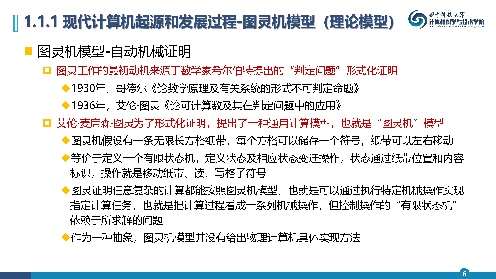

---

- **冯·诺依曼计算机系统结构（工程模型）**
  - 1946年冯·诺依曼在《电子计算机逻辑设计初探》和《关于离散变量自动计算机的草案》报告中提出了存储程序和程序控制的思想
  - 程序和运行程序所需要的数据以二进制的形式存放到存储器中（统一二进制表达）
  - "存储程序"是将解题的步骤编制成程序，也就是指令流
  - "程序控制"是计算机中的控制器逐条取出存储器中指令，结合计算机当前状态，控制各功能部件进行相应的操作

---

**现代计算机发展驱动力**

- 计算机技术的高速发展离不开理论科学（软件）、材料科学（器件）、工程科学（硬件）、应用需求（产业）的共同推动
- 处理器中的电子元件（晶体管）可以抽象为基本数字处理单元
- **计算机系统结构发展动力**
  - 50多年来，晶体管不断缩小，当前晶体管尺寸为纳米规模，是十分精细的人工可制造及控制单元。可以认为晶体管是构建复杂计算芯片"城市"的基本"砖石"
  - 如何基于海量的极小、极简元件构造出庞大而复杂的计算机呢？
  - 在这极小和极大之间，需要一套科学理论和工程方法来指导计算机宏伟"城市"的设计和建设，这就是计算机系统结构的原理、方法和技术的研究范畴

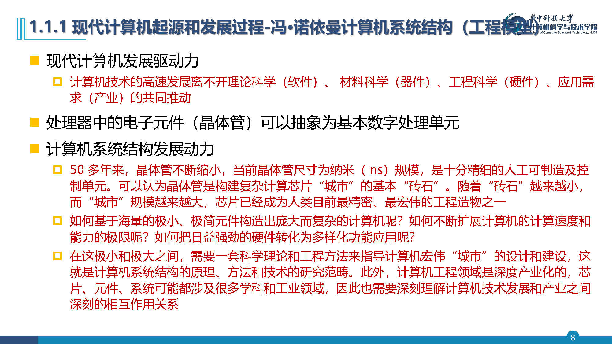

---

**通用计算机结构（硬件和软件）**

- 计算机硬件包括中央处理器（CPU）、主板、主存储器（内存）、外部存储器（外存）和各种I/O设备
- 计算机软件采用操作系统管理各种硬件资源，提供抽象层支撑各种应用程序运行
- 硬件是软件的物理载体，软件是硬件的功能扩展

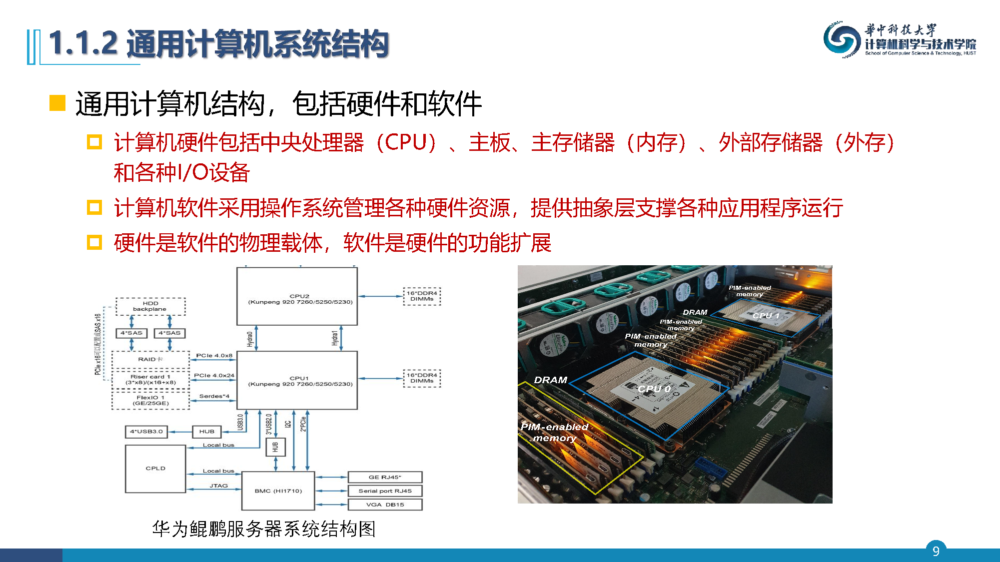

---

**计算机类型与设计目标**

- 桌面计算机（Desktop Computers）
- 服务器（Servers）
- 物联网/嵌入式计算机（IoT/Embedded Computers）
- 个人移动装置（Personal Mobile Device）
- 集群/数据中心计算系统（Clusters/Warehouse-Scale Computers）

| 特性 | 个人移动设备 | 桌面计算机 | 服务器 | 计算机集群 | 嵌入式设备 |
| --- | --- | --- | --- | --- | --- |
| 价格（元） | 500~10K | 500~30K | 10K~10M | 100K~1B | 10~100K |
| 处理器价格（元） | 100~1K | 500~5K | 1K~20K | 1K~20K | 0.1~100 |
| 关键设计目标 | 成本，能耗，性能，响应度 | 性价比，能耗，图形性能 | 吞吐率，可用性，扩展性，能耗 | 性价比，吞吐率，能耗负载成比例 | 成本，能耗，特定程序性能 |

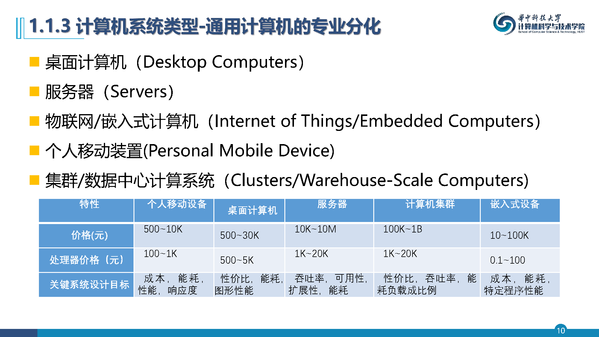

---

- **半导体器件是集成电路的基石，是计算机硬件基础**
  - 任何物理器件在时间和空间上都有物理限制
- **集成电路的制造工艺是用特征尺寸来衡量**
  - 从1971年的10微米下降到2022年的"4纳米"
  - 特征尺寸线性下降时，晶体管密度将平方上升
  - 晶体管性能的提高与特征尺寸的降低成线性关系

---

**处理器中晶体管数量的指数级增长**

- 高登·摩尔（Gordon Moore）提出，最初预测晶体管密度会每年翻一番
- 实际上晶体管数目每年大约增长40%~55%，或者说每18-24个月翻番
- 2003年摩尔定律开始放缓，2016年实际增长率为摩尔定律预测的十分之一

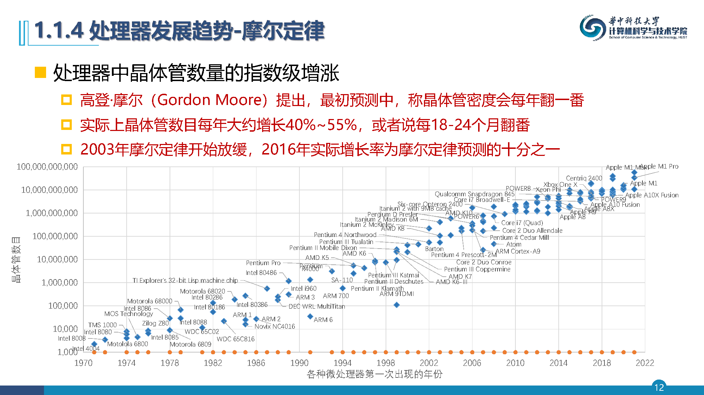

---

- **登纳德缩放定律**
  - 晶体管密度增加，每个晶体管尺寸变小，相应能耗也会降低，每平方毫米硅芯片能耗几乎保持恒定
  - 登纳德缩放定律从2004年开始大幅放缓，2012年左右接近失效
- **原因**
  - 晶体管不再越小、越快、越节能
  - 处理器频率增加受限
  - 微处理器整体功率受限
- **结果**
  - 整体而言处理器性能提升变慢，即每20年才能翻倍一次
  - 单个处理器内开始包含高效能和高性能异构处理核

---

- **处理器近四十年整体发展**
  - 第一阶段（1978年-1986年），单处理器年增长率大约为25%
  - 第二阶段（1986年到2003年），处理器器件和系统结构技术的共同发展促成了计算机性能年增长率提升到大约为52%
  - 第三阶段（2003年到2011年），单处理器年增长率下降到大约为23%
  - 第四阶段（2011年到2021年），性能年增长率从12%降到3.5%

---

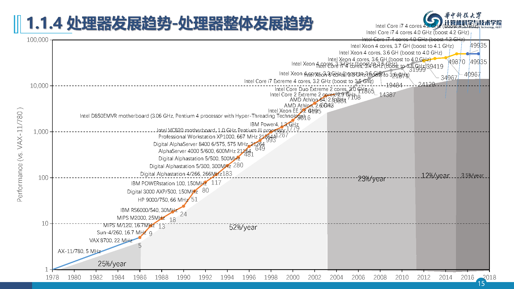

---

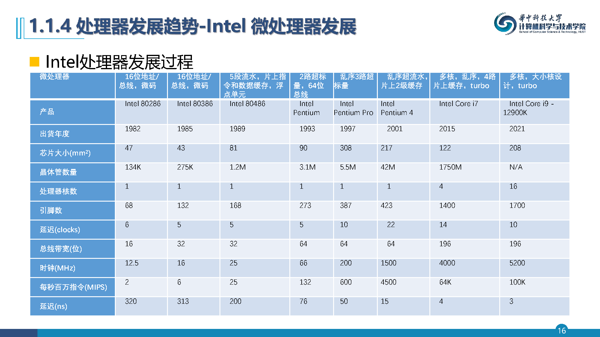

---

- **基础元器件物理性能的提升速度在降低**
- **芯片功率作用甚至比连线延迟还要重要**
- **当前降低能耗和成本、提高性能的唯一途径是应用定制化**

---

- **动态随机存储器（Dynamic Random Access Memory，DRAM）**
  - 为处理器提供数据快速存储
  - DRAM同样采用半导体工艺，也遵循摩尔定律
  - DRAM容量增长速度随时间的变化（每2-4年翻一倍）

---

**外部存储器（外存）**

- 主要用于持久化保存数据，即使掉电之后，数据也不会丢失
  - 闪存固态盘、非易失性内存
  - 磁盘一直是最主要的外存储器件，目前人类社会绝大多数数据仍存放在磁盘中

| 磁盘 | 3600RPM | 5400 RPM | 7200 RPM | 10,000 RPM | 15,000 RPM |
| --- | --- | --- | --- | --- | --- |
| 产品 | CDC WrenI | Seagate ST41600 | Seagate ST15150 | Seagate ST39102 | Seagate ST373453 |
| 出货年度 | 1983 | 1990 | 1994 | 1998 | 2003 |
| 容量(GB) | 0.03 | 1.4 | 4.3 | 9.1 | 73.4 |
| 介质尺寸(inch) | 5.25 | 5.25 | 3.5 | 3.0 | 2.5 |
| 接口 | ST-412 | SCSI | SCSI | SCSI | SCSI |
| 带宽(MB/s) | 0.6 | 4 | 9 | 24 | 86 |

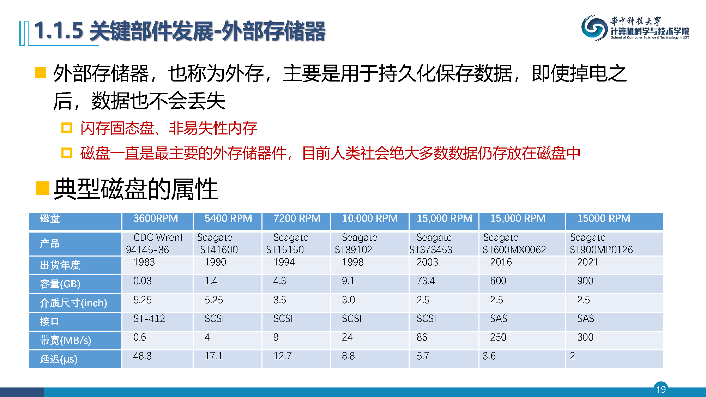

---

**互连网络**

- 多个计算部件、计算机之间的互连方式
- 网络器件的性能，尤其是带宽，获得了长足的进步
- 带宽和延迟

| 类型 | 以太网 | 快速以太网 | Gb以太网 | 10 Gb以太网 |
| --- | --- | --- | --- | --- |
| IEEE标准 | 802.3 | 803.3u | 802.3ab | 802.3ba |
| 出货年度 | 1978 | 1995 | 1999 | 2003 |
| 带宽(MB/s) | 10 | 100 | 1000 | 10k |

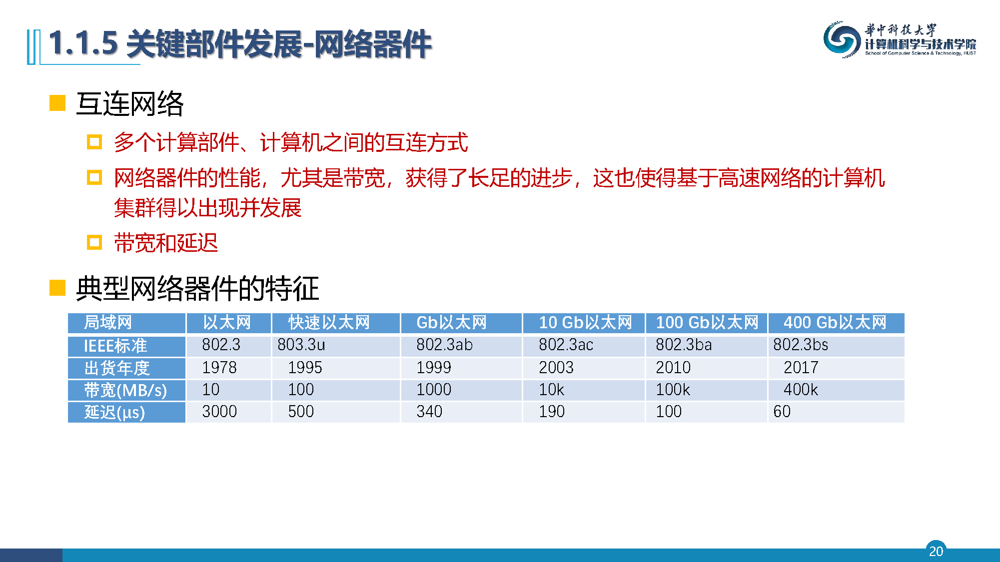

---

- **带宽和延迟**
  - 带宽可以通过多部件方式提升
  - 延迟较难提高

---

**计算机系统结构的定义**

- 计算机系统结构（Computer Architecture）和计算机体系结构具有相同的英文名
  - 狭义计算机系统结构通常特指计算机体系结构
  - 40年前计算机体系结构一般特指指令集体系架构（Instruction Set Architecture，ISA）
  - 计算机系统结构不再仅限于研究处理器，研究范畴不断拓展
- 钱学森定义：系统是由相互作用、相互依赖的若干组成部分结合而成的，具有特定功能的有机整体
- **计算机系统结构定义为：满足设计目标需求的计算机软硬部件的系统组织方式**
- Patterson从功能和性能角度定义：设计满足目标要求计算平台的科学和艺术

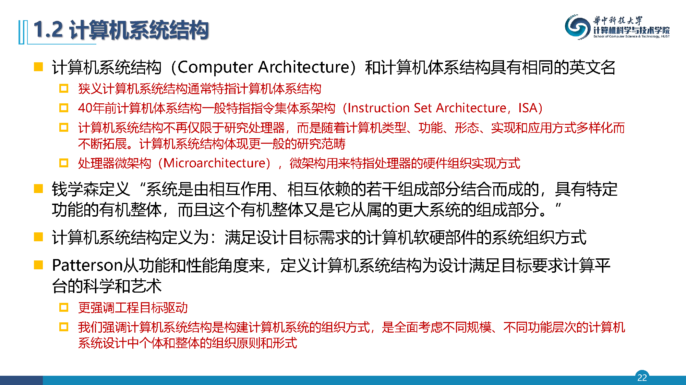

---

**如何组织海量晶体管实现应用功能**

- 基本物理单元是晶体管，计算机系统世界的"原子"或者"砖"，存在无限大的设计空间
- 计算机系统结构通过分层、分模块设计方式，把层间、模块内的设计复杂度控制在一个可接受的范围内
- 计算机系统结构也研究计算机系统抽象层的设计方法和实现机制

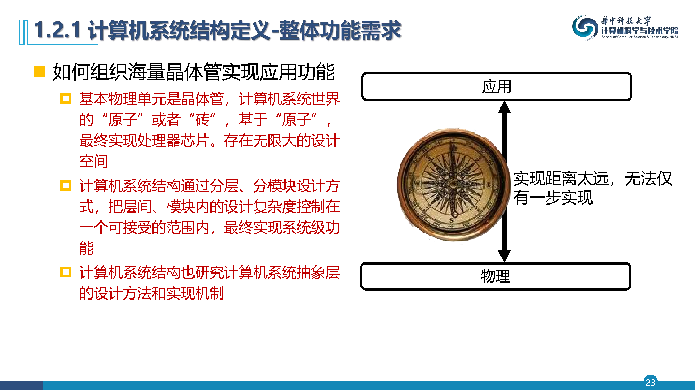

---

**五类计算机的功能需求**

- 首先确定计算机系统的必要属性和功能
- 其次考虑在成本、可靠性、功耗、安全性等约束下最大化性能（综合设计）
- 最后充分掌握实现方式细节

---

- **计算机系统结构研究范畴**
  - **单机系统结构**
    - 流水线微架构：静态和动态指令调度，超标量和多线程，分支预测、猜测执行等
    - 存储层次结构：缓存策略和算法、多级缓存、虚拟内存、外存I/O和数据管理等
  - **多处理器结构**
    - 数据缓存一致性、数据共享和同步机制、网络拓扑结构和通信寻径等

---

- **性能提升：采用多个部件，并能让多个任务并行执行**
- **迈克尔·弗林：指令流及数据流并行分类**
  - 单指令流、单数据流（SISD）
  - 单指令流、多数据流（SIMD）
  - 多指令流、多数据流（MIMD）
  - 多指令流、单数据流（MISD）
- **软件并行：数据级并行，任务级并行**

---

- **计算机是针对任务工作负载的服务装置**
- **任务具有不同的类型、数据访问模式等特征**
- **在给定时间内处理的一系列任务序列称之为工作负载**
  - 工作负载具有各种特征，例如任务类型分布、强度变化等

---

- **任务执行时间**
  - 可被观察、被测量，是评估一个系统性能的核心指标
  - 其快慢是用户最能直观感受到的服务体验
  - 响应时间、服务时间、处理延迟等
- **任务是相对的**：应用程序、I/O请求
- **通过任务执行时间相对快慢来评价系统的性能高低（加速比）**

---

**任务吞吐率**

- 单位时间内完成的任务总数
  - 网络：每秒位数（bps）
  - 存储设备：每秒兆字节数（MB/s）或者每秒I/O数（IOPS）
  - 数据库：每秒查询数（QPS）
- **实际吞吐率依赖于工作负载行为**
  - 服务装置通常是被动接受并处理任务
  - 单位时间内任务发送数量称之为负载强度
  - 不断增加负载强度到一定值之后，实际吞吐率不会再增加，这个吞吐率称之为峰值吞吐率
  - 峰值吞吐率是系统内在禀性的反映

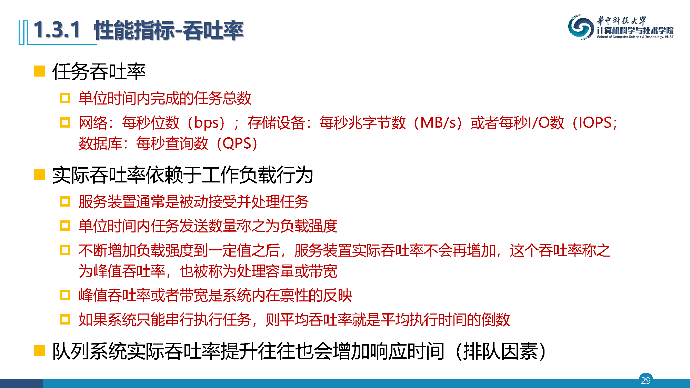

---

**功率与散热设计**

- 计算机及其部件的运行需要消耗能量，设计者在系统和部件两个层次考虑功率和电流设计
  - 首先必须确定最高功率
  - 主动调节，适应电源功率供给及其变化
  - 必须在内部部件之间合理分配能量供给
- 根据热力学第二定律，功耗最终都会变成热能
  - 热设计功率（Thermal Design Power，TDP）：当处理器达到最大负荷时所释放的热量，决定了冷却需求
  - 现代处理器提供两个方法来帮助主动管理过热：降低时钟速率或强制断电
- **能耗和能耗效率**：功率是单位时间消耗的能量，而能耗是一段时间内消耗功率的总和

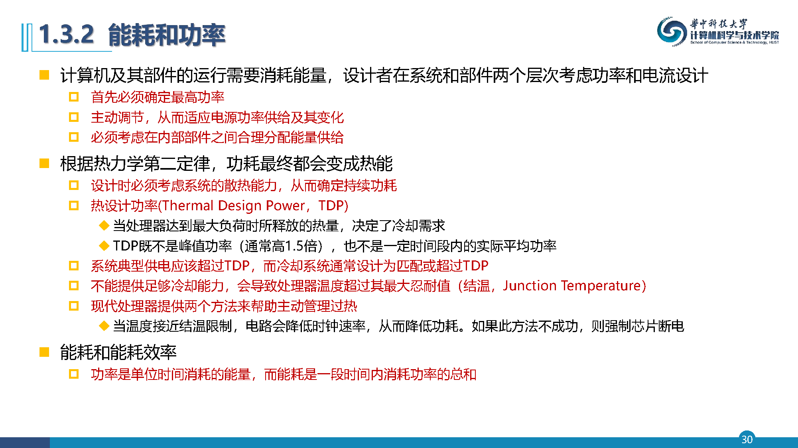

---

- **CMOS芯片的动态能耗**
  - 每个晶体管的能耗与电容性负载（Capacitive Load）与电压平方的乘积成正比：能耗动态 ∝ 电容性负载 × 电压²
  - 一次转换（0→1或1→0）的能耗：能耗动态 ∝ 1/2 × 电容性负载 × 电压²
  - 每个晶体管所需要的功率：功率动态 ∝ 1/2 × 电容性负载 × 电压² × 开关频率
- **对于一项固定任务，降低时钟频率可以降低功率，但增加执行时间，不一定会降低能耗**

---

**例题：电压降低15%对动态能耗和动态功率的影响**

- 由于电容值不变，所以能耗变化就是电压平方之比
  - 能耗新/能耗原 = (电压×0.85)²/电压² = 0.85² = 0.72
  - 动态能耗降低为原来的72%
- 对于功率，需要考虑开关频率的比值
  - 功率新/功率原 = 0.72 × 0.85 = 0.61
  - 动态功率降低为原来的61%

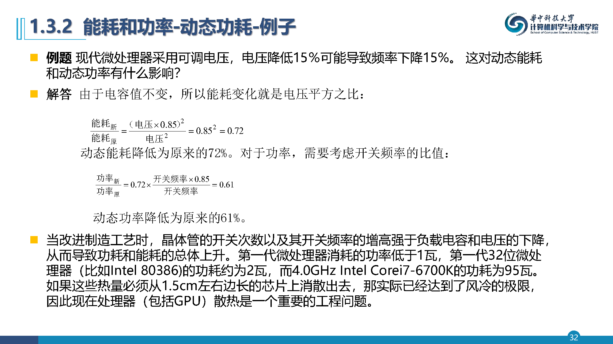

---

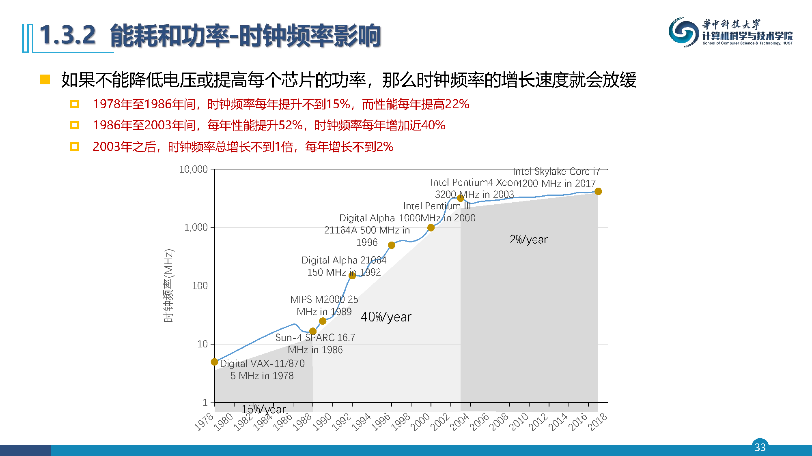

---

- **处理器A比处理器B高20%的功率，但是完成同样的任务，A的执行时间是B的70%，那么A完成这个任务的总能耗为1.2×0.7=0.84**
- **对于移动装置，其电池电量是固定的，提高任务能效非常重要**
- **功率分配、散热、避免热点已经成为越来越困难的问题**
- **在保证时钟频率和电源电压不变的情况下**
  - 闲时关闭
  - 动态电压-频率调整（Dynamic voltage-frequency scaling, DVFS）
  - 针对典型情景的设计
  - 超频

---

- **计算机应用范围越广，其成本和价格就越成为一个关键因素**
- **评估成本是困难的**
  - 成本会不断变化，不同行业和部门能够看到的成本是不同的
  - 决定了是否在新设计中使用某一项新功能或者新技术
- **计算机组件的制造成本会随着时间而降低（学习曲线）**
- **产量是决定成本的第二个重要因素**
  - 产量提升缩短了学习曲线所需要的时间
  - 产量的增加会提高购买与制造效率
  - 产量增加摊销成本

---

**集成电路成本公式**

- 已封装集成电路的成本为：集成电路成本 = (晶片成本 + 晶片测试成本 + 封装和最终测试成本) / 最终测试成品率
- **晶片成本公式**：
  - 晶片成本 = 晶圆成本 / (每个晶圆上的晶片数 × 晶片成品率)
  - 每个晶圆上的晶片数 ≈ π × (晶圆直径/2)² / 晶片面积
- **更准确的估算公式**：
  - 每个晶圆上的晶片数 = (π × (晶圆直径/2)² - π × 晶圆直径) / 晶片面积

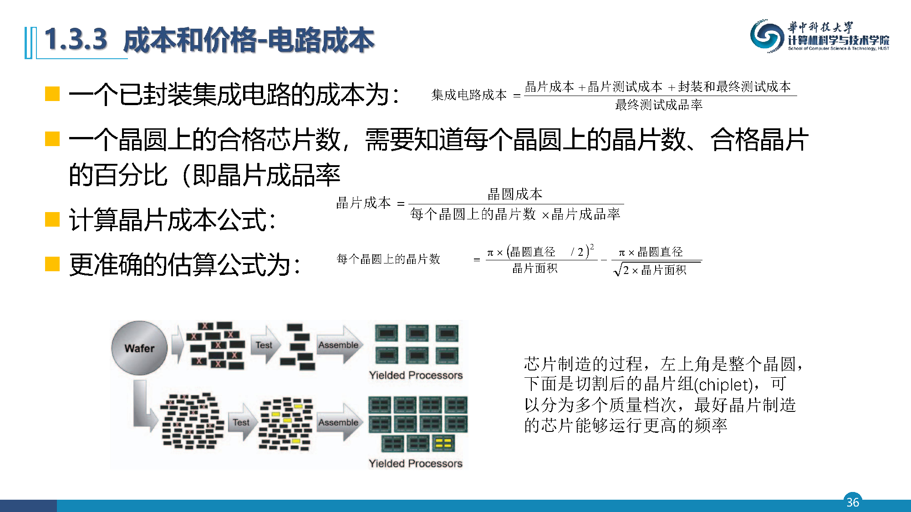

---

- **例题：求300mm晶圆上的晶片数目**
  - 当晶片面积为2.25cm²时：每个晶圆上的晶片数目 = (706.9 - 94.2) / 2.25 ≈ 270
  - 当晶片面积为1.00cm²时：每个晶圆上的晶片数目 = (706.9 - 94.2) / 1.00 ≈ 640

---

- **集成电路成品率模型：假定晶圆上的缺陷是随机分布的**
  - 晶片成品率 = 晶圆成品率 × (1 / (1 + 单位面积上的缺陷 × 晶片面积))^N
- **例题：设每平方厘米上有0.047个缺陷，N为12**
  - 较大晶片（2.25cm²）：成品率 = 1/(1+0.047×2.25)^12 ≈ 0.30
  - 较小晶片（1.00cm²）：成品率 = 1/(1+0.047×1.00)^12 ≈ 0.58

---

**部件可靠性和可用性**

- **可靠性度量**
  - 部件可靠性是从一个参考初始时刻开始持续服务的度量
  - 平均无故障时间（MTTF）：发生故障之前的正常工作时间
  - 平均修复时间（MTTR）：服务中断后恢复正常的时间
  - 平均故障间隔时间（MTBF）= MTTF + MTTR
  - 如果一组部件的寿命时间满足负指数分布，整体故障率就是各模块故障率之和
- **可用性度量**
  - 部件可用性 = MTTF / (MTTF + MTTR)

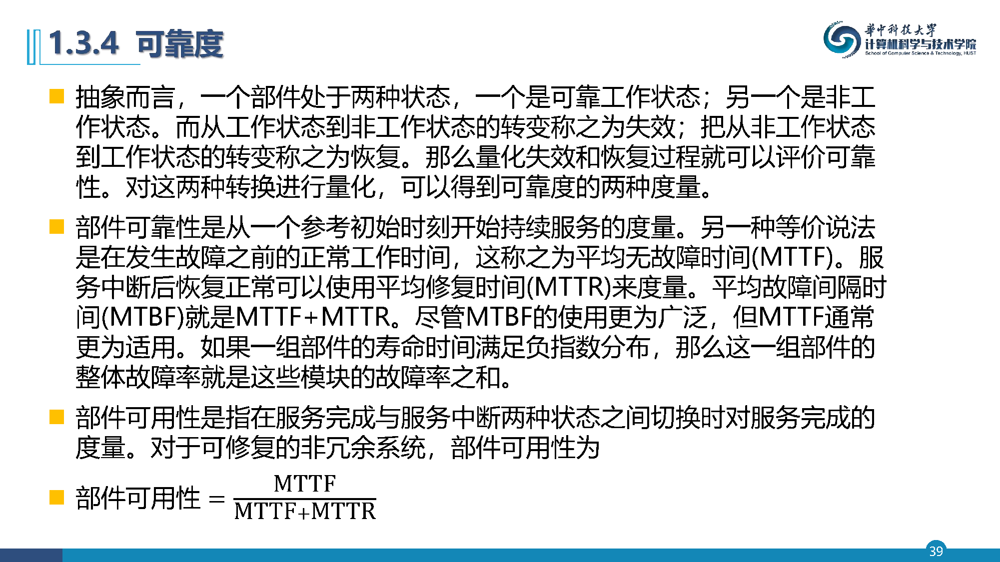

---

- **例题：磁盘子系统MTTF计算**
  - 10个磁盘：均为1000000小时MTTF
  - 1个ATA控制器：500000小时MTTF
  - 1个电源：200000小时MTTF
  - 1个风扇：200000小时MTTF
  - 1根ATA电缆：1000000小时MTIF
- **解答：故障率之和 = 10×1/1000000 + 1/500000 + 1/200000 + 1/200000 + 1/1000000 = 23/1000000**
- **系统的MTTF = 1000000/23 ≈ 43500小时（略低于5年）**

---

**冗余电源可靠性**

- 冗余电源对的MTTF合理近似为：MTTF_电源对 ≈ MTTF²_电源 / (2 × MTTR_电源)
- 使用上例数据（操作人员需要24小时才能更换）
  - MTTF_电源对 ≈ 200000² / (2 × 24) ≈ 8.3亿小时
- 使用电源对的可靠程度约为单电源的4150倍

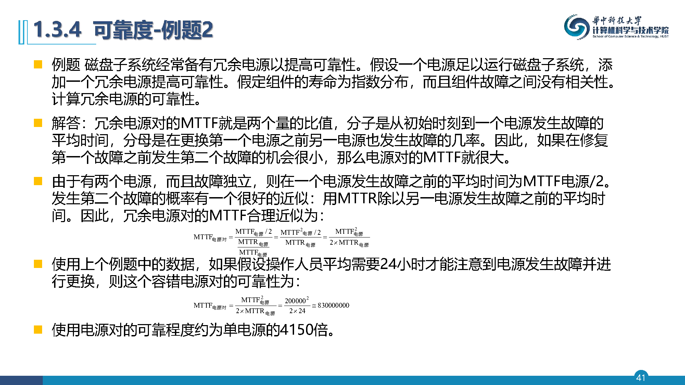

---

- **系统分层设计原则**
- **并行性设计与挖掘原则**
- **局域性挖掘原则**
- **加快经常事件原则**
- **平衡设计原则**
- **性能评价驱动设计原则**

---

**分层抽象设计**

- 计算机系统整体设计空间巨大且复杂，通过分层抽象设计，保证每层涉及组件数量和复杂度有限
  - 计算机系统涉及范围从纳米级晶体管电路到百万服务器规模的仓储式计算机
- 层间定义相对固定抽象接口，可以抽象为上层的一个基本组件
  - 这样在每层可以进行相对独立的专业化、产业化的设计与开发
  - 可通过垂直层间的高效分工和合作，实现计算机系统的整体演进
- 功能层次化划分是计算机系统设计中常用的思考方式

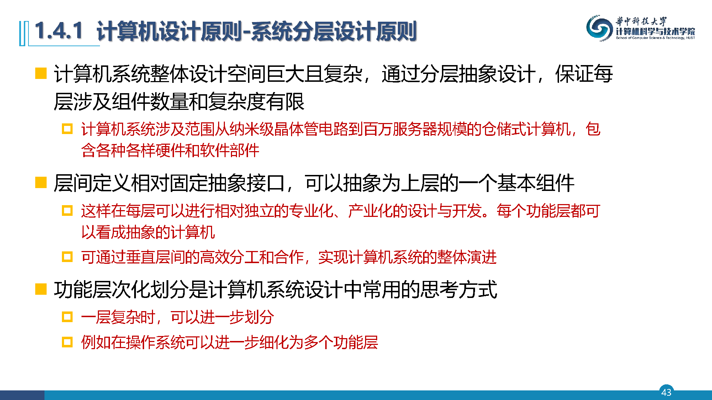

---

**计算机系统整体功能栈（9个功能层）**

1. 物理电子层：基础电子材料、晶体管材料（石墨烯）、结构和制造工艺
2. 器件层（Device）：构造基础逻辑元器件（与门、与非门等）
3. 逻辑电路层：组合逻辑电路和时序电路
4. 微体系结构层（Microarchitecture）
5. 指令集体系结构层（ISA）：计算机硬件和软件的分界层
6. 运行时系统软件层：操作系统、虚拟机、编译器等
7. 开发语言和环境：各种编程语言和编译平台
8. 算法层：针对共性问题提供算法解决方案
9. 应用层：给用户提供功能性程序满足特定应用需求

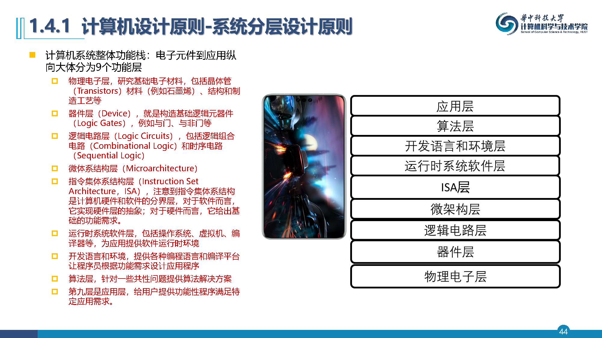

---

- **计算机系统中可以通过增加组件数量提高整体处理能力**
  - 空间并行：增加功能相同部件的数量，每个部件独立处理任务
  - 时间并行：一组部件合作完成一个任务，每个部件仅执行任务特定环节
  - 计算机系统每层都可以增加并行性（系统并行度）
- **任务具有并行性**：指令级并行、请求级并行和线程级并行
- **需要发掘硬件和任务内在并行性**

---

**局域性原理**

- 程序常常重复使用它们最近用过的数据和指令
- **两种类型：时间局域性和空间局域性**
  - 时间局域性：最近访问过的内容很可能会在短期内被再次访问
  - 空间局域性：地址相互临近的对象很可能会在短时间内被用到
  - 来源于人类思考问题的方式
- **经验规律：一个程序90%的执行时间花费在仅10%的代码中**
- 局域性意味着可以根据程序最近访问的指令，比较准确地预测近期将执行的内容

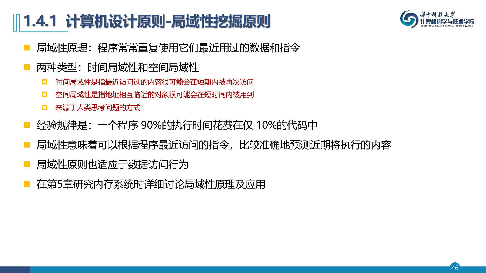

---

- **加快经常性事件原则就是指重点关注常见情形，常见情形优先于非常见情形**
  - 优化频繁出现的场景，会产生更显著的整体效果
  - 也适应于可靠性、能耗优化等方面
- 在计算机系统设计中会大量使用这一简单原则，需要通过统计和分析过去的负载行为来确定哪些是常见情形
- 加快经常性事件原则能使性能提高多少，可以使用Amdahl定律来量化

---

- **根据设计目标要求，协同多个部件完成任务处理流程，需要整体优化设计，保证所有部件平衡工作，避免局部成为瓶颈**
  - 整体性能往往取决于瓶颈部件或者关键步骤的性能
  - 努力使得每个部件工作在最佳工作范围，也就是平衡点
  - 多个系统指标之间也需要平衡
- **一旦组成部件技术进化，可能导致过去较好平衡的系统结构方案可能不再平衡**
  - 旧平衡被打破，需要设计新的平衡

---

**性能评价的困难性**

- 客观评价计算机系统性能是困难的
  - 由大量软硬部件构成的复杂系统
  - 工作负载也是多样、多变的
  - 先验模型难以准确预测计算机系统的运行时性能
- 外部市场、应用需求和内部技术发展合力推动计算机系统不断进化
  - 计算机系统结构的演化就是基于不断的性能评价和迭代开发
  - 系统设计者需要在设计时确定性能目标、测试方法和测试平台

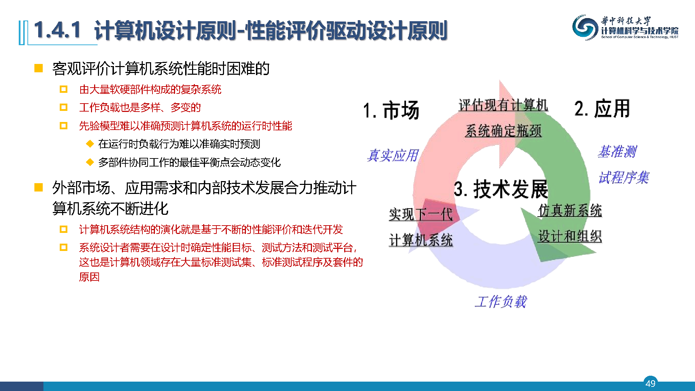

---

**Amdahl定律**

- 采用Amdahl定律定量评价和分析加速比（speedup）
  - 加速比 = 整个任务在采用该升级时的性能 / 整个任务在未采用该升级时的性能
  - 或：加速比 = 整个任务在未采用该升级时的执行时间 / 整个任务在采用该升级时的执行时间
- **Amdahl定律刻画了局部加速比和全局加速比之间的关系**
  - 原计算机计算时间中可改进部分所占的比例（改进比例）
  - 改进部分的局部加速比
- **总加速比 = 1 / (1 - 改进比例 + 改进比例 / 局部加速比)**

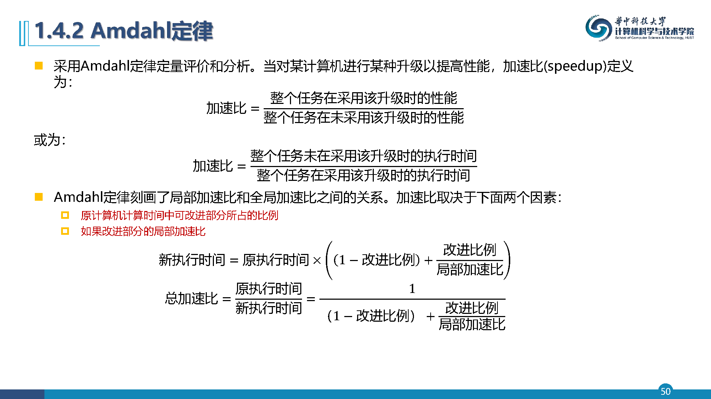

---

- **例题：新处理器执行Web服务应用的速度是原处理器的10倍，原处理器有40%的时间忙于计算，60%的时间等待I/O**
- **解答：改进比例=0.4；局部加速比=10**
  - 总加速比 = 1 / (0.6 + 0.4/10) = 1 / 0.64 ≈ 1.56

---

**例题：比较两种FP优化方案**

- 方案一：升级FPSQR硬件，使这一运算速度提高到原来的10倍
  - FPSQR占用20%的执行时间
  - 加速比 = 1 / (0.8 + 0.2/10) = 1/0.82 ≈ 1.22
- 方案二：让所有FP指令的运行速度提高到原来的1.6倍
  - FP指令占用50%的执行时间
  - 加速比 = 1 / (0.5 + 0.5/1.6) = 1/0.8125 ≈ 1.23
- 提高整体FP运算的性能稍好一些，体现了加快经常性事件原理

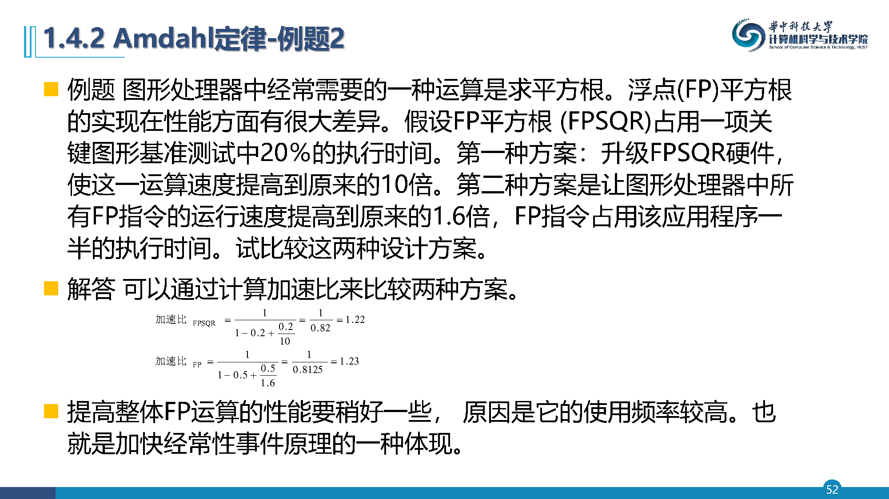

---

**CPU性能公式**

- 处理器以时钟周期作为运行时间单位
- **CPU时间 = 程序的CPU时钟周期数 × 时钟周期时间**
  - 或：CPU时间 = 程序的CPU时钟周期数 / 频率
- **CPI（每条指令的平均时钟周期数）**
  - CPI = 程序的CPU时钟周期数 / 指令数
- **CPU时间 = 指令数 × CPI × 时钟周期时间**

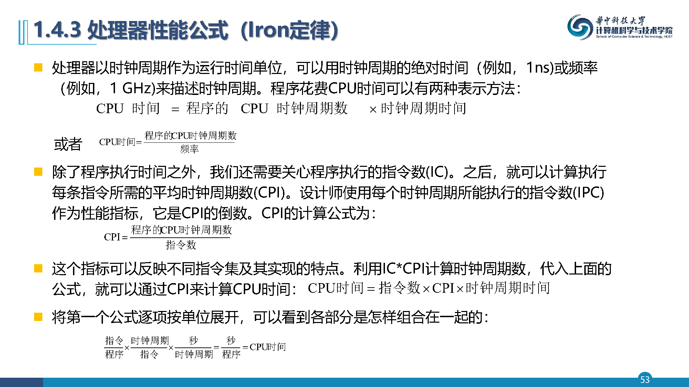

---

**处理器总时钟周期与总CPI**

- **总时钟周期 = Σ ICᵢ × CPIᵢ**
- **CPU时间 = (Σ ICᵢ × CPIᵢ) × 时钟周期时间**
- **总CPI = Σ ICᵢ × CPIᵢ / IC = Σ (ICᵢ / IC) × CPIᵢ**
  - 也就是各种指令CPI和该指令在一个程序中所占比例的加权平均
- CPI应当通过实际测量得出，因为多种因素影响，包括流水线、缓存缺失和存储系统等

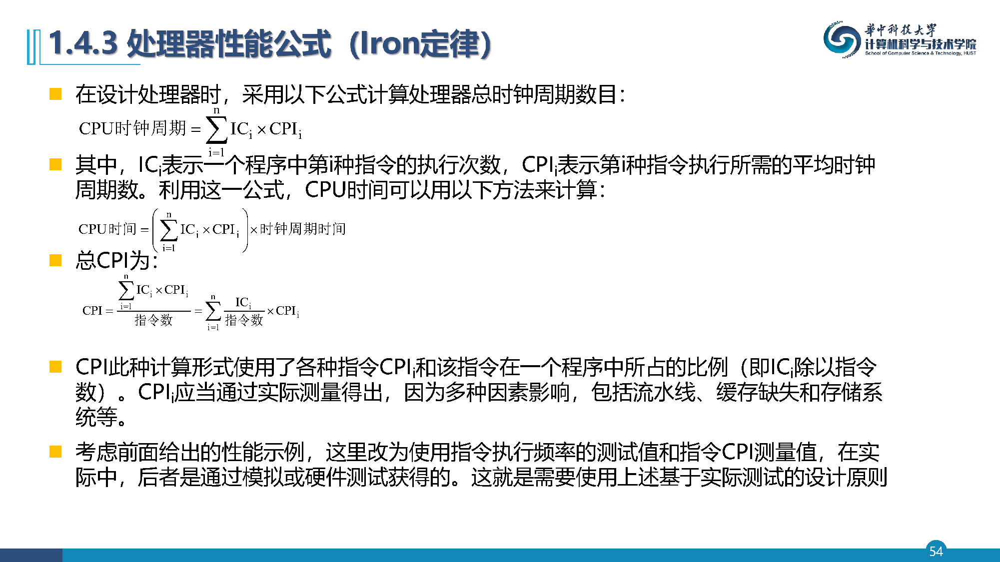

---

- **例题：两种CPI优化方案对比**
  - FP操作频率=25%，平均CPI=4.0
  - 其他指令的平均CPI=1.33
  - FPSQR的频率=2%，CPI=20
- **原CPI = (4×25%) + (1.33×75%) = 2.0**
- **改进FPSQR后CPI = 2.0 - 2%×(20-2) = 1.64**
- **改进所有FP指令后CPI = (75%×1.33) + (25%×2.5) = 1.625**

---

**CPI例题（续）**

- 改进FP指令后的CPI（1.625）比改进FPSQR指令后CPI（1.64）更低，所以性能更好
- **加速比 = CPI原 / CPI新FP = 2.0 / 1.625 ≈ 1.23**
- 使用Amdahl定律可以计算出相同的加速比

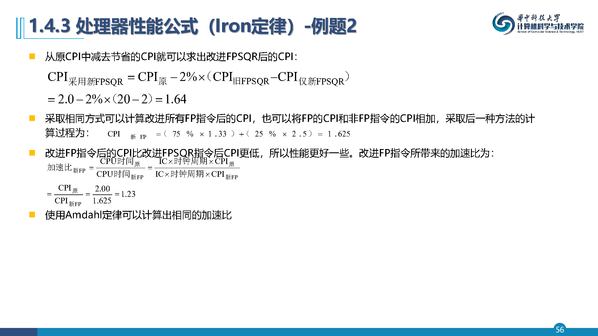

---

**性能测量方法**

- **基准程序测试方法**
  - 基准测试：选择最常用、最具代表性的程序作为标准测试程序
  - 基准测试应用程序集（称为基准测试套件），例如标准性能评估机构（SPEC）
- **工作负载测试方法**
  - 完全运行测量真实应用程序是最客观的
  - 宏基准测试程序（Macrobenchmark）：模拟部分或全部真实应用程序的行为
  - 微基准测试程序（Microbenchmark）：创建负载组合请求类型、大小、强度等
- **基于追踪记录（Trace）测试方法**
  - 从真实生产系统中抓取实际的请求行为并记录到追踪文件（trace）中

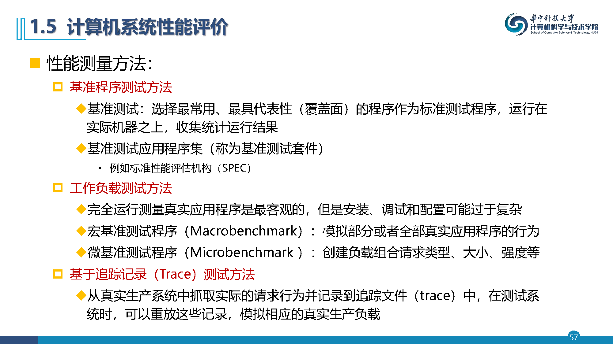

---

**性能综合评价方法**

- 使用SPECRatio和几何均值综合汇总套件的性能结果
  - SPECRatio = 执行时间基准 / 执行时间
- **几何平均 = $(\prod \text{SPECRatio}_i)^{1/n}$**
- **几何均值的两个重要特性：**
  1. 这些比值的几何均值与几何均值之比相等
  2. 几何均值之比等于性能比值的几何均值，与基准计算机的选择无关
- 因此，使用几何均值更加合理

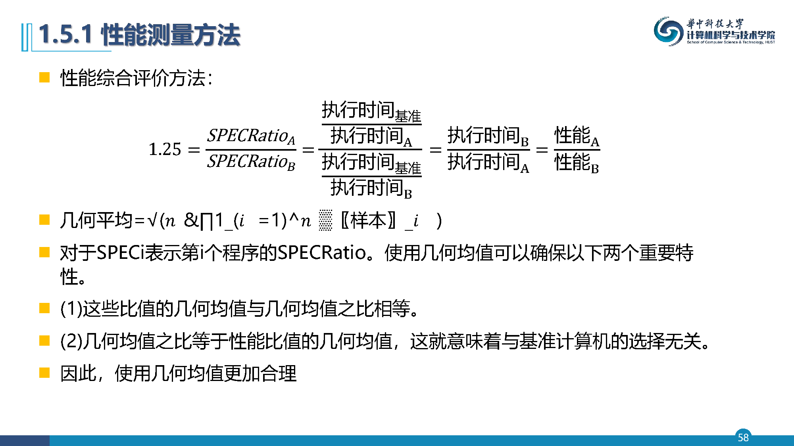

---

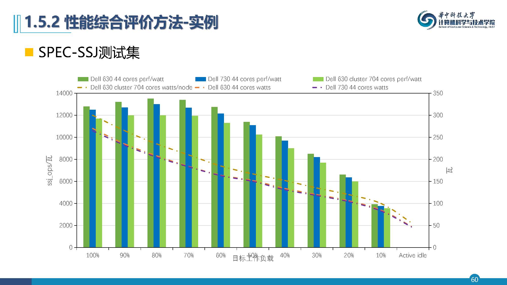

---

- **补充处理器价格和成本知识**

---
