<!-- _class: lead -->

# 专用加速器

**计算机系统结构**

---

## 本章内容

- **理解专用领域计算加速概念及设计原则**
- **掌握深度神经网络及加速原理**
- **理解寒武纪神经网络处理器架构及处理模式**

---

- **处理器不断增加的晶体管主要用于实现下述硬件：**
  - （1）一级、二级、三级甚至四级缓存；（2）512位SIMD浮点单元；（3）15级以上流水线；（4）分支预测；（5）乱序执行；（6）推测性预取；（7）多线程；（8）多处理核心等
- **编译器甚至无法弥合在C或C++和GPU之间的语义沟壑**
- **登纳德缩放定律比摩尔定律更早结束，更多晶体管的开关意味着消耗更多的功率**
- **一条RISC的逻辑运算消耗125皮焦，但是额外开销占很大比例**
- **为了获得数量级的大幅度优化，一条指令能够执行从一到数百的算术运算，从而摊销额外取指和译码等公共开销，提高整体的处理器效率**

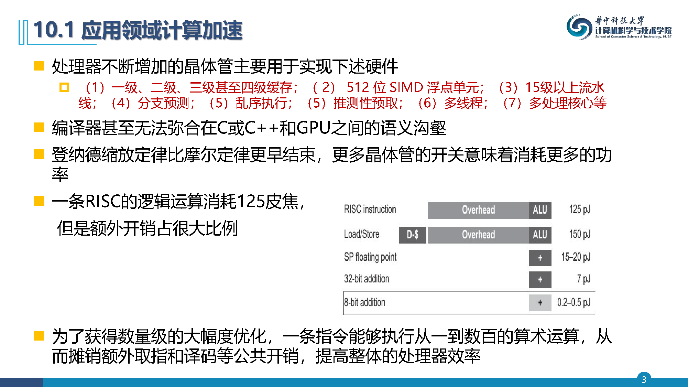

---

- **通用处理器模式拓展到特定应用领域体系结构（DSA）**
  - 前者运行传统的大型程序，例如操作系统
  - 后者仅能非常好地处理特定任务，特定领域算法几乎总是用于计算密集型任务，例如物体识别或语音理解等
  - 两者相互补充使得当前计算机将比过去更加异构
- **关键的挑战是选择合适的特定领域设计目标**
  - 需求量大到足以证明在SOC甚至定制芯片是值得的
- **指令集和通用编程环境一样，DSA也需要编程平台和开发工具链**
- **软件和硬件系统没有清晰的边界了。软件处理和数据对象直接映射到硬件结构之中**

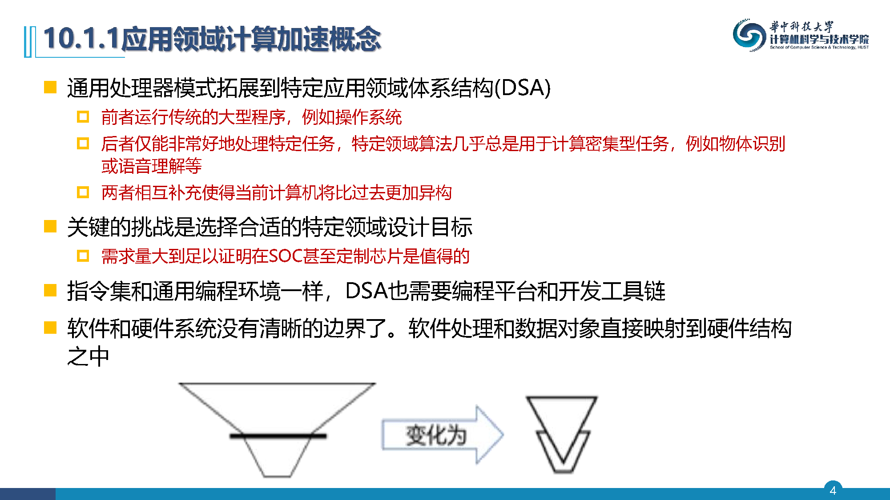

---

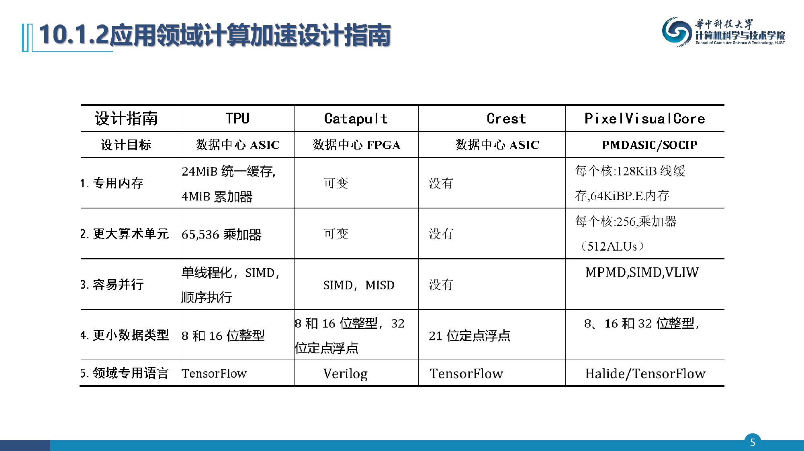

---

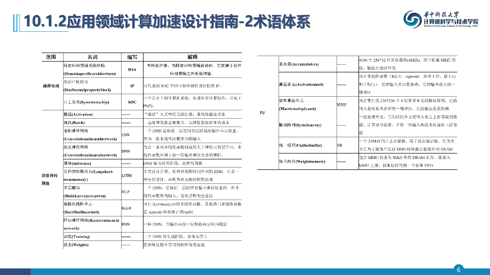

---

- **2010年以来，在大数据、神经网络（算法）和计算能力（硬件）共同驱动下，人工智能重新成为热点，由神经科学启发而来人工神经网络，已经成为一个极其重要的人工智能应用领域**
- **人工智能通常基于符号模式和连接模式，前者构建大量的逻辑规则用于推理，后者构建复杂网络刻画因果关系，本轮人工智能的复兴机遇在于可以在大量标记数据中进行高性能机器学习**
- **仓库级计算机系统（WSC）能够收集和存储从数十亿用户的PB级数据，而处理器能够提供更强计算能力进行处理。过去神经网络运行在CPU通用处理器上，但不是很高效，因为处理DNN并不会使用通用处理硬件中的大部分功能部件（例如分支预测和大量Cache）**
- **硬件加速器被认为是一个更高能效的解决方案**

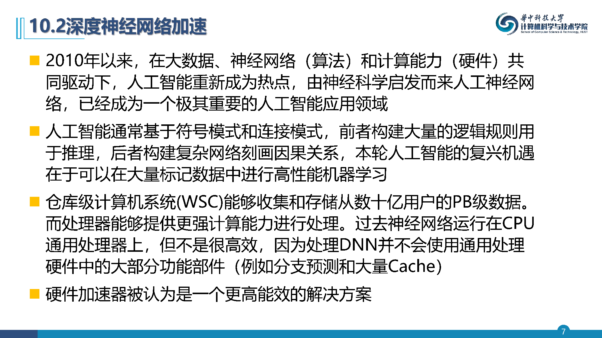

---

- **机器学习一个重要分支称为深度神经网络（DNN）**
- **DNN设计思想来模拟人类大脑神经元工作。神经网络中人工神经元计算一组权重/参数与数据值的乘积之和，然后通过非线性函数得到输出**
- **每个人工神经元都有一个大的扇入连接（N到1连接）和一个大的扇出连接（1到N连接）**
- **输出用于模拟神经元"激活"，也称为映射函数（mapping function）**
- **在数学上，激活函数被用于将大输出值域转换成较小值域区间，可以极大程度影响神经网络的性能**
- **一簇人工神经元能够处理输入的不同部分，并且该簇的输出成为下一层人工神经元的输入。输入和输出层之间的层称为隐藏层**
- **DNN通常包含很多层**

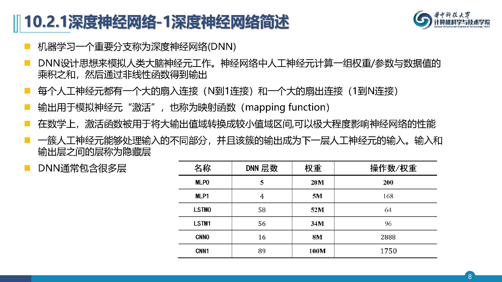

---

- **在确定神经网络架构之后，下一步就是学习与神经网络图中每条边相关的权重。权重决定了模型的行为。根据神经结构类型，单个模型中可以有数千到数千亿个权重。训练过程是调整这些权重从而让神经网络性能达到要求的长期计算过程，因此DNN近似于由训练数据描述的复杂函数，实现从输入到输出对象之间的映射**
- **映射生成阶段通常被称为训练或学习，而使用映射阶段有很多名称：推理、预测、评分、实施、评估、运行或测试**
- **确定权重是一个迭代过程，需要不断使用训练集反向更新神经网络权重，这个过程称为反向传播**
- **训练目标是找到一个函数将输入映射到正确的输出**

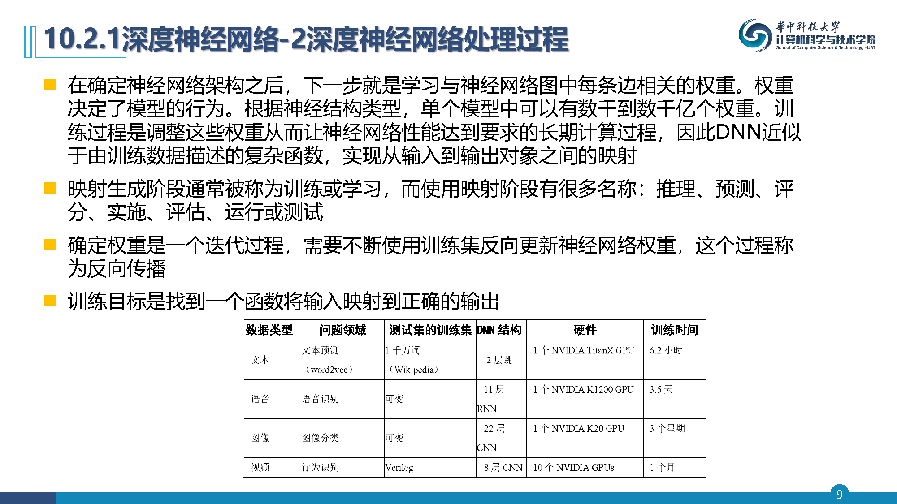

---

- **多层感知机（MLP）是最早使用的DNN。计算前一层输出向量乘以权重矩阵的加权和，即$y_{n-1}=F(W·y_n)$，然后输入一组非线性函数F，得到本层的输出**
- **如果每个输出神经元结果取决于前一层的所有输入神经元，则这种层称为全连接**
- **MLP是简单网络结构，因为它只需要将输入向量和权重矩阵相乘。通过参数和公式可以确定权重和推理操作数（两个操作：乘法+加）：**
  - $Dim[i]$：输出向量的维度，即神经元的数量
  - $Dim[i-1]$：输入向量的维度
  - 权重数：$Dim[i-1] × Dim[i]$
  - 操作数：$2 ×$ 权重数
  - 操作数/权重数：2
- **最后一项是根据Roofline模型计算的运算强度**

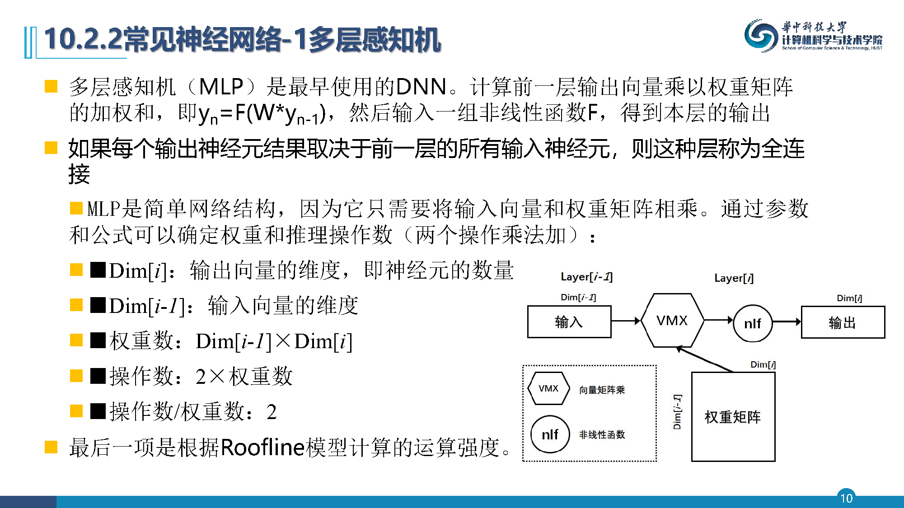

---

- **CNN将来自前一输出层空间中相邻区域乘以权重、再输入一组非线性函数，这些权重在同一层中会重复使用。CNN思想是每一层都提高了图片的抽象层次**
- **每层神经网络层产生一组二维特征图（Feature map），二维特征图的每个单元识别一个输入区域的一个特征**
- **显示了从输入图像创建第一个特征图元素的2×2个模板计算。模板计算以固定模式使用相邻单元来更新数组的所有元素。输出特征图的数量将取决于有多少不同的特征和使用模板的步长**

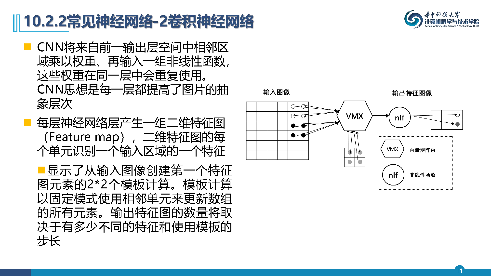

---

- **从数学方面来看，如果输入特征图和输出特征图的数量都等于1，并且步幅也是1，那么一个二维CNN的单层与二维离散卷积的计算相同**
- **CNN比MLP更复杂。下面列出了计算权重和操作的参数和方程：**
  - $Dim_{FM}[i-1]$：（正方形）输入特征图的维度
  - $Dim_{FM}[i]$：（正方形）输出特征图的维度
  - $Dim_{Sten}[i]$：（方形）模板的尺寸
  - $Num_{FM}[i-1]$：输入特征图的数量
  - $Num_{FM}[i]$：输出特征图的数量
  - 神经元数量：$Num_{FM}[i] × Dim_{FM}[i]^2$
  - 每个输出特征图的权重数：$Num_{FM}[i-1] × Dim_{Sten}[i]^2$
  - 每层权重总数：$Num_{FM}[i] ×$ 每个输出特征图的权重数
  - 每个输出特征图的操作数：$2 × Dim_{FM}[i]^2 ×$ 每个输出特征图的权重数
  - 每层操作总数：$Num_{FM}[i] ×$ 每特征输出层操作数 $= 2 × Dim_{FM}[i]^2 × Num_{FM}[i] ×$ 每特征输出层操作数 $= 2 × Dim_{FM}[i]^2 ×$ 每层权重总数
  - 操作数/权重数：$2 × Dim_{FM}[i]^2$

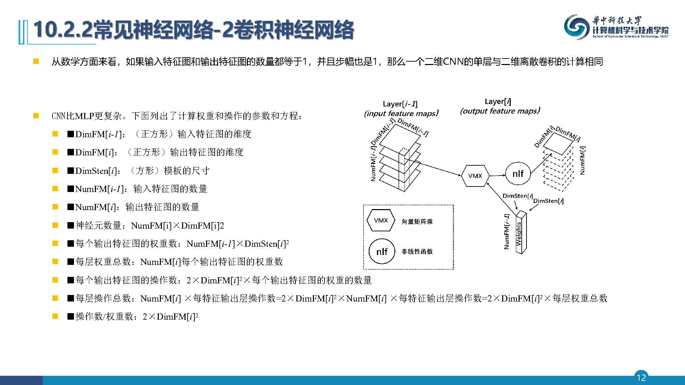

---

- **第三种DNN是RNN，常用于语音识别或语言翻译领域。RNN增加显式模型连续输入的能力，它向DNN模型添加状态，以便RNN可以记住事件**
- **长短期记忆（Long short-term memory，LSTM）是目前最流行的RNN。LSTM缓解了以前RNN无法记住重要的长期信息的问题。与其他两个DNN不同，LSTM是分层设计。LSTM由称为单元格的模块组成。可以将单元格视为连接在一起的模板或宏，它们一起构成完整的DNN模型**

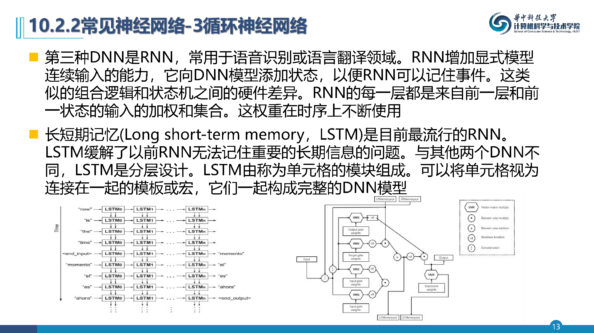

---

- **LSTM单元的输入和输出都连接在一起，所以三个输入输出对的大小必须相同。LSTM单元内部有足够的依赖关系，所有输入和输出通常都是相同的大小，假设它们的大小都相同，称为 $Dim_{LSTM}$。除此之外，向量矩阵乘法的大小也有不同。因为连接了所有三个输入，用到的参数维度为 $3Dim_{LSTM} × Dim_{LSTM}$；因为将输入与短期内存输入连接起来作为向量，输入乘法的向量维度为 $2Dim_{LSTM} × Dim_{LSTM}$；最后的按位乘法向量的维度为 $Dim_{LSTM} × Dim_{LSTM}$**
- **现在可以计算权重和操作了：**
  - 每个单元格的权重数：$3(3Dim_{LSTM}×Dim_{LSTM}) + (2Dim_{LSTM}×Dim_{LSTM}) + (1Dim_{LSTM}×Dim_{LSTM}) = 12Dim_{LSTM}^2$
  - 每个单元格的5个向量矩阵乘法的运算次数：$2 ×$ 每个单元格的权重数 $= 24 × Dim_{LSTM}^2$
  - 3次按位乘法和1次加法运算次数（向量都是输出的大小）：$4 × Dim_{LSTM}$
  - 每个单元格的操作总数：$24 × Dim_{LSTM}^2 + 4 × Dim_{LSTM}$
  - 操作数/权重数：2

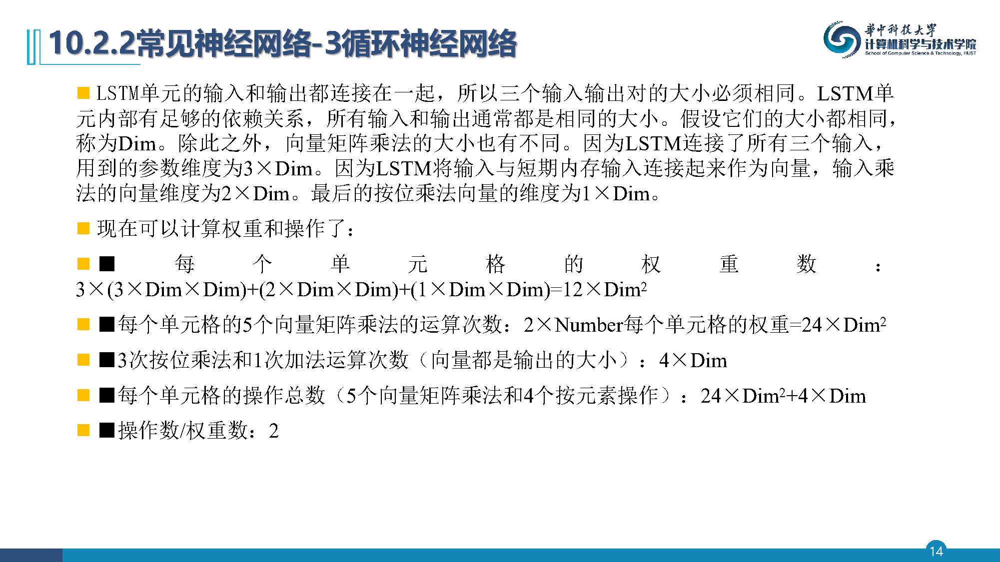

---

- **DNN可以有很多权重，重用权重作为性能优化，此类数据集称为批量或小批量，反向传播需要批量处理**
- **与许多应用相比，数字精度对于DNN来说没有那么重要**
- **利用数值精度的灵活性，使用定点而不是浮点，称为量化**

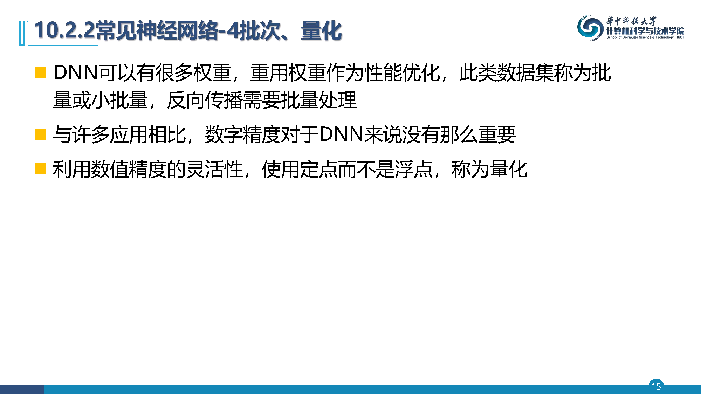

---

- **中科院计算所设计并实现神经网络（NN）加速处理器——寒武纪及其指令集。根据前面对于DNN算法的介绍，其向量和矩阵的数据级并行比标量的并行度更高效；并且代码密度也更高。所以，寒武纪的设计重点在于使用硬件来表示、挖掘数据级并行，具体而言：**
  - 分解大数据块操作成为一组处理规模较小的专用矩阵/向量处理，提高灵活性
  - 类RISC的指令格式设计可以降低设计验证的复杂性、译码器的功耗和面积

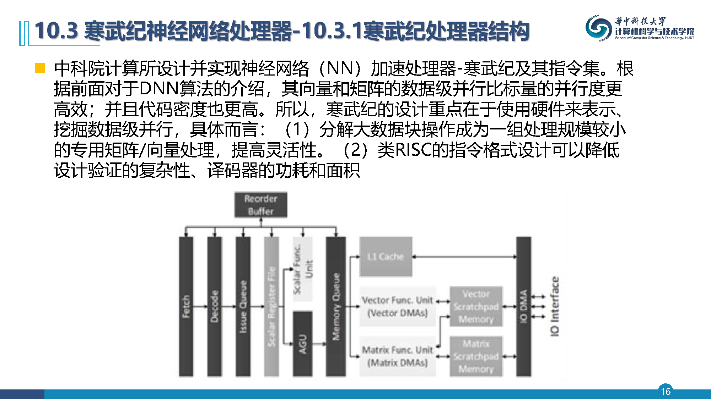

---

- **寒武纪处理器设计了一个简洁、灵活高效的指令集**
- **寒武纪处理器提供4类通用指令：计算、逻辑、控制和数据移动，指令长度都是64位，这有利于内存对齐以及load/store/指令译码逻辑的简化。控制和数据传送指令类似于相应的RISC指令，仅为NN做了少许改动。运算指令（包括矩阵，向量和标量）和逻辑操作指令是特有的**

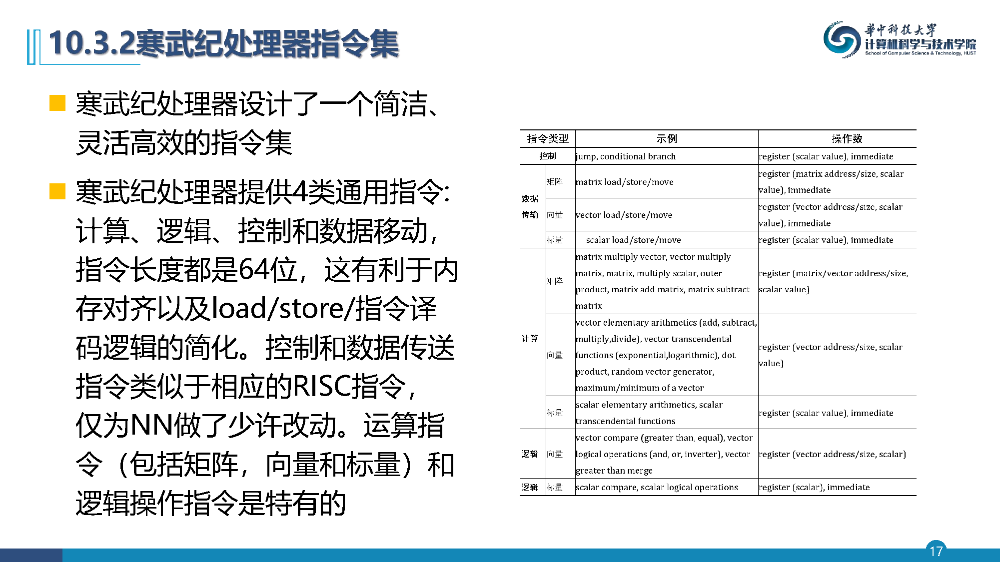

---

- **寒武纪处理器一共设计了6条矩阵指令。不失一般性，我们以广泛使用的sigmoid函数 $f(t) = \frac{1}{1+e^{-t}}$ 为例说明。一个向量的元素级sigmoid激活可以分成3个步骤，每个步骤都由一条指令来支持：**
  - 计算输入向量的每一个元素的指数
  - 把常数1加到向量的每一个元素
  - 计算 $= \frac{1}{1+e^{-t}}$
- **以多层感知机（MLP）的例子，描述矩阵运算指令是如何支持它的。MLP通常包括多层，每一层通过一些已知神经元（比如，输入神经元）来计算一些未知的神经元的值（比如，输出神经元）。前向计算中，一个这样的层可以表示如下：$Y = f(WX + b)$**
- **寒武纪处理器提供了一个向量对应元素相除的"向量除向量"指令**

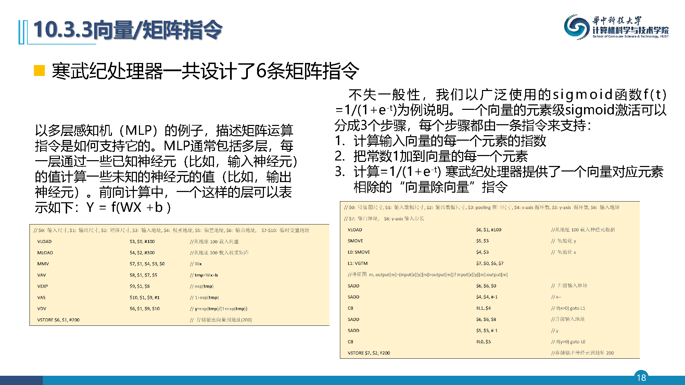

---

- **除了向量计算指令之外，寒武纪处理器还提供VGT（Vector Greater than）、VE（Vector Equal）、VAND/VOR/VNOT、标量比较、标量逻辑运算等指令**
- **寒武纪处理器的设计原则总结起来是几点：**
  - (1) 采用基于load-store访存模式的RISC指令集
  - (2) 不使用复杂的Cache体系和相关控制逻辑
  - (3) 使用暂存器而不是寄存器堆来作为计算数据的主存储

---

- **附录J进一步介绍了专用加速器相关知识的扩展内容，并按照本章相关主题进行了分类**
- **附录J额外描述了谷歌张量处理加速器（附录J.1）**

---

