<!-- _class: lead -->

# 指令系统

**计算机系统结构**

---

## 本章内容

- **理解计算机指令集体系架构概念**
- **掌握计算机指令集体系架构内容**
- **理解指令集和编译器的相互作用**
- **了解RISC-V指令集、ARMv8指令集和龙芯指令集**

---

- **指令集体系架构（Instruction Set Architecture, ISA），简称指令集**
  - 计算机硬件具有标准接口和操作规范
  - 软硬件的分界线
- **本章讨论内容**
  - 计算机指令集
  - 编址和寻址方式、指令类型及格式
  - 与指令集相辅相成的编译器
  - 典型指令集（RISC-V、ARMv8、龙芯）

---

**指令集提供了处理器硬件抽象**

- 定义了软硬件系统之间的逻辑接口
- 决定了CPU微架构的具体功能
- 在兼容指令集的前提下，软件和硬件系统能各自独立发展
- **复杂指令集（CISC）与精简指令集（RISC）**
  - CISC通常提供数百条指令，降低了对编译器要求，但增加了硬件实现的复杂性
  - RISC指令集仅提供必要的基础指令，由编译器将复杂操作分解为多条基础指令的组合
  - 现有CISC指令集CPU也能在硬件中采用微码（Microcode）方式实现复杂指令的分解
- **流行指令集**：Intel x86、ARM、开源的RISC-V

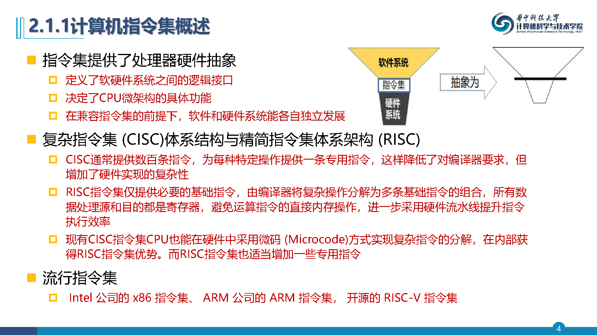

---

- **高级C语言编写的程序通过编译过程生成二进制机器码**
- **机器码映射到硬件表示，CPU内部通过硬件微架构（Microarchitecture）识别、执行指令（机器码）**
- **微架构实现所有指令到内部计算单元、逻辑判定单元、存储单元和通讯单元等硬件功能模块之间的映射**
- **每个基本硬件功能单元通过一套特定电路实现**

---

- **CPU视图**
  - **体系结构寄存器（Architectural registers）**
    - 显示寄存器（通用寄存器、状态寄存器和指令计数器等）
  - **内存地址空间**
- **指令执行过程就是在当前CPU视图状态下，执行一条指令，变迁到下一个CPU视图状态的过程**
  - RISC类型CPU首先更新显示寄存器，之后修改相应的内存地址空间

---

**指令集体系结构定义了程序员可见的处理器视图**

- 包括全部指令集合、每条指令格式和功能、寄存器和内存视图
- 指令集是有格式的，让CPU能够机械地正确识别和解析所有指令
- 指令集格式必须标识所有的功能：指令码、寻址模式、数据类型、指令类型、指令格式、寄存器命名、条件码等
- **通常从7个方面对指令集体系结构进行定义和分类：**
  1. 数据存取模式
  2. 内存编址模式
  3. 内存寻址
  4. 操作数类型及大小
  5. 操作数
  6. 控制指令
  7. 指令格式

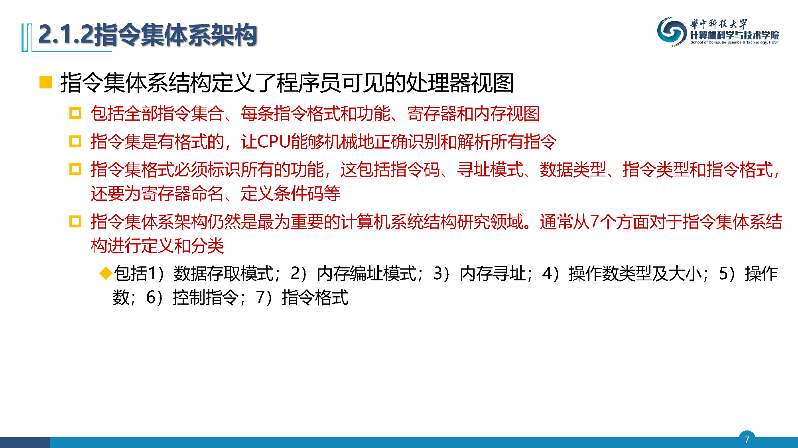

---

**数据访问操作很大程度决定了ISA**

| 内存地址数目 | 最大操作数个数 | 类型 | 示例 |
| --- | --- | --- | --- |
| 0 | 3 | 寄存器-寄存器 | ARM, MIPS, PowerPC, RISC-V |
| 1 | 2 | 寄存器-内存 | Intel 80x86, Motorola 68000 |
| 2 | 2 | 内存-内存 | VAX |
| 3 | 3 | 内存-内存 | VAX |

- **寄存器-寄存器**：简单、固定长度指令编码；缺点是指令数目高于采用内存引用的系统
- **寄存器-内存**：无需独立的载入指令就可以访问数据；缺点是每条指令的时钟数会随操作数位置变化
- **内存-内存**：最紧凑；缺点是指令规模变化很大，内存访问会造成瓶颈

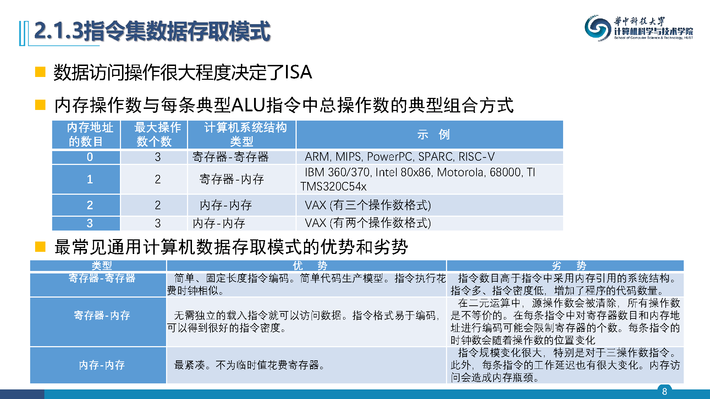

---

- **指令集首先需要建立全局存储空间**
  - CPU按照地址存取寄存器、内存中的数据，访存指令能够根据指令类型和访问地址正确存取数据
- **指令集内存空间通常是字节编址和寻址**
- **主流CPU中，字节内的位（bit）次序是一致的**
- **CPU访问内存的单位是字（word）**
  - 64位CPU的基本存取单元是64个bit（双字）
  - 需要提供对字节（8位）、半字（16位）和字（32位）的访问方式

---

- **多字节数据对象访问，必须约定存取数据对象内部的字节次序**
  - 数据对象中的字节排位方式有大端模式和小端模式
  - x86和ARM架构都采用小端模式
    - CPU的D0线是最低位，D7线是最高位
    - 以太网的物理层是大端的字节序

---

**数据对齐**

- 在许多计算机中，对多字节数据对象进行寻址时都必须和CPU字是对齐的
- s字节的数据对象，字节地址为A，如果A mod s=0，则对该对象的寻址是对齐的
- 一般CPU和内存硬件连线是固定而且对齐的
- 具体的对齐策略由体系结构、操作系统、编译器和语言规范定义
- 32/64位机器上的Visual C/C++将双精度数据类型对齐到8个字节

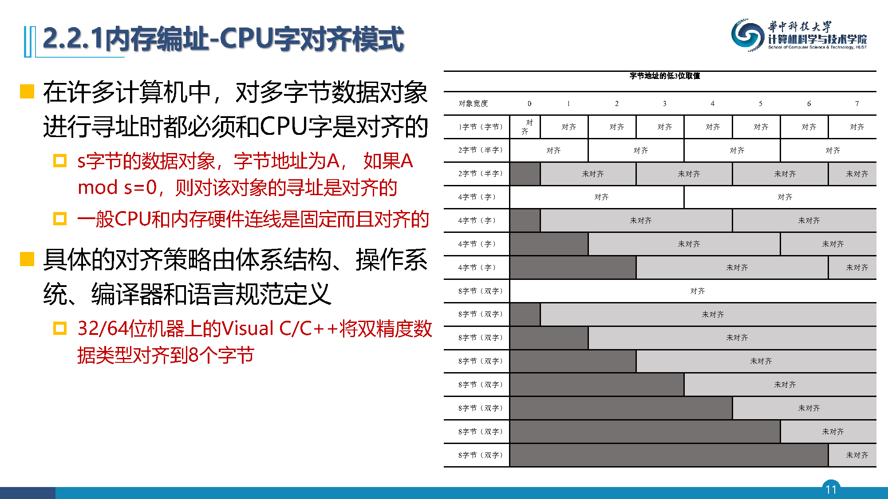

---

- **指令集确定指令在地址空间进行精确寻址，从而得到要访问数据对象的内存地址、寄存器地址**
  - 在访存地址时，由寻址方式指定的实际内存地址称为有效地址
  - 需要解决常数处理
- **增加寻址模式能够大幅减少指令数量，但也会增加计算机实现的复杂度**

---

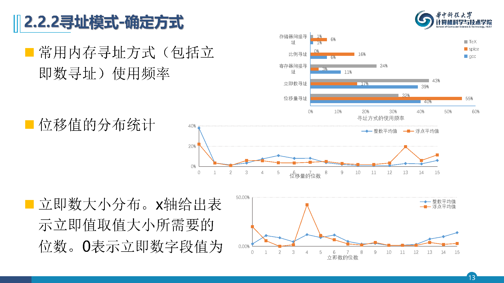

---

**指令操作的数据类型**

- 最常用在指令操作码中的标识来定义操作数的类型，能被硬件识别的标签对数据类型进行标记
- 操作数类型（整数、单精度浮点、字符等）的有效地址决定了其大小
  - 常见操作数类型包括：字符（8位）、半字（16位）、字（32位）、单精度浮点（单字）和双精度浮点（双字）
- 整数几乎都是用二进制补码数字表示；浮点数通常都使用IEEE 754浮点标准
- **近年指令集支持向量或矩阵数据类型**

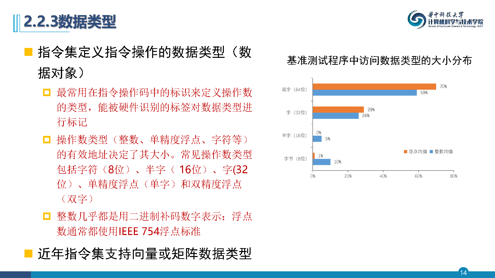

---

**指令集功能类型和格式**

- 遵循加快经常性事件设计原则，通常简单、基础操作为最频繁执行的指令
- 指令功能完备性，必要功能指令都需要支持
- **大多数指令集支持的操作类型：**

| 操作符类型 | 示例 |
| --- | --- |
| 算数与逻辑 | 整数算术与逻辑运算：加、减、与、或、乘、除 |
| 数据传送 | Load-Store指令 |
| 控制 | 分支、跳转、过程调用与返回、陷入 |
| 系统 | 操作系统调用、虚拟内存管理指令 |
| 浮点 | 浮点运算：加、乘、除、比较 |
| 字符串 | 字符串移动、比较、搜索 |

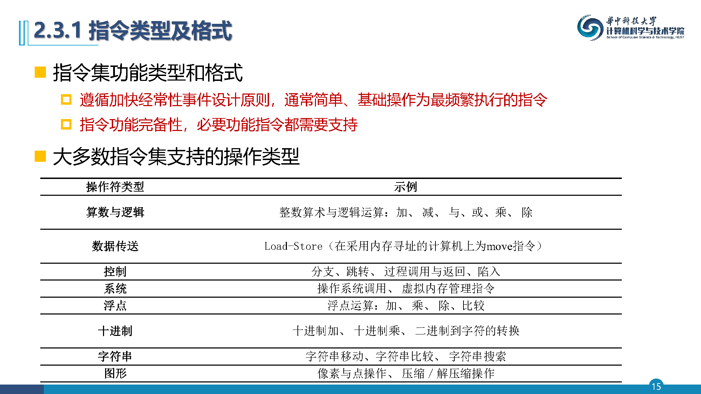

---

- **80x86中执行最多的前10类指令**（占流行整数程序的96%）

| 排位 | 80x86指令 | 整数均值占比 |
| --- | --- | --- |
| 1 | Load载入 | 22% |
| 2 | 条件分支 | 20% |
| 3 | 比较 | 16% |
| 4 | Store存储 | 12% |
| 5 | 加 | 8% |
| 6 | 与 | 6% |
| 7 | 减 | 5% |
| 8 | 寄存器之间值的移动 | 4% |
| 9 | 调用 | 1% |
| 10 | 返回 | 1% |

- 新应用场景增加特殊强化指令、向量指令，以及同步指令和内存访问一致性指令

---

- **控制流指令实现程序分支与跳转，分为4种不同类型：**
  1. 条件分支
  2. 跳转
  3. 过程调用
  4. 过程返回

---

**控制流指令的目标地址**

- 分支指令包含地址或者地址计算模式
- 使用程序计数器（PC）加上偏移量方式寻址，称为PC相对分支指令
- **高级语言表达分支语义**
  - case或switch语句
  - 虚拟函数或虚拟方法
  - 高阶函数或函数指针
  - 动态共享库
- 通常采用寄存器间接跳转，统计分支偏移量分布确定其距离

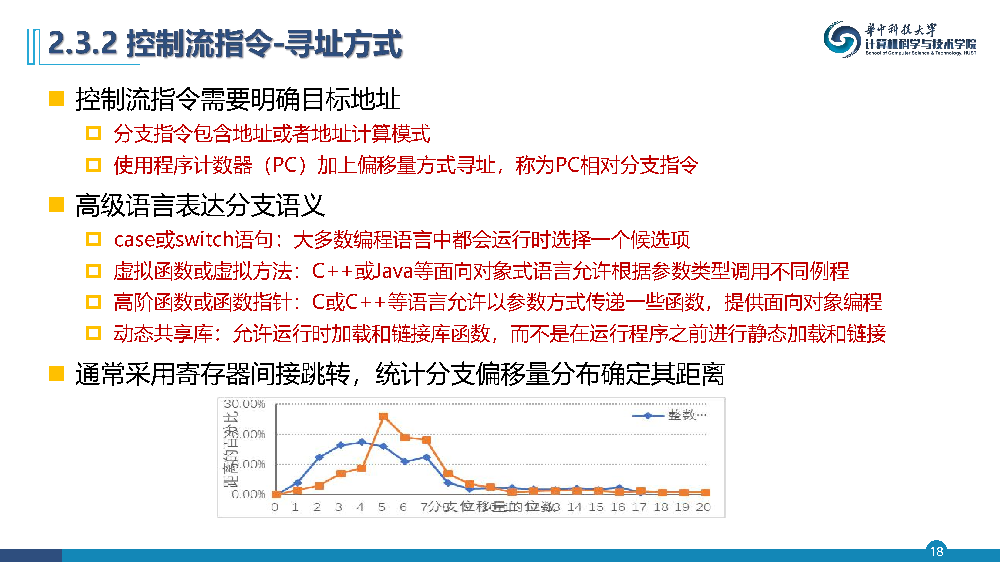

---

- **条件分支的判定方式**

---

**过程调用和返回**

- 过程调用和返回包括控制转移和上下文保存过程
- 返回地址需要保存在特殊链接寄存器，或者保存通用寄存器中
- **两种基本约定方式：**
  - **调用者保存**：发出调用的过程必须保存它希望在调用之后进行访问的寄存器
  - **被调用者保存**：被调用过程必须保存它希望使用的寄存器
- 多数实际系统都采用这两种机制的组合方式，在应用程序二进制接口（ABI）中指定

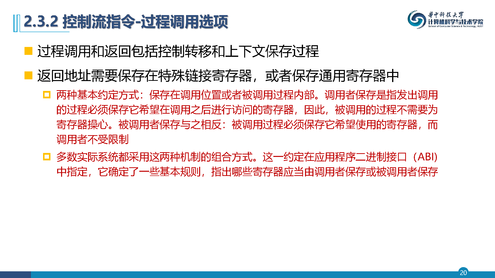

---

**指令格式**

- 指令格式能让硬件电路快速识别操作和操作数
- 指令格式规格化特定字段，并且编码描述操作、寻址方式等
  - 较早的计算机有1-5个操作数，每个操作数有10种寻址方式，这样导致较大组合空间
  - Load-Store计算机可以将寻址方式嵌入到操作码中统一编码
- **指令进行编码时，确定寄存器字段和寻址方式字段**
  - 寄存器和寻址方式的数量
  - 寄存器字段和寻址方式字段大小对平均指令长度的影响
  - 编码后的指令长度易于以流水线实施方式处理

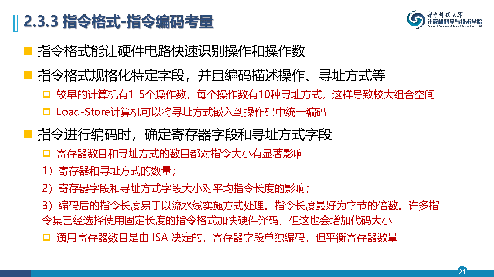

---

- **通用寄存器数目是由ISA决定的，寄存器字段单独编码**
- **常见指令编码方式**
  - 变长编码
  - 定长编码
  - 混合编码方法
    - 采用固定16位格式的RISC指令集
    - 新混合RISC指令集同时拥有16位和32位指令，较短的指令支持较少的运算、较小的地址与立即数字段、较少的寄存器和两地址格式

---

**编译器技术与指令集**

- 编译器技术对于设计、实现指令集是至关重要的
  - 编译器把高层语言程序转化为可以在CPU上运行的二进制指令流
  - 绝大多数程序指令都是编译器生成的，所以指令集体系结构最主要的"用户"就是编译器
- **编译器整体结构和编译过程**
  - 每种编程语言都有一个和语言相关的前端（分析），把源程序分析为多个组成要素及其语法结构
  - 经过词法分析、语法分析、语义分析和中间代码生成器，得到中间表示和符号表
  - 然后进入综合（synthesis），分为高级优化阶段、代码生成阶段和目标机器相关代码优化阶段

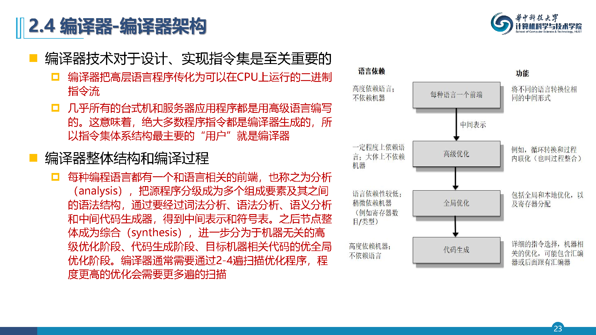

---

**现代编译器执行的优化分类**

- **高层优化**：对高级语言源代码执行，将输出结果传送给后续的优化扫描
- **局域优化**：仅对无分支代码段（基本块）内的代码进行优化
- **全局优化**：将本地优化扩展到分支范围之外，并引入一组专为优化循环的转换
- **寄存器分配**：将寄存器与操作数关联在一起
- **与CPU相关的优化**：充分利用目标体系结构的特性进行专门优化

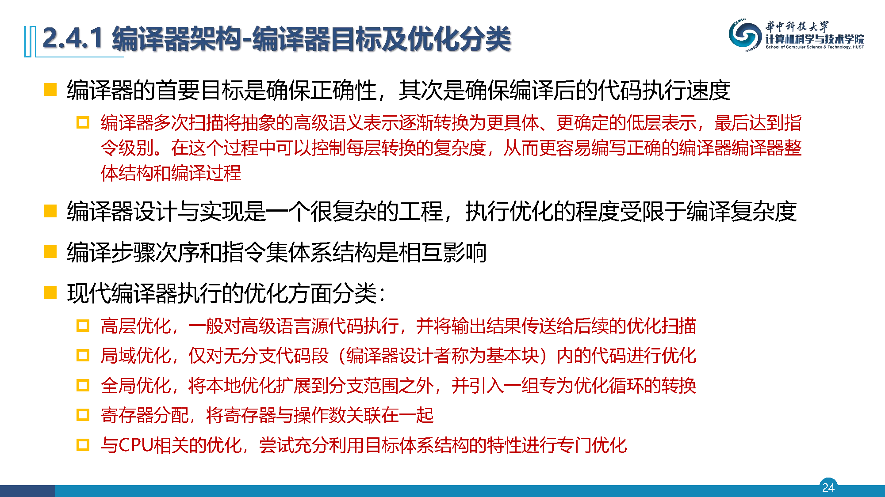

---

**寄存器分配**

- 编译器基本操作之一是寄存器分配
  - 寄存器是最快的数据存储单元，其分配效果对于CPU执行过程至关重要
- **寄存器使用分为两个过程：寄存器分配和寄存器指派**
  - 寄存器分配指在每个时间点，选择一组将被放到寄存器中的变量
  - 寄存器指派为每个变量分配一个寄存器
- **寄存器分配算法称为图（Graph）着色技术**
  - 基本思想是构造一幅变量关系图，进行寄存器合理分配
  - 图着色最好使用至少16个通用寄存器，对于整数变量进行全局分配

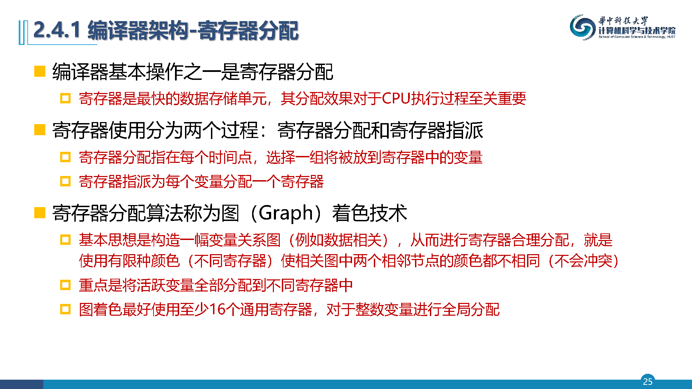

---

- **编译质量：代码大小和运行速度**
  - 给定程序可以实现为多种指令序列，不同实现具有不同的运行效果
  - 编译器与高级语言之间的关系显著影响生产机器代码的质量
- **针对高级语言用来保存数据的三个独立结构进行分析：**
  - 栈：用于本地变量分配
  - 全局数据区：用于全局变量和常量
  - 堆：用于不符合栈规则的动态对象分配

---

- **编译器共完成了11个局域优化与全局优化**
- **主要优化类型及每种类型的示例**

---

- **指令集特性可以帮助更好地编写编译器**
  - 指令功能格式的正则性
  - 提供基础原语
  - 平衡多因素
  - 尽量在编译时确定和使用常量
- **设计考量**
  - 寄存器数量：新指令集体系结构中至少拥有16个通用寄存器
  - 正交性：全部寻址方式都适用于所有传送数据的指令
  - 简单性：提供原语而非解决方案
  - 在指令集设计中，少就是多

---

- **科学计算和多媒体应用都需要处理向量，而向量具有内部数据（元素）并行性**
- **向量计算机的一个主要优势：一次载入多个元素，然后将执行与数据传输重叠起来，从而隐藏内存访问的延迟**
- **SIMD指令通常是向量指令集体系结构的简化版，通常处理较短的向量**

---

**特殊扩展指令**

- **同步和一致性指令**
  - 协调多线程并发工作需要引入原子和一致性操作
  - 原子表示某一处理器内存读写之间的过程不会被打断
- **虚拟化指令集**
  - 在主机操作系统中进一步分层，底层是虚拟机控制器（Virtual Machine Monitor, VMM）
  - 可以使用解释执行、动态二进制翻译、扫描和翻译和半虚拟化技术
- **安全扩展指令集**
  - 当前CPU提供基于硬件的内存加密，将内存中的特定应用代码和数据隔离开来

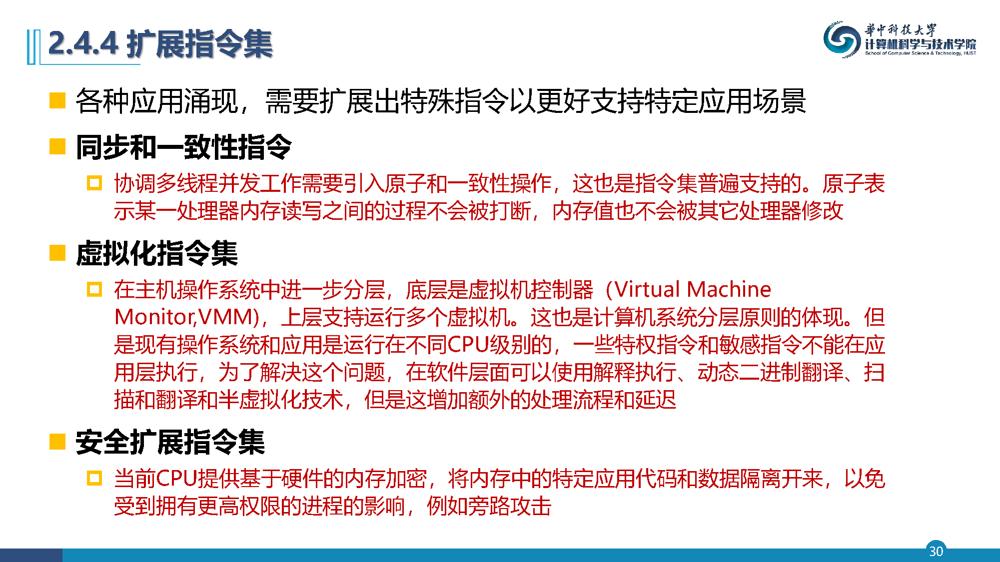

---

**RISC-V指令集**

- 加州大学伯克利分校在2010年发布的第五代RISC通用指令集架构
- 采用大量通用寄存器、易于流水线化和一组精简指令，包括32位和64位指令集
- **核心指令集RV32I**包括47条整型指令，可支持操作系统的运行
  - 提供模块化可选扩展：RV32M（乘除法）、RV32F（单精度浮点）、RV32D（双精度浮点）、RV32A（原子操作）
  - 寻址模式：偏移量（12-16位大小）、立即数（8-16位大小）和间接寄存器
  - 数据大小：8位、16位、32位和64位整数，64位IEEE 754浮点数
  - 提供至少16个，最好是32个通用寄存器
  - 使用固定指令编码模式，也支持可变指令编码

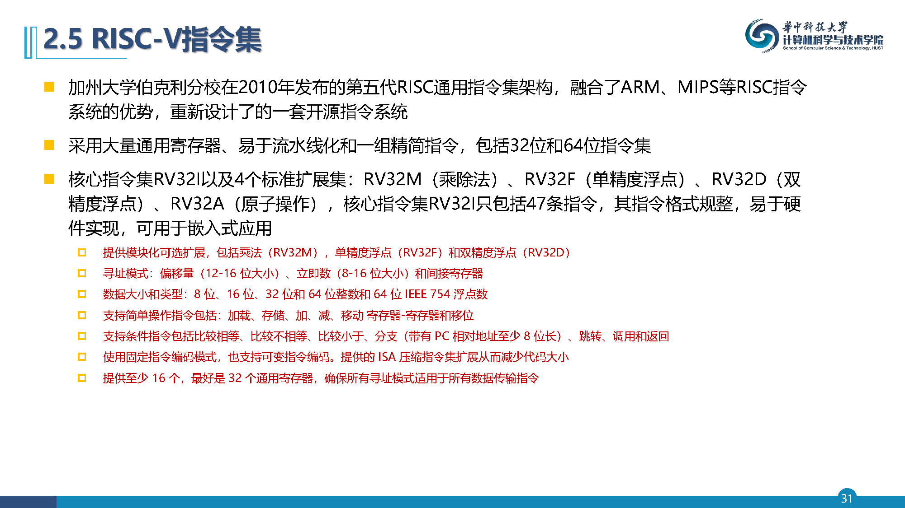

---

- **RV32I为定长指令集，但操作码字段预留了扩展空间，可以扩展为变长指令，指令字长必须是双字节对齐**
- **RISC-V包括6种指令格式**

---

**龙芯指令集（LoongArch）**

- 国产自主可控的龙芯系列通用处理器
- LoongArch仍采用RISC指令集原则：32位定长指令、32个通用寄存器、32个浮点/向量寄存器
  - 具体包括：基础指令337条、虚拟机扩展10条、二进制翻译扩展176条、128位向量扩展1024条、256位向量扩展1018条，共计2565条原生指令
- 相对于MIPS：单条指令支持的立即数从MIPS的最大16位扩展到最大24位，分支跳转偏移也从64K扩展到1M字节
- 指令格式类型从MIPS的3种扩大到9种：包含3种无立即数格式和6种有立即数格式

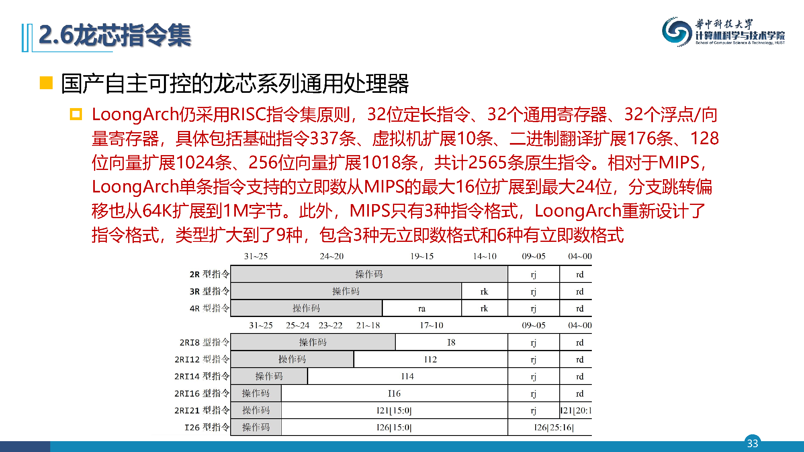

---

- **附录内容说明**
  - 附录B进一步介绍了指令集相关的扩展知识
  - 在2.2节基础之上增加了寻址方式、数据类型实例
  - 在2.3节基础之上增加了控制流指令和指令格式实例
  - 在2.4节基础之上增加了编译优化和多媒体指令实例
  - 介绍了ARM指令集（附录B.4）

---

---
