<!-- _class: lead -->

# 流水线处理器

**计算机系统结构**


---

## 本章内容

- **理解通过微架构实现指令集**
- **掌握指令流水线原理及性能分析**
- **掌握和分析指令流水线冲突**
- **掌握数据冲突原因及解决思路**
- **掌握分支冲突原因及解决思路**
- **掌握流水线具体实现方法**

---

## 指令集与微架构

- **指令集ISA是软硬件的分界线，指令集的硬件实现称为微架构**
  - 解析指令格式，并执行相应功能
  - 具体过程对于程序员和软件来说是透明的
- **微架构**：指令执行流水线、超标量处理、缓存机制、内存存取调度策略、猜测执行、时钟门、预取机制、电压/频率调节、纠错等功能
- **保证软件的兼容性**：指令集保持不变，但微架构会不断优化
  - 早期处理器设计者主要考虑电路的正确性
  - 当前处理器设计者主要考虑执行性能、扩展功能、控制能耗和效率提升

---

<style>
.columns { display: grid; grid-template-columns: 1fr 1fr; gap: 1.5rem; }
</style>

<div class='columns'>

<div>

## 逻辑电路组成

- **微结构硬件由逻辑电路部件构成**
  - 一个逻辑电路实现输入线和输出线的功能映射
  - 通过真值表描述输入和输出之间的逻辑关系
  - 进一步分解为基本门电路的组合
- **传播延迟（propagation delay）**：输入信号的改变导致输出信号的改变，改变过程需要时间
- **组合电路**：输出严格依赖于输入的组合
  - 基本门电路（与、或、非、异或等）、多路选择器、解码器、可编程逻辑阵列
- **时序电路**：输出依赖于前期的数据输出和当前的数据输入
  - 锁存器（Latch）和D触发器（Flip-Flop）

</div>

<div>

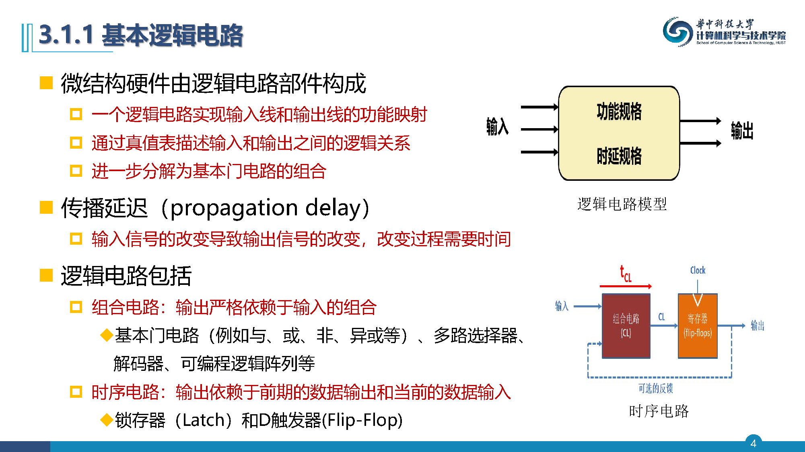

</div>

</div>

---

<style>
.columns { display: grid; grid-template-columns: 1fr 1fr; gap: 1.5rem; }
</style>

<div class='columns'>

<div>

## 数据存储部件

- **组合逻辑和时序路径电路可以构造出更复杂的逻辑电路部件**
- **数据存储部件**：
  - (A) 32位指令计数器
  - (B) 32位寻址的指令存储器结构
  - (C) 32个32位寄存器组，能实现两端读和单端写
  - (D) 32位寻址的数据存储器结构

</div>

<div>

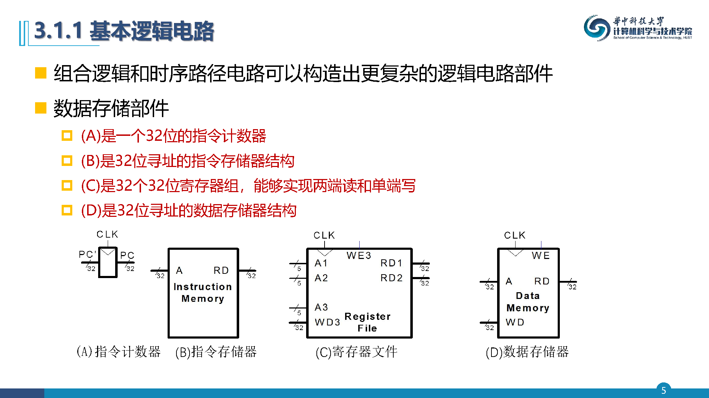

</div>

</div>

---

<style>
.columns { display: grid; grid-template-columns: 1fr 1fr; gap: 1.5rem; }
</style>

<div class='columns'>

<div>

## CPU数据路径与控制路径

- **CPU运行就是自动执行有限状态机**
- **在当前CPU状态下，读取、执行一条指令及处理相应数据之后，产生新的CPU状态**
- **从微架构角度看，处理器硬件对于一条指令的执行进一步分为**：
  - **数据路径**：包含数据存储和计算部件（指令计数器、指令寄存器、寄存器组、ALU和主存等）
  - **控制路径**：控制指令在数据路径中的执行过程，告诉数据路径如何执行指令

</div>

<div>

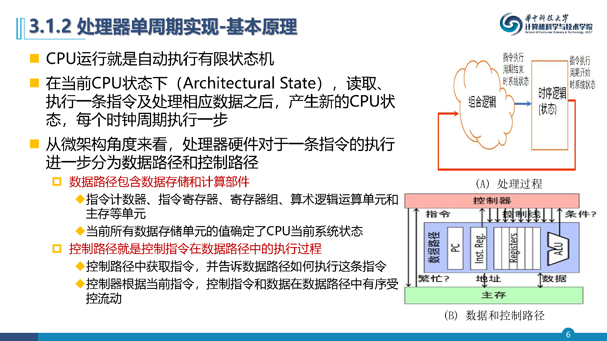

</div>

</div>

---

## RISC处理器执行add指令的数据路径

- **在RISC处理器上执行 `add rd, rs1, rs2` 的数据路径和时序**

| 阶段 | 操作 | 说明 |
|------|------|------|
| 第一阶段 | `MA:=PC` | RegSel=PC; RegW=0; RegEn=1; MALd=1 |
| 第二阶段 | `B:=Reg[rs2]`, `A:=Reg[rs1]` | RegSel=rs2/rs1; RegW=0; RegEn=1; ALd=1, BLd=1 |
| 第三阶段 | `Reg[rd]:=A+B` | ALUop=Add; ALUEn=1; RegSel=rd; RegW=1 |
| 最后 | `Reg[rd]=Reg[rs1]+Reg[rs2]` | PC=PC+4 |

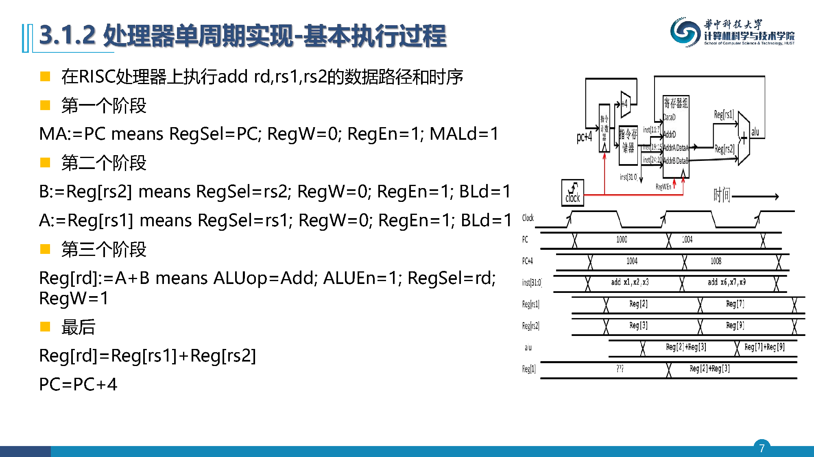

---

## 简单RISC-V处理器的完整数据路径

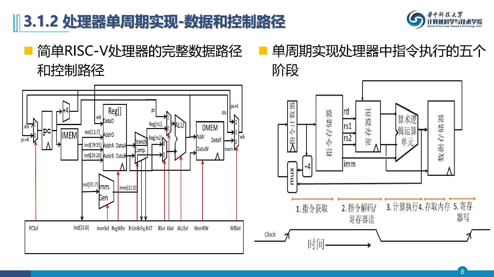

---

<style>
.columns { display: grid; grid-template-columns: 1fr 1fr; gap: 1.5rem; }
</style>

<div class='columns'>

<div>

## 单周期处理器的时钟周期

- **单周期处理器中，时钟周期由最长的指令执行时间决定**
- **需要分析关键路径（最长组合逻辑电路通道）的总延迟，并做针对性优化**
- **也可把一个长时钟周期分解为多个短时钟周期（微指令思想）**

</div>

<div>

## 不同类型指令的关键路径和延迟

| 执行阶段 | IF | ID | EX | MEM | WB | 整体延迟 |
|----------|-----|-----|-----|------|-----|----------|
| 执行部件 | 内存 | 寄存器 | 逻辑运算 | 内存 | 寄存器 | |
| R型指令 | 200 | 50 | 100 | | 50 | 400 |
| I型指令 | 200 | 50 | 100 | | 50 | 400 |
| 取数据指令 | 200 | 50 | 100 | 200 | 50 | 600 |
| 写数据指令 | 200 | 50 | 100 | 200 | | 550 |
| 分支 | 200 | 50 | 100 | | | 350 |
| 跳转 | 200 | | | | | 200 |

</div>

</div>

---

<style>
.columns { display: grid; grid-template-columns: 1fr 1fr; gap: 1.5rem; }
</style>

<div class='columns'>

<div>

## 微码的单总线数据路径实现

**微指令写使用寄存器传输**：
- `MA:=PC` → RegSel=PC; RegW=0; RegEn=1; MALd=1
- `B:=Reg[rs2]` → RegSel=rs2; RegW=0; RegEn=1; BLd=1
- `Reg[rd]:=A+B` → ALUop=Add; ALUEn=1; RegSel=rd; RegW=1

**微码程序**：
- Instruction Fetch: MA,A:=PC; PC:=A+4; wait for memory; IR:=Mem
- ALU: A:=Reg[rs1]; B:=Reg[rs2]; Reg[rd]:=ALUOp(A,B); goto instruction fetch
- ALUI: A:=Reg[rs1]; B:=ImmI; Reg[rd]:=ALUOp(A,B); goto instruction fetch

</div>

<div>

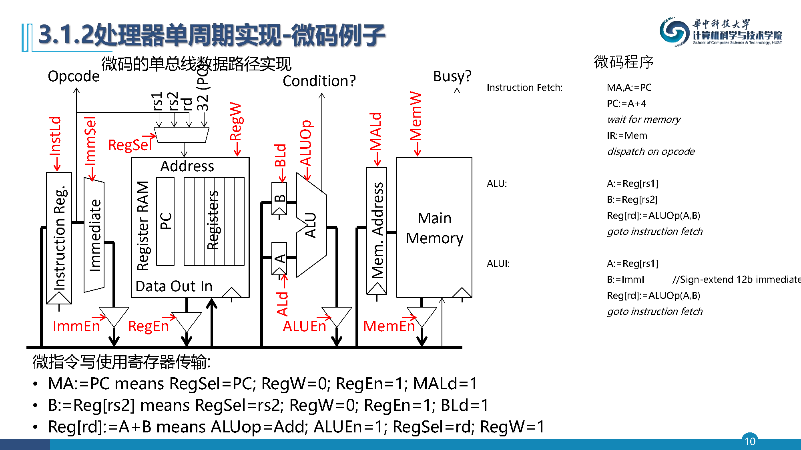

</div>

</div>

---

<style>
.columns { display: grid; grid-template-columns: 1fr 1fr; gap: 1.5rem; }
</style>

<div class='columns'>

<div>

## 单周期实现的不足

- **单周期处理器虽然可以实现指令集，但从硬件角度来看，整体利用率不高**
- **不同指令执行周期长短不一，一个部件使用时，其他部件可能完全空闲**
- **为了提升硬件利用率和整体性能，需要引入流水线结构**

</div>

<div>

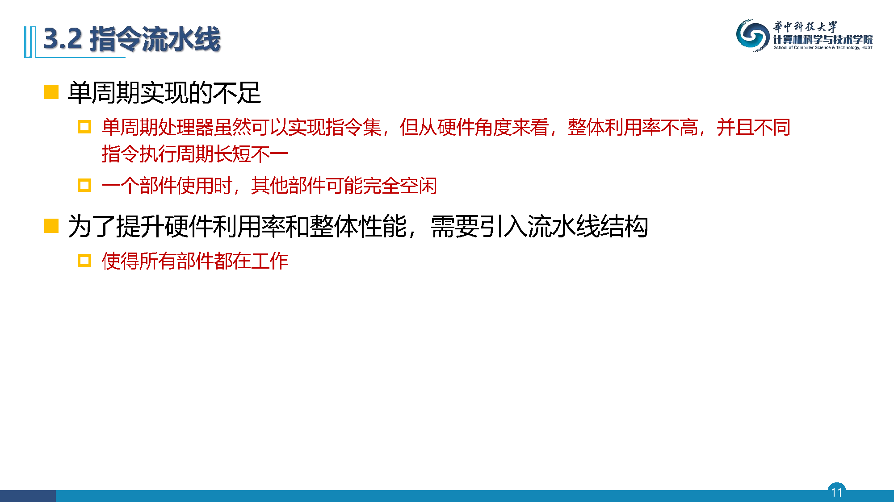

</div>

</div>

---

## 流水线处理器 vs 非流水处理器

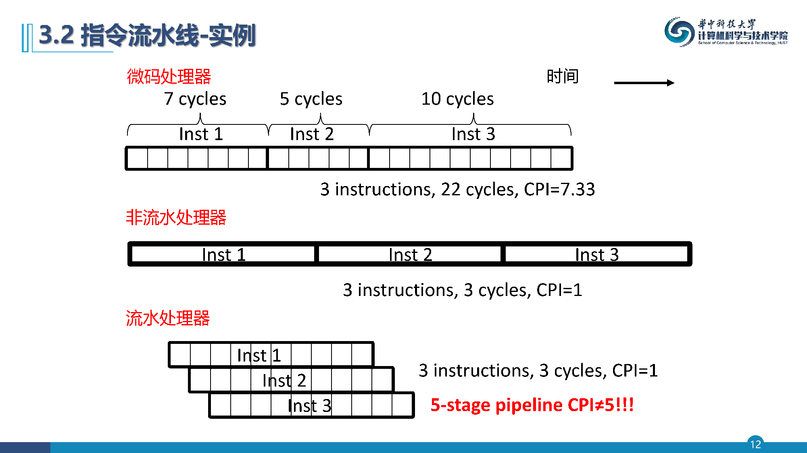

---

<style>
.columns { display: grid; grid-template-columns: 1fr 1fr; gap: 1.5rem; }
</style>

<div class='columns'>

<div>

## 流水线原理

- **流水线中的每个步骤执行指令的一个处理环节，不同步骤能够并行执行不同指令的相应操作**
- **每一步骤称为流水级或流水段**
- **流水级前后相连形成流水线，指令从一端进入，依次通过流水级，在另一端流出**
- **所有流水级都必须同时工作**

## 指令执行吞吐率

- **非流水线**：`1/(T+R)`
- **流水线**：`1/(T/K+R)`

</div>

<div>

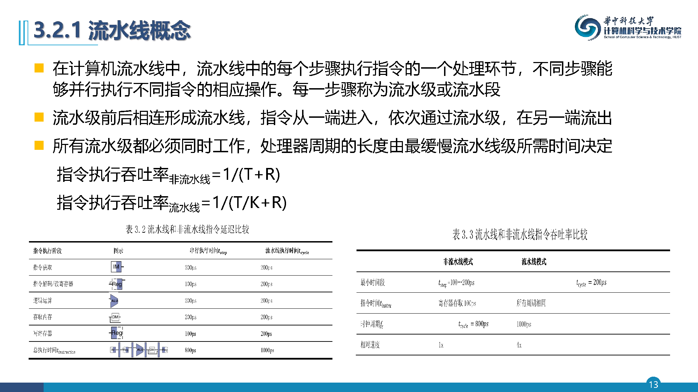

</div>

</div>

---

<style>
.columns { display: grid; grid-template-columns: 1fr 1fr; gap: 1.5rem; }
</style>

<div class='columns'>

<div>

## RISC-V整数流水线

- **实现载入、存储、分支和ALU指令类型**
- **五阶段指令执行过程**：
  - IF（指令获取）
  - ID（指令解码/读寄存器）
  - EX（逻辑运算）
  - MEM（存取内存）
  - WB（写寄存器）
- **每条指令仍需要5个周期执行完成，但每个时钟周期内5个流水线段执行5条不同指令**
- **每条指令的上下文数据随着指令一起流动**

</div>

<div>

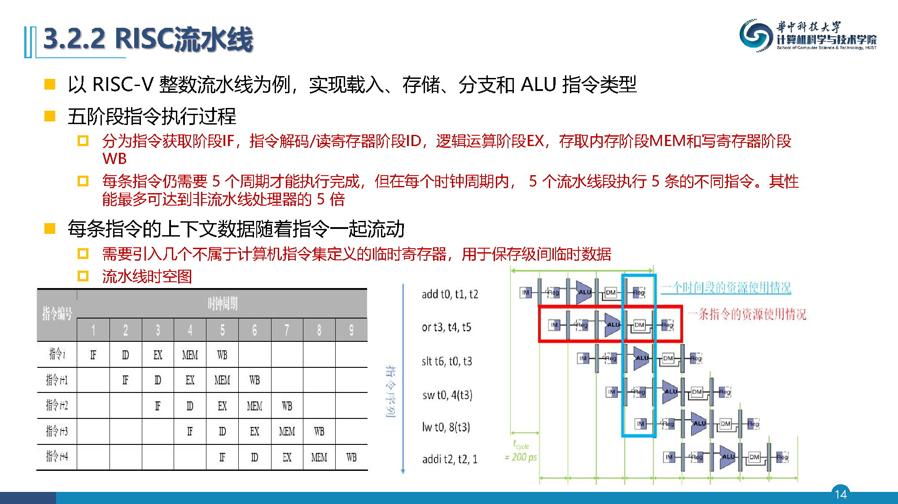

</div>

</div>

---

## 五阶段指令执行过程

### （1）指令提取周期（IF）
```assembly
IR←Mem[PC]
NPC←PC+4
```

### （2）指令译码/寄存器提取周期（ID）
```assembly
A←Regs[rs1]
B←Regs[rs2]
Imm←符号扩展IR中的立即数
```

### （3）执行/有效地址周期（EX）

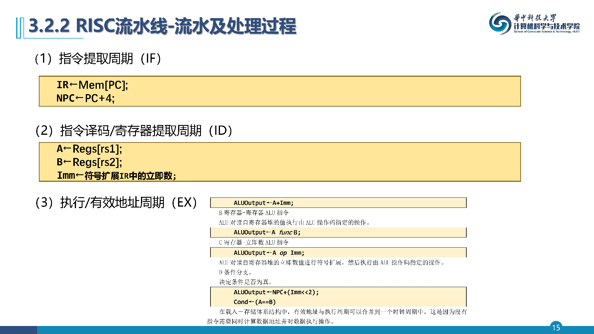

---

## 存储访问与写回周期

### （4）存储访问周期（MEM）
```assembly
LMD←Mem[ALUOutput]  或  Mem[ALUOutput]←B
```

### （5）写回周期（WB）

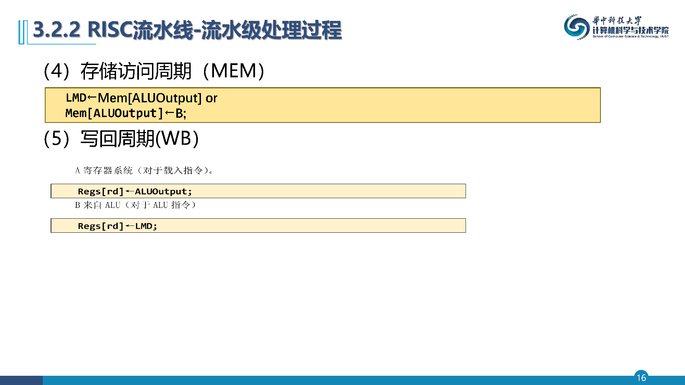

---

<style>
.columns { display: grid; grid-template-columns: 1fr 1fr; gap: 1.5rem; }
</style>

<div class='columns'>

<div>

## 段级寄存器的五段流水线

- **级间寄存器、多路选择器**
- **每个流水阶段上的事件**

</div>

<div>

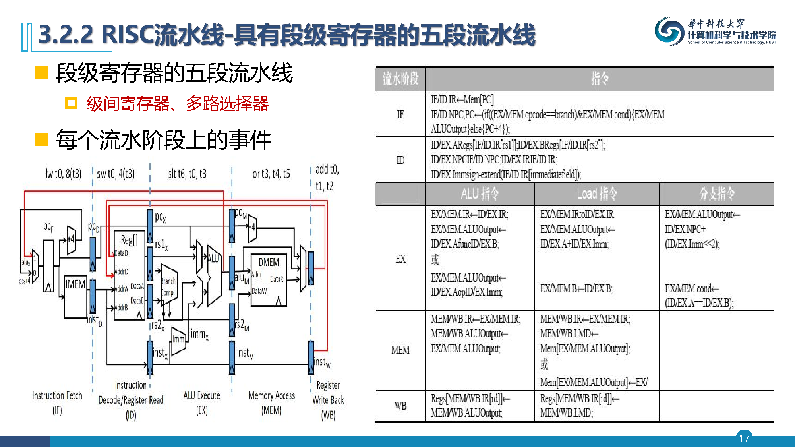

</div>

</div>

---

<style>
.columns { display: grid; grid-template-columns: 1fr 1fr; gap: 1.5rem; }
</style>

<div class='columns'>

<div>

## 流水线处理结构特征

- **从时空图角度抽象**
- **从流水线控制处理过程抽象**
  - 控制路径
  - 数据路径

</div>

<div>

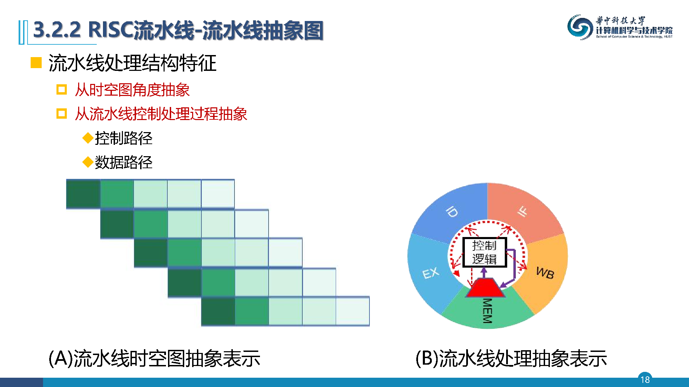

</div>

</div>

---

<style>
.columns { display: grid; grid-template-columns: 1fr 1fr; gap: 1.5rem; }
</style>

<div class='columns'>

<div>

## 流水线深度限制因素

- **流水线中流水级之间的失衡和流水化开销会限制流水线深度**
- **流水线时钟周期包含流水线寄存器延迟和时钟偏差**

</div>

<div>

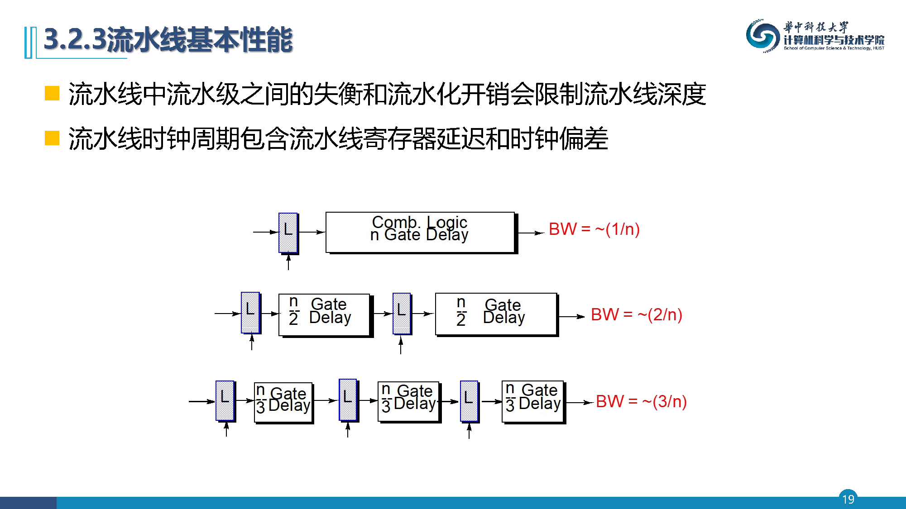

</div>

</div>

---

## 五段流水线时空图

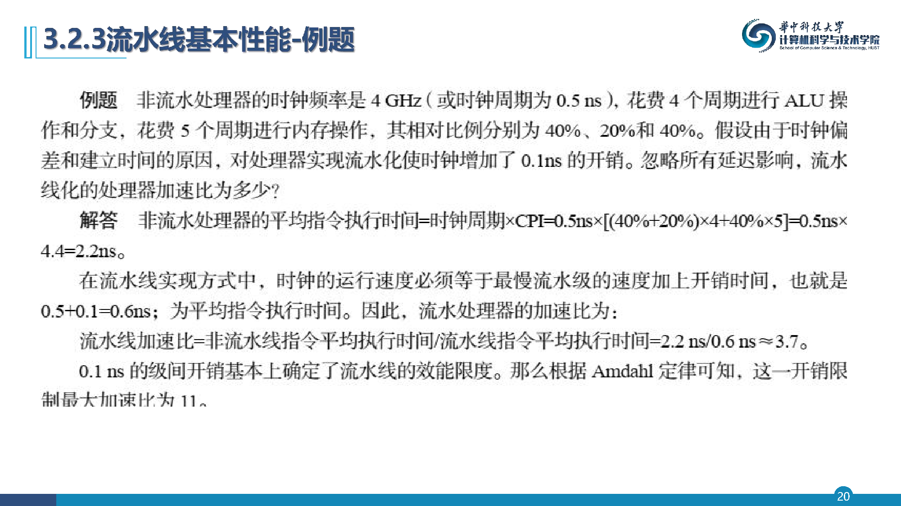

---

<style>
.columns { display: grid; grid-template-columns: 1fr 1fr; gap: 1.5rem; }
</style>

<div class='columns'>

<div>

## 流水线冲突（Hazard）

- **现实流水线中存在指令之间的冲突（hazard），达不到理想加速比**
- **hazard表达有潜在冲突的可能，只有特定情况才会发生**
- **主要有三类流水线冲突**：
  - **结构冲突**：多条指令重叠执行时，同时竞争某一硬件部件
  - **数据冲突**：并发执行的前后指令访问相同的数据
  - **控制冲突**：分支指令及其他改变程序计数器的指令会改变指令流

</div>

<div>

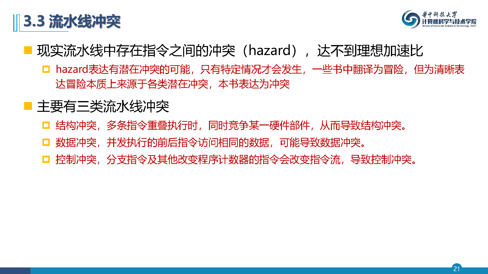

</div>

</div>

---

<style>
.columns { display: grid; grid-template-columns: 1fr 1fr; gap: 1.5rem; }
</style>

<div class='columns'>

<div>

## 冲突避免原则

- **为了避免冲突，流水线控制经常停顿一些指令的执行，让其他指令能够继续执行**
- **一般原则是后面的指令让前面的指令先执行**
- **当一条指令被停顿时，之前的指令继续执行，而其后的所有指令也被停顿**
- **这也会导致指令发射暂停，导致流水线性能下降**

</div>

<div>

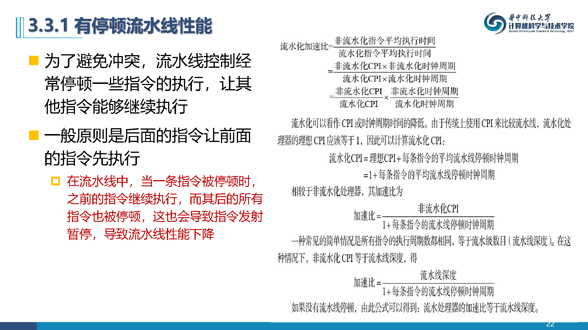

</div>

</div>

---

<style>
.columns { display: grid; grid-template-columns: 1fr 1fr; gap: 1.5rem; }
</style>

<div class='columns'>

<div>

## 结构冲突

- **结构冲突是指流水线方式工作时，多条并发指令组合存在硬件资源冲突**
- **解决方法**：
  - **增加空间并行度**（增加硬件资源）
  - **增加时间并行度**（细化流程进行流水化）
  - **停顿指令**
- **单内存端口结构冲突的解决**：
  - 指令和数据提供独立的存储器访问
  - 分离指令缓存和数据缓存（Harvard结构）

</div>

<div>

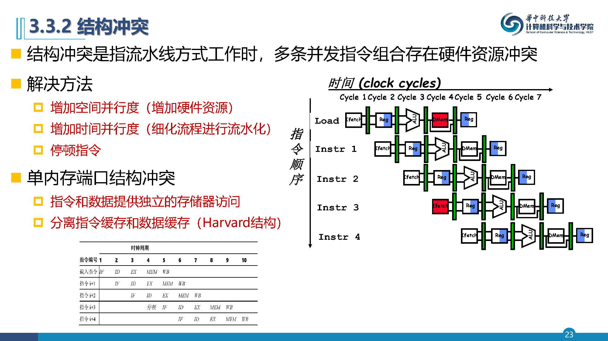

</div>

</div>

---

## Harvard结构流水线

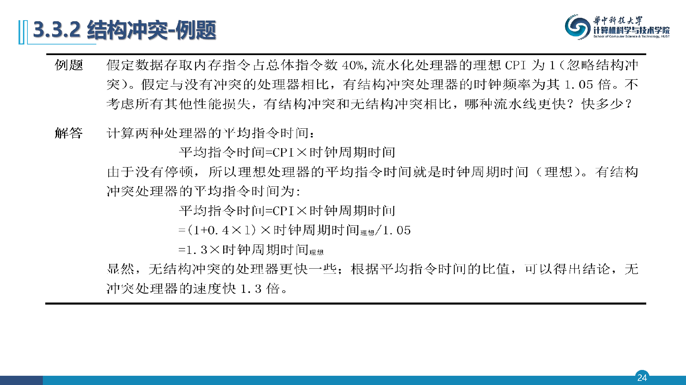

---

<style>
.columns { display: grid; grid-template-columns: 1fr 1fr; gap: 1.5rem; }
</style>

<div class='columns'>

<div>

## 数据冲突

- **数据冲突就是流水线中前后指令存取操作数的时序不同于程序顺序执行的时序**
- **三种数据冲突**：
  - **I1读、I2写**（简写为WAR）
  - **I1写、I2读**（简写为RAW）
  - **I1写、I2写**（简写为WAW）
  - RAR没有影响

</div>

<div>

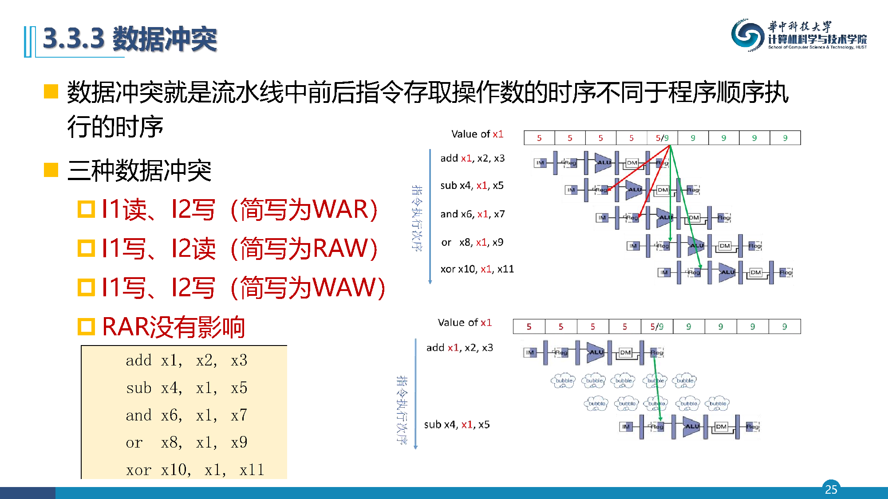

</div>

</div>

---

<style>
.columns { display: grid; grid-template-columns: 1fr 1fr; gap: 1.5rem; }
</style>

<div class='columns'>

<div>

## 重定向技术（Forwarding）

- **一种消除真数据相关的方法是重定向（forwarding）技术**
- **来自EX/MEM和MEM/WB流水线寄存器的ALU结果总是被送到ALU的输入端**
- **转发硬件检测到前ALU操作已经对当前ALU操作的源寄存器进行了写入操作，则控制逻辑选择转发结果作为ALU输入**
- **采用转发技术后，如果sub停顿，则add将会完成，不会触发旁路**

</div>

<div>

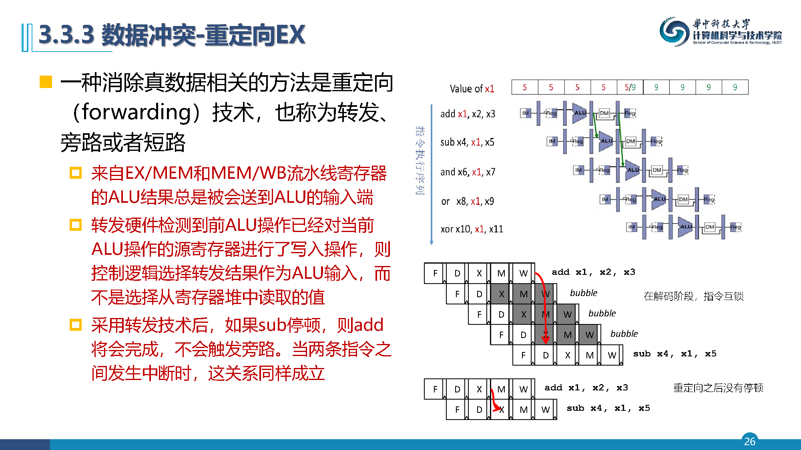

</div>

</div>

---

<style>
.columns { display: grid; grid-template-columns: 1fr 1fr; gap: 1.5rem; }
</style>

<div class='columns'>

<div>

## 转发技术的推广

- **转发技术加以推广，将结果直接传送给需要它的功能单元**
- **MEM级也可能需要定向技术**

</div>

<div>

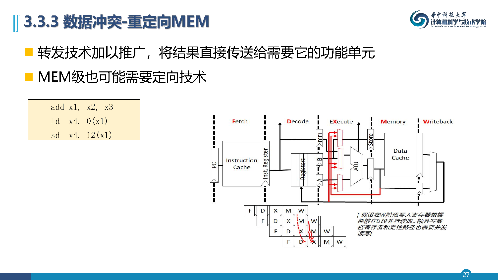

</div>

</div>

---

## 载入指令的延迟

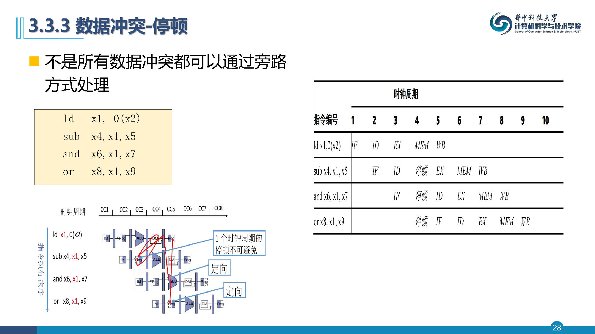

---

<style>
.columns { display: grid; grid-template-columns: 1fr 1fr; gap: 1.5rem; }
</style>

<div class='columns'>

<div>

## 条件分支处理

- **分支必须执行之后，才能确定下一条指令**
- **分支成功导致后续指令作废，需要从分支目标读取新指令**
- **3个周期延迟，2个停顿**

```assembly
10: beq r1,r3,36
14: and r2,r3,r5
18: or r6,r1,r7
22: add r8,r1,r9
36: xor r10,r1,r11
```

</div>

<div>

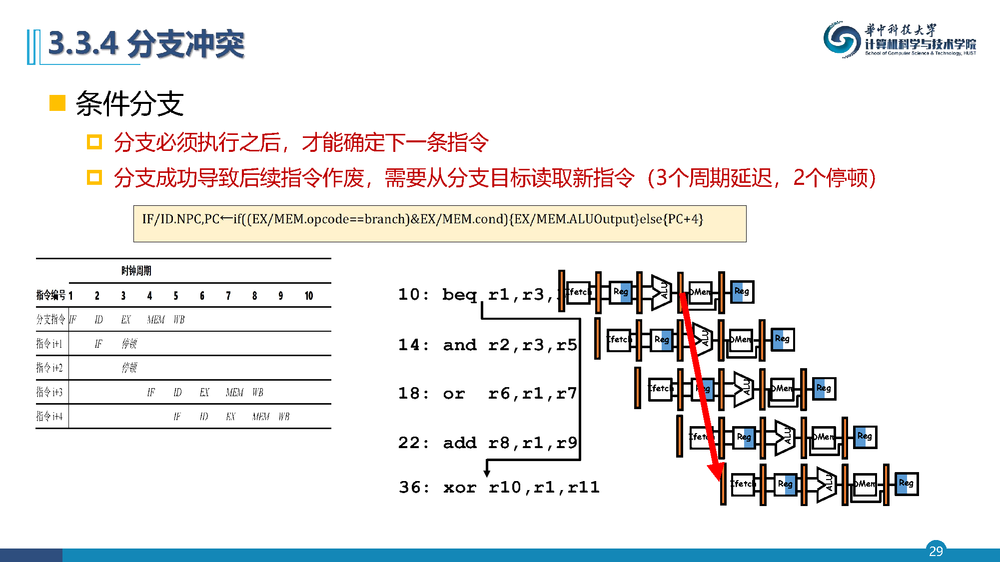

</div>

</div>

---

<style>
.columns { display: grid; grid-template-columns: 1fr 1fr; gap: 1.5rem; }
</style>

<div class='columns'>

<div>

## 分支处理机制

- **确定分支方向和分支目标地址的工作放到ID阶段完成**
- **预测分支不成功**：尽早确定分支（1个周期停顿）
- **分支处理机制**：
  - 停顿机制
  - 预测分支不成功
  - 预测分支成功
- **分支延迟槽**：隐藏分支延迟

</div>

<div>

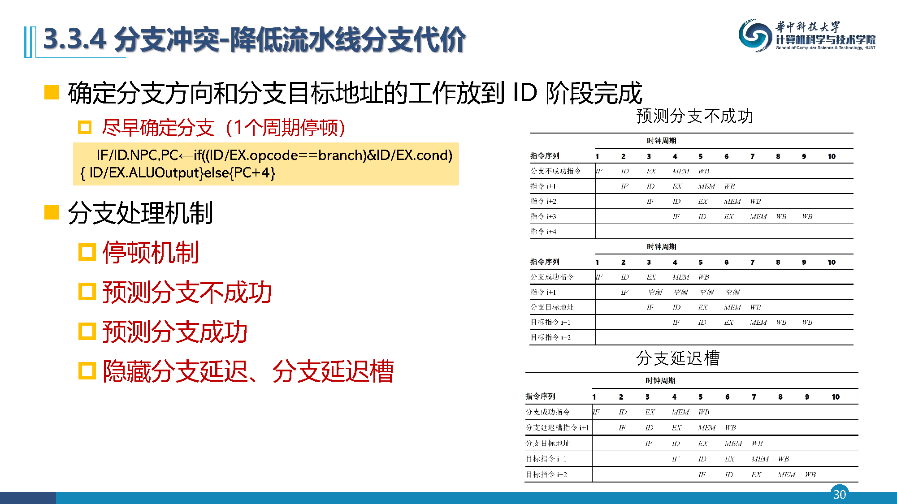

</div>

</div>

---

<style>
.columns { display: grid; grid-template-columns: 1fr 1fr; gap: 1.5rem; }
</style>

<div class='columns'>

<div>

## 分支延迟槽的调度

- **(a) 来自分支之前**
- **(b) 来自目标**
- **(c) 来自不成功指令**

</div>

<div>

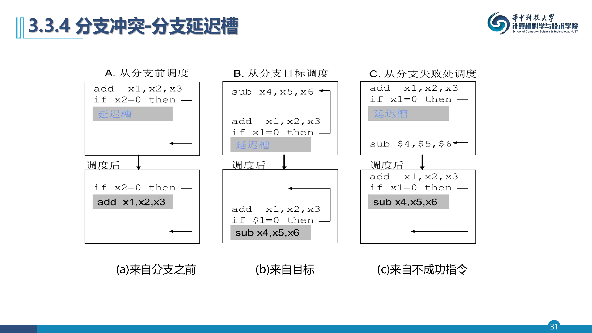

</div>

</div>

---

## 静态分支预测

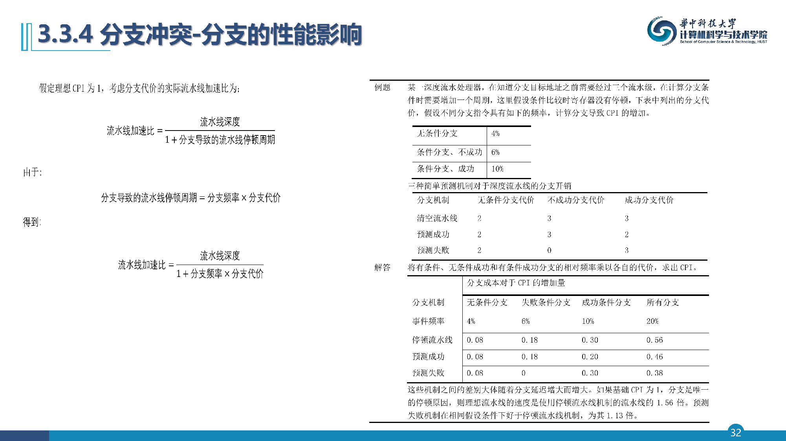

---

<style>
.columns { display: grid; grid-template-columns: 1fr 1fr; gap: 1.5rem; }
</style>

<div class='columns'>

<div>

## 分支预测方法

- **当流水线变深，且分支潜在代价增加时，需更有效的方式来预测分支**
- **编译时静态分支预测**
- **运行时动态分支预测**

</div>

<div>


</div>

</div>

---

<style>
.columns { display: grid; grid-template-columns: 1fr 1fr; gap: 1.5rem; }
</style>

<div class='columns'>

<div>

## 静态分支预测分析

- **优化编译时分支预测的一种重要方式是分析先前运行过程收集的实际分支行为（Trace过程）**
- **根据结果对于分支进行静态预测**
- **经常表现为双峰分布**
- **不同类型的分支经常明显偏向于成功或不成功两种情况之一**

</div>

<div>

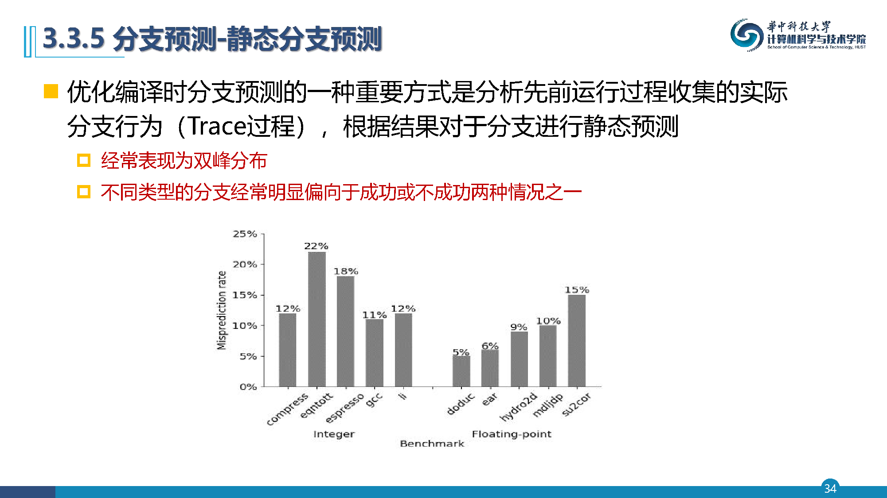

</div>

</div>

---

<style>
.columns { display: grid; grid-template-columns: 1fr 1fr; gap: 1.5rem; }
</style>

<div class='columns'>

<div>

## 动态分支预测

- **标识分支**：当分支流不断到达时，通过分支地址识别分支，记录分支历史信息
- **预测分支**：设计分支预测器对于每个分支进行预测
- **反馈修正**：在分支确定之后，通过反馈更新分支预测器（一种机器学习的方法）

</div>

<div>

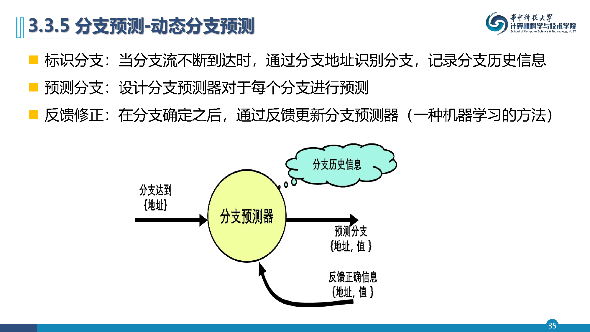

</div>

</div>

---

<style>
.columns { display: grid; grid-template-columns: 1fr 1fr; gap: 1.5rem; }
</style>

<div class='columns'>

<div>

## 分支历史表

- **分支历史表是一个小型存储器，根据分支指令地址的低位部分进行索引**
- **每个分支预测记录包含N位，记录该分支最近是否成功**
- **1位分支历史预测机制在一次循环中可能会得到两次错误预测**
- **可以采用多位，例如2位分支历史表**

</div>

<div>

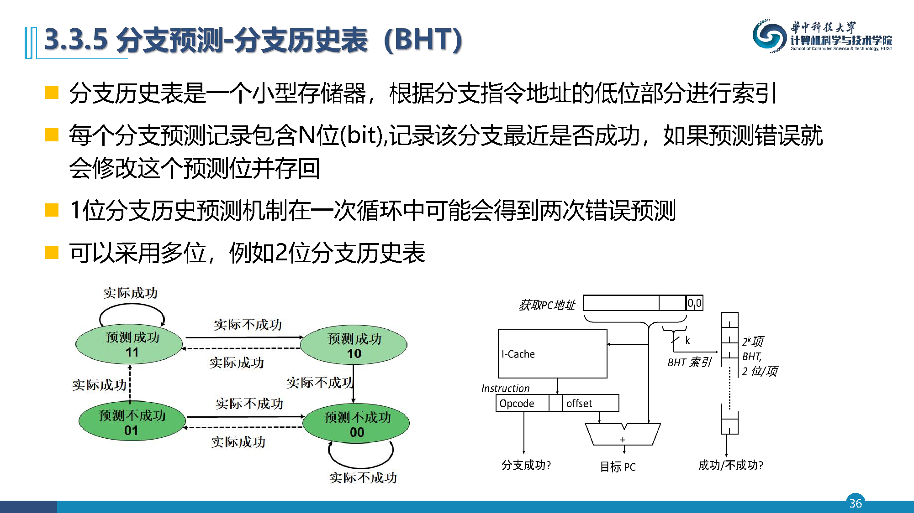

</div>

</div>

---

<style>
.columns { display: grid: grid; grid-template-columns: 1fr 1fr; gap: 1.5rem; }
</style>

<div class='columns'>

<div>

## 分支预测准确度

- **对于SPEC89基准测试，4096项2位预测缓冲区的预测准确度**
- **4096项2位预测缓冲区与无限缓冲区下的预测准确度对比**

</div>

<div>

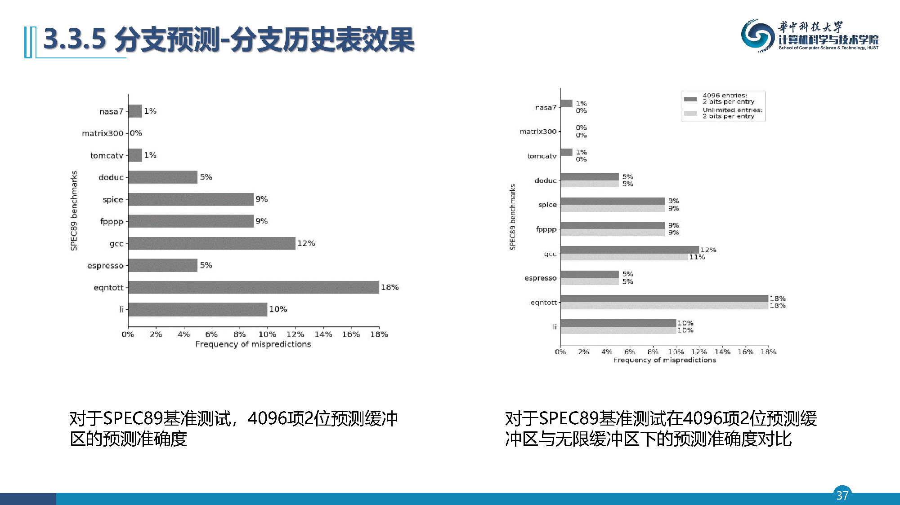

</div>

</div>

---

<style>
.columns { display: grid; grid-template-columns: 1fr 1fr; gap: 1.5rem; }
</style>

<div class='columns'>

<div>

## 分支目标缓冲

- **仅能成功预测分支，没有分支目标地址，无法降低流水线分支代价**
- **如果能尽早识别分支指令，预测其分支成功，且知道相应PC地址，就可以将分支代价降为零**
- **分支目标缓冲**：缓存一条分支之后下一条指令的预测地址
- **五级流水线使用分支目标缓冲区的流程**

</div>

<div>

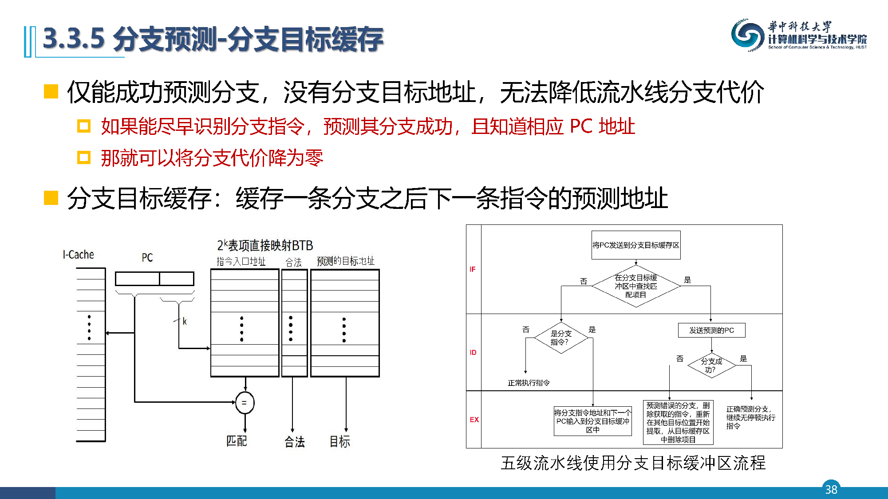

</div>

</div>

---

<style>
.columns { display: grid; grid-template-columns: 1fr 1fr; gap: 1.5rem; }
</style>

<div class='columns'>

<div>

## 分支目标缓冲评估

- **若要评估一个分支目标缓冲区的工作情况，必须首先判断所有可能情况的代价**

</div>

<div>

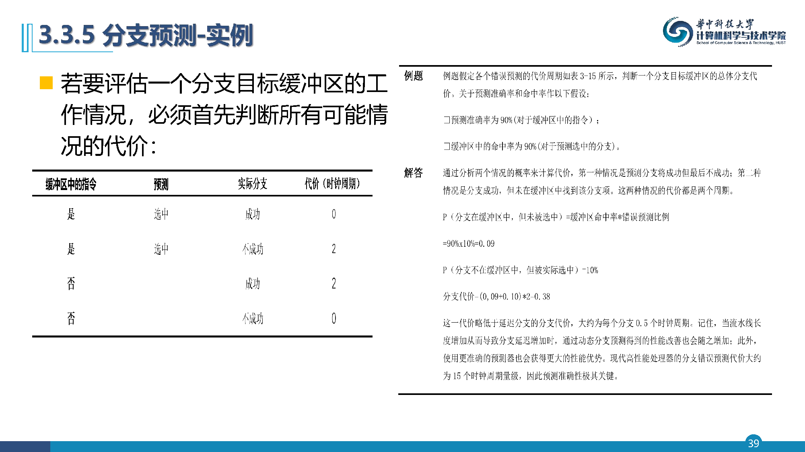

</div>

</div>

---

<style>
.columns { display: grid; grid-template-columns: 1fr 1fr; gap: 1.5rem; }
</style>

<div class='columns'>

<div>

## 返回地址预测与集成指令提取单元

- **返回地址预测器**：高级语言程序中间接过程调用、选择或case语句、FORTRAN计算的goto语句等都会产生间接跳转
- **集成指令提取单元**：在多发射处理器中，需要一个集成了多种功能的集成指令提取单元
  - 集成分支预测
  - 指令预取
  - 指令缓存访问

</div>

<div>


</div>

</div>

---

<style>
.columns { display: grid; grid-template-columns: 1fr 1fr; gap: 1.5rem; }
</style>

<div class='columns'>

<div>

## 流水线控制实现

- **为了控制这一简单流水线，需要设定4个多路选择器的控制方式**
- **ALU级的2个多路选择器根据指令类型设定，由ID/EX寄存器的IR字段确定**
- **将一条指令从ID段移入EX段的过程通常称为指令发射，EX段及后面的指令称为已发射**

</div>

<div>

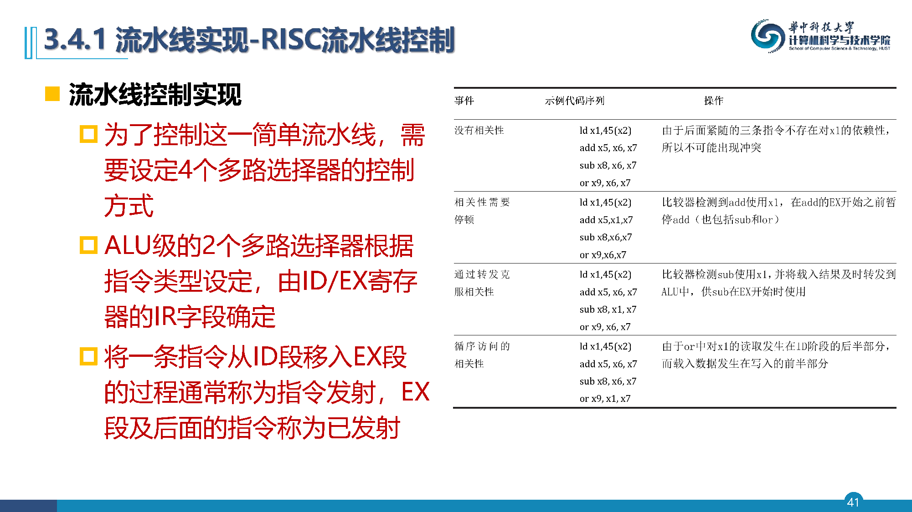

</div>

</div>

---

<style>
.columns { display: grid; grid-template-columns: 1fr 1fr; gap: 1.5rem; }
</style>

<div class='columns'>

<div>

## 流水线停顿与互锁

- **当使用载入结果的指令位于ID级时，检测到互锁的逻辑**
- **一旦检测到冲突，控制单元必须插入流水线停顿，并防止IF和ID级中的指令继续前进**

</div>

<div>

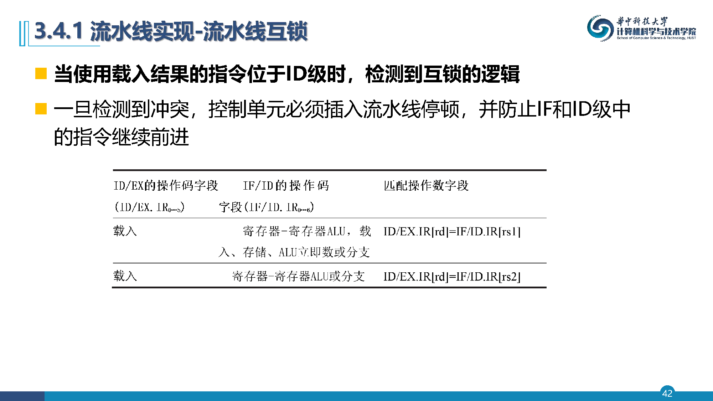

</div>

</div>

---

<style>
.columns { display: grid; grid-template-columns: 1fr 1fr; gap: 1.5rem; }
</style>

<div class='columns'>

<div>

## 重定向逻辑实现

- **实现重定向逻辑，关键是要注意到流水线寄存器中既包含了要重定向的数据，也包含了源、目标寄存器字段**
- **可以从ALU结果（EX/MEM中或MEM/WB中）或从MEM/WB中的载入结果向两个ALU输入重定向数据**

</div>

<div>

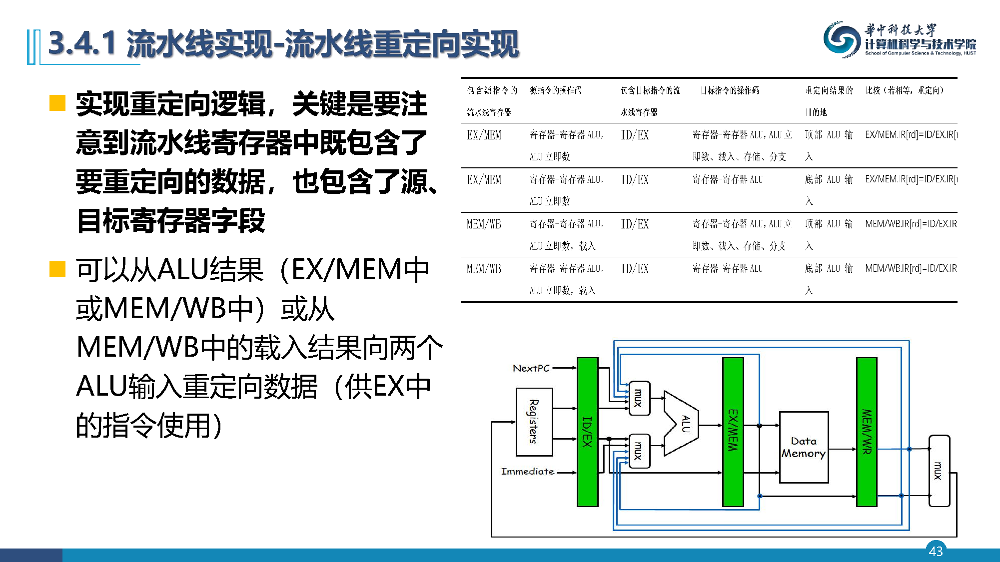

</div>

</div>

---

<style>
.columns { display: grid; grid-template-columns: 1fr 1fr; gap: 1.5rem; }
</style>

<div class='columns'>

<div>

## 异常类型

- **异常处理也会改变控制流**
- **当很多类型的事件会导致异常，中断当前指令的执行**：
  1. I/O设备处理
  2. 用户程序调用操作系统服务
  3. 跟踪指令执行
  4. 断点（程序员请求的中断）
  5. 整数算术溢出
  6. 浮点算术异常
  7. 页面错误
  8. 存储器访问未对齐
  9. 违反存储器保护规则
  10. 使用未定义或未实现的指令
  11. 硬件故障
  12. 电源故障

</div>

<div>

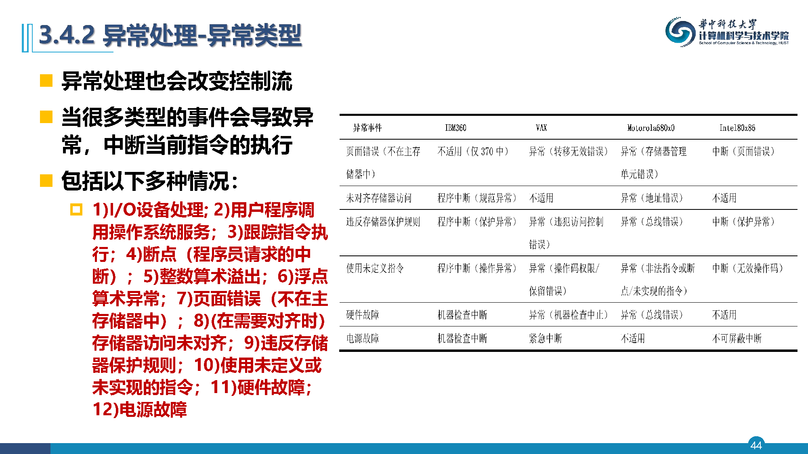

</div>

</div>

---

<style>
.columns { display: grid; grid-template-columns: 1fr 1fr; gap: 1.5rem; }
</style>

<div class='columns'>

<div>

## 异常分类

- **同步与异步**
- **用户请求与强制**
- **程序可屏蔽与用户不可屏蔽**
- **指令内部与指令之间**
- **恢复与终止**

</div>

<div>

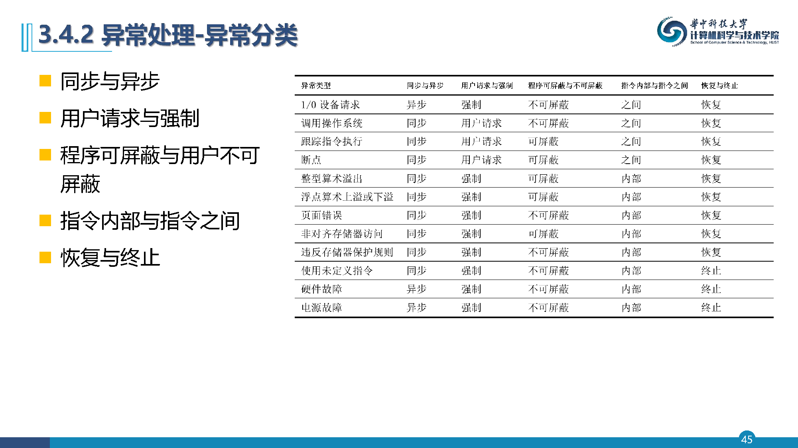

</div>

</div>

---

<style>
.columns { display: grid; grid-template-columns: 1fr 1fr; gap: 1.5rem; }
</style>

<div class='columns'>

<div>

## 异常处理难点与精确异常

- **异常处理难点**：可能乱序发生；必须可以正确返回
- **在发生异步时，流水线控制可以采取以下步骤安全地保存流水线状态**：
  1. 在下一个IF向流水线中强制插入一个自陷指令
  2. 禁止错误指令的所有写入操作，禁止流水线中后续所有指令的写入操作
  3. 异常处理例程保存故障指令的PC
- **精确异常处理能力**：如果流水线可以停止，使错误指令之前的指令能够完成，使其之后的指令可以从头重新启动

</div>

<div>

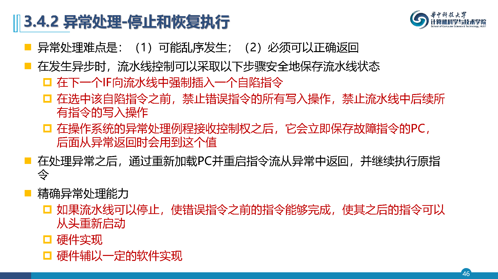

</div>

</div>

---

<style>
.columns { display: grid; grid-template-columns: 1fr 1fr; gap: 1.5rem; }
</style>

<div class='columns'>

<div>

## 流水线中的异常

- **RISC-V流水级，以及每一级中可能发生的异常**
- **采用流水化时，由于有多条指令重叠执行，同一时钟周期中可能出现多个异常**

</div>

<div>

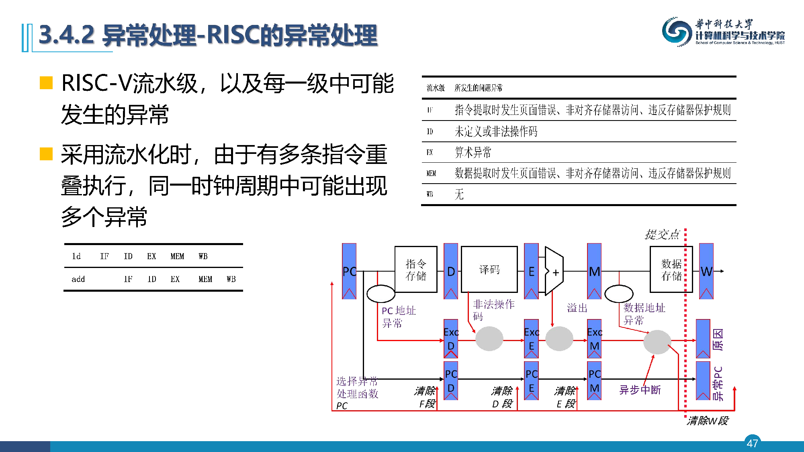

</div>

</div>

---

<style>
.columns { display: grid; grid-template-columns: 1fr 1fr; gap: 1.5rem; }
</style>

<div class='columns'>

<div>

## 浮点流水线

- **浮点需要执行多个周期或耗费大量逻辑电路单周期实现**
- **浮点多周期流水线实现**：
  - 重复使用EX单元
  - 计算过程进一步流水化
- **假定RISC-V实现中有以下4个独立的功能单元**：
  - 整型数据处理单元
  - 浮点与整数乘法器
  - 浮点加法器
  - 浮点和整型除法器

</div>

<div>

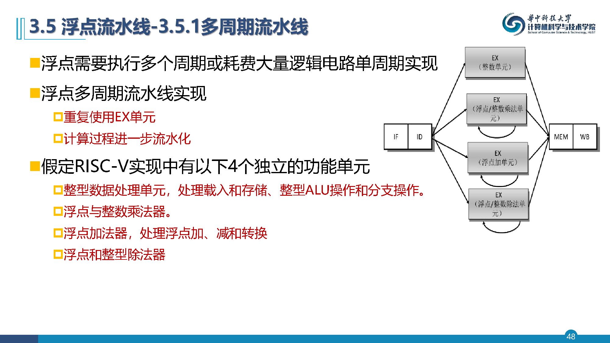

</div>

</div>

---

<style>
.columns { display: grid; grid-template-columns: 1fr 1fr; gap: 1.5rem; }
</style>

<div class='columns'>

<div>

## 浮点流水线的启动间隔

- **EX段设计成流水方式，允许浮点计算部件的流水化，并允许多个操作重叠进行**
- **通常不能一个周期发射一条指令，而是有启动间隔（或称重复间隔）**
- **起始间隔或重复间隔是指在发出两个特定类型的操作之间必须间隔的周期数**

</div>

<div>

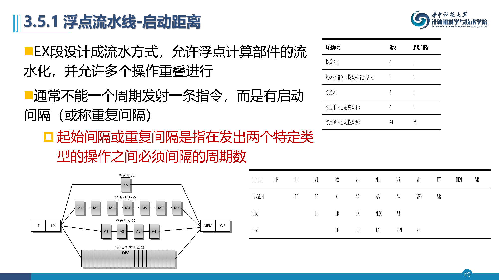

</div>

</div>

---

<style>
.columns { display: grid; grid-template-columns: 1fr 1fr; gap: 1.5rem; }
</style>

<div class='columns'>

<div>

## 浮点冲突检测与重定向

- **因为除法单元未被完全流水化，所以可能发生结构冲突**
- **因为指令的运行时间不同，所以一个周期内可能有多个寄存器写**
- **由于指令不会按序到达WB，所以可能存在WAW冲突**
- **由于操作延迟较长，所以RAW冲突的停顿将会变得更为频繁**
- **指令的完成顺序可能不同于其发射顺序**

</div>

<div>

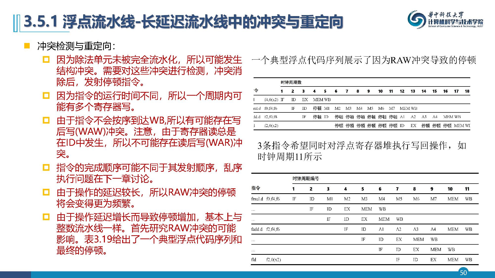

</div>

</div>

---

<style>
.columns { display: grid; grid-template-columns: 1fr 1fr; gap: 1.5rem; }
</style>

<div class='columns'>

<div>

## 乱序完成与异常

- **指令的完成顺序可能不同于其发射顺序**
- **假定在fadd.d已经完成而fdiv.d还未完成时，fsub.d导致了浮点算术异常，会出现不精确异常**
- **三种可能方法来处理乱序完成情况**：
  1. 忽略问题，容忍非精确异常
  2. 缓冲操作的结果
  3. 允许异常变得不十分精确，但保存足够的信息

</div>

<div>

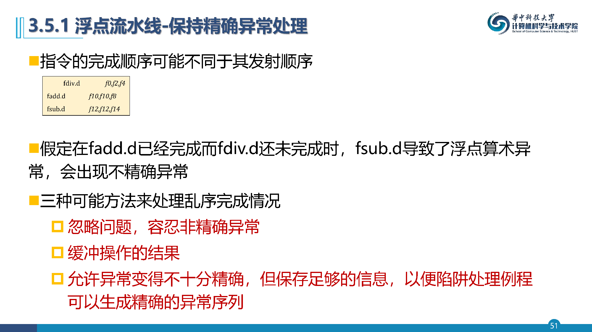

</div>

</div>

---

<style>
.columns { display: grid; grid-template-columns: 1fr 1fr; gap: 1.5rem; }
</style>

<div class='columns'>

<div>

## R4000浮点流水线

- **R4000浮点流水线中使用的8个流水级**
- **浮点运算的延迟和初始间隔都取决于给定运算必须使用的浮点功能级**

</div>

<div>

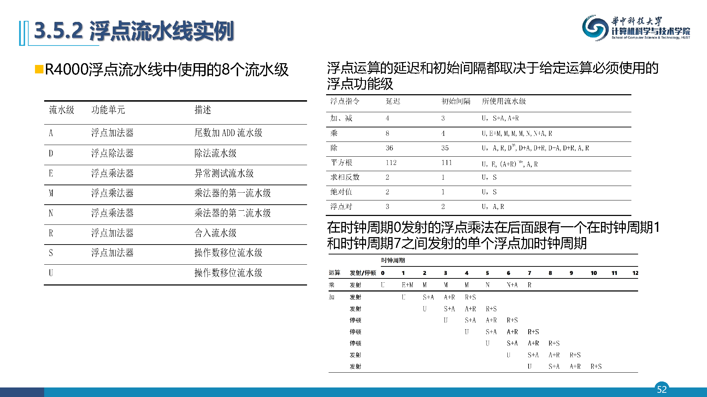

</div>

</div>

---

<style>
.columns { display: grid; grid-template-columns: 1fr 1fr; gap: 1.5rem; }
</style>

<div class='columns'>

<div>

## 浮点运算调度

- **如果加法指令在浮点除法指令结束时启动，该浮点除法可能导致该加法指令的停顿**
- **在加法之后发射的乘法总是可以无停顿继续进行**

</div>

<div>

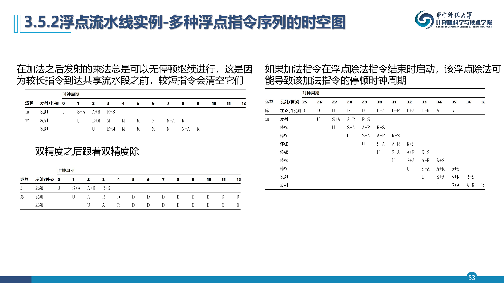

</div>

</div>

---

<style>
.columns { display: grid; grid-template-columns: 1fr 1fr; gap: 1.5rem; }
</style>

<div class='columns'>

<div>

## 附录参考

- **附录C进一步补充了流水线相关的知识，并按照本章相关主题进行了分类**
- **在附录C.3添加描述了分支预测实例**
- **在附录C.4在流水线实现部分扩展讨论了流水线的异常处理**
- **在附录C.5增加介绍了浮点流水线**

</div>

<div>

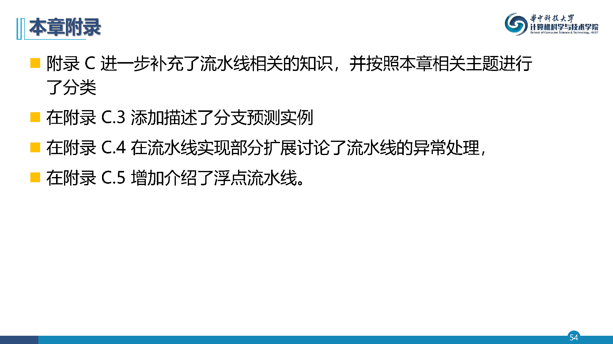

</div>

</div>

---

## 本章小结


---
