<!-- _class: lead -->

# 指令级并行处理

**计算机系统结构**


---

## 本章内容

- **理解指令级并行概念**
- **掌握静态指令调度及其方法**
- **掌握动态指令调度及其方法**
- **掌握高级动态分支预测原理及其实现方法**
- **理解多线程技术、类型及效果**
- **理解华为泰山处理器流水线**

---

<style>
.columns { display: grid; grid-template-columns: 1fr 1fr; gap: 1.5rem; }
</style>

<div class='columns'>

<div>

## 指令级并行（ILP）

- **在理想情况下，N级流水线（完成指令/时钟周期），则CPI为1**
- **每个时钟周期同执行指令数量为N，指令并行度（ILP）为N**
- **存在结构、数据和控制冲突，单条流水线实际CPI通常大于1**
- **从软件和硬件两个方面提高指令级并行度**：
  - **软件方面**：静态指令调度
  - **硬件方面**：动态指令调度

</div>

<div>

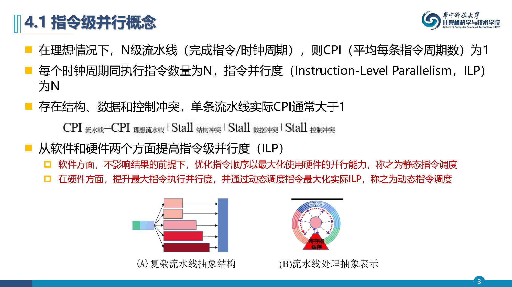

</div>

</div>

---

<style>
.columns { display: grid; grid-template-columns: 1fr 1fr; gap: 1.5rem; }
</style>

<div class='columns'>

<div>

## 流水线延迟与基本块

- **虽然流水线实现冲突检测和重定向硬件，但不能完全消除冲突及停顿**
- **复杂流水线结构中，不同执行部件延迟可能长短不一，更难消除**
- **编译器可以尝试调度指令来避免流水线停顿**
- **简单指令级调度针对基本块（Basic Block）**
  - 除入口外没有其他转入分支，除出口外没有其他转出分支
  - 基本块内可利用的指令并行度非常有限
  - 对于典型RISC程序，分支频率在15%~25%之间，基本块仅有3~6条非分支指令

</div>

<div>

## 浮点运算延迟

| 生成结果的指令 | 使用结果的指令 | 延迟（时钟周期） |
|--------------|--------------|----------------|
| 浮点算术运算 | 另一个浮点算术运算 | 3 |
| 浮点算术运算 | 存储双精度值 | 2 |
| 载入双精度值 | 浮点算术运算 | 1 |
| 载入双精度值 | 存储双精度值 | 0 |

</div>

</div>

---

<style>
.columns { display: grid; grid-template-columns: 1fr 1fr; gap: 1.5rem; }
</style>

<div class='columns'>

<div>

## 循环调度示例

```c
for(i=0;i<=999;i=i+1)
    x[i]=x[i]+y[i];
```

| 指令 | 操作 | 说明 |
|------|------|------|
| Loop: fld | f0,0(x1) | f0＝数组元素 |
| | fadd.d f4,f0,f2 | 加上f2中的标量 |
| | fsd f4,0(x1) | 存储结果 |
| | addi x1,x1,-8 | 使指针减8个字节（双字） |
| | bne x1,x2,Loop | x1！=x2时跳转 |

**通过调度，每7个时钟周期完成一次循环迭代**

</div>

<div>

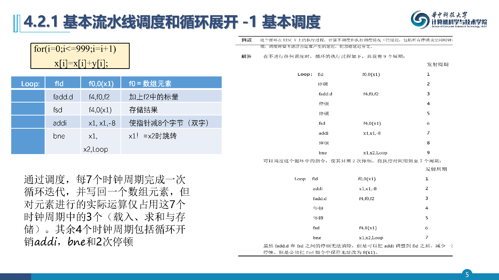

</div>

</div>

---

## 循环调度时空图

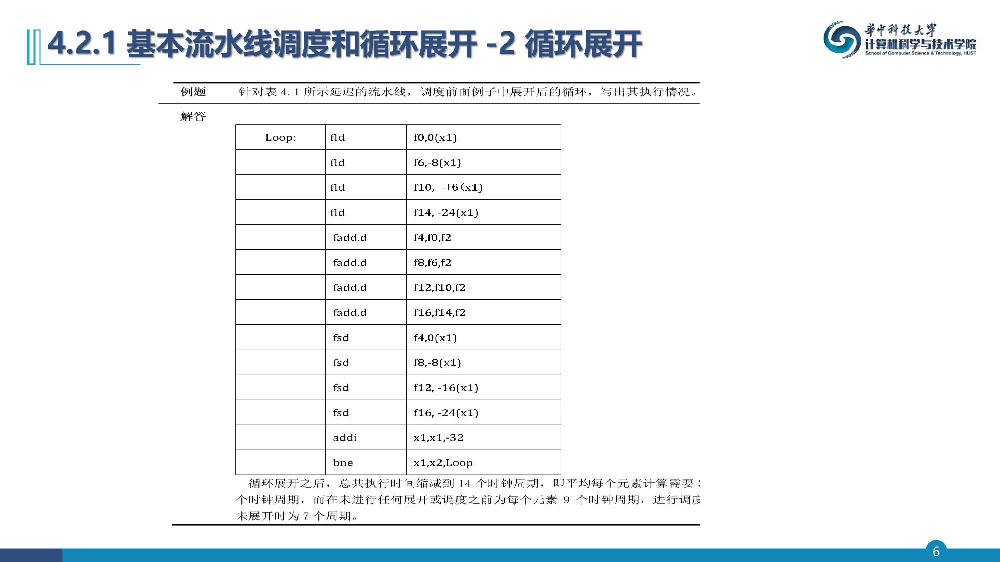

---

## 指令调度优化

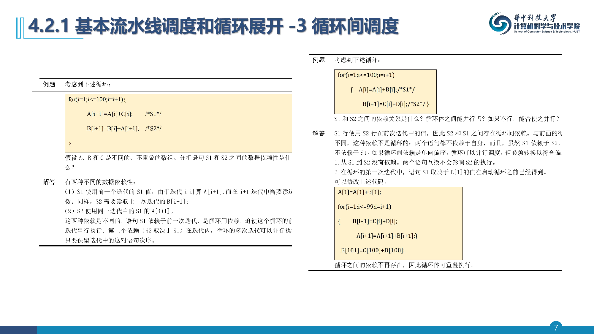

---

<style>
.columns { display: grid; grid-template-columns: 1fr 1fr; gap: 1.5rem; }
</style>

<div class='columns'>

<div>

## 多发射处理器分类

- **多发射处理器大致分为三类**：
  - **静态调度超标量处理器**：每个周期内发射的指令数是可变的
  - **动态调度超标量处理器**：内部包含多个流水线，每个时钟可能发射不同数目的指令
  - **VLIW（超长指令字）处理器**：
    - 每个时钟周期发射固定数目的指令
    - 依赖于编译器的静态调度

</div>

<div>

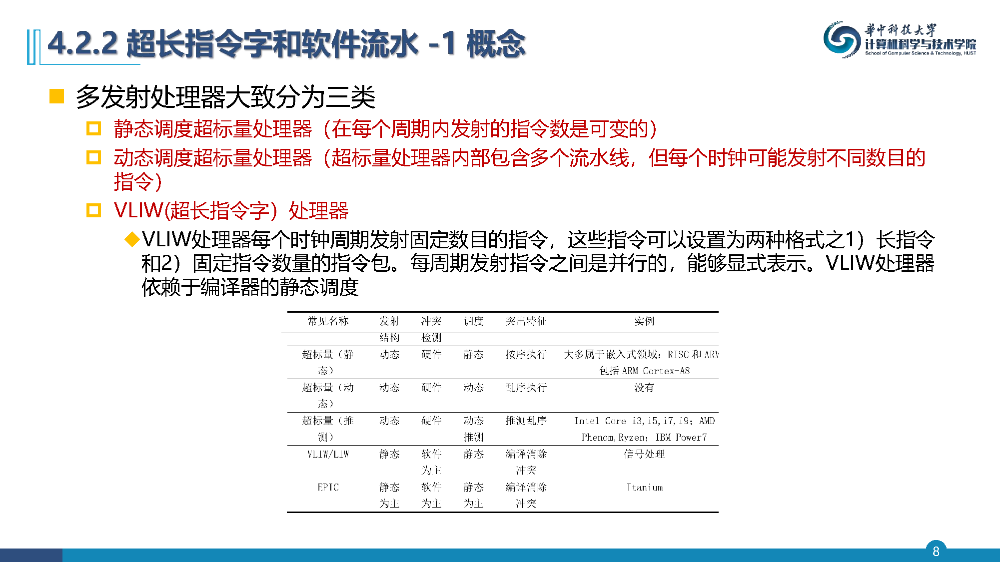

</div>

</div>

---

<style>
.columns { display: grid; grid-template-columns: 1fr 1fr; gap: 1.5rem; }
</style>

<div class='columns'>

<div>

## VLIW处理器

- **考虑一个VLIW处理器，可以同时执行5种运算**：
  - 一个整数运算（包含分支）
  - 两个浮点运算
  - 两个存储器存取
- **VLIW指令可能包含与每个功能单元相对应的一组指令字段**
- **总指令长度介于80~120位之间**
- **Intel Itanium 1和2**：每个指令包中包含6个运算
- **代码序列必须具有足够并行指令，以填充可用操作槽**

</div>

<div>

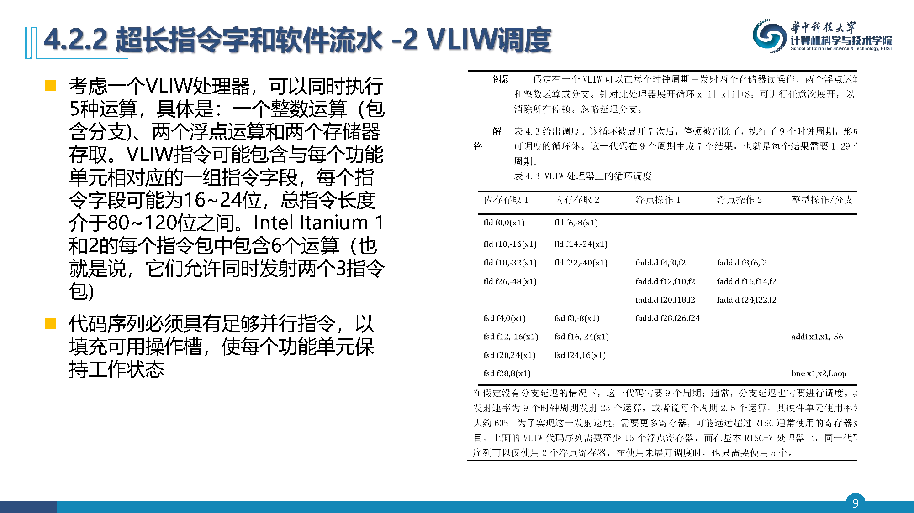

</div>

</div>

---

<style>
.columns { display: grid; grid-template-columns: 1fr 1fr; gap: 1.5rem; }
</style>

<div class='columns'>

<div>

## 软件流水线

- **调整循环方式，把来自不同迭代的相同指令一起发射执行**
- **这几条指令在硬件上能够并行执行**
- **这称之为软件流水线**

</div>

<div>

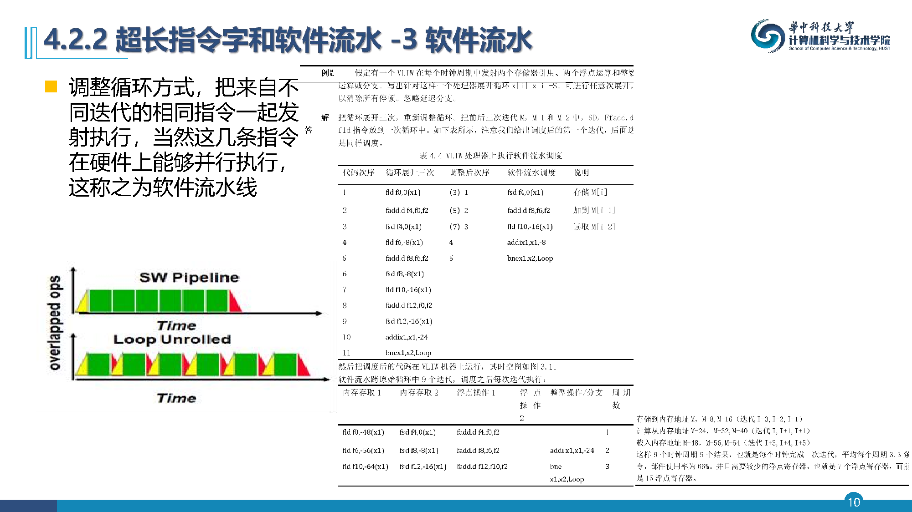

</div>

</div>

---

<style>
.columns { display: grid; grid-template-columns: 1fr 1fr; gap: 1.5rem; }
</style>

<div class='columns'>

<div>

## 循环展开与代码变换

- **编译器对于静态发射或静态调度的处理器非常重要**
- **为了获得最终展开后的代码，必须进行如下判定和变换**：
  - 确认循环间迭代不相关，判定展开循环是有用的
  - 使用不同寄存器，避免数据相关
  - 去除多余的测试和分支指令，调整循环终止与迭代代码
  - 分析存储器地址，确定载入和Store指令交换位置后没有引用同一地址
  - 对代码进行调度，保留任何必要相关
- **3种因素会限制循环展开带来的好处**：
  1. 每次展开操作分摊的开销数目降低
  2. 代码规模限制
  3. 编译器限制

</div>

<div>

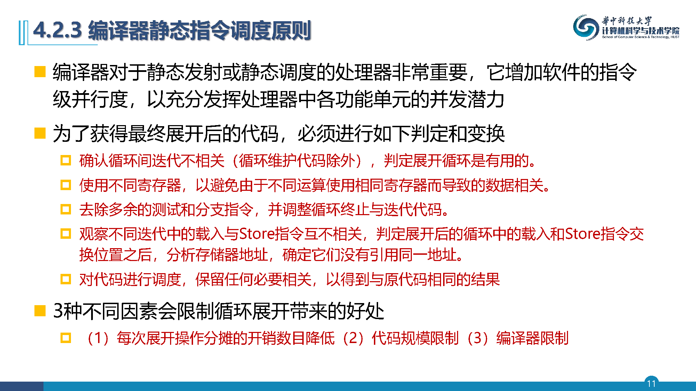

</div>

</div>

---

<style>
.columns { display: grid; grid-template-columns: 1fr 1fr; gap: 1.5rem; }
</style>

<div class='columns'>

<div>

## 动态调度

- **动态调度通过硬件调度指令的执行顺序以减少停顿，同时保持数据流和异常处理行为**
  - 解耦程序代码和硬件流水线实现
  - 实现软件无关性
  - 动态处理预料之外的延迟
  - 可以拓展到硬件推测执行
- **静态调度**：使用编译器优化程序指令流，减少指令间冲突
- **动态调度**：不改变程序指令流，但通过调度能够尽量避免相关性停顿
- **动态调度和静态调度通常共同优化代码**

</div>

<div>

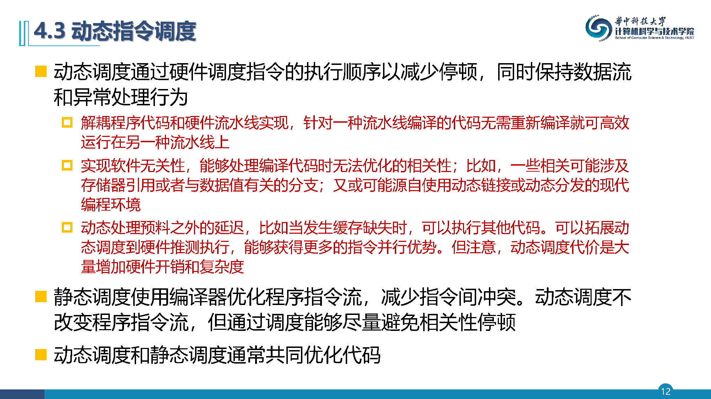

</div>

</div>

---

<style>
.columns { display: grid; grid-template-columns: 1fr 1fr; gap: 1.5rem; }
</style>

<div class='columns'>

<div>

## 顺序发射与冲突

- **顺序发射与执行：如果一条指令停顿，后续指令则不能继续进行**
- **流水线中两条相邻指令存在相关性，就可能导致冲突和停顿**

```assembly
fdiv.d f0,f2,f4
fadd.d f10,f0,f8
fsub.d f8,f8,f14
```

- **在fadd.d和fsub.d之间（f8）存在反相关，如果流水线在fadd.d之前执行fsub.d，将产生WAR冲突**
- **fadd.d和fmul.d之间（f6）存在输出相关**
- **乱序执行和完成将会导致异常处理变得复杂**

</div>

<div>

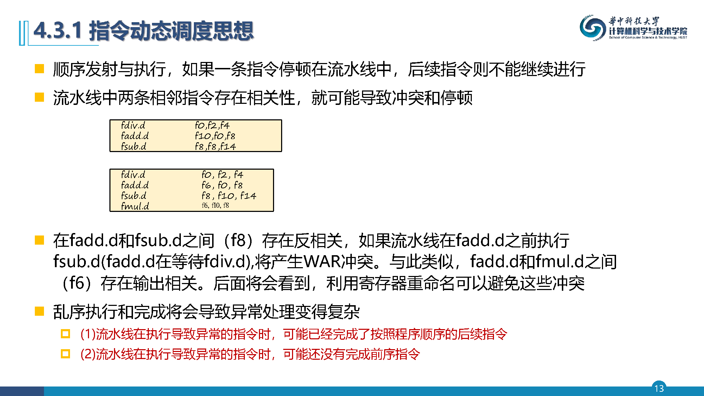

</div>

</div>

---

<style>
.columns { display: grid; grid-template-columns: 1fr 1fr; gap: 1.5rem; }
</style>

<div class='columns'>

<div>

## 记分牌算法

- **记分牌的目标**：在没有结构性冲突时，保持每时钟周期1条指令的执行速率
- **记分牌全面负责指令发射与执行，包括所有冲突检测任务**
- **为了提高并行执行能力，在EX级中同时执行多条指令**

```assembly
fdiv.d f0,f2,f4
fadd.d f10,f0,f8
fsub.d f8,f8,f14
```

- **fadd.d和fsub.d之间存在反相关（WAR）**
- **必须检查WAW冲突**
- **记分牌通过停顿存在WAR和WAW的后续指令**

</div>

<div>

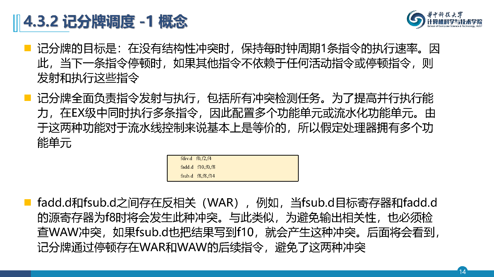

</div>

</div>

---

<style>
.columns { display: grid; grid-template-columns: 1fr 1fr; gap: 1.5rem; }
</style>

<div class='columns'>

<div>

## CDC6600记分牌

- **CDC6600采用load-store系统结构，有16个功能单元**
  - 4个浮点单元
  - 5个内存存取单元
  - 7个整数操作单元
- **每条指令需要经历四个执行步骤**：
  1. **发射**：功能单元空闲且没有其他活动指令以同一寄存器为目标
  2. **读取操作数**：监控源操作数是否可用
  3. **执行功能单元**：接收到操作数后开始执行
  4. **写结果**：检测WAR冲突，如有则停顿

</div>

<div>

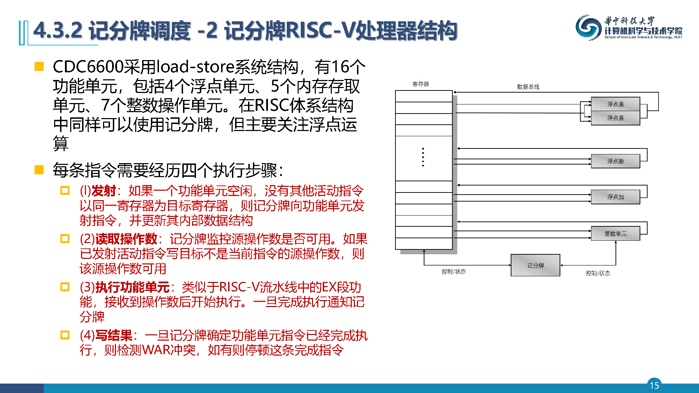

</div>

</div>

---

<style>
.columns { display: grid; grid-template-columns: 1fr 1fr; gap: 1.5rem; }
</style>

<div class='columns'>

<div>

## 记分牌冲突分析

```assembly
fdiv.d f0,f2,f4
fadd.d f10,f0,f8
fsub.d f8,f8,f14
```

- **fadd.d和fsub.d都使用f8，存在WAR冲突**
- **fadd.d有一个源操作数为f8，就是fsub.d的目标寄存器**
- **fadd.d和前一条指令存在RAW相关**
- **记分牌未能实现转发技术**

</div>

<div>

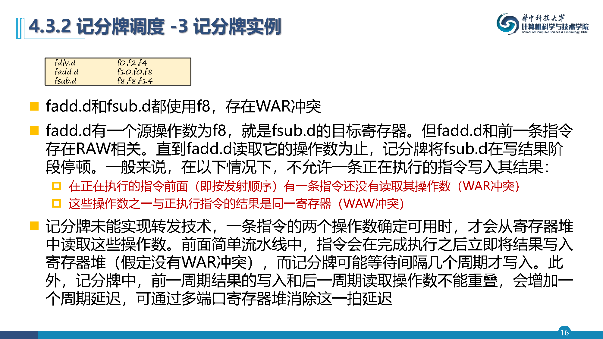

</div>

</div>

---

<style>
.columns { display: grid; grid-template-columns: 1fr 1fr; gap: 1.5rem; }
</style>

<div class='columns'>

<div>

## 记分牌数据结构

- **记分牌是硬件实现的特定数据结构和处理过程**
- **记分牌由三个部分构成**：
  1. **指令状态**：标识该指令处于四个步骤中的哪一步
  2. **功能单元状态**（9个字段）：
     - Busy：标识该单元是否繁忙
     - Op：执行的运算
     - Fi：目标寄存器
     - Fj, Fk：两个源寄存器编号
     - Qj, Qk：生成源寄存器的功能单元
     - Rj, Rk：标记源寄存器是否准备就绪
  3. **寄存器结果状态**：指出哪个功能单元将写入每个寄存器

</div>

<div>

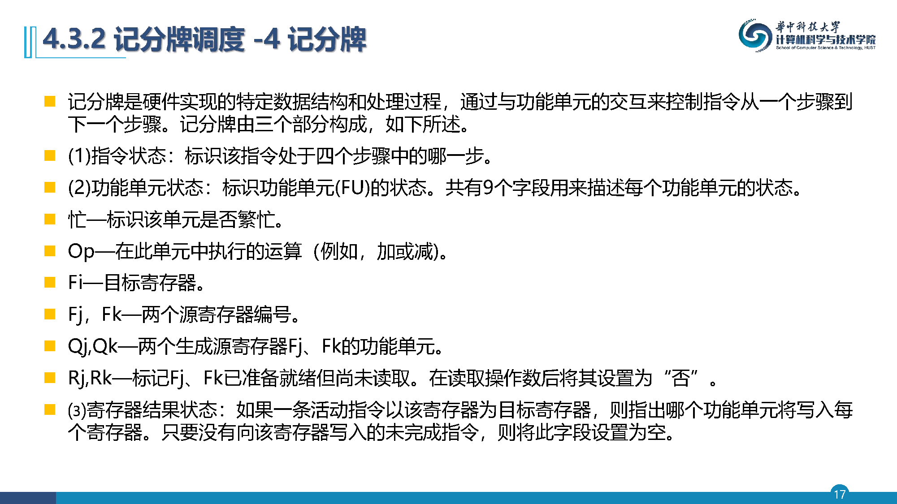

</div>

</div>

---

## 记分牌工作流程

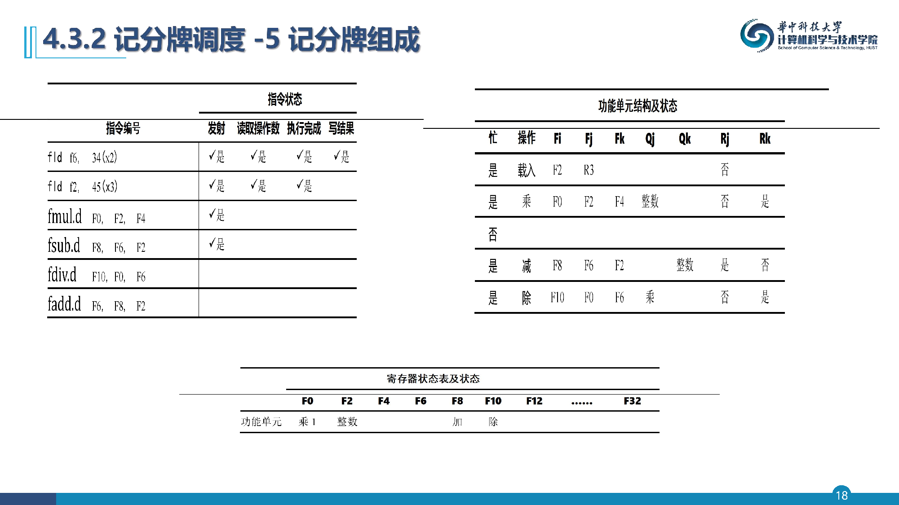

---

<style>
.columns { display: grid; grid-template-columns: 1fr 1fr; gap: 1.5rem; }
</style>

<div class='columns'>

<div>

## 记分牌状态表示例

- **假定浮点功能单元的EX周期延迟**：
  - 加法：2个时钟周期
  - 乘法：10个时钟周期
  - 除法：40个时钟周期
- **执行上述代码，状态表中是什么样的**

</div>

<div>

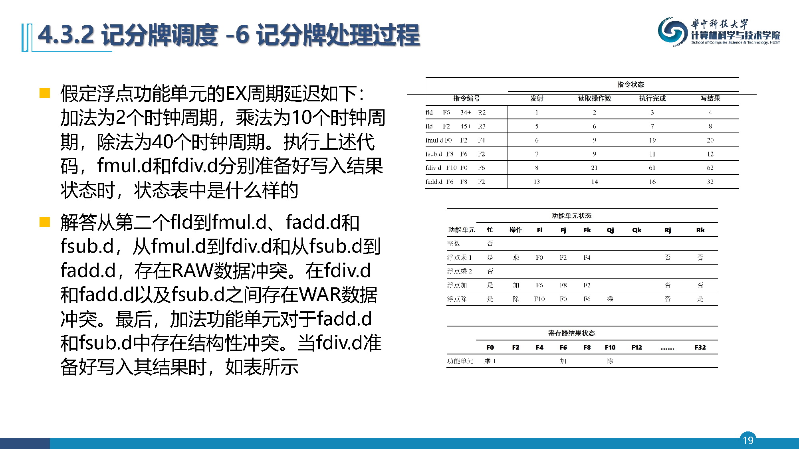

</div>

</div>

---

<style>
.columns { display: grid; grid-template-columns: 1fr 1fr; gap: 1.5rem; }
</style>

<div class='columns'>

<div>

## 记分牌操作数标识

- **记分牌记录操作数标志符信息**
- **例如，在发射指令时，必须记录源寄存器**
- **Regs[D]表示寄存器D的内容**
- **Fj[FU]←S1表示寄存器名称S1被放在Fj[FU]中**

</div>

<div>

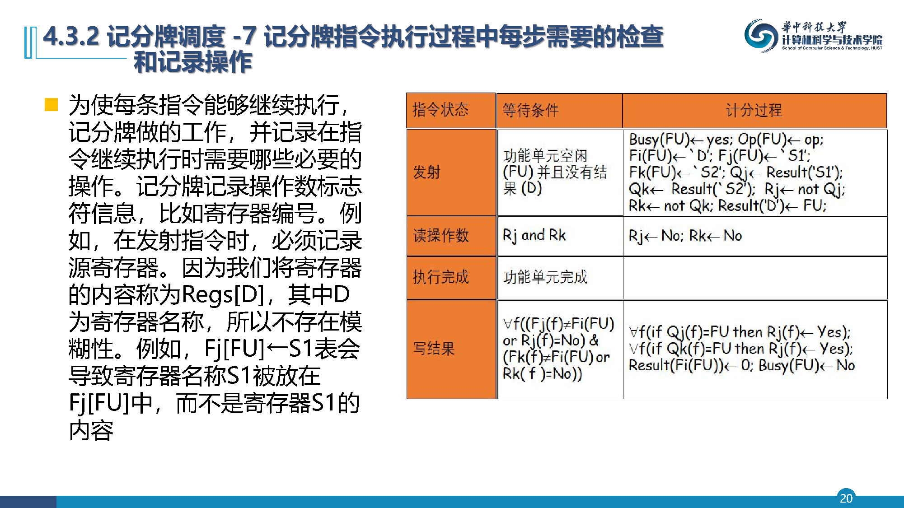

</div>

</div>

---

<style>
.columns { display: grid; grid-template-columns: 1fr 1fr; gap: 1.5rem; }
</style>

<div class='columns'>

<div>

## 记分牌性能限制因素

- **记分牌利用可用ILP，在最大程度上降低因为程序RAW所导致的停顿数目**
- **受以下几个因素影响**：
  - **指令间可用并行数**
  - **记分牌的项数**：决定了窗口的大小
  - **功能单元的数目和类型**
  - **存在反相关和输出相关**
- **WAW和WAR冲突在动态调度处理器中变得更为重要**

</div>

<div>

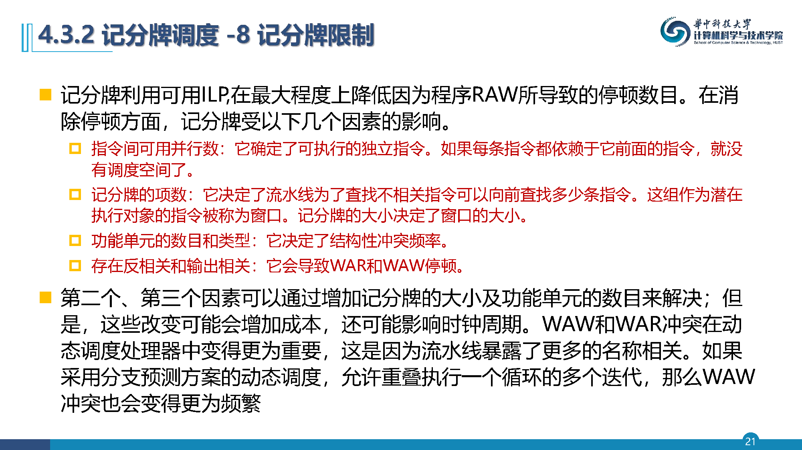

</div>

</div>

---

<style>
.columns { display: grid; grid-template-columns: 1fr 1fr; gap: 1.5rem; }
</style>

<div class='columns'>

<div>

## Tomasulo算法

- **IBM360/91浮点单元使用由Robert Tomasulo发明的支持乱序执行方法**
- **特点**：
  - 跟踪指令相关，在操作数可用时立即执行指令
  - 重命名寄存器以避免WAR和WAW冲突
  - 软件无关性，无需修改编译器
  - 可以扩展
  - 处理流水线推测执行

</div>

<div>

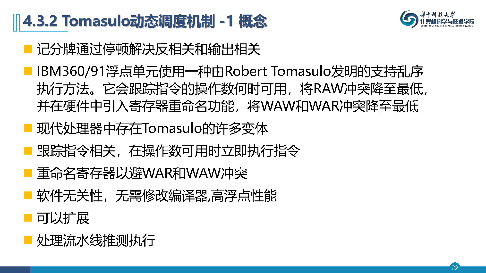

</div>

</div>

---

<style>
.columns { display: grid; grid-template-columns: 1fr 1fr; gap: 1.5rem; }
</style>

<div class='columns'>

<div>

## Tomasulo算法硬件结构

- **指令从指令单元以FIFO的顺序发送到指令队列**
- **保留站**：包括操作、实际操作数以及用于检测和解决冲突的信息
- **load缓冲区**：保存有效地址、跟踪未完成的load、保存已完成的加载结果
- **store缓冲区**：保存有效地址的组件、保存待Store指令的地址和值
- **FP单元和load单元的结果放在公共数据总线（CDB）上**

</div>

<div>

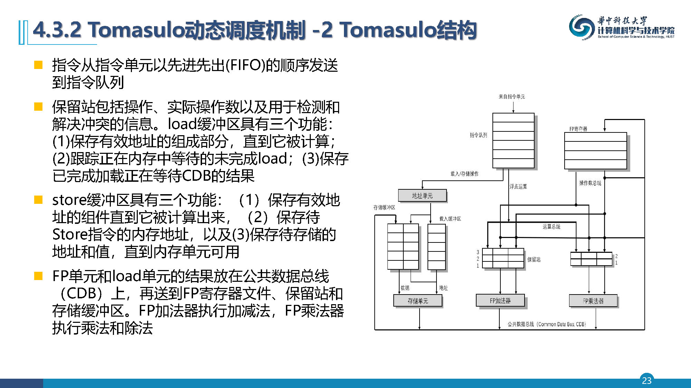

</div>

</div>

---

<style>
.columns { display: grid; grid-template-columns: 1fr 1fr; gap: 1.5rem; }
</style>

<div class='columns'>

<div>

## 寄存器重命名示例

| 原始代码 | 重命名后 |
|----------|----------|
| fdiv.d f0,f2,f4 | fdiv.d f0,f2,f4 |
| fadd.d f6,f0,f8 | fadd.d S,f0,f8 |
| fsd f6,0(x1) | fsd S,0(x1) |
| fsub.d T,f10,f14 | fsub.d f8,f10,f14 |
| fmul.d f6,f10,T | fmul.d f6,f10,f8 |

- **共有两处反相关WAR：fadd.d与fsub.d之间、fsd与fmul.d之间**
- **fadd.d和fmul.d之间还有输出相关WAW**
- **三个名相关都可以通过寄存器重命名来消除**

</div>

<div>

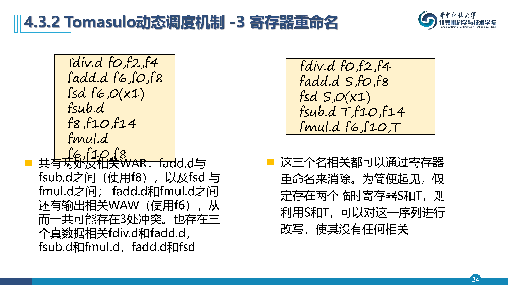

</div>

</div>

---

<style>
.columns { display: grid; grid-template-columns: 1fr 1fr; gap: 1.5rem; }
</style>

<div class='columns'>

<div>

## Tomasulo寄存器重命名

- **Tomasulo方案中，寄存器重命名功能由保留站实现**
- **保留站会缓存等待发射指令的操作数**
- **保留站在一个操作数可用时马上提取并缓冲它**
- **等待执行的指令会指定保留站作为输入源**
- **连续进行写入操作并且重叠执行时，只会使得最后一个操作更新寄存器**
- **使用保留站而不是集中式寄存器堆，使得冲突检测和执行控制是分散式的**
- **结果将直接从缓冲它们的保留站中传递给功能单元**
- **旁路是使用公共结果总线（CDB）完成的**

</div>

<div>

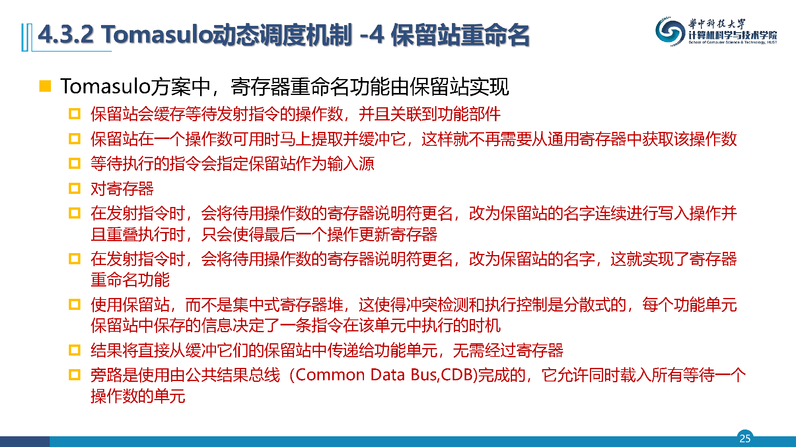

</div>

</div>

---

<style>
.columns { display: grid; grid-template-columns: 1fr 1fr; gap: 1.5rem; }
</style>

<div class='columns'>

<div>

## Tomasulo算法步骤

- **发射**：从FIFO指令队列的头部获取下一条指令。如果有匹配保留站为空，则发射指令。如果没有空保留站，则停顿。发射时对寄存器进行重命名，消除WAR和WAW冲突
- **执行**：如果有一个或多个操作数不可用，则监视公共数据总线。当操作数变为可用时，放到保留站中。当所有操作数都可用时，在相应功能单元中执行运算
- **写结果**：在计算出结果之后，写到CDB上，再传送到寄存器和任意等待这一结果的保留站（包括存储缓冲区）

</div>

<div>

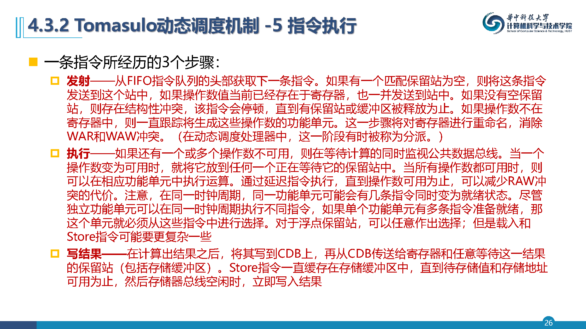

</div>

</div>

---

<style>
.columns { display: grid; grid-template-columns: 1fr 1fr; gap: 1.5rem; }
</style>

<div class='columns'>

<div>

## 保留站字段

- **每个保留站有以下7个字段**：
  - **Op**：对源操作数S1和S2执行的运算
  - **Qj、Qk**：将生成相应源操作数的保留站
  - **Vj、Vk**：源操作数的值
  - **A**：保存为载入或Store指令计算存储器地址的信息
  - **Busy**：指明这个保留站及其相关功能单元正被占用
- **寄存器堆有一个字段Qi**：一个运算的结果应当存储在这个寄存器中，则Qi是包含此运算的保留站编号

</div>

<div>

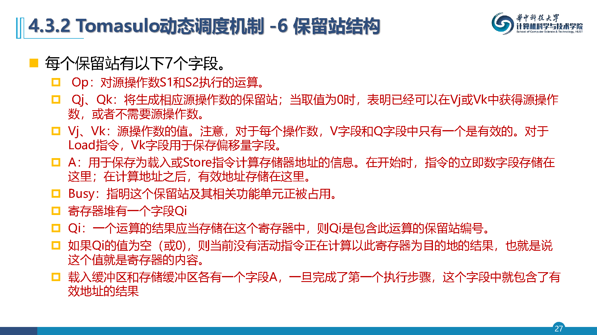

</div>

</div>

---

<style>
.columns { display: grid; grid-template-columns: 1fr 1fr; gap: 1.5rem; }
</style>

<div class='columns'>

<div>

## Tomasulo执行示例

- **假定延迟值**：
  - Load指令：1个时钟周期
  - 相加指令：2个时钟周期
  - 乘法指令：6个时钟周期
  - 除法指令：12个时钟周期

```assembly
1. fld f6,32(x2)
2. fld f2,44(x3)
3. fmul.d f0,f2,f4
4. fsub.d f8,f2,f6
5. fdiv.d f0,f0,f6
```

</div>

<div>

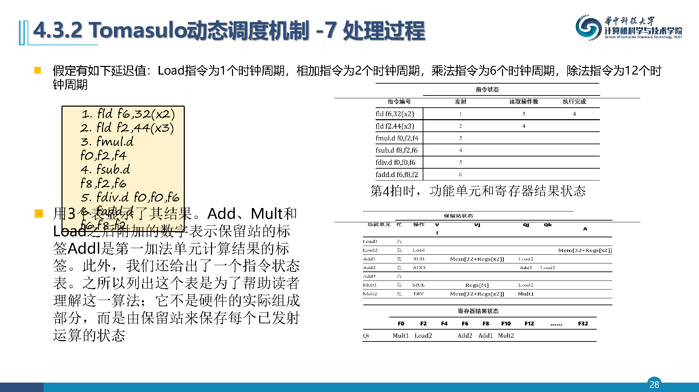

</div>

</div>

---

<style>
.columns { display: grid; grid-template-columns: 1fr 1fr; gap: 1.5rem; }
</style>

<div class='columns'>

<div>

## 指令执行时空图

| 指令 | 1 | 2 | 3 | 4 | 5 | 6 | 7 | 8 | 9 | 10 | ... |
|------|-----|-----|-----|-----|-----|-----|-----|-----|-----|------|-----|
| fld f6,32(x2) | I | S | C | W | | | | | | | |
| fld f2,44(x3) | | I | S | C | W | | | | | | |
| fmul.d f0,f2,f4 | | | I | s | S | E | E | E | E | E | C | W |
| fsub.d f8,f2,f6 | | | | I | S | E | C | W | | | |
| fdiv.d f0,f0,f6 | | | | | I | s | s | s | s | s | S | E... |
| fadd.d f6,f8,f2 | | | | | | I | S | E | C | W | |

**六条指令的完成时间分别为第4、5、12、8、24和10**

</div>

<div>

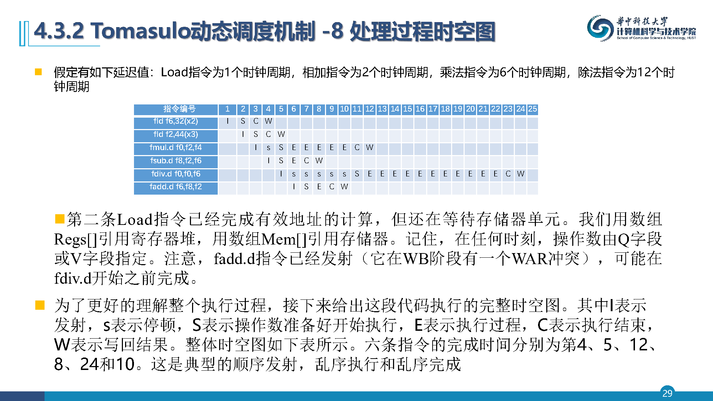

</div>

</div>

---

<style>
.columns { display: grid; grid-template-columns: 1fr 1fr; gap: 1.5rem; }
</style>

<div class='columns'>

<div>

## Tomasulo算法伪代码

| 指令状态 | 等待条件 | 操作或记录工作 |
|----------|----------|---------------|
| 发射 FP操作 | 站r空 | 更新寄存器状态和保留站 |
| 载入或存储 | 缓存区r空 | 计算有效地址 |
| 执行 FP操作 | Qj=0 且 Qk=0 | 计算结果 |
| 载入/存储操作步骤1 | Qj=0 | 计算有效地址 |
| 载入步骤2 | 步骤1完成 | 从存储器读取 |
| 写结果 | 执行完成且CDB可用 | 更新寄存器和保留站 |

</div>

<div>

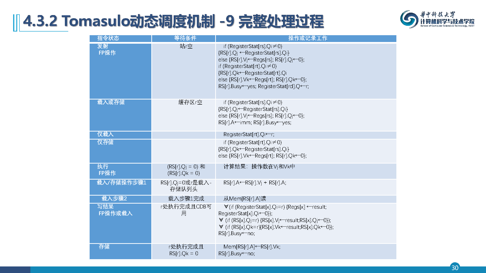

</div>

</div>

---

<style>
.columns { display: grid; grid-template-columns: 1fr 1fr; gap: 1.5rem; }
</style>

<div class='columns'>

<div>

## 动态展开循环

- **如果能够准确预测分支，保留站也可以同时执行多条指令**
- **循环展开不需要修改代码也能实现，是由硬件使用保留站动态展开的**
- **保留站可以充当额外的寄存器，实现重命名**
- **第10个拍已经发射了该循环两个连续迭代中的所有指令**
- **达到稳定状态之后，一次循环延迟为6个时钟周期**

</div>

<div>

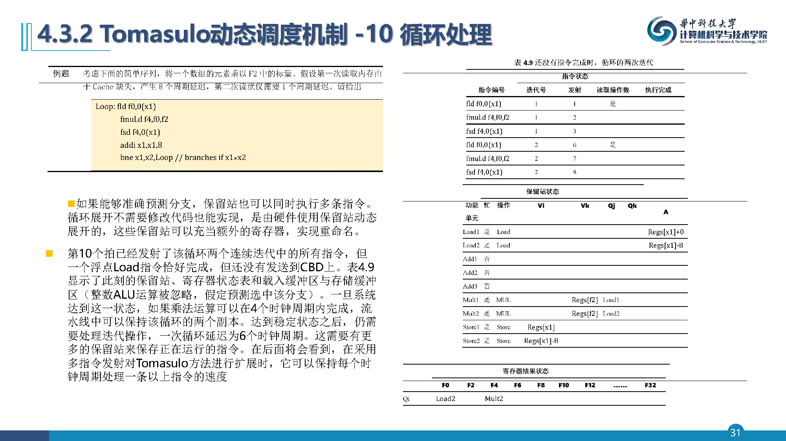

</div>

</div>

---

<style>
.columns { display: grid; grid-template-columns: 1fr 1fr; gap: 1.5rem; }
</style>

<div class='columns'>

<div>

## 循环展开时空图

| 指令编号 | 1 | 2 | 3 | 4 | 5 | 6 | 7 | 8 | 9 | 10 | 11 | 12 | 13 | 14 | 15 | 16 | 17 |
|----------|---|---|---|---|---|---|---|---|---|----|----|----|----|----|----|----|-----|
| fld f0,0(x1) | I | S | E | E | E | E | E | E | E | C | W | | | | | | |
| fmul.d f4,f0,f2 | | I | s | s | s | s | s | s | s | s | S | E | E | E | C | W | |
| fsd f4,0(x1) | | | I | s | s | s | s | s | s | s | s | s | s | s | s | S | C |
| addi x1,x1,8 | | | | I | | | | | | | | | | | | |
| bne x1,x2,Loop | | | | | I | | | | | | | | | | | |

</div>

<div>

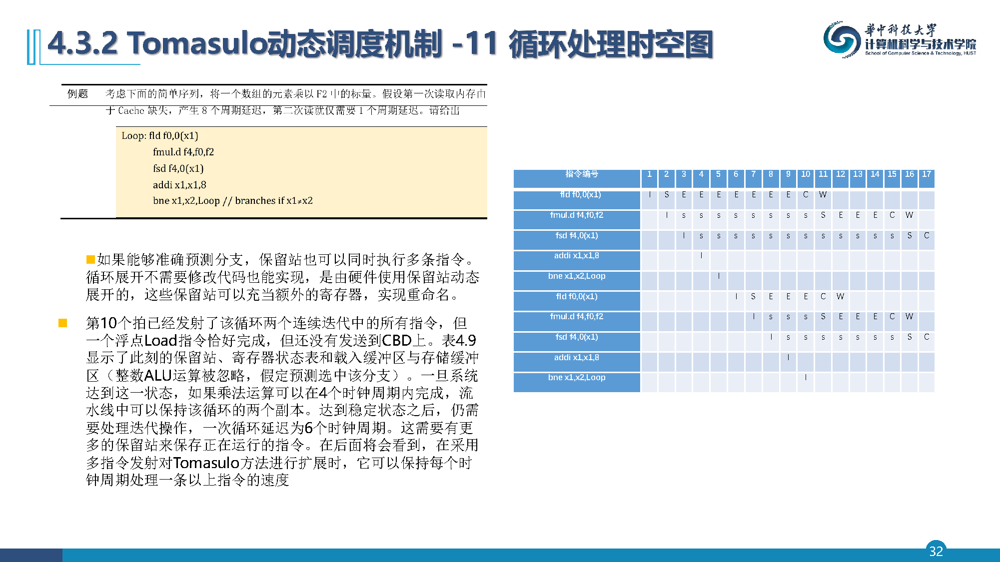

</div>

</div>

---

<style>
.columns { display: grid; grid-template-columns: 1fr 1fr; gap: 1.5rem; }
</style>

<div class='columns'>

<div>

## Load/Store指令顺序

- **Load指令和Store指令访问不同地址时，可以放心地乱序执行**
- **如果访问相同地址，则会产生数据相关**：
  - Load在Store之前：交换会导致WAR冲突
  - Store在Load之前：交换会导致RAW冲突
- **处理器可以检查未完成Store指令是否与Load指令共享相同存储器地址**
- **Tomasulo优点**：可以提供非常高的性能
- **缺点**：复杂性，需要大量硬件

</div>

<div>

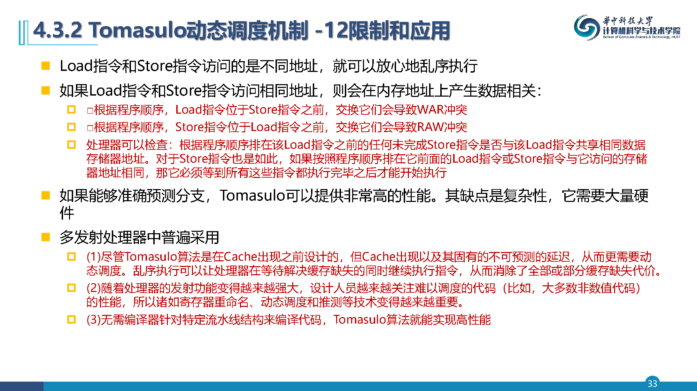

</div>

</div>

---

<style>
.columns { display: grid; grid-template-columns: 1fr 1fr; gap: 1.5rem; }
</style>

<div class='columns'>

<div>

## 分支预测器

- **动态指令调度加速指令执行速度，导致分支预测错误代价更大**
- **分支预测器类型**：
  - **局部分支预测器**：每个分支自己过去的行为
  - **全局分支预测器**：分支之间的关联
- **相关预测器或全局预测器**：利用其他分支行为来进行预测

```assembly
add x3,x1,#-2
if (aa==2)
    bnez x3,L1 ;branch b1 (aa!=2)
    aa=0;
if (bb==2)
L1: add x3,x2,#-2
    bb=0;
    bnez x3,L2 ;branch b2 (bb!=2)
    if (aa!=bb) add x2,x0,x0 ;bb=0
L2: sub x3,x1,x2 ;x3=aa-bb
    beqz x3,L3 ;branch b3 (aa=bb)
```

</div>

<div>

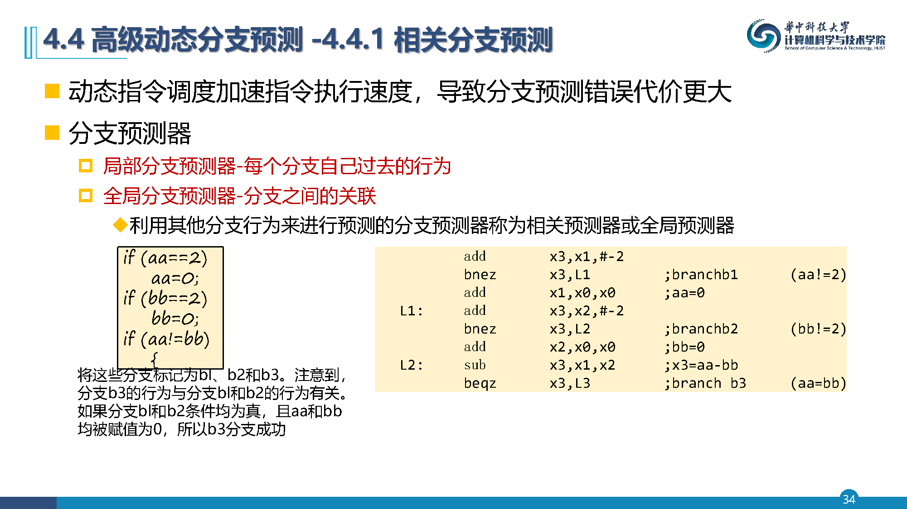

</div>

</div>

</div>

---

<style>
.columns { display: grid; grid-template-columns: 1fr 1fr; gap: 1.5rem; }
</style>

<div class='columns'>

<div>

## （m,n）预测器

- **利用最近m个分支的行为从2^m个分支预测器中进行选择**
- **每个预测器都是单个分支的n位局部预测器**
- **m个分支的全局历史记录在m位移位寄存器中**
- **将分支地址的低位与m位全局历史串联在一起，对分支预测缓冲区进行寻址**
- **一个64项的(2,2)预测器**：6位索引（4位地址+2位全局位）
- **没有全局历史的2位预测器就是(0,2)预测器**

</div>

<div>

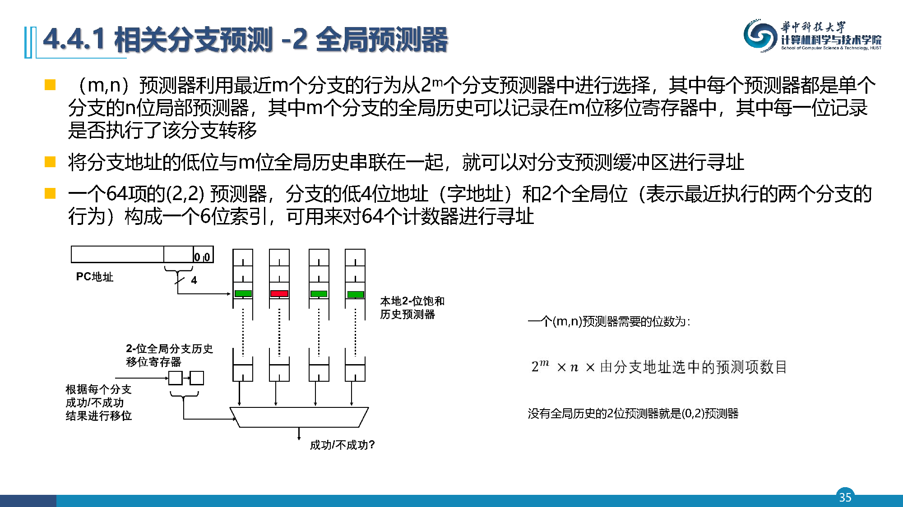

</div>

</div>

---

<style>
.columns { display: grid; grid-template-columns: 1fr 1fr; gap: 1.5rem; }
</style>

<div class='columns'>

<div>

## 分支预测准确度对比

- **相关预测器的性能优于具有相同状态位数的简单2位预测器**
- **经常优于具有无限项数的2位预测器**
- **混合预测器**：结合本地分支信息和全局分支历史
- **gshare预测器**：索引是通过异或分支地址和最近的条件分支结果

</div>

<div>

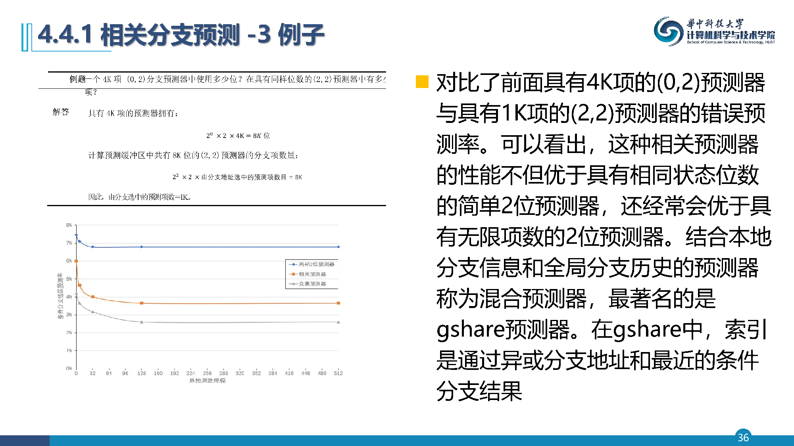

</div>

</div>

---

<style>
.columns { display: grid; grid-template-columns: 1fr 1fr; gap: 1.5rem; }
</style>

<div class='columns'>

<div>

## 竞赛预测器

- **单一预测器都有其限制**
- **竞赛预测器**：采用多个预测器（全局+局部），加上额外的选择器
- **可以以中等规模的预测位实现更好的预测准确度**
- **局部预测器**：包括两级预测器
  - 上级：局部历史表（1024个10位项）
  - 下级：有1K项的3位饱和计数器表
- **这种组合共使用29K位**

</div>

<div>

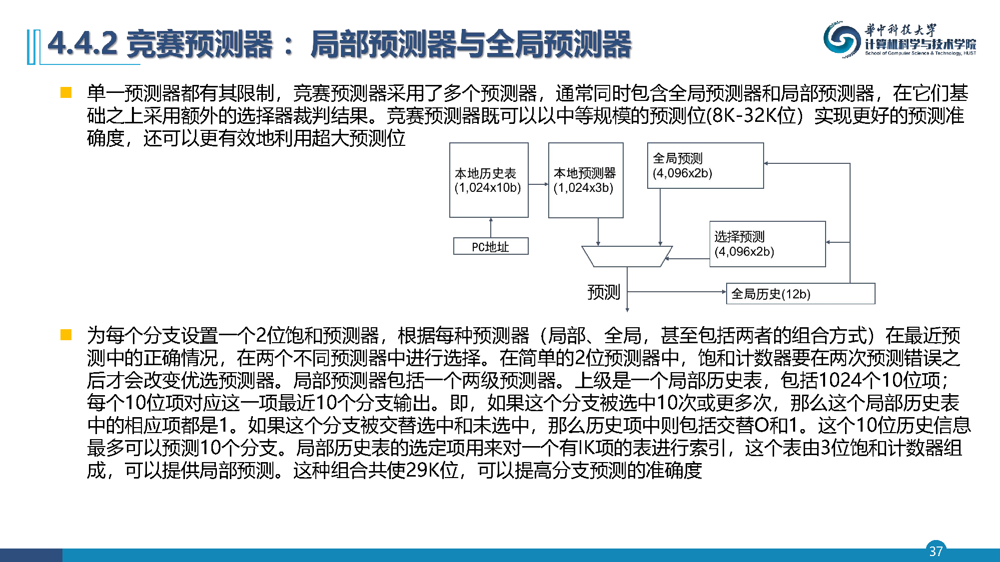

</div>

</div>

---

<style>
.columns { display: grid; grid-template-columns: 1fr 1fr; gap: 1.5rem; }
</style>

<div class='columns'>

<div>

## Intel Core i7分支预测

- **Intel Core i7使用了两级预测器**
- **第一级预测器较小**：每个时钟周期预测一个分支
- **较大的二级预测器作为备份**
- **每个预测器组合了3个不同预测器**：
  1. 简单的两位预测器
  2. 全局历史预测器
  3. 循环退出预测器
- **还有独立单元为间接分支预测目标地址**
- **使用栈来预测返回地址**

</div>

<div>

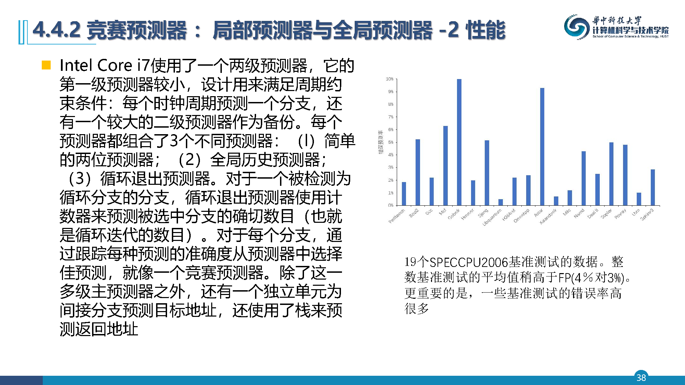

</div>

</div>

---

<style>
.columns { display: grid; grid-template-columns: 1fr 1fr; gap: 1.5rem; }
</style>

<div class='columns'>

<div>

## 基于硬件的推测

- **通过预测分支的输出，在假定预测正确的前提下执行程序**
- **持续提取、发射和执行指令，就好像分支预测总是正确的**
- **当预测错误时，能够恢复到前一个正确状态重新执行**
- **关键思想**：允许指令乱序执行，但强制顺序提交
- **重排序缓冲区（ROB）**：保存已经完成执行但还没有提交的指令结果

</div>

<div>

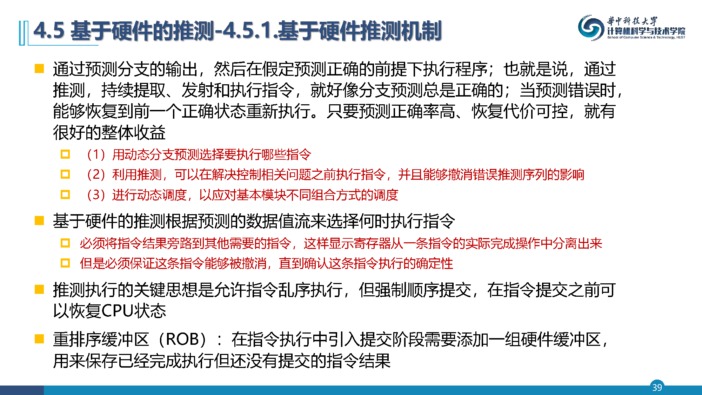

</div>

</div>

---

<style>
.columns { display: grid; grid-template-columns: 1fr 1fr; gap: 1.5rem; }
</style>

<div class='columns'>

<div>

## 重排序缓冲区

- **ROB提供了很多内部隐式寄存器**
- **ROB从指令完成到其提交完毕之前保存结果**
- **ROB中每条条目包含五个字段**：指令类型、目的地字段、值字段和就绪字段
- **ROB包含存储缓冲区**
- **Store指令仍然分两步执行，但第二步是由指令提交来执行的**
- **使用ROB条目编号而不是保留站编号来标记结果**

</div>

<div>

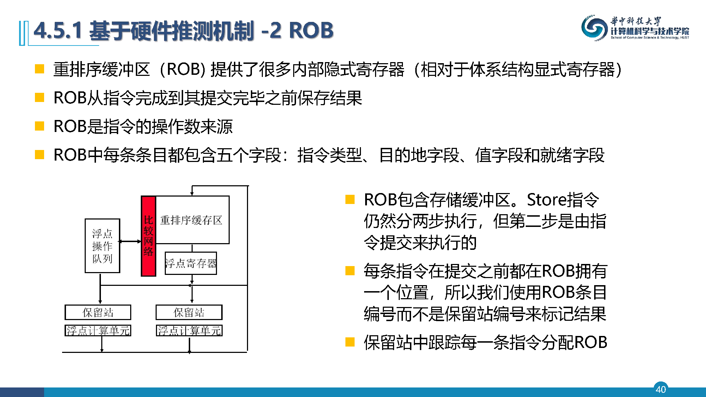

</div>

</div>

---

<style>
.columns { display: grid; grid-template-columns: 1fr 1fr; gap: 1.5rem; }
</style>

<div class='columns'>

<div>

## ROB指令执行步骤

1. **发射**：从指令队列获得指令，如果存在空保留站而且ROB中有空条目，则发射
2. **执行**：等待操作数可用，然后在功能单元中执行运算
3. **写结果**：结果写到CDB上，然后写到ROB和等待的保留站
4. **提交**：完成指令的最后一个阶段
   - **正常提交**：更新寄存器，从ROB清除指令
   - **Store提交**：更新存储器
   - **分支预测错误**：ROB被刷新，从分支的后续正常指令处重新开始

</div>

<div>

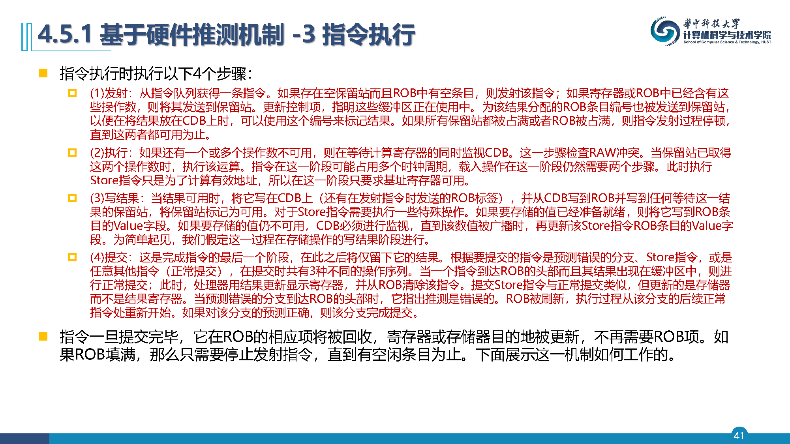

</div>

</div>

---

<style>
.columns { display: grid; grid-template-columns: 1fr 1fr; gap: 1.5rem; }
</style>

<div class='columns'>

<div>

## ROB状态表示例

- **保留站和寄存器状态字段的基本信息与Tomasulo算法中相同**
- **区别**：Qj和Qk字段以及寄存器状态字段中的保留站编号被ROB条目编号代替
- **Dest字段**：指定一个ROB条目，也就是这个保留站条目所生成结果的目的地
- **"值"列**：所保存的值；#X格式表示ROB条目X的值字段

</div>

<div>

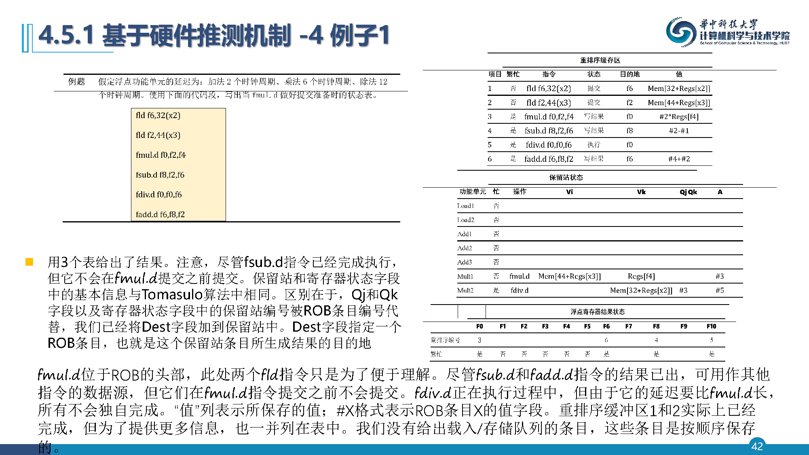

</div>

</div>

---

<style>
.columns { display: grid; grid-template-columns: 1fr 1fr; gap: 1.5rem; }
</style>

<div class='columns'>

<div>

## ROB算法伪代码

| 指令状态 | 等待条件 | 操作或记录工作 |
|----------|----------|---------------|
| 发射 | 保留站和ROB都可用 | 更新寄存器状态和保留站 |
| 执行浮点指令 | Qj=0 且 Qk=0 | 计算结果 |
| 载入步骤1 | Qj=0 | 计算有效地址 |
| 载入步骤2 | 步骤1完成 | 从存储器读取 |
| 存储 | 执行完成 | 更新ROB |
| 提交 | ROB头部且Ready | 更新寄存器或存储器 |

</div>

<div>


</div>

</div>

---

<style>
.columns { display: grid; grid-template-columns: 1fr 1fr; gap: 1.5rem; }
</style>

<div class='columns'>

<div>

## 寄存器重命名总结

- **通过寄存器重命名消除名相关（WAR和WAW）**
- **通过推测执行方法能够减轻分支相关带来的停顿**
- **记分牌、Tomasulo和ROB提供了隐式重命名方式**
- **体系结构显式寄存器被运行时分配到内部临时寄存器**
- **显式寄存器重命名**：明确使用更大的物理寄存器集，并与寄存器重命名方法结合在一起

</div>

<div>

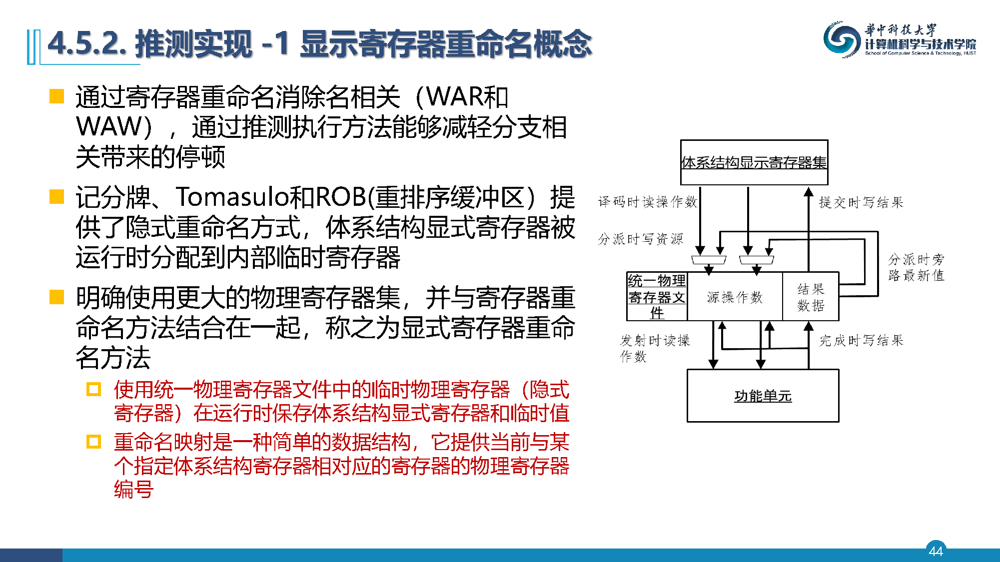

</div>

</div>

---

<style>
.columns { display: grid; grid-template-columns: 1fr 1fr; gap: 1.5rem; }
</style>

<div class='columns'>

<div>

## 多线程技术

- **多线程技术允许同时执行多个线程**
- **类型**：
  - 细粒度多线程
  - 粗粒度多线程
  - 同时多线程（SMT）
- **可以进一步提高处理器利用率**

</div>

<div>

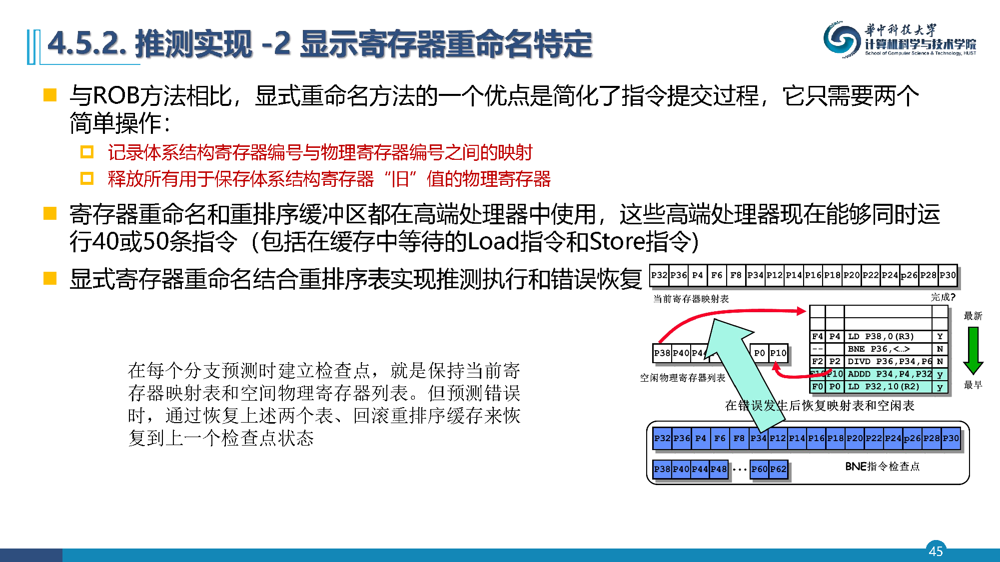

</div>

</div>

---

<style>
.columns { display: grid; grid-template-columns: 1fr 1fr; gap: 1.5rem; }
</style>

<div class='columns'>

<div>

## 华为泰山处理器

- **华为泰山处理器是华为自主研发的数据中心处理器**
- **采用先进的微架构设计**
- **支持多核多线程**
- **高效的流水线设计**
- **先进的功耗管理**

</div>

<div>

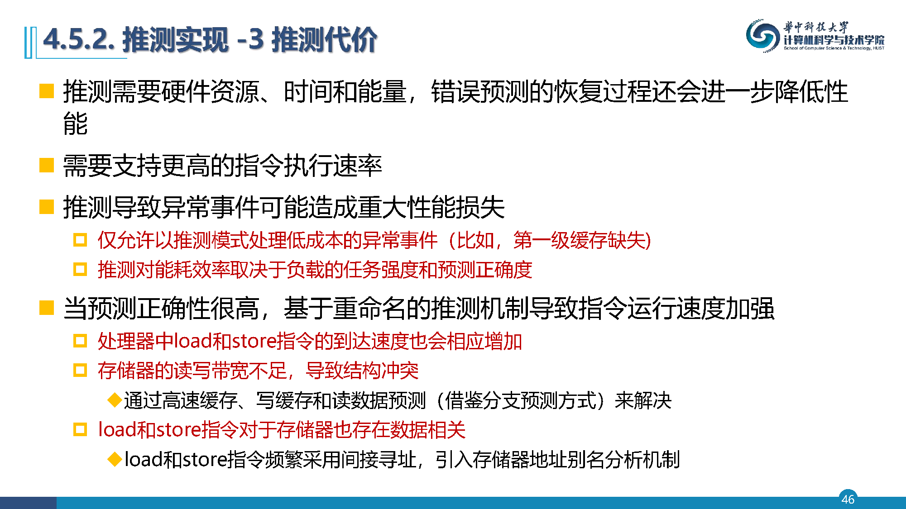

</div>

</div>

---

<style>
.columns { display: grid; grid-template-columns: 1fr 1fr; gap: 1.5rem; }
</style>

<div class='columns'>

<div>

## 泰山处理器流水线

- **采用多级流水线设计**
- **支持乱序执行**
- **集成先进的分支预测器**
- **高效的资源利用率**

</div>

<div>

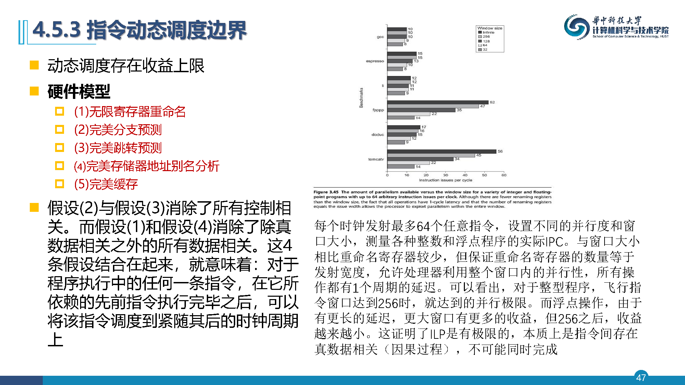

</div>

</div>

---

<style>
.columns { display: grid; grid-template-columns: 1fr 1fr; gap: 1.5rem; }
</style>

<div class='columns'>

<div>

## 泰山处理器微架构

- **高性能整数运算单元**
- **高效的浮点运算单元**
- **大容量的缓存层次结构**
- **先进的内存访问优化**

</div>

<div>

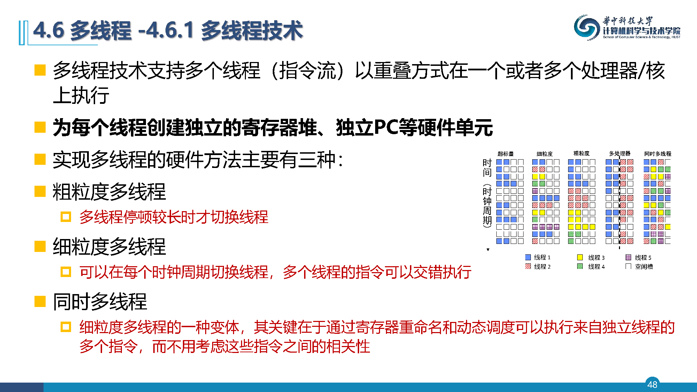

</div>

</div>

---

<style>
.columns { display: grid; grid-template-columns: 1fr 1fr; gap: 1.5rem; }
</style>

<div class='columns'>

<div>

## 泰山处理器特性

- **高并发处理能力**
- **低功耗设计**
- **高安全性和可靠性**
- **广泛的应用场景**

</div>

<div>

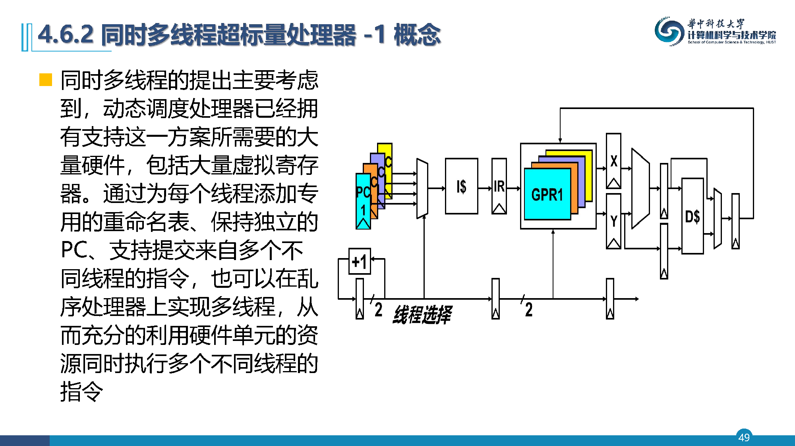

</div>

</div>

---

<style>
.columns { display: grid; grid-template-columns: 1fr 1fr; gap: 1.5rem; }
</style>

<div class='columns'>

<div>

## 指令级并行技术总结

- **静态指令调度**：编译器优化指令顺序
- **动态指令调度**：硬件动态调整指令执行顺序
- **寄存器重命名**：消除名相关
- **分支预测**：减少控制冲突
- **推测执行**：提前执行可能执行的指令

</div>

<div>

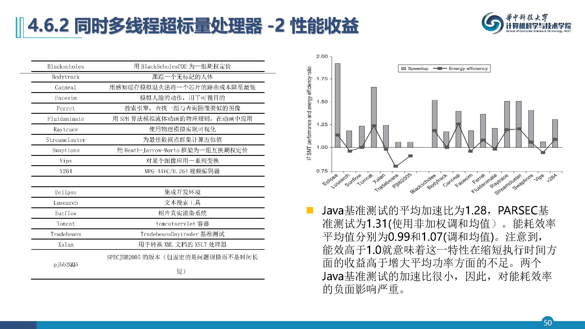

</div>

</div>

---

<style>
.columns { display: grid; grid-template-columns: 1fr 1fr; gap: 1.5rem; }
</style>

<div class='columns'>

<div>

## 动态调度算法对比

| 特性 | 记分牌 | Tomasulo | ROB |
|------|--------|----------|-----|
| 冲突检测 | 集中式 | 分散式 | 分散式 |
| 寄存器重命名 | 否 | 是 | 是 |
| 推测执行 | 否 | 否 | 是 |
| 复杂性 | 中等 | 高 | 最高 |

</div>

<div>

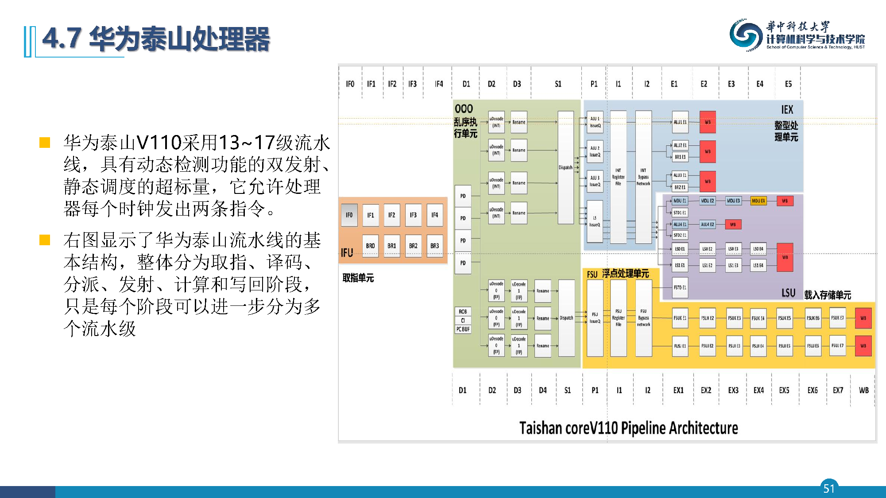

</div>

</div>

---

<style>
.columns { display: grid; grid-template-columns: 1fr 1fr; gap: 1.5rem; }
</style>

<div class='columns'>

<div>

## 分支预测技术发展

1. **静态分支预测**：基于编译器的预测
2. **局部分支预测**：基于分支历史
3. **全局分支预测**：基于所有分支的关联
4. **相关分支预测**：结合局部和全局
5. **竞赛分支预测**：多个预测器竞争

</div>

<div>

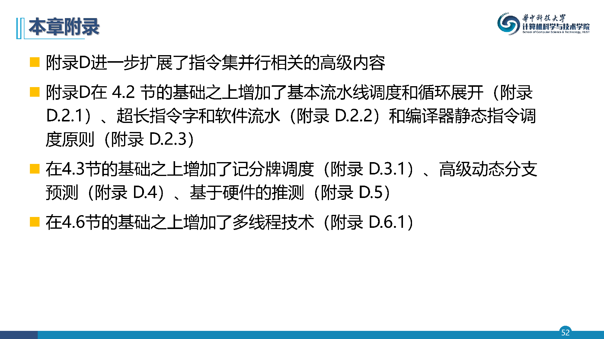

</div>

</div>

---

## 本章小结


---
