<!-- _class: lead -->

# 内存系统

**计算机系统结构**

---

## 本章内容

- **理解存储层次设计的任务和工作原理，局部性原理；**
- **掌握 Cache 性能量化指标和优化技术；**
- **理解虚拟存储器原理，掌握存储层次设计方法，理解典型存储层次。**

---

## 本章知识点

- 存储器的层次结构
- Cache 基本概念和量化指标
- Cache 性能优化的各种策略
- 虚拟存储器以及典型实例

通过本章学习，理解存储系统的设计和优化方法。

---

<!-- _layout: image -->

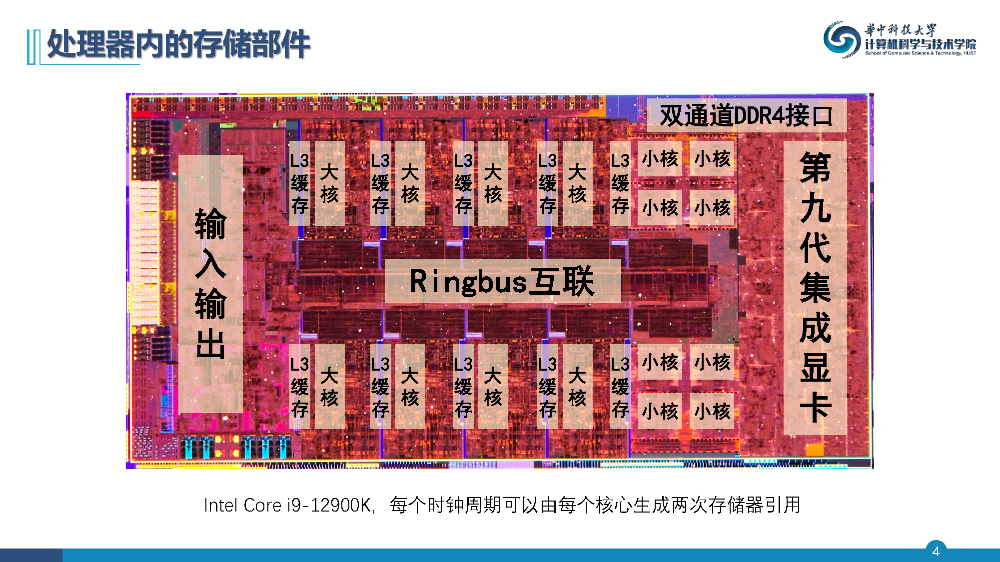

---

<!-- _layout: image -->

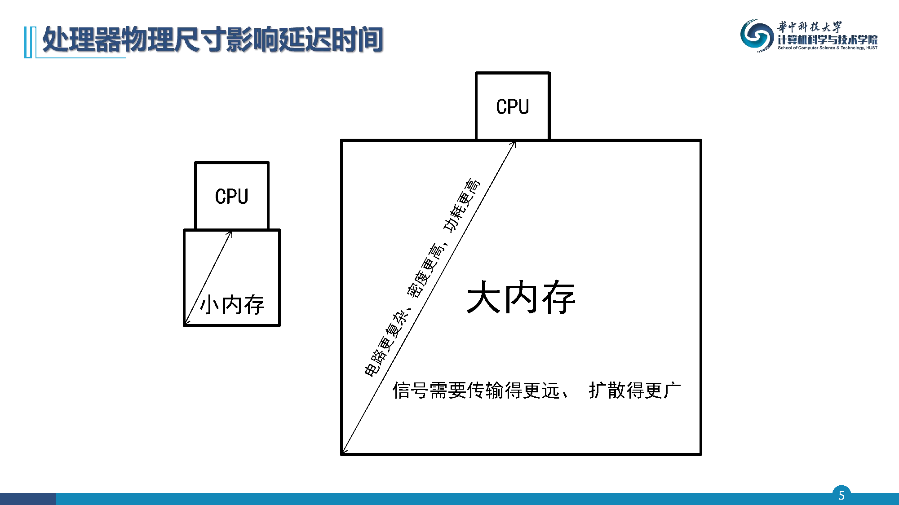

---

## 存储系统的核心问题

**计算机系统结构设计中关键的问题之一：** 如何以合理的价格，设计容量和速度都满足计算机系统要求的存储器系统？

人们对这三个指标的要求：**容量大、速度快、价格低**

三个要求是相互矛盾的：
- 速度越快，每位价格就越高；
- 容量越大，每位价格就越低；
- 容量越大，速度越慢。

**解决方法：** 采用多种存储器技术，构成多级存储层次结构。

---

<!-- _layout: image -->

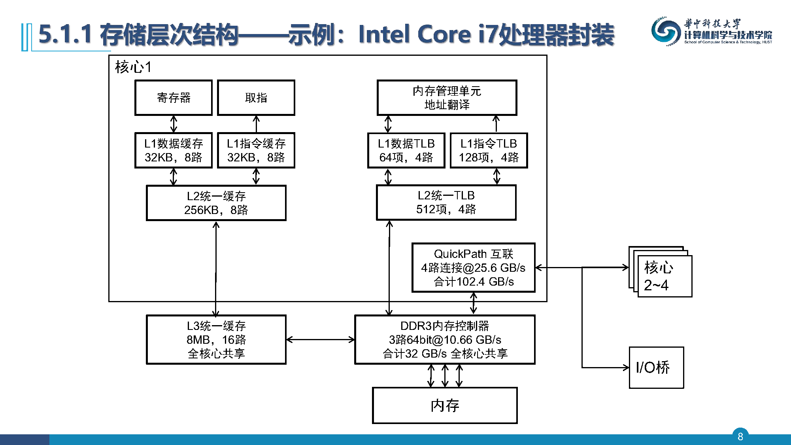

---

<!-- _layout: image -->

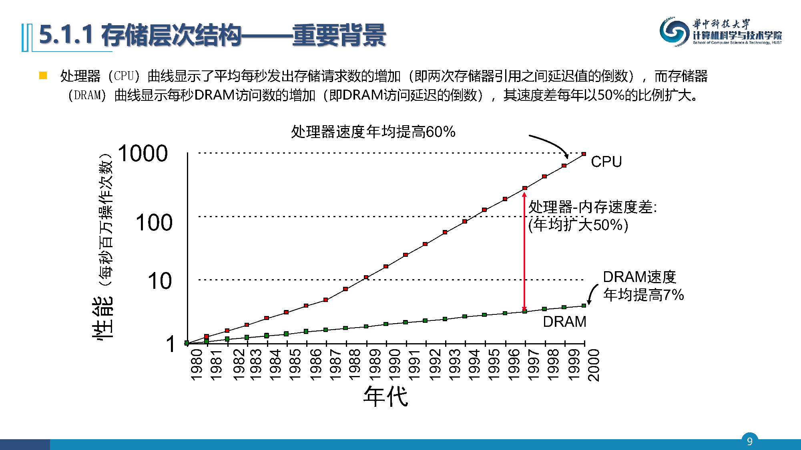

---

<!-- _layout: image -->

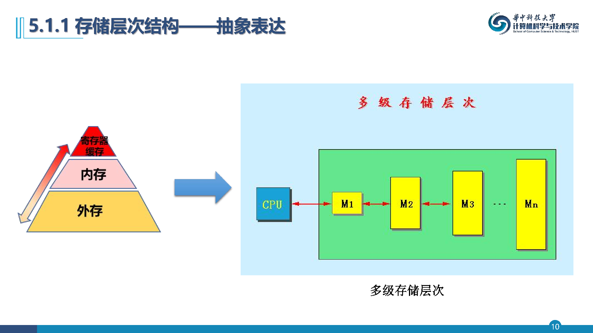

---

## 存储层次设计的目标

假设第 $i$ 个存储器 $M_i$ 的访问时间为 $T_i$，容量为 $S_i$，平均每位价格为 $C_i$：

- **访问时间：** $T_1 < T_2 < \dots < T_n$
- **容量：** $S_1 < S_2 < \dots < S_n$
- **平均每位价格：** $C_1 > C_2 > \dots > C_n$

整个存储系统要达到的目标：从 CPU 来看，该存储系统的速度接近于 $M_1$ 的，而容量和每位价格都接近于 $M_n$ 的。

存储器越靠近 CPU，则 CPU 对它的访问频度越高，而且最好大多数的访问都能在 $M_1$ 完成。

---

## 两级存储层次的参数

仅考虑由 $M_1$ 和 $M_2$ 构成的两级存储层次：

- $M_1$ 的参数：$S_1, T_1, C_1$
- $M_2$ 的参数：$S_2, T_2, C_2$

**存储容量：** 整个存储系统的容量即是第二级存储器 $M_2$ 的容量，即 $S = S_2$

**每位价格：** $C = \dfrac{C_1 S_1 + C_2 S_2}{S_1 + S_2}$，当 $S_1 \ll S_2$ 时，$C \approx C_2$

---

## 命中率与不命中率

- **命中率 $H$：** CPU 访问存储系统时，在 $M_1$ 中找到所需信息的概率

$$H = \frac{N_1}{N_1 + N_2}$$

  - $N_1$：访问 $M_1$ 的次数
  - $N_2$：访问 $M_2$ 的次数

- **不命中率：** $F = 1 - H$

---

## 平均访问时间

$$T_A = H T_1 + (1 - H)(T_1 + T_M) = T_1 + (1 - H) T_M = T_1 + F \cdot T_M$$

分两种情况考虑 CPU 的一次访存：

- **命中时：** 访问时间即为 $T_1$（命中时间）
- **不命中时：** 不命中时的访问时间为 $T_2 + T_B + T_1 = T_1 + T_M$，其中 $T_M$ 为不命中开销

  - **不命中开销 $T_M$：** 从向 $M_2$ 发出访问请求到把整个数据块调入 $M_1$ 中所需的时间
  - **传送一个信息块所需的时间为 $T_B$**

---

## 存储器的工作原理与介质类型

**工作原理：**
- 只读存储器（ROM）
- 随机存储器（RAM）
  - 动态随机存储器（DRAM）：SDRAM、DDR SDRAM、DDR2/3/4/5、HBM
  - 静态随机存储器（SRAM）
- 高速缓冲存储器（Cache）

**介质类型：**
- SRAM
- DRAM
- Fe-RAM（铁电存储器）
- MRAM（磁性存储器）
- PCM（相变存储器）

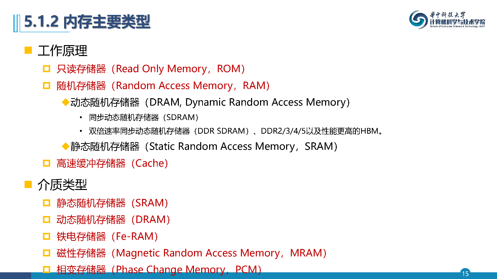

---

## DRAM 性能演进

访问时间的性能改进为每年大约 5%。1986 年采纳 CMOS 制作工艺，DRAM 访问性能提高了 2 倍。20 世纪 90 年代中期引入各种突发传输模式以及后期引入 SDRAM，显著增加了访问时间的计算复杂度。DDR4 和 DDR5 设计复杂性再度提高，延迟已经驻足不前，收益则主要体现在内存带宽方面。

| 年份 | DRAM 类型 | 频率 MT/s | 时钟周期 ns | 列选延迟 周期数 | 访问延迟 ns |
| --- | --- | --- | --- | --- | --- |
| 1992 | SDR | 100 | 8.00 | 3 | 24.00 |
| 2000 | DDR | 333 | 6.00 | 2.5 | 15.00 |
| 2004 | DDR2 | 667 | 3.00 | 5 | 15.00 |
| 2006 | DDR2 | 800 | 2.50 | 6 | 15.00 |
| 2010 | DDR3 | 1333 | 1.50 | 9 | 13.50 |
| 2016 | DDR4 | 1866 | 1.07 | 13 | 13.93 |
| 2022 | DDR5 | 4800 | 0.42 | 40 | 16.67 |

---

<!-- _layout: image -->

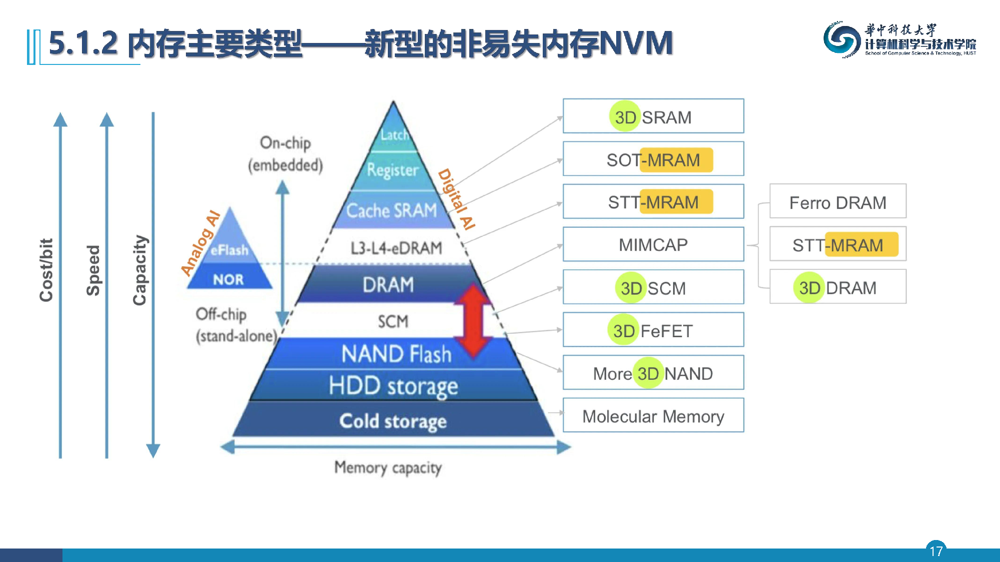

---

## 层次存储系统与局部性原理

**层次存储系统可以简化为两层存储：**
- 下层存储容量大，以固定大小存储单元（例如块或者页）全局编址
- 上层存储容量小，在存取路径上更接近处理器（速度更快），按相同单元形式组织，存放的是下层存储的子集
- 上层存储称为下层存储的缓存

**程序访问的局部性原理：** 对于绝大多数程序来说，程序所访问的指令和数据在地址上不是均匀分布的，而是相对簇聚的。

**局部性包含两个方面：**
- **时间局部性：** 程序马上将要用到的信息很可能就是现在正在使用的信息
- **空间局部性：** 程序马上将要用到的信息很可能与现在正在使用的信息在存储空间上相邻

---

<!-- _layout: image -->

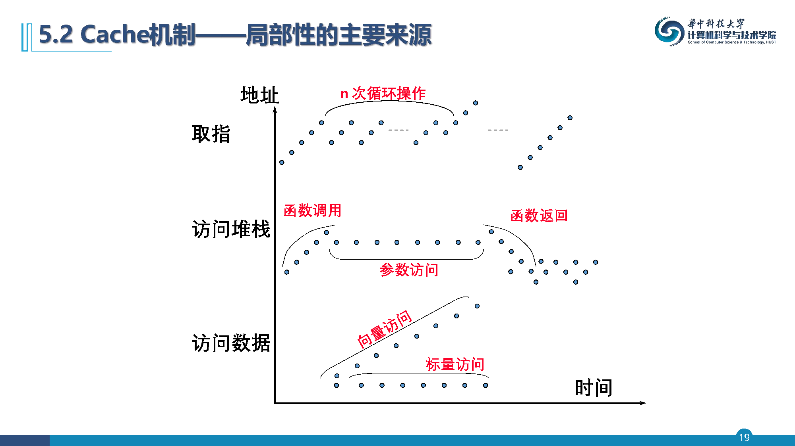

---

<!-- _layout: image -->

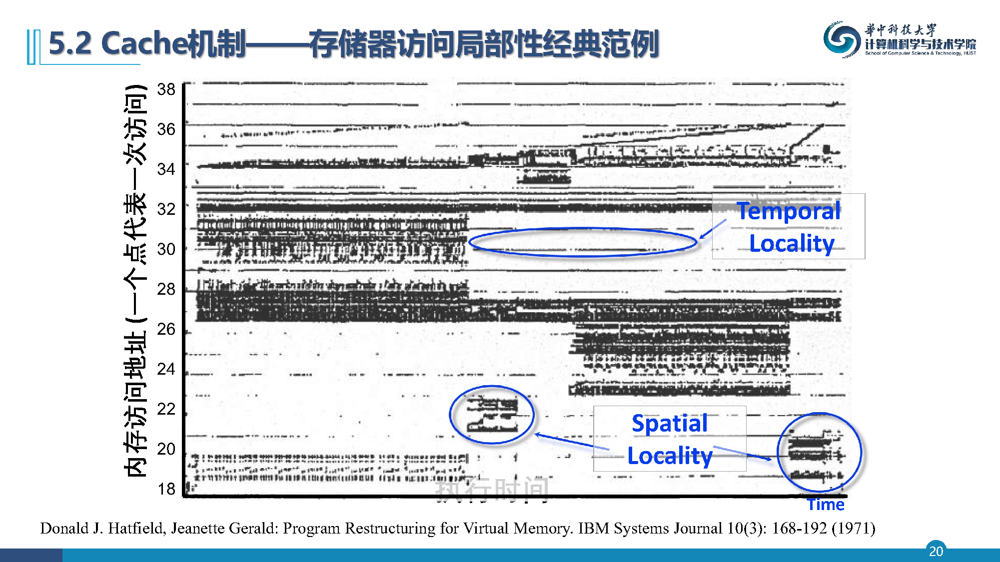

---

## 存储层次结构比较

| 级别 | 1 | 2 | 3 | 4 |
| --- | --- | --- | --- | --- |
| 名称 | 寄存器 | 缓存 | 主存储器 | 磁盘存储 |
| 典型容量 | 小于 0.1MB | 256 KB～8MB | 小于 1 TB | 大于 2 TB |
| 主要技术 | 具有多个端口的定制存储器 | 片上 CMOS、SRAM | CMOS、DRAM | 磁盘 |
| 访问时间（ns） | 0.15～0.30 | 0.5～1.5 | 30～200 | 5×10⁶ |
| 带宽（MB/s） | 1×10⁵～1×10⁶ | 1×10⁵～4×10⁵ | 5000～20000 | 50～500 |
| 管理方 | 编译器 | 硬件 | 操作系统 | 操作系统/操作员 |

---

## 三级存储系统

三级存储系统包括 Cache（高速缓冲存储器）、主存储器和磁盘存储器（辅存）。可看成是由"Cache—主存"层次和"主存—辅存"层次构成的系统。

从主存的角度来看：
- **"Cache－主存"层次：** 弥补主存速度的不足
- **"主存－辅存"层次：** 弥补主存容量的不足

---

## "Cache－主存"与"主存－辅存"层次的区别

| 比较项目 | Cache－主存层次 | 主存－辅存层次 |
| --- | --- | --- |
| 目的 | 弥补主存速度的不足 | 弥补主存容量的不足 |
| 存储管理实现 | 主要由专用硬件实现 | 主要由软件实现 |
| 访问速度的比值 | 几比一 | 几万比一 |
| 典型的块/页大小 | 几十个字节 | 几百到几千个字节 |
| 对第二级的 CPU 访问方式 | 可直接访问 | 均通过第一级 |
| 不命中时是否切换 CPU | 不切换 | 切换到其他进程 |

---

## 存储器停顿周期

**存储器停顿周期：** 处理器在等待存储器访问而停顿时的周期数目

**整体执行性能由 CPU 执行时间来评价：**

$$CPU 执行时间 = (CPU 时钟周期 + 存储器停顿周期) \times 时钟周期时间$$

简化假设：
- 将处理缓存命中的时间放在 CPU 时钟周期里计算
- 假定处理器在发生缓存缺失时停顿

---

## 存储器停顿周期计算

**存储器停顿周期 = 缺失数 × 缺失代价**

提取出指令数（IC）公因子：

$$\text{存储器停顿周期} = IC \times \frac{\text{缺失数}}{\text{指令数}} \times 缺失代价 = IC \times \frac{\text{访存数}}{\text{指令数}} \times 缺失率 \times 缺失代价$$

> **注意：** 此处缺失代价是一个平均值，但在计算时却被作为常数来使用。在实际存储系统中发生缺失时，缓存后面的存储器可能因为先前请求仍在处理或存储器刷新而处于繁忙状态，访存时间并不确定。

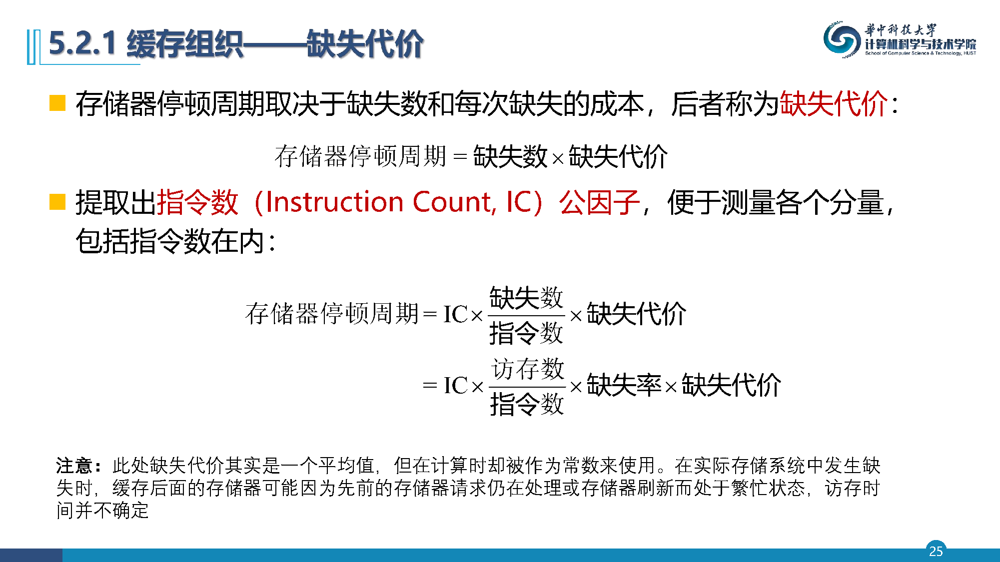

---

## 缺失率与测量

**缺失率：** 缓存访问中导致缺失的访问比例

测量方法：
- 用缓存仿真器测量
- 许多微处理器提供了用于计算缺失数与存储器引用数的硬件

**读写操作的缺失率通常不同：**

$$\text{存储器停顿周期} = IC \times \frac{\text{访存数}}{\text{指令数}} \times 缺失率 \times 缺失代价$$

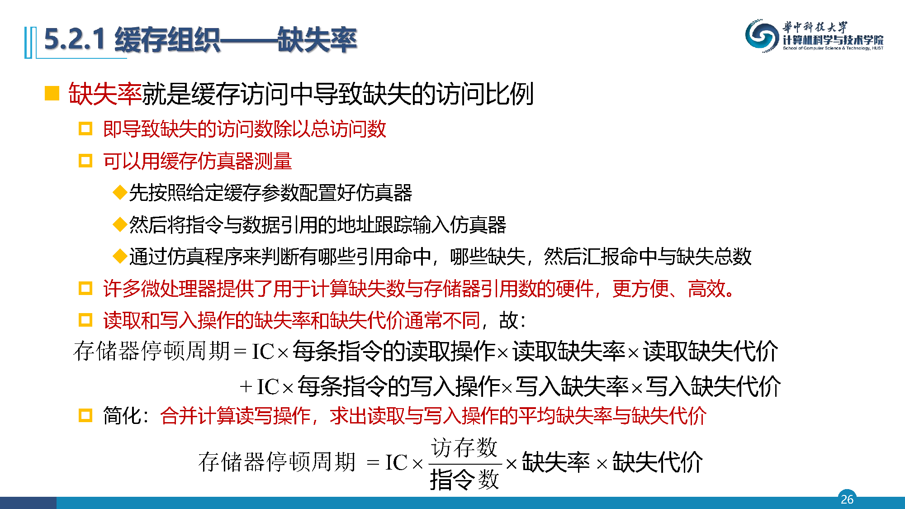

---

<!-- _layout: image -->

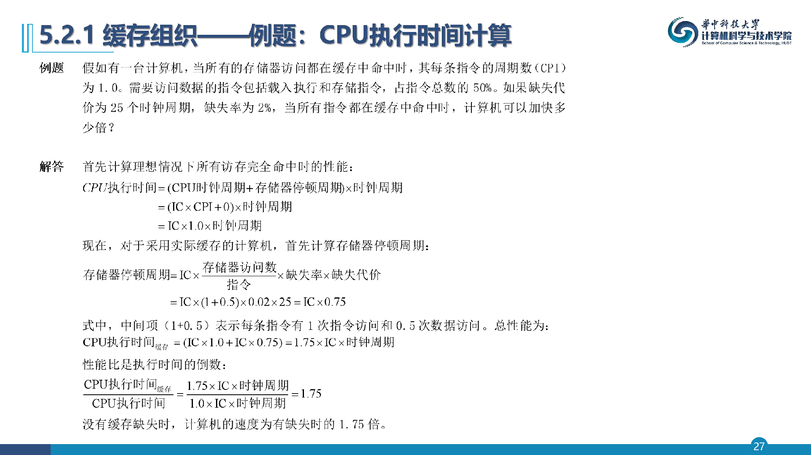

---

## 每条指令的缺失数

与"每次存储器引用的缺失数"的关系为：

$$\frac{\text{缺失数}}{\text{指令数}} = 缺失率 \times \frac{\text{访存数}}{\text{指令数}}$$

将每次存储器引用的缺失率转换为每条指令的缺失：

$$\frac{\text{缺失数}}{\text{指令数}} = 0.02 \times 1.5 = 0.03$$

即：每 1000 条指令发生 30 次缺失

表示为"每条指令的缺失数"的好处：**与硬件实现无关**

---

<!-- _layout: image -->

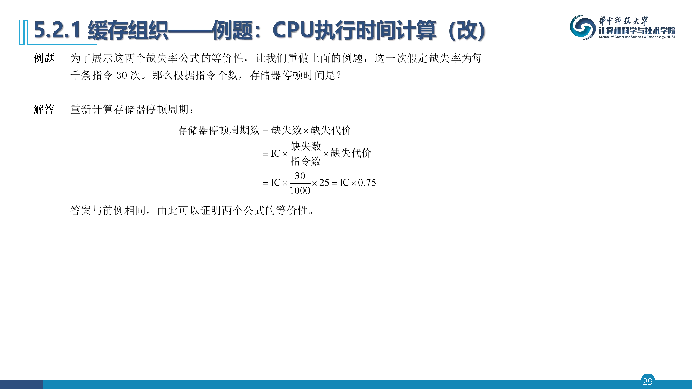

---

## Cache 映射的四个基本问题

**问题1：** 一个块可以放在上一级的什么位置，即放何处？ （放置策略）

**问题2：** 如果一个块在上一级中，如何找到它，即怎么找？ （查找方法）

**问题3：** 在缺失时应当替换哪个块，即换哪块？ （替换方法）

**问题4：** 在写入时会发生什么，即怎样写？ （写入方法）

---

## 基本结构和原理

- **存储空间分割与地址计算：** 来自 CPU 的主存地址被分割为块地址和块内位移
- **Cache 和主存分块：** Cache 是按块进行管理的，Cache 和主存均被分割成大小相同的块
- 主存块地址（块号）用于查找该块在 Cache 中的位置
- 块内位移用于确定所访问的数据在该块中的位置

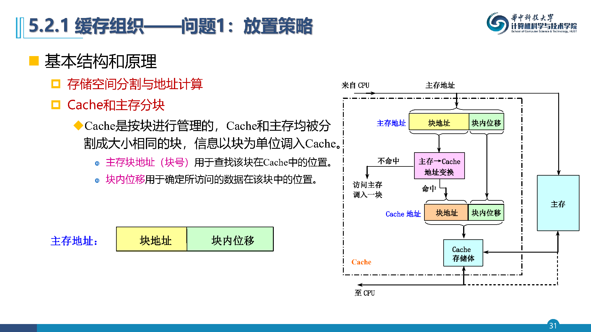

---

<!-- _layout: image -->

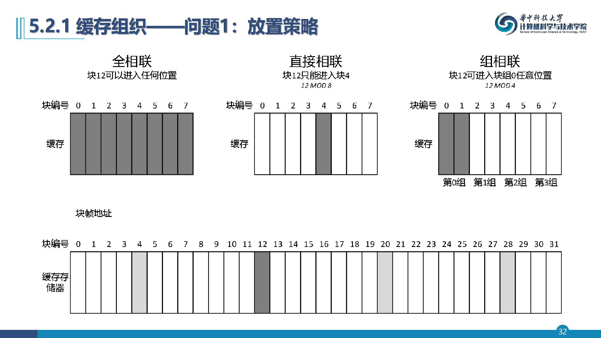

---

## 全相联映象

**全相联：** 主存中的任一块可以被放置到 Cache 中的任意一个位置

**对比：** 阅览室位置 ── 随便坐

**特点：** 空间利用率最高，冲突概率最低，实现最复杂

---

## 直接映象

**直接映象：** 主存中的每一块只能被放置到 Cache 中唯一的一个位置（循环分配）

**对比：** 阅览室位置 ── 只有一个位置可以坐

**特点：** 空间利用率最低，冲突概率最高，实现最简单

对于主存的第 $i$ 块，若它映象到 Cache 的第 $j$ 块，则：

$$j = i \mod(M)$$

设 $M = 2^m$，则当表示为二进制数时，$j$ 实际上就是 $i$ 的低 $m$ 位

---

## 组相联映象

**组相联：** 主存中的每一块可以被放置到 Cache 中唯一的一个组中的任何一个位置

组相联是直接映象和全相联的一种折衷

**组的选择常采用位选择算法：**
- 主存第 $i$ 块映象到第 $k$ 组，则：$k = i \mod(G)$
- 设 $G = 2^g$，则 $k$ 实际上就是 $i$ 的低 $g$ 位
- 低 $g$ 位以及直接映象中的低 $m$ 位通常称为索引

**n 路组相联：** 每组中有 $n$ 个块（$n = M/G$），相联度越高，Cache 空间的利用率就越高，不命中率越低。

|  | n（路数） | G（组数） |
| --- | --- | --- |
| 全相联 | M | 1 |
| 直接映象 | 1 | M |
| 组相联 | 1＜n＜M | 1＜G＜M |

绝大多数计算机的 Cache：n ≤ 4

---

## Cache 的标识查找

当 CPU 访问 Cache 时，如何确定 Cache 中是否有所要访问的块？若有的话，如何确定其位置？

**通过查找目录表来实现：**
- 主存块的块地址的高位部分，称为**标识**
- 每个主存块能唯一地由其标识来确定

$$\text{索引位数} = \log_2\left(\frac{\text{缓存大小}}{\text{块大小} \times \text{组相联度}}\right)$$

---

## 替换算法

当新调入一块而 Cache 又已被占满时，替换哪一块？

**直接映象 Cache：** 替换很简单，因为只有一个块，别无选择

**组相联和全相联 Cache：** 有多个块供选择

**三种主要替换算法：**
- **随机法：** 优点是实现简单
- **先进先出法（FIFO）**
- **最近最少使用法（LRU）：** 选择近期最少被访问的块作为被替换的块（实际是选择最久没有被访问过的块），优点是命中率较高

LRU 和随机法分别因其缺失率低和实现简单而被广泛采用。对于容量很大的 Cache，LRU 和随机法的缺失率差别不大。当缓存较小时，LRU 优于其它方式，FIFO 通常优于随机方式。

---

## 替换算法性能比较

使用 10 项 SPEC2000 基准测试，采用 64 字节的块大小，针对 Alpha 体系结构：

| 大小 | 两路 LRU | 两路随机 | 两路 FIFO | 四路 LRU | 四路随机 | 四路 FIFO | 八路 LRU | 八路随机 | 八路 FIFO |
| --- | --- | --- | --- | --- | --- | --- | --- | --- | --- |
| 16KB | 114.1 | 117.3 | 115.5 | 111.7 | 115.1 | 113.3 | 109.0 | 111.8 | 110.4 |
| 64KB | 103.4 | 104.3 | 103.9 | 102.4 | 102.3 | 103.1 | 99.7 | 100.5 | 100.3 |
| 256KB | 92.2 | 92.1 | 92.5 | 92.1 | 92.1 | 92.5 | 92.1 | 92.1 | 92.5 |

---

## "写"操作的比例与策略

"写"在所有访存操作中所占的比例：
- load 指令：26%
- store 指令：10%
- "写"在所有访存操作中所占的比例 ≈ 7%
- "写"在访问 Cache 操作中所占的比例 ≈ 28%

**"写"操作必须在确认命中后才可进行**

**两种写策略（区分不同 Cache 设计方案的重要标志）：**
- **直写法（存直达法）：** 执行"写"操作时，不仅写入 Cache，也写入下一级存储器
- **写回法（拷回法）：** 执行"写"操作时，只写入 Cache。仅当 Cache 中相应的块被替换时，才写回主存

---

## 写策略的比较

- **写回法的优点：** 速度快，所使用的存储器带宽较低
- **直写法的优点：** 易于实现，一致性好

采用直写法时，若 CPU 在"写"操作过程中必须等待直到"写"操作结束，则称 **CPU 写停顿**。减少写停顿的一种常用优化技术：**采用写缓冲器**

**"写"操作时的调块：**
- **写入分派（写时取）：** 写不命中时，先把所写单元所在的块调入 Cache，再行写入
- **无写入分派（绕写法）：** 写不命中时，直接写入下一级存储器而不调块

**写策略与调块组合：**
- 写回法 ── 按写分配
- 写直达法 ── 不按写分配

---

<!-- _layout: image -->

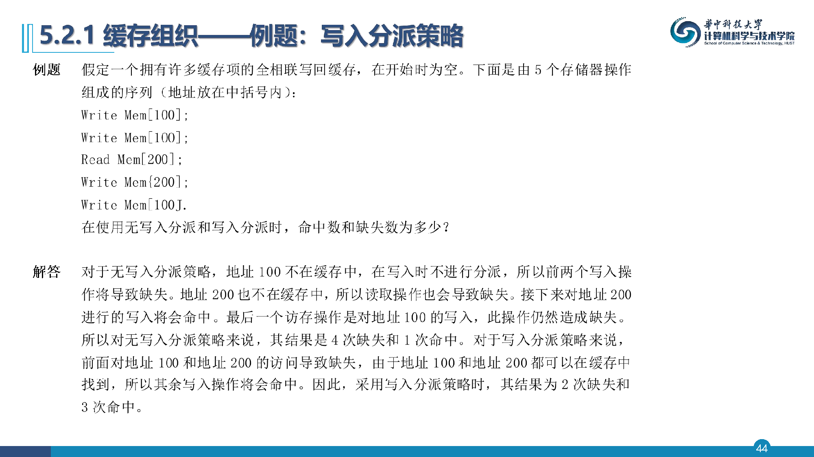

---

## 存储器性能的度量标准

$$存储器平均访问时间 = 命中时间 + 缺失率 \times 缺失代价$$

- **命中时间：** 在缓存中命中的时间
  - 可用绝对时间衡量（如 0.25～1.0ns）
  - 也可用处理器等待存储器的时钟周期数来衡量（如 150～200 个时钟周期）

---

## 缓存容量与缺失率

比较不同大小的指令、数据与统一缓存中每千条指令的缺失数。指令引用所占百分比大约为 74%。

使用 10 项 SPEC2000 基准测试，采用两路相联缓存、64 字节的块大小，针对 Alpha 体系结构：

| 大小(KB) | 指令缓存 | 数据缓存 | 统一缓存 |
| --- | --- | --- | --- |
| 8 | 8.16 | 44.0 | 63.0 |
| 16 | 3.82 | 40.9 | 51.0 |
| 32 | 1.36 | 38.4 | 43.3 |
| 64 | 0.61 | 36.9 | 39.4 |
| 128 | 0.30 | 35.3 | 36.2 |
| 256 | 0.02 | 32.6 | 32.9 |

---

<!-- _layout: image -->

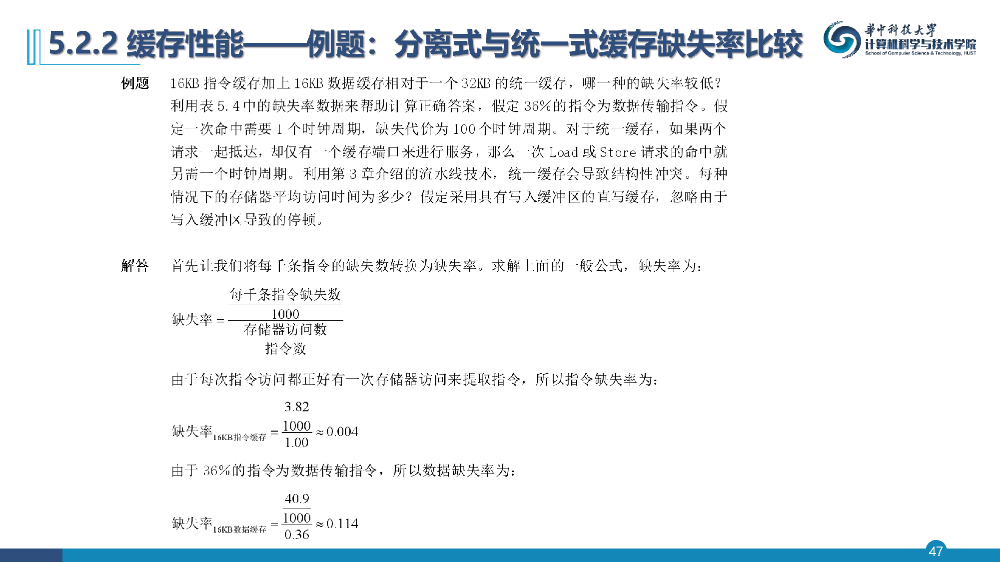

---

<!-- _layout: image -->

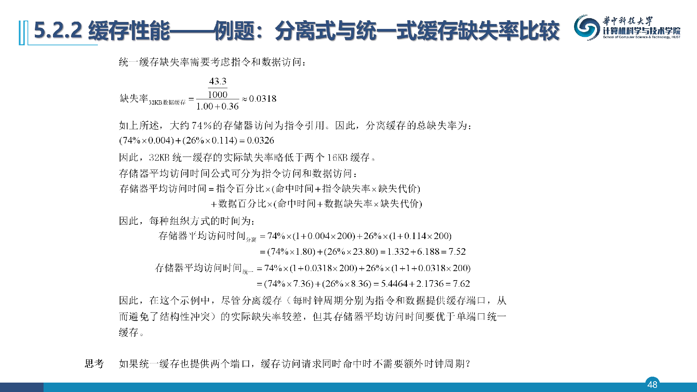

---

## 缓存性能与 CPU 执行时间

存储器平均访问时间仅计入缓存缺失造成的停顿。

采用循序执行处理器，有：

$$CPU 执行时间 = (CPU 时钟周期 + 存储器停顿周期) \times 时钟周期时间$$

**关键问题：** 一次缓存命中的时钟周期应看做 CPU 执行时钟周期的一部分，还是存储器停顿时钟周期的一部分？

广泛接受的是将命中时钟周期看做 CPU 执行时钟周期的一部分。

---

<!-- _layout: image -->

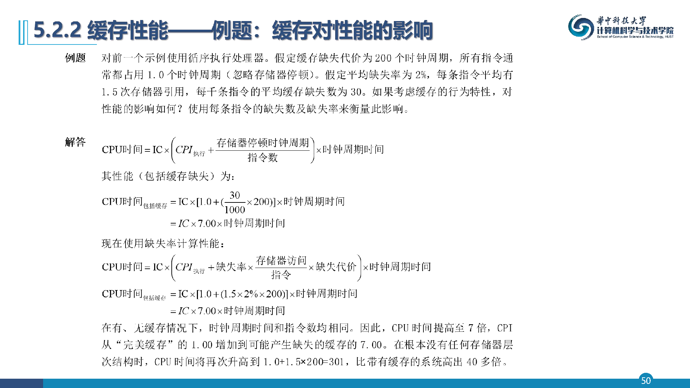

---

## 缓存对低 CPI 处理器的影响

缓存特性可能对性能产生巨大影响。对于低 CPI、高时钟频率的处理器，缓存缺失会产生双重影响：

- CPI 越低，固定数目的缓存缺失时钟周期产生的相对影响越高
- 时钟频率较高的处理器在每次缺失时会占用较多的时钟周期

**结论：** 对于低 CPI、高时钟频率的处理器，缓存的重要性更高。如果在评估此类处理器的性能时忽略缓存行为，误差更大。再次印证了 Amdahl 定律。

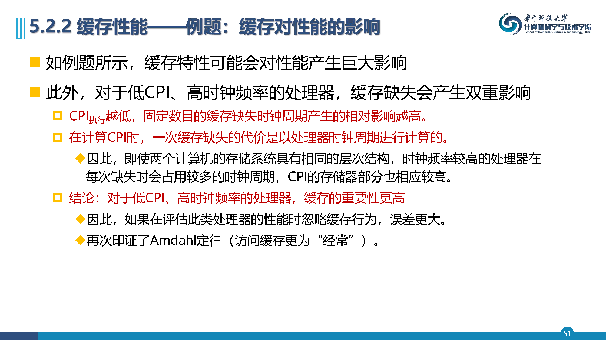

---

<!-- _layout: image -->

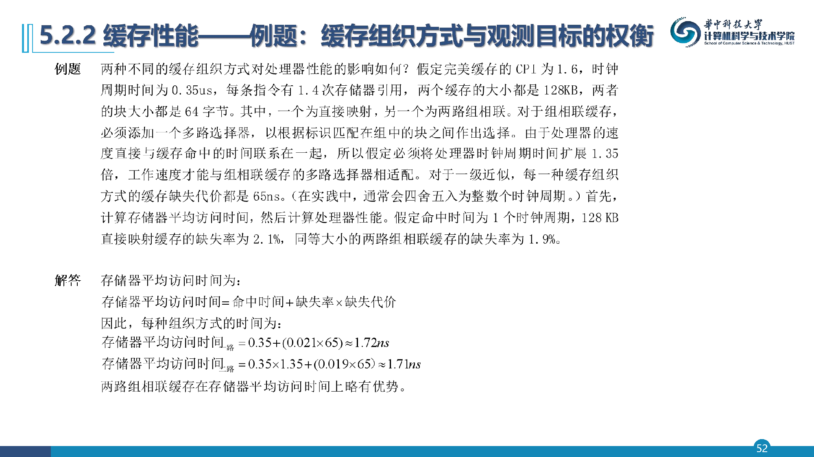

---

<!-- _layout: image -->

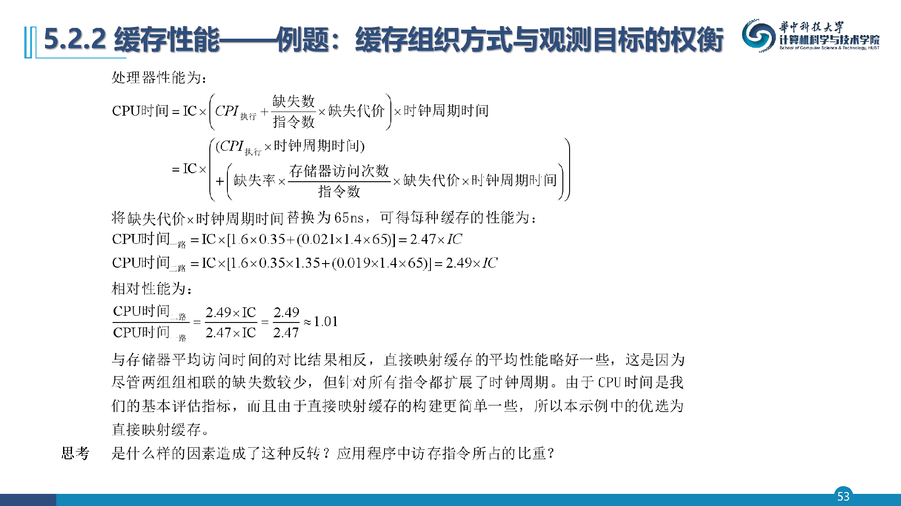

---

## 乱序执行处理器的缺失代价

在乱序执行处理器中，缺失代价如何定义？考虑存储器缺失的全部延迟，还是仅考虑处理器必须停顿时的无重叠延迟？

需要重新定义存储器停顿：

$$\text{存储器停顿周期}_{\text{缺失}} = \frac{\text{缺失数}}{\text{指令}} \times (总缺失代价 - 重叠缺失延迟)$$

需要确定：
- **存储器延迟长度：** 在乱序执行处理器中如何确定存储器操作的起止时刻
- **延迟重叠的长度：** 在什么时刻存储器操作必然造成处理器停顿

---

<!-- _layout: image -->

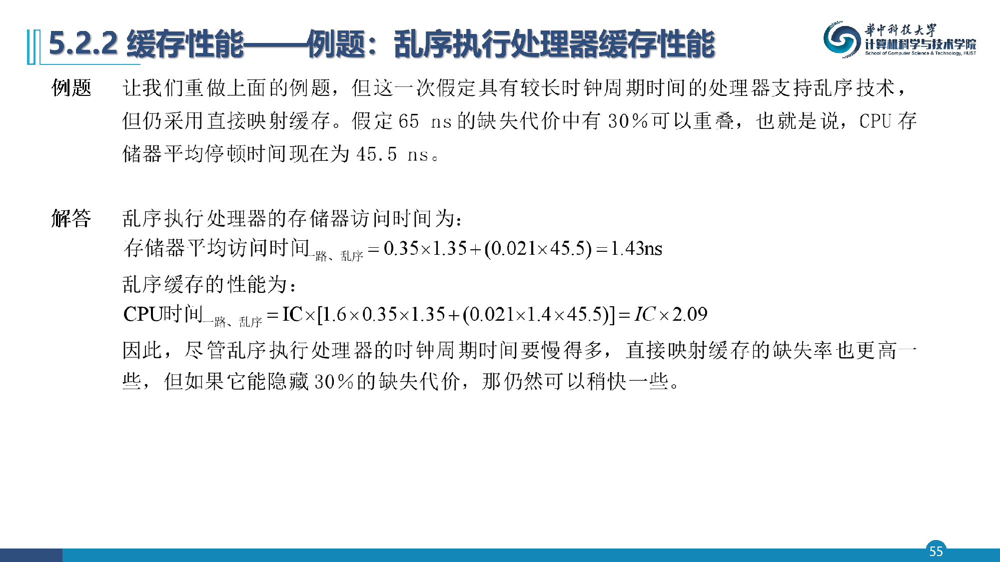

---

## 乱序处理器性能评估

乱序处理器容忍一部分缓存缺失导致的延迟，减小对性能造成的伤害。设计师在评估存储器层次结构的权衡时，通常使用乱序处理器与存储器的模拟器。

---

<!-- _layout: image -->

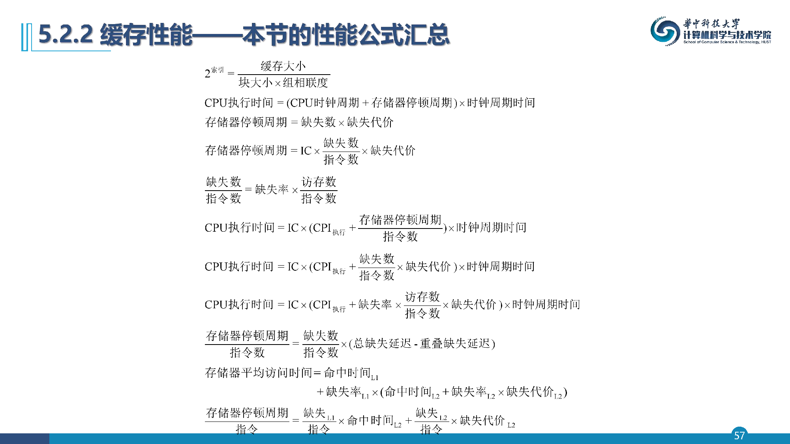

---

## 基本缓存优化方法

以存储器平均访问时间公式为框架：

$$存储器平均访问时间 = 命中时间 + 缺失率 \times 缺失代价$$

**三类基本优化方法：**
- **降低缺失率：** 更大的块、更大的缓存、更高的关联度
- **降低缺失代价：** 多级缓存，为读取操作设定高于写入操作的优先级
- **减少命中时间：** 在索引缓存时避免地址转换

---

## 缓存缺失的 3C 分类

由 2019 年 ACM Eckert Mauchly Award 获得者马克·D·希尔提出：

- **强制缺失（Compulsory）：** 首次访问的块不在缓存中，也被称为冷启动缺失
- **容量缺失（Capacity）：** 缓存无法容纳程序执行期间所需要的全部块，过后再读取
- **冲突缺失（Conflict）：** 在组相联或直接映射中，多数块被映射进一个组，某个块被暂时放弃

多处理器场景还有第四个 C：**一致性（Coherency）缺失**

---

## 缺失分类与缓存设计

**强制缺失：** 与缓存大小无关
- 在无限缓存中发生

**容量缺失：** 随缓存容量增加而降低
- 在全相联缓存中发生

**冲突缺失：** 随相联度增大而降低
- 从全相联变为八路、四路、两路组相联时发生

> **注意：** 在不超过 128KB 时，大小为 N 的直接映射缓存的缺失率大约与大小为 N/2 的两路组相联缓存的缺失率相同。

---

## 缺失率组成分析

| 缓存大小（KB） | 相联度 | 总缺失率 | 强制缺失 | 容量缺失 | 冲突缺失 |
| --- | --- | --- | --- | --- | --- |
| 4 | 1 | 0.098 | 0.0001 (0.1%) | 0.070 (72%) | 0.027 (28%) |
| 4 | 2 | 0.076 | 0.0001 (0.1%) | 0.070 (93%) | 0.005 (7%) |
| 4 | 4 | 0.071 | 0.0001 (0.1%) | 0.070 (99%) | 0.001 (1%) |
| 4 | 8 | 0.071 | 0.0001 (0.1%) | 0.070 (100%) | 0.000 (0%) |
| 8 | 1 | 0.068 | 0.0001 (0.1%) | 0.044 (65%) | 0.024 (35%) |
| 8 | 2 | 0.049 | 0.0001 (0.1%) | 0.044 (90%) | 0.005 (10%) |
| 8 | 4 | 0.044 | 0.0001 (0.1%) | 0.044 (99%) | 0.000 (1%) |
| 16 | 1 | 0.049 | 0.0001 (0.1%) | 0.040 (82%) | 0.009 (17%) |
| 32 | 1 | 0.042 | 0.0001 (0.2%) | 0.037 (89%) | 0.005 (11%) |
| 64 | 1 | 0.037 | 0.0001 (0.2%) | 0.028 (77%) | 0.008 (23%) |
| 128 | 1 | 0.021 | 0.0001 (0.3%) | 0.019 (91%) | 0.002 (8%) |
| 256 | 1 | 0.013 | 0.0001 (0.5%) | 0.012 (94%) | 0.001 (6%) |
| 512 | 1 | 0.008 | 0.0001 (0.8%) | 0.005 (66%) | 0.003 (33%) |

---

## 相联度下降与缺失率变化

展示相联度下降时所导致的缺失率变化，共 4 类：
- **八路：** 从全相联到八路相联时产生的冲突缺失
- **四路：** 从八路相联到四路相联时产生的冲突缺失
- **两路：** 从四路相联到两路相联时产生的冲突缺失
- **一路：** 从两路相联到一路相联（直接映射）时产生的冲突缺失

---

## 降低缺失率的方法

**冲突缺失：** 理论上采用全相联组织就可以避免所有冲突缺失，但全相联的硬件实现成本非常高昂。

**容量缺失：** 除了增大缓存之外没有什么特效方法。如果上一级存储器远小于程序所需要的容量，将造成频繁的替换（摆动）。

**另一种方法——增大块：** 可以降低强制缺失率，但更大的块可能会增加其他类型的缺失（增加命中时间或不命中开销……）

---

## 增大块大小的影响

**降低缺失率最简单的方法是增大块：** 较大的块可充分利用空间局部性。

**但块大小过大，缺失率反而会上升。** 较大的块也会提高缺失代价：
- 减少缓存中的块数，可能会提高冲突缺失率
- 如果缓存很小，甚至还会提高容量缺失率

**不应将块大小增大到会提高缺失率的程度。** 缺失代价的增加造成的性能损失可能超过缺失率下降带来的收益。

---

## 块大小与缓存容量的关系

| 块大小（Byte） | 4KB 缓存 | 16KB 缓存 | 64KB 缓存 | 256KB 缓存 |
| --- | --- | --- | --- | --- |
| 16 | 8.57% | 3.94% | 2.04% | 1.09% |
| 32 | 7.24% | 2.87% | 1.25% | 0.70% |
| 64 | 7.00% | 2.64% | 1.06% | 0.51% |
| 128 | 7.78% | 2.77% | 1.02% | 0.49% |
| 256 | 9.51% | 3.29% | 1.15% | 0.49% |

---

<!-- _layout: image -->

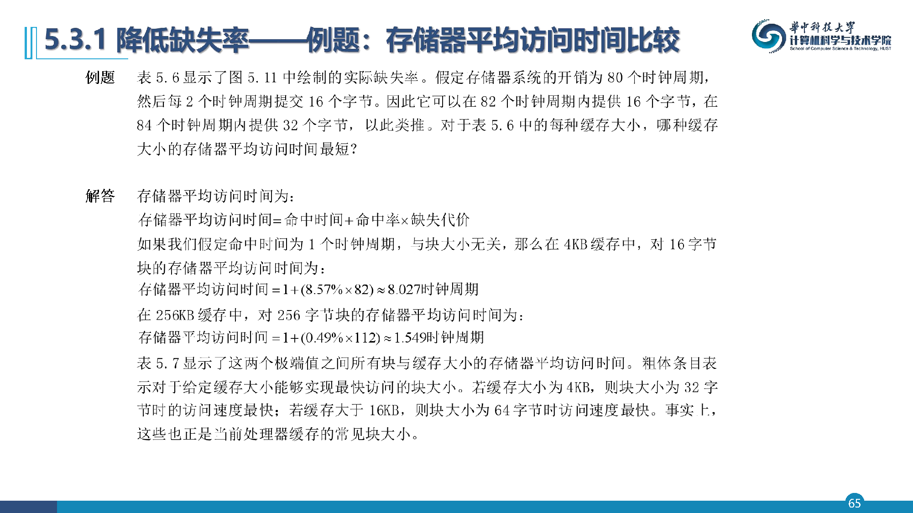

---

## 存储器平均访问时间随块大小的变化

| 块大小（Byte） | 4KB 缓存 | 16KB 缓存 | 64KB 缓存 | 256KB 缓存 |
| --- | --- | --- | --- | --- |
| 16 | 8.027 | 4.231 | 2.673 | 1.894 |
| 32 | 7.082 | 3.411 | 2.134 | 1.588 |
| 64 | 7.160 | 3.323 | 1.933 | 1.449 |
| 128 | 8.469 | 3.659 | 1.979 | 1.470 |
| 256 | 11.651 | 4.685 | 2.288 | 1.549 |

---

## 增大缓存

**降低容量缺失率最明显的方法是增大缓存。** 明显的缺点：
- 可能延长命中时间
- 增加成本和功耗

这一技术在片外缓存中尤其常用。

**2:1 Cache 经验规则：** 容量为 N 的直接映射 Cache 的缺失率 ≈ 容量为 N/2 的两路组相联 Cache 的缺失率。

采用相联度超过 8 的方案实际意义不大。改善一个方面常导致另一方面恶化：增大块可以降低缺失率但提高缺失代价；提高相联度可能延长命中时间。

---

<!-- _layout: image -->

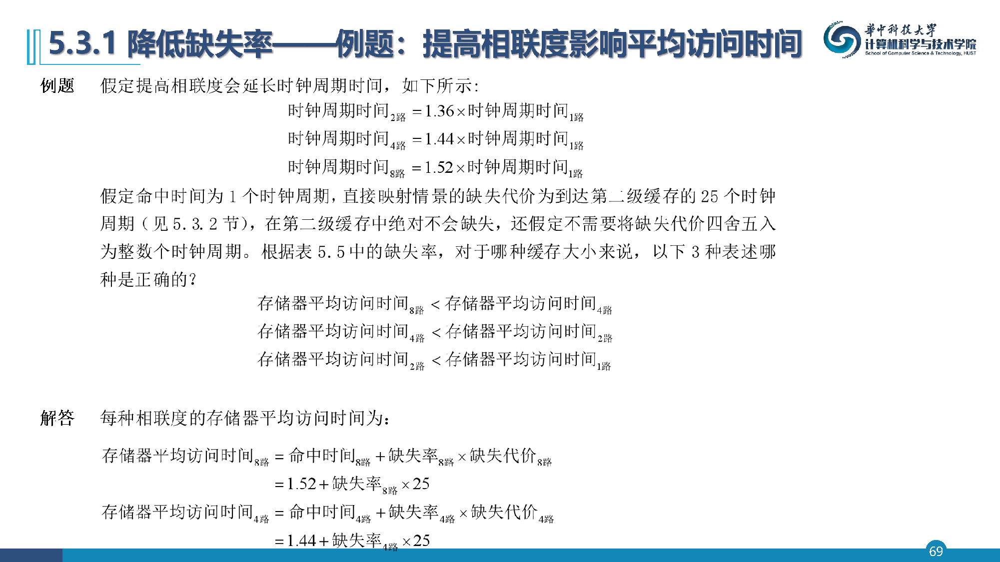

---

<!-- _layout: image -->

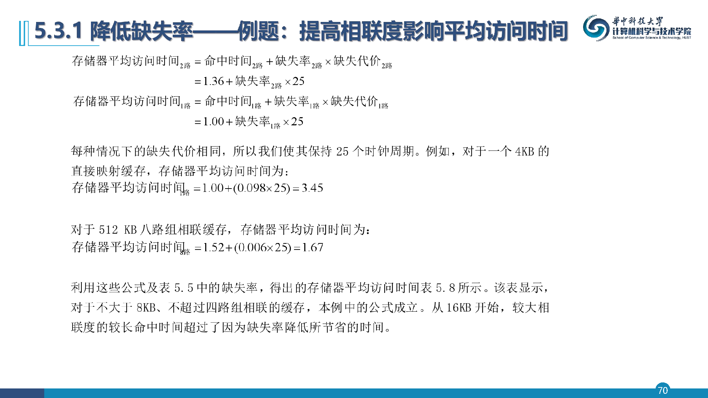

---

## 存储器平均访问时间对比

| 缓存大小（KB） | 一路 | 两路 | 四路 | 八路 |
| --- | --- | --- | --- | --- |
| 4 | 3.44 | 3.25 | 3.22 | **3.28** |
| 8 | 2.69 | 2.58 | 2.55 | **2.62** |
| 16 | **2.23** | 2.40 | 2.46 | 2.53 |
| 32 | **2.06** | 2.30 | 2.37 | 2.45 |
| 64 | **1.92** | 2.14 | 2.18 | 2.25 |
| 128 | **1.52** | 1.84 | 1.92 | 2.00 |
| 256 | **1.32** | 1.66 | 1.74 | 1.82 |
| 512 | **1.20** | 1.55 | 1.59 | 1.66 |

> 粗体意味着该时间短于左侧的时间，即直接映射反而最优。

---

## 多级 Cache

**应把 Cache 做得更快？还是更大？** 答案：二者兼顾，再增加一级 Cache。

- **第一级 Cache（L1）：** 小而快
- **第二级 Cache（L2）：** 容量大

**性能分析：**

$$\text{不命中开销}_{L1} = 命中时间_{L2} + 不命中率_{L2} \times 不命中开销_{L2}$$

$$\text{平均访存时间}_{L1} = 命中时间_{L1} + 不命中率_{L1} \times (命中时间_{L2} + 不命中率_{L2} \times 不命中开销_{L2})$$

---

## 局部缺失率与全局缺失率

- **局部缺失率** = 该级 Cache 的缺失次数 / 到达该级 Cache 的访问次数
- **全局缺失率** = 该级 Cache 的缺失次数 / CPU 发出的访存总次数
- **全局缺失率 = 缺失率$L1$ × 缺失率$L2$**

评价第二级 Cache 时，应使用**全局缺失率**这个指标。

每条指令的平均访存停顿时间：

$$\text{每条指令的平均存储器停顿时间} = \frac{每条指令的缺失数_{L1}}{指令} \times 命中时间_{L2} + \frac{每条指令的缺失数_{L2}}{指令} \times 缺失代价_{L2}$$

---

<!-- _layout: image -->

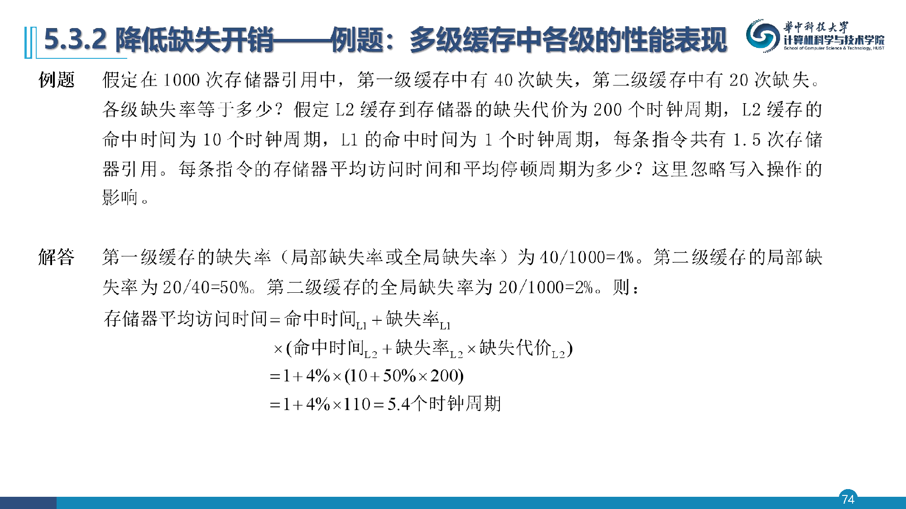

---

<!-- _layout: image -->

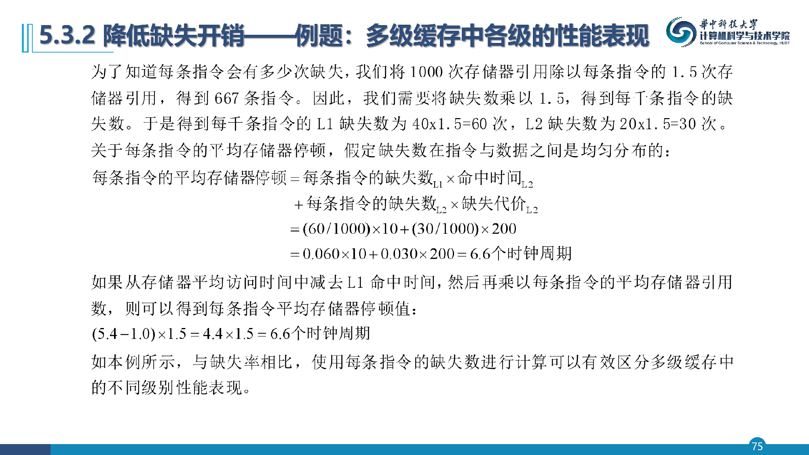

---

## 第二级 Cache 的设计

对于第二级 Cache：
- 在第二级 Cache 比第一级大得多的情况下，两级 Cache 的全局不命中率与和第二级 Cache 相同的单级 Cache 的不命中率非常接近
- 局部不命中率不是衡量第二级 Cache 的好指标
- 第二级 Cache 不会影响 CPU 的时钟频率，设计有更大的考虑空间

**第二级 Cache 的参数：**
- **容量：** 一般比第一级大很多，可能几乎没有容量不命中
- **相联度：** 可采用较高相联度
- **块大小：** 可采用较大块（如 64、128、256 字节）
- **多级包容性：** 第一级 Cache 中的数据是否总是同时存在于第二级 Cache 中？

---

## 第二级 Cache 的参数

- **容量：** 第二级 Cache 的容量一般比第一级大许多，大容量意味着可能几乎没有容量不命中
- **相联度：** 可采用较高的相联度
- **块大小：** 可采用较大块，如 64、128、256 字节

需要考虑的另一个问题：**多级包容性**
- 第一级 Cache 中的数据是否总是同时存在于第二级 Cache 中？

---

## 写缓冲器与地址转换

**Cache 中的写缓冲器**导致对存储器访问的复杂化：
- 读不命中时，所读单元的最新值有可能还在写缓冲器中，尚未写入主存
- **解决方法：** 推迟对读不命中的处理，或检查写缓冲器中的内容

---

<!-- _layout: image -->

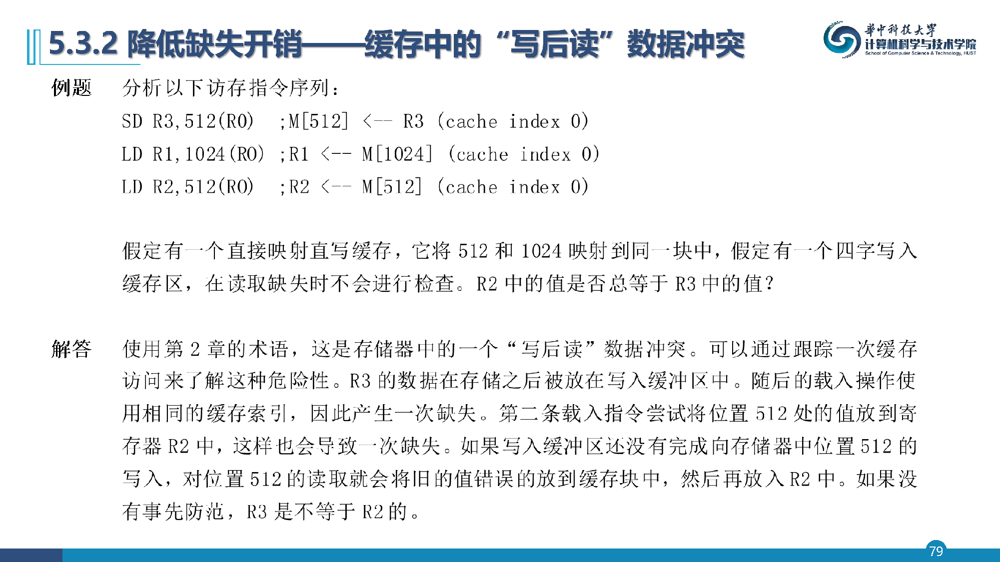

---

## 命中时间与 Cache 设计

**命中时间直接影响到处理器的时钟频率。** 在当今许多计算机中，Cache 的访问时间限制了处理器的时钟频率。

- **容量小、结构简单的 Cache：** 硬件越简单，速度就越快。应使 Cache 足够小，以便可以与 CPU 一起放在同一块芯片上
- **折衷方案：** 把 Cache 的标识放在片内，而把 Cache 的数据存储器放在片外

---

## 物理 Cache 与虚拟 Cache

**物理 Cache：** 使用物理地址进行访问的传统 Cache，标识存储器中存放物理地址，缺点是地址转换和访问 Cache 串行进行，访问速度慢。

**虚拟 Cache：** 可以直接用虚拟地址进行访问的 Cache，优点：
- 命中时不需要地址转换，省去了地址转换的时间
- 即使不命中，地址转换和访问 Cache 也可以并行进行

---

## 虚拟 Cache 的问题

**并非都采用虚拟 Cache：**
- **清空问题：** 进程切换时需要清空 Cache。解决方法：在地址标识中增加 PID 字段（进程标识符）
  - PIDs 与单进程相比：+0.3%～+0.6%
  - PIDs 与清空相比：-0.6%～-4.3%
- **同义和别名：** 多个虚拟地址指向同一物理地址。解决方法：反别名法、页着色

---

## Cache 优化技术总结

| 技术 | 命中时间 | 缺失代价 | 缺失率 | 硬件复杂度 | 备注 |
| --- | --- | --- | --- | --- | --- |
| 增大块大小 |  | - | + | 0 | 微小，Pentium 使用 128 字节 |
| 增大缓存 | - |  | + | 1 | 广泛应用，特别是对 L2 缓存 |
| 提高相联度 | - |  | + | 1 | 广泛应用 |
| 采用多级缓存 |  | + |  | 2 | 昂贵硬件，广泛应用 |
| 读操作优先于写操作 |  | + |  | 1 | 广泛应用 |
| 避免在缓存索引期间进行地址转换 | + |  |  | 1 | 广泛应用 |

> "+" 表示改进，"-" 表示负面影响，空白表示没有影响。

---

## 虚拟存储器

虚拟存储器是"主存—辅存"层次进一步发展的结果，分为两类：
- **页式虚拟存储器：** 把空间划分为大小相同的块
- **段式虚拟存储器：** 把空间划分为可变长的块

页面是对空间的机械划分，而段则按程序的逻辑意义进行划分。

虚拟地址空间与物理地址空间的对应关系。

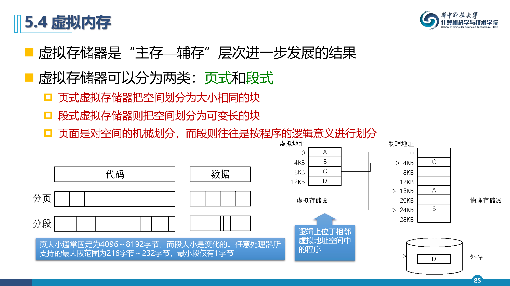

---

## 缓存与虚拟存储器的参数对比

| 参数 | 第一级缓存 | 虚拟内存 |
| --- | --- | --- |
| 块（页）大小 | 16～128 字节 | 4096～65536 字节 |
| 命中时间 | 1～3 时钟周期 | 100～200 时钟周期 |
| 缺失代价 | 8～200 时钟周期 | 10⁶～10⁷ 时钟周期 |
| 访问时间 | 6～160 时钟周期 | 8×10⁵～8×10⁶ 时钟周期 |
| 缺失率 | 0.1%～10% | 0.00001%～0.001% |
| 地址位数 | 缓存地址：14～20 | 虚拟地址：32～64 |

---

## 缓存与虚拟存储器的其他区别

- 发生缓存缺失时的替换主要由硬件控制，而虚拟存储器替换主要由操作系统控制
- 处理器地址的大小决定了虚拟存储器的大小，但缓存大小与处理器地址大小无关
- 除了在层次结构中充当主存储器的低一级后援存储之外，辅助存储还用于文件系统

---

## 虚拟存储器的四个基本问题

**块可以放在主存储器的什么位置？**
- 虚拟存储器的缺失代价涉及外存储设备的访问，代价非常高

**如果一个块在主存储器中，如何找到它？**
- 分页和分段都依靠按页号或段号索引的数据结构（页表项）

**在虚拟存储器缺失时应当替换哪个块？**
- 操作系统的最高指导原则是将页错误降至最低，几乎所有操作系统都采取 LRU

**在写入时发生了什么？**
- 上下两级存储器在访问时间上存在巨大差异，总采用写回策略

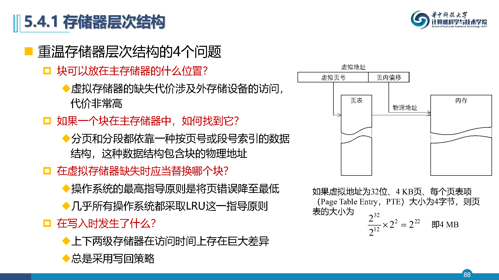

---

## 地址变换缓冲器（TLB）

**TLB：** 专用高速缓冲器，用于存放近期经常使用的页表项，其内容是页表部分内容的副本，也利用了局部性原理。

**TLB 中的项由两部分构成：**
- **标识：** 存放虚地址的一部分
- **数据：** 存放物理页帧号、有效位、存储保护信息、使用位、修改位等

---

## TLB 的组织结构（AMD Opteron）

AMD Opteron 的数据 TLB 包含 40 个项，采用全相联映象。地址转换过程：
1. 用虚拟地址的虚页号查找 TLB
2. 并行与所有 40 个标识比较
3. 匹配后输出物理页帧号

一般 TLB 比 Cache 的标识存储器更小、更快，保证 TLB 的读出操作不会使 Cache 的命中时间延长。

---

## 页大小的选择

页大小的选择即偏向较大页与偏向较小页之间的平衡：

- 页表的大小与页大小成反比，增大页的大小可以节省存储器
- 分页较大时，可以允许缓存命中时间较短的较大缓存
- 传递较大页的效率更高（尤其通过网络）
- TLB 项目的数量受限，分页较大意味着可以高效地映射更多存储器，降低 TLB 缺失数量

---

## 附录内容

附录 E 进一步介绍了内存系统相关的高级内容：
- 延伸 5.3.3 节：避免在索引缓存期间进行地址转换以缩短命中时间（附录 E.1）
- 缓存优化小结（附录 E.2）
- 虚拟存储器和缓存（附录 E.3）

---

<!-- _layout: image -->

