<!-- _class: lead -->

# 外存系统

**计算机系统结构**

---

## 本章内容

- **掌握存储设备特性及其存储系统层次性结构**
- **理解输入/输出过程及处理方式**
- **掌握存储可靠性概念及提升方式**
- **掌握磁盘阵列概念、分类和特点**
- **掌握存储系统结构和处理过程**

---

## 外存系统的必要性

- 内存容量有限、单位存储成本较高、掉电后数据会丢失
- 外部存储系统（外存系统，Storage System）持久化、低成本、可靠地保存大量数据
  - 外存介质、外存设备和外存系统
- 处理器不能直接访问外存，需要通过输入/输出（I/O）机制
  - 由硬件和软件协作完成 I/O 过程和数据管理

---

## 存储系统的层次性

完整的计算机存储系统包含内存和外存。从处理器角度从内至外可分为多个层次：寄存器 → Cache → 内存 → 固态盘/磁盘/光盘 → 磁带/光盘/网络存储。

**存储系统层次化的主要原因：** 满足成本约束的情况下，平衡存储容量和性能，使容量和成本接近最下层，而性能接近最上层。

**存储层次化的不利之处：** 必须设计复杂的数据管理机制以保证数据正确地在不同层次间上下流动。

---

## 数据量的增长趋势

IDC 预测 2020 年全球累计产生的数据总量已经达到 64.2 ZB，并且在 2020 年至 2025 年间仍将以约 23% 的年均复合增长率继续增长，2025 年数据量达到 175 ZB。

2018 年到 2025 年，所有存储设备的总出货量必须超过 22 ZB，大约 59% 的存储容量来自磁盘，大约 26% 的存储容量来自固态盘。

---

## 存储设备特性对比

| 存储特性 | 磁盘 | 闪存固态盘 | 非易失性内存 |
| --- | --- | --- | --- |
| 容量（GB） | 10³～10⁴ | 10²～10³ | 10¹～10² |
| 物理寻址单元（Byte） | 512 | 10³～10⁴ | 8～64 |
| 企业级成本（元/GB） | 0.3 | 2 | 70 |
| IO 带宽（IOPS） | 10² | 10⁴～10⁶ | 10⁴～10⁸ |
| 峰值带宽（MB/s） | 10² | 10²～10³ | 10³～10⁴ |
| 单读 IO 延迟（微秒） | 10⁴ | 10～10² | 10⁻²～10⁻¹ |
| 单写 IO 延迟（微秒） | 10⁴ | 10²～10³ | 10⁻¹～1 |
| 存储单元更新次数 | ∞ | 10²～10⁶ | 10⁶～10⁸ |
| 接口类型 | SATA/SAS | SATA/PCIe/NVMe | 内存总线 |
| 设备类型 | 块设备 | 块设备 | 内存设备 |
| 随机 IO 性能 | 低 | 高 | 高 |
| IO 并行度 | 低 | 中、高 | 高 |
| 读写对称性 | 对称 | 写代价高 | 写代价高 |

---

## 非易失性内存介质

多种物理存储材料：
- 相变存储器（PCM）
- 自旋转移扭矩随机存取存储器（STT-RAM）
- 阻变存储器（RRAM）
- Intel 傲腾持久内存模块（PMM）

**PMM 的特点：**
- 被插在内存总线上，连接到处理器的集成内存控制器（iMC）
- 访问粒度为 256 字节（XPLine）
- 多个 PMM 设备配置成交错模式，构成更大的存储体
- 可配置成内存模式（Memory mode）或应用直接访问模式（App Direct mode）

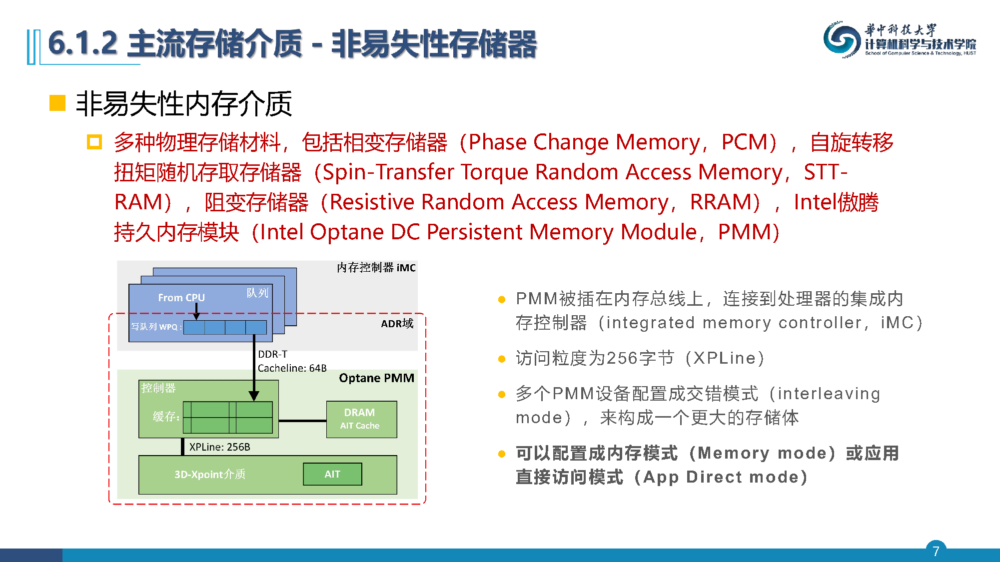

---

## 固态硬盘（闪存 NAND Flash）

闪存颗粒中的数据由保存在每个闪存单元中的电荷电压表示。不同类型的闪存单元可存储不同数量比特：

- **SLC（单层单元）：** 存储 1 位
- **MLC（两层单元）：** 存储 2 位
- **TLC（三层单元）：** 存储 3 位
- **QLC（四层单元）：** 存储 4 位

闪存单元一次注入电子（写操作）之后，在完全释放所存电子之前（擦除操作）不能再次注入，因此闪存固态盘**不能原地更新**。此外浮栅门开关次数有限，存在擦写寿命（P/E 次数）。层阶越高，P/E 次数越低。

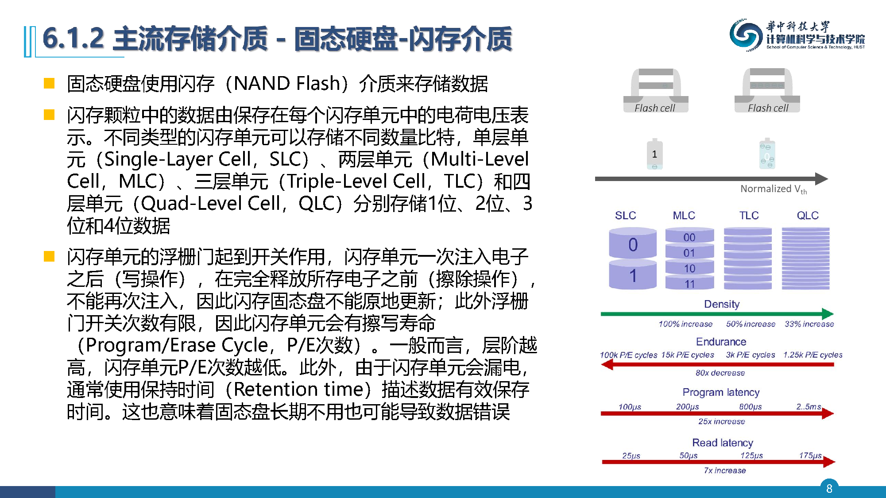

---

## 固态硬盘的内部结构

SSD 内部包含多个闪存芯片（Chip），每个芯片包含一个或多个逻辑单元（Die），每个逻辑单元进一步包含一个或多个闪存平面（Plane），闪存平面被划分为上千个闪存块（Block），一个块进一步被划分为几百个闪存页（Page）。

- **块：** 基本擦除单位
- **页：** 基本读写单位

闪存页在被写之前必须先擦除，擦除操作一次必须擦除一整个闪存块。有效数据必须被迁移到其他块中的空闲页上，称之为**垃圾回收（GC）**。

**闪存转换层（FTL）** 负责 I/O 请求处理，实现用户逻辑块地址（LBA）到固态盘内部物理块地址的映射，并执行磨损均衡和垃圾回收等功能。

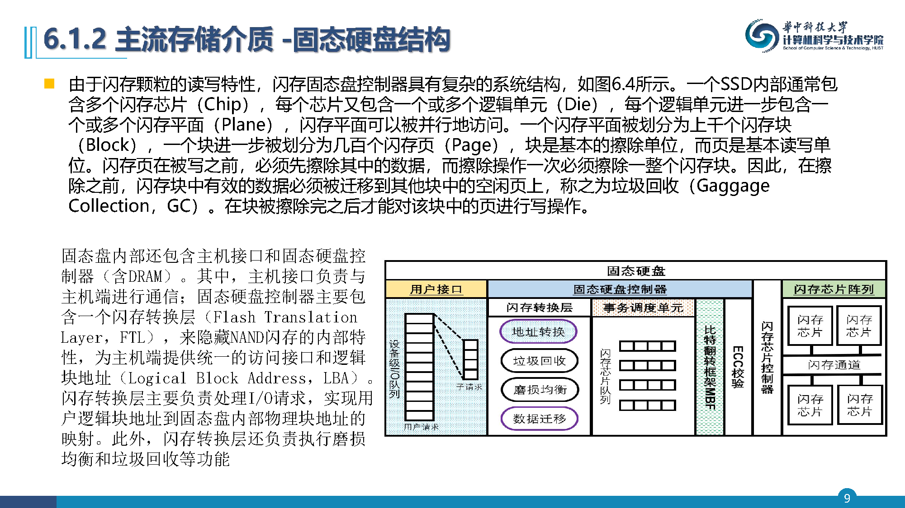

---

## 机械硬盘

机械硬盘主要由磁盘盘片、磁头、主轴与传动轴等组成。

- 一块机械硬盘包含多个盘片，每个盘片有两个面，每个盘面都有一个读/写磁头
- 每个盘面被划分成一个个磁道，每个磁道进一步被划成相同数量的扇区
- **扇区是硬盘的最小物理读写单位，通常是 512 字节**
- 每个磁片上的相同磁道构成一个圆柱面
- 主轴马达保持盘片匀速转动

**磁盘处理一个读写 I/O 时，总延迟包括：**
- 磁头寻道延迟
- 盘片旋转延迟
- 数据传输延迟

读写同一磁道上数据，可避免额外的寻道时间。

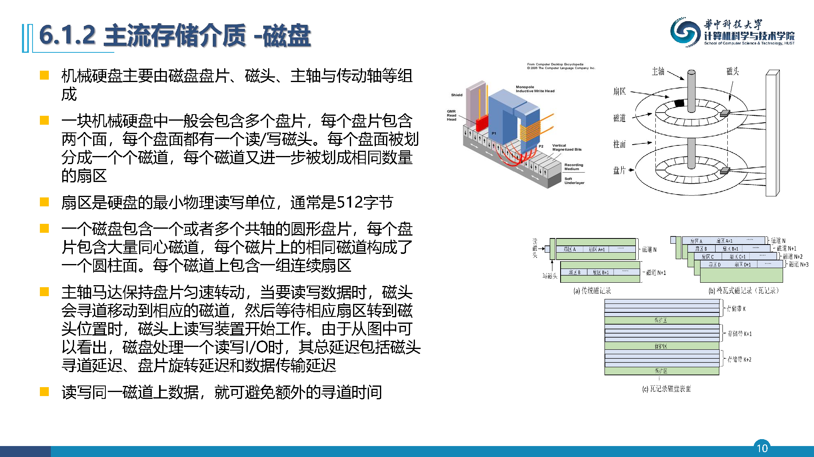

---

## 磁盘访问时间计算

**例题：** 对于磁盘而言，读写一个 512 字节扇区的平均磁盘访问时间是多少？假设此时磁盘空闲，没有排队延迟；平均寻道时间是 5ms，顺序传输速度是 200MB/s，转速是 7200 转/分，控制器的开销是 0.1ms。

**解答：**

$$\text{平均磁盘访问时间} = \text{平均寻道时间} + \text{平均旋转延迟} + \text{传输时间} + \text{控制器开销}$$

$$= 5 + \frac{0.5}{7200} + \frac{0.5}{200} + 0.1 = 5 + 4.2 + 0.0025 + 0.1 = 9.3 \text{ ms}$$

---

<!-- _layout: image -->

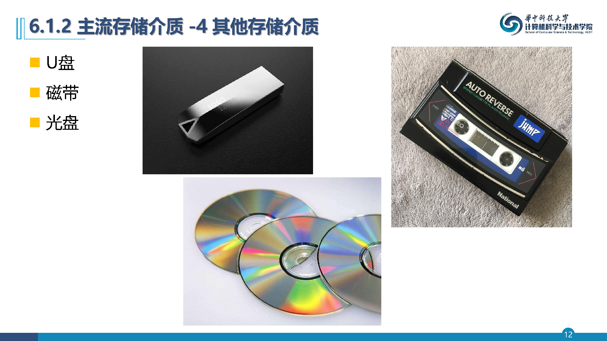

---

## I/O 系统概述

处理器和外部设备交换数据，不能像存取内存一样通过指令直接寻址访问，而是需要执行输入/输出（I/O）操作。I/O 过程需要硬件和软件的协同处理。

- **I/O 硬件：** 包括主机处理器、I/O 设备、两者之间的物理通道（如总线）和 I/O 控制硬件等
- **I/O 软件：** 负责协调多个硬件部件完成 I/O 过程的程序，包括驱动程序等

---

## I/O 设备与总线

**I/O 设备分成两类：**
- **块设备（block devices）：** 存取数据的单位是固定大小、可寻址的块，如磁盘、固态盘、蓝光光盘、USB 盘等
- **字符设备（character devices）：** 以字符为单位发送或接收一个字符流，不考虑寻址，如打印机、键盘和鼠标等

**主机对所有设备进行统一编址：**
- **Port-Mapped I/O：** 独立的设备地址空间
- **Memory-Mapped I/O：** 统一内存地址映射方式

设备可以看成一个"I/O 处理器"，接收并处理主机发出的 I/O 请求。

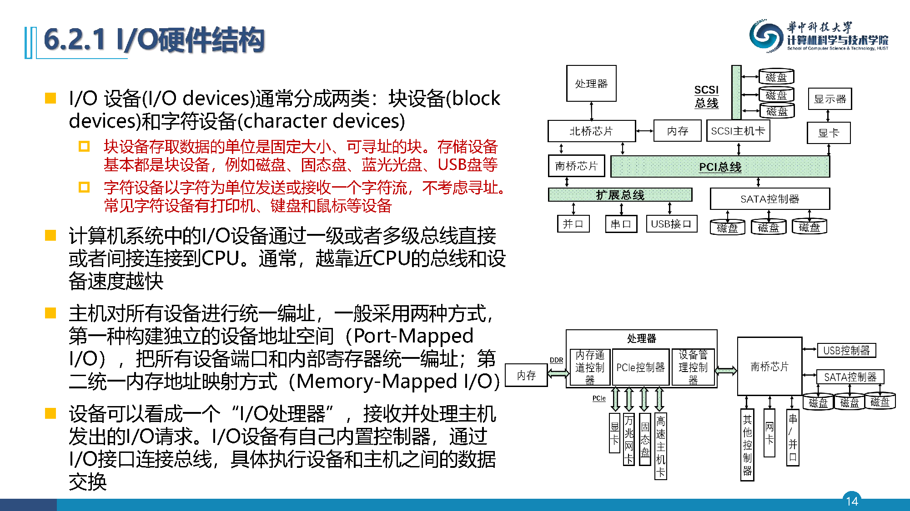

---

## PCIe 总线

PCIe 是目前最为流行的高速总线，包含一个根组件（Root Complex）、多个终端点（End Point）和多个数据通道（lane）。一对根端口和终端点组成一个点对点连接对。

PCI 是并行总线，排线频率提升困难；PCIe 采用串行总线方式。PCIe 使用交换组件（Switch）扩展连接更多终端点，还可以通过桥接芯片扩展连接到更多慢速总线。

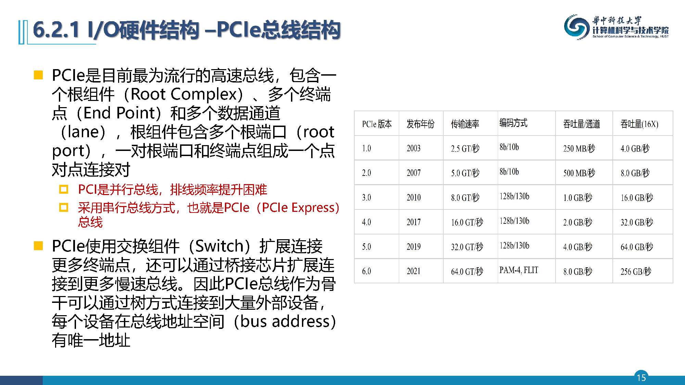

---

## 设备驱动程序与 I/O 模式

主机通过设备驱动程序具体执行 I/O 过程，通过设置寄存器来和设备进行通讯。

**三种 I/O 过程模式：**
- **程序控制 I/O**
- **中断驱动（Interrupts）I/O**
- **直接内存存取（DMA）驱动 I/O**

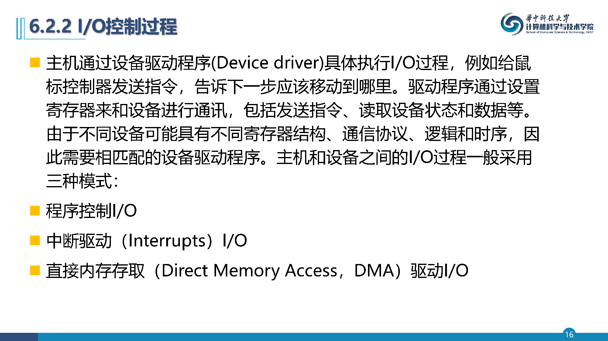

---

## I/O 处理模型

I/O 处理是 CPU 和设备之间的交互处理过程，可以抽象为请求-服务模型或客户端-服务器模型。

**从请求程序来看：** I/O 请求可以分为同步 I/O 和异步 I/O 模式

**从服务程序来看：** 有阻塞 I/O 和非阻塞 I/O 两种方式

**5 种常用 I/O 处理模型：**
- 同步阻塞 I/O 模型
- 异步阻塞 I/O 模型
- 同步非阻塞 I/O 模型（同步轮询模型）
- 非阻塞 I/O 复用模型
- 非阻塞信号驱动 I/O 模型

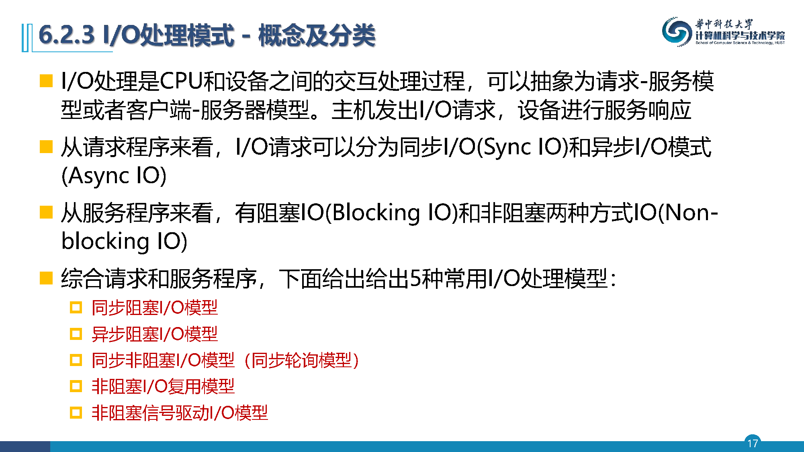

---

## 缓冲区、缓存与请求队列

**数据缓冲区（Buffer）：** 当两个设备之间有明显的速度差异（如 CPU 和磁盘）时，可以配置缓冲区。慢速设备把缓冲区写满后，会一次全部发送到快速设备。为了保证设备持续写入，可以使用双缓冲区。

**缓存（Cache）：** 利用不同存储介质之间的性能差异和访问局域性，把数据副本保存在比通常存储数据位置更快的访问位置。

**请求队列：** 服务程序可以服务多个请求程序，可以使用请求队列维护待请求，进一步执行队列调度优化整体性能。

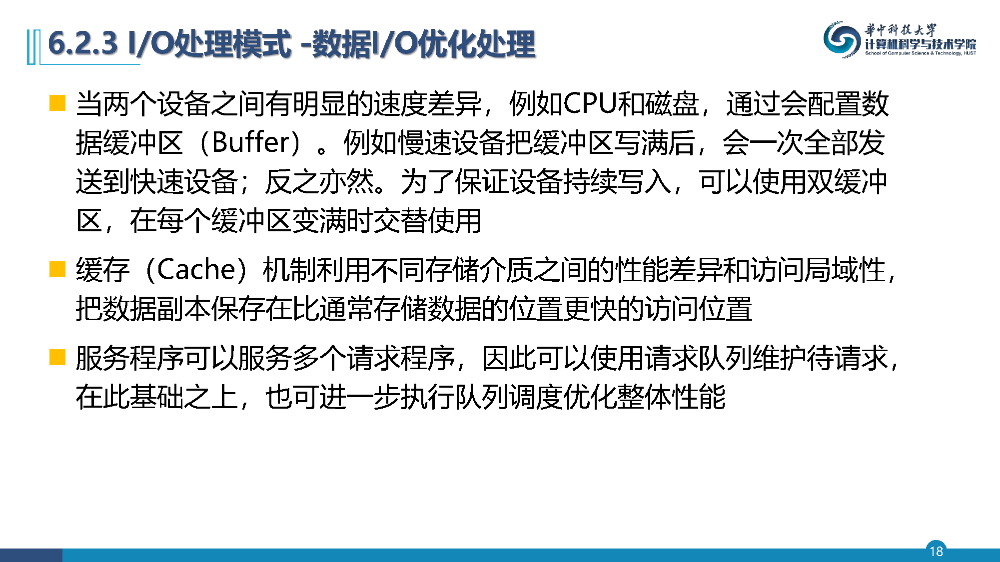

---

## I/O 性能指标

响应时间和吞吐量同样适用于 I/O，这两个指标往往具有一个平衡关系。

**吞吐率指标：I/O 数（IOPS）和 MByte/s**

**例题：** I/O 系统具有单个磁盘，读写带宽为 200MB/s。测试结果表明 1MB 大小的请求响应时间是 5ms，0.1MB 大小的请求响应时间为 2ms。

- 1MB IOPS = 200 个；0.1MB IOPS = 500 个
- 1MB 吞吐率 = 200×1MB/s = 200MB/s（磁盘带宽 100% 利用）
- 0.1MB 吞吐率 = 500×0.1MB/s = 50MB/s（磁盘带宽仅 25% 利用）

**IOPS 数值不能很好地反映实际的性能。**

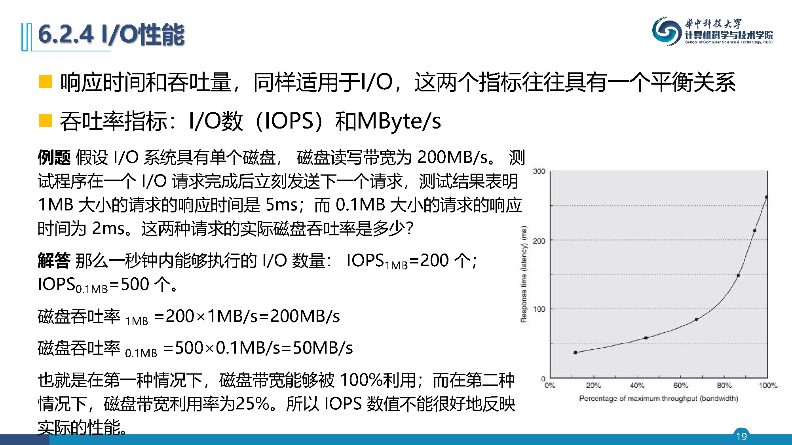

---

## 排队论基础

构建数学模型来粗略计算请求-服务模型系统的响应时间和吞吐率，这种数学模型称之为**排队论**。

**Little 定律：** 建立平均任务数、新任务的平均到达率和执行任务的平均时间之间的关系：

$$\text{平均任务数} = \text{任务到达率} \times \text{平均响应时间}$$

Little 定律适用于任何处于平衡状态的系统，只要系统内部不会创建或删除任务，并且有不受响应时间影响的稳定任务达到。

---

## 排队论核心概念

- **服务时间（Time_server）：** 服务任务的平均时间；平均服务费率为 1/服务时间
- **排队时间（Time_queue）：** 队列中的平均排队时间
- **响应时间（Time_system）：** 排队时间和服务时间的总和 = Time_queue + Time_server
- **任务到达率（Arrive rate）：** 任务到达的平均数量/秒
- **服务任务数量（Length_server）：** 正在服务中的平均任务数
- **队列长度（Length_queue）：** 队列的平均长度

**服务器利用率** = Arrival_rate × Time_server

服务利用率必须在 0 到 1 之间；否则服务装置将会过载。

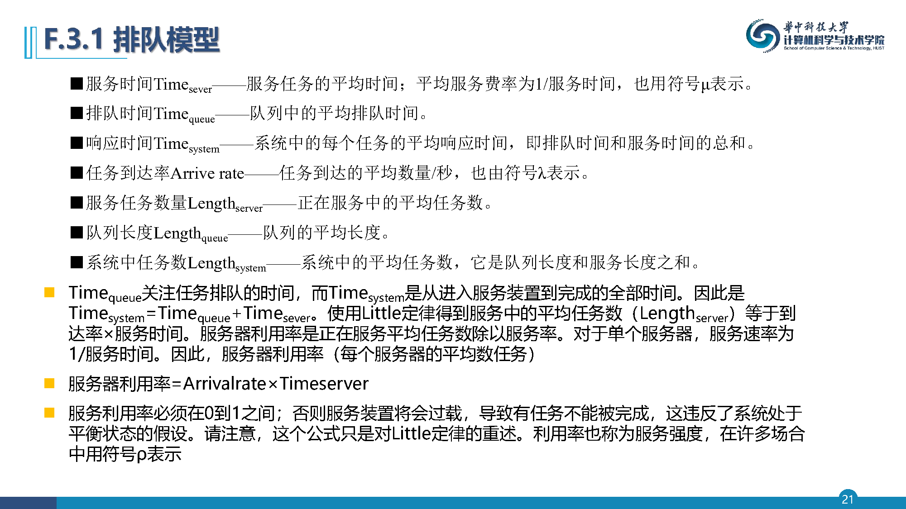

---

## 请求服务分布类型

- 常数分布
- 指数分布
- 正态分布
- 二项式分布

---

## 排队队列与利用率

在稳态情况下，Little 定律能够很好地利用到黑盒服务器模型：

$$\text{Length}_{queue} = \text{到达率} \times \text{Time}_{queue}$$

由于 $\text{到达率} \times \text{Time}_{server} = \text{服务器利用率}$，进一步简化得到：

$$\text{Length}_{queue} = \frac{\text{服务器利用率}^2}{1 - \text{服务器利用率}}$$

排队情况和服务器利用率之间的关系符合直觉：任务越多，排队越长。

---

## M/M/1 排队模型

**模型假设：**
- 系统处于平衡状态
- 到达间隔时间满足指数分布
- 请求源的数量不受限制（无限队列）
- 服务器串行执行任务
- 队列长度没有限制，遵循先进先出原则
- 只有一台服务器

**M/M/1 模型：** 第一个 M 指请求到达间隔时间分布满足指数随机分布；第二个 M 指服务时间分布也是指数分布；1 代表只有一个服务器。

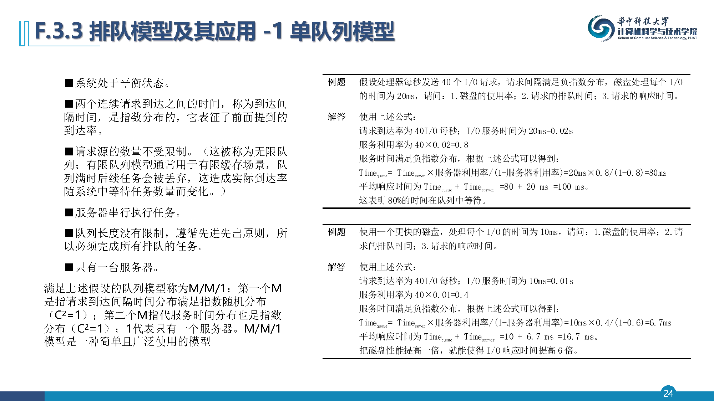

---

<!-- _layout: image -->

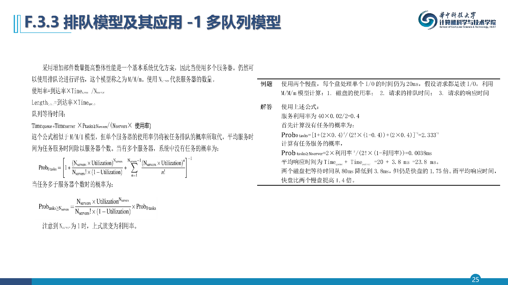

---

## 存储可靠性概述

存储设备是数据持久化载体，其首要功能就是保证数据不丢失。对数据进行有效的保护已成为存储系统最为关键的要求。

当计算和传输设备产生错误时，可以通过重新计算或重传保证数据可靠性，但前提是相应的数据应该保存完好。

---

## 可靠性基本概念

**出错原因：**
- **错误（fault）：** 设计时模块所存在的潜在问题
- **差错（error）：** 错误的表现形式，在服务时才会表现出来
- **故障（failure）：** 差错导致模块不工作

**可靠性量化指标：**
- 可靠度（R）、可维护度、可用品度
- MTTF（平均无故障时间）
- MTTR（平均修复时间）
- MTBF（平均故障间隔时间）

$$\text{可靠度：} R(t) = P\{x>t\}, \quad \text{MTTF} = \int_0^\infty R(t) dt$$

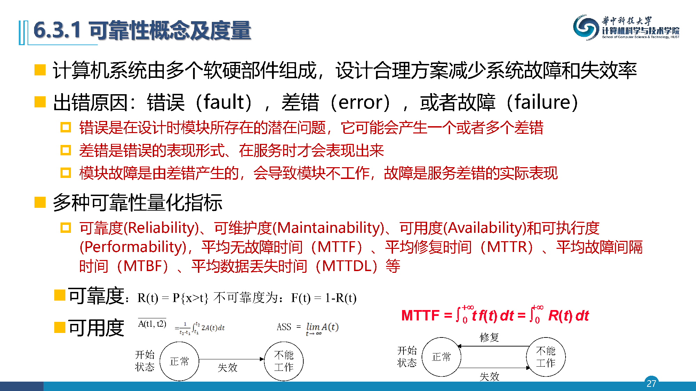

---

## 可用性与 MTTF 提升方法

**系统可用性（Availability）** 定义为系统可以为用户所使用时间的百分比。

**提高 MTTF 的四种方法：**
- 避错（Fault Avoidance）
- 容错（Fault Tolerance）
- 除错（Error Removal）
- 差错预测（Error Forecasting）

---

## 串行与并联系统可靠性

**串联系统：** N 个组件必须全部工作正常，系统才正常。任一组件失效时，系统就失效。

$$R = R_1 \cap R_2 \cap \dots \cap R_N$$

**并联系统：** N 个组件只要其中一个工作正常，系统就正常工作。只有全部组件都失效时，系统才失效。

$$F = F_1 \cap F_2 \cap \dots \cap F_N$$

**串并联系统的可靠性：** n 个部件先构成串联组件，m 个组件进一步构成并联结构。

$$R(t) = 1 - [1 - R_i(t)]^{m \cdot n}$$

**并串联系统的可靠性：**

$$R(t) = [1 - (1 - R_i(t))^m]^n$$

计算机系统中器件越多，可靠性越低：N 器件的可靠性一般只有单个器件的 1/N。

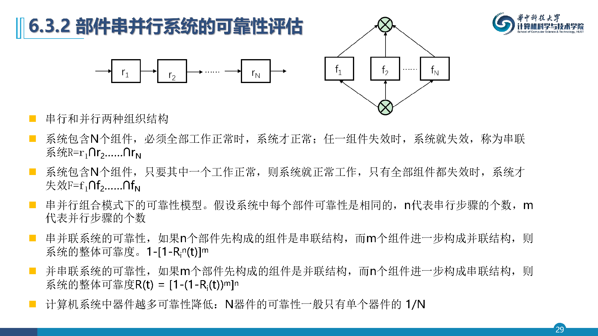

---

## 容错机制

容错机制成为存储系统提高系统可用性的主要方法：

- **副本技术：** 保存数据的多个副本
- **纠删码技术：** 分为系统码和非系统码
  - 任意 r 个数据分块丢失均能够通过存活的数据和校验分块解码出丢失数据
  - 最大纠错上限为 $2t$，符合 MDS（Maximum Distance Separable）条件的纠删码称为最大距离可分码
  - 里德-所罗门（Reed-Solomon，RS）编码是典型代表

---

<!-- _layout: image -->

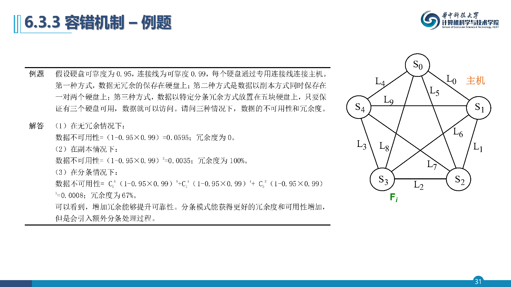

---

## 磁盘阵列（RAID）概述

**RAID（Redundant Array of Inexpensive/Independent Disks）：** 使用多个磁盘的组合来代替一个大容量的磁盘。

**基本原理：**
- 以条带为单位把数据均匀地分布到多个磁盘上，让多个磁盘并行工作
- 当多个数据读写请求并行处理，总的 I/O 性能提高
  - 如果一个请求访问多个块，可由多个盘合作并行处理，提高数据传输率
  - 多个独立的请求可由多个盘并行处理，减少 I/O 请求的排队等待时间

---

## RAID 的条带化

条带中数据块是交叉存放的单位。数据块大小可初始时配置，对性能有直接影响：
- 数据块小于磁盘和主机交换数据的单位可能造成 I/O 放大
- 数据块太大，磁盘间并行性难以利用

**冗余数据的计算方法：**
- 大多采用奇偶校验码
- 也可采用汉明码（Hamming code）或 Reed-Solomon 码

**冗余信息的存放方式：**
- 集中存放在少数的几个盘中
- 均匀存放到所有的盘中（能避免出现热点问题）

---

## RAID 级别总览

| 级别 | 名称 | 特点 |
| --- | --- | --- |
| RAID 0 | 条带化 | 数据分割，无容错能力 |
| RAID 1 | 镜像 | 双拷贝，冗余备份 |
| RAID 2 | 汉明码 | 并行位交叉，单校验盘 |
| RAID 3 | 奇偶校验 | 并行块交叉，单校验盘 |
| RAID 4 | 块交叉奇偶校验 | 独立，循环校验盘 |
| RAID 5 | 分布式奇偶校验 | 块交叉，分布式校验 |
| RAID 6 | 双校验 | P+Q 双校验，可容双盘错 |
| RAID 10 | RAID 1+0 | 先镜像再条带存放 |

---

## RAID 0

**非冗余磁盘阵列：** 把数据切分成条带，以条带为单位交叉地分布存放到多个磁盘中。

**优点：** 空间利用率高；读写快；设计简单

**缺点：** 没有容错能力

---

## RAID 0 的读写与故障

- **写入：** 数据条带化分布到各磁盘，并行写入
- **读取：** 可从多盘并行读取数据
- **故障：** 任一磁盘损坏，数据无法恢复

---

## RAID 1（镜像）

**镜像磁盘：** 对所有磁盘数据提供一份冗余的备份。每当把数据写入磁盘时，将该数据也写入其镜像盘。

**RAID 1 特点：**
- 能实现快速读取操作
- 写入操作时镜像的两个磁盘都要写入，但可并行进行，不需要计算校验信息，速度比更高级别 RAID 快
- 可靠性高，数据恢复简单
- **实现成本最高**

---

## RAID 1 的读写与恢复

- **写入：** 同时向数据盘和镜像盘写入
- **读取：** 可从任一副本读取
- **恢复：** 任一盘损坏，从镜像盘恢复即可

---

## RAID 2（汉明纠错码）

存储器式的磁盘阵列（按汉明纠错码的思路构建）。含 4 个数据盘，配合专用纠错码盘（汉明码）。

**汉明纠错码原理（7/4 码）：**

$$h_0 = b_0 \oplus b_1 \oplus b_3$$
$$h_1 = b_0 \oplus b_2 \oplus b_3$$
$$h_2 = b_1 \oplus b_2 \oplus b_3$$

通过校验位可以检测并定位单比特错误。

---

## RAID 3（位交叉奇偶校验）

**交叉奇偶校验磁盘阵列：** 采用位交叉（条带宽度小）。

- 写数据时：为每行数据形成奇偶校验位并写入校验盘
- 读出数据时：根据故障盘以外的所有其他盘中的正确信息恢复故障盘中的数据（通过异或运算实现）
- 多个磁盘的并行访问，但不能同时进行多个 I/O 请求的处理
- 只需要一个校验盘，校验空间开销比较小

---

## RAID 4（块交叉奇偶校验）

**块交叉奇偶校验磁盘阵列：** 采用比较大的条带，以块为单位进行交叉存放和计算奇偶校验。实现目标：能同时处理多个小规模访问请求。

**RAID 4 读写特点：**
- **读取：** 每次只需访问数据所在的磁盘。仅在该磁盘出现故障时，才会去读校验盘，并进行数据重建
- **写入：** 写一块数据需要 2 次磁盘读和 2 次磁盘写操作

---

## RAID 4 写过程详解

写入新数据 A0' 到块 A0 的过程：

1. **读取旧数据 A0 和旧校验码 P**（读两次）
2. **计算新校验码：** $P' = A_0 \oplus P \oplus A_0'$
3. **写入新数据 A0' 和新校验码 P'**（写两次）

---

<!-- _layout: image -->

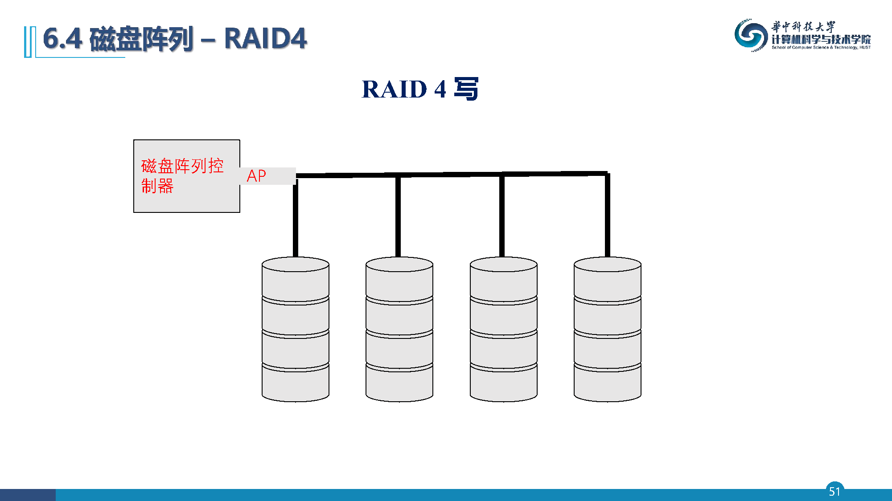

---

<!-- _layout: image -->

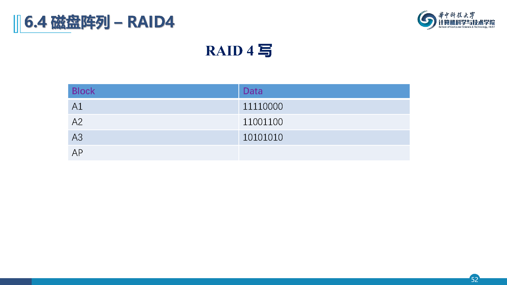

---

<!-- _layout: image -->

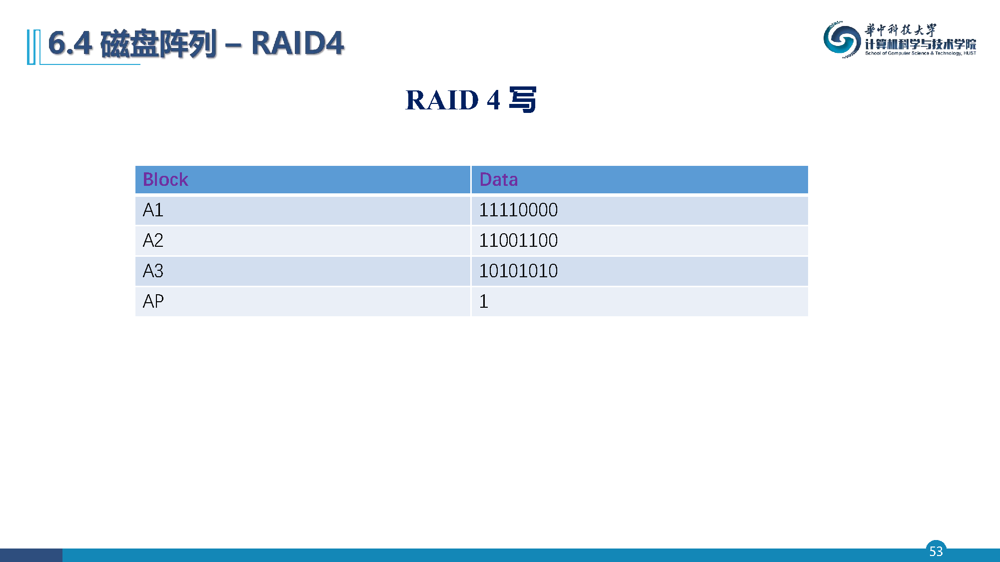

---

<!-- _layout: image -->

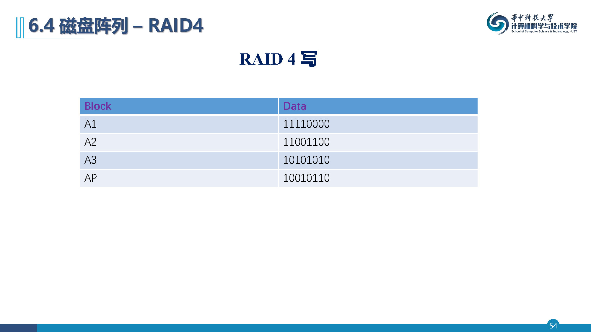

---

<!-- _layout: image -->

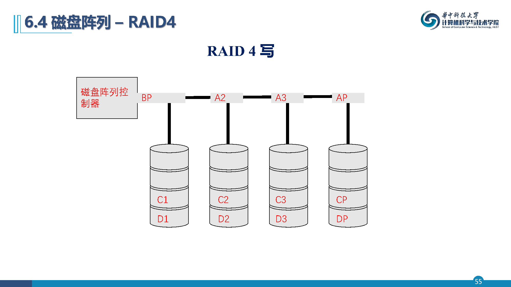

---

## RAID 5（块交叉分布式奇偶校验）

**块交叉分布奇偶校验磁盘阵列：** 数据以块交叉的方式存于各盘，无专用冗余盘，**奇偶校验信息均匀分布在所有磁盘上**。

相对于 RAID 4，校验块分散在所有盘上，避免了校验盘的写瓶颈。

---

<!-- _layout: image -->

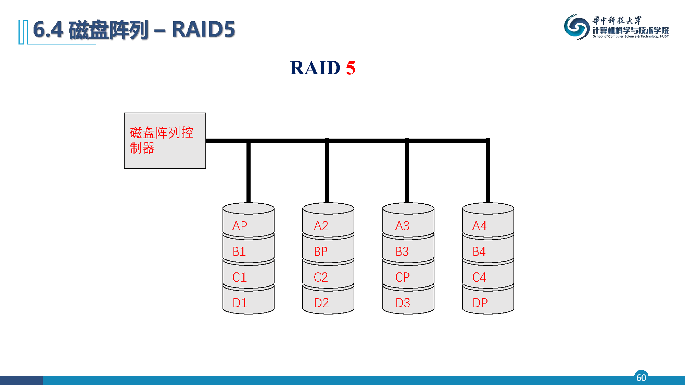

---

## RAID 6（P+Q 双校验）

- 相对于 RAID 5，增加了一个独立的第二个校验（Q）
- **校验空间开销是 RAID 5 的两倍**
- **可容忍两个磁盘出错**

---

## RAID 10 与 RAID 01

**RAID 10（RAID 1+0）：** 先进行镜像（RAID 1），再进行条带存放（RAID 0）

**RAID 01（RAID 0+1）：** 先进行条带存放（RAID 0），再进行镜像（RAID 1）

两者均具有容错能力，但组合方式不同导致性能和可靠性有所差异。

---

## RAID 实现方式

实现磁盘阵列的方式主要有三种：

- **软件方式（Linux MD）：** 阵列管理软件由主机实现。优点是成本低；缺点是占用主机时间
- **阵列卡方式：** RAID 管理软件固化在 I/O 控制卡上，不占用主机时间，一般用于服务器和 PC
- **专用磁盘阵列：** 基于通用接口总线的开放式平台，可被多个服务器同时存取

---

## 存储系统结构

存储系统不仅需要高性能 I/O 和可靠大容量存储，还需要提供数据存储组织管理的能力。应用程序可以通过标准接口方便存取海量数据。

**存储栈（Storage Stack）：** 应用数据请求逐层下发送到设备，之后再逐层向上响应请求。每层都执行特定的处理。

**两级存储空间映射：**
- **第一级：** 文件命名空间 → 逻辑存储空间（数据块/页空间）的映射
- **第二级：** 逻辑存储空间（卷/单元）→ 物理存储空间（存储设备/分区/单元）的映射

---

## 存储栈处理过程

1. 文件系统为用户和应用程序提供文件目录树视图，内部把文件/目录读写请求转化为逻辑块层请求
2. 逻辑块层向上提供统一数据块地址空间，内部把逻辑块请求转换为设备块 I/O 请求
3. 通用块层提供 I/O 合并、写吸收等 I/O 优化调度
4. 设备驱动层执行设备相关的优化，如针对磁盘的 I/O 调度方法
5. I/O 设备驱动程序执行物理 I/O，通过总线发送给设备端控制器
6. 设备控制器具体负责对其内部存储介质的数据读写

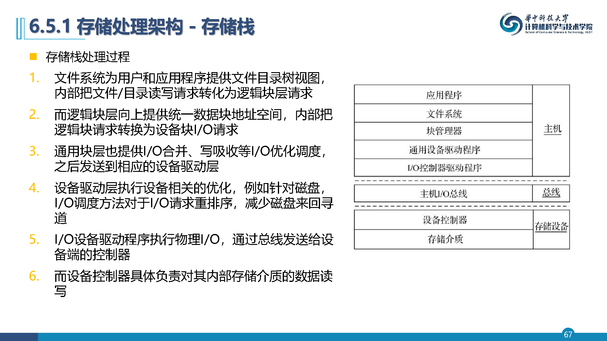

---

## Linux 本地存储结构

应用程序通过用户态标准 I/O 库调用标准文件接口存取文件数据，文件系统把文件请求转化为相应数据块读写操作，通过缓存层、块存储层和驱动层最终交给存储设备。

**存储栈各层：**
- **虚拟文件系统（VFS）层：** 提供通用文件存取接口，可同时接受多个文件操作请求
- **具体文件系统：** 处理文件请求转化为数据块存取
- **页缓存机制：** 加速数据块存取，提高性能

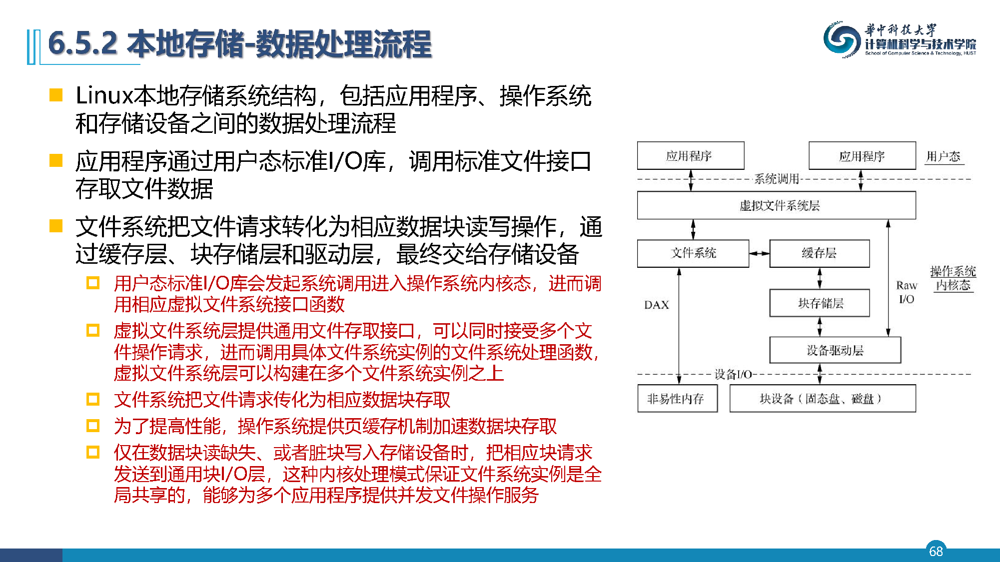

---

## 设备驱动程序

现代操作系统为每个设备提供设备驱动程序。驱动程序定义一组编程接口，隐藏设备的工作细节，将调用映射到物理设备的特有 I/O 操作上，包括对设备进行初始化、参数有效性检查、执行 I/O 过程、管理电源和日志等。

**驱动程序工作模式：**
- **阻塞模式：** 通过中断来解除阻塞状态
- **非阻塞模式：** 通过轮询检测完成信号，尽快响应请求完成

设备驱动必须可重入。

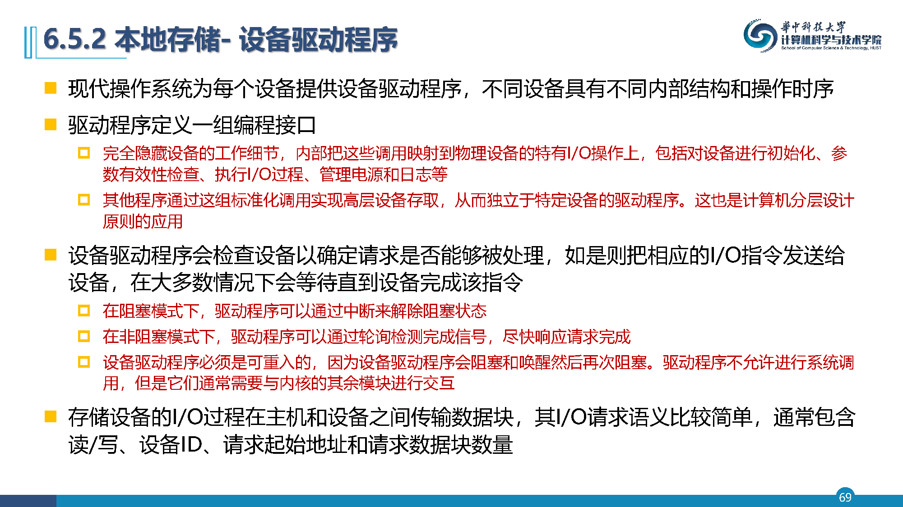

---

## 文件系统

文件系统和存储设备互为表里。文件系统是最重要的数据管理和存储系统，对应用程序提供文件/目录数据抽象及相应处理接口。

文件系统为应用提供文件/目录数据抽象及相应处理接口，内部维护文件逻辑空间到物理存储空间之间的映射，并执行数据处理操作，屏蔽底层存储特性和 I/O 过程。

**文件存取操作：** IEEE 制定的 POSIX 定义了文件级存取接口及其操作语义。

---

## 文件系统命名空间与块存储

**文件：** 具有独立逻辑地址空间的抽象数据容器。应用程序可以把数据序列化后保存到文件之中。

**文件目录：** 以文件和目录结构形式对外提供统一命名空间（通常是树形结构），有利于大量文件的组织和管理。

**块存储空间：** 由一组固定大小单元（Block）线性编址构成，固定单元也称为页、段等。

- CPU 访问内存是按字节编址
- 访问外存时，通过 I/O 请求中的间接寻址扩充可访问空间
- **LBA（Logical Block Address）** 是逻辑块地址
- **PBA（Physical Block Address）** 是物理块地址

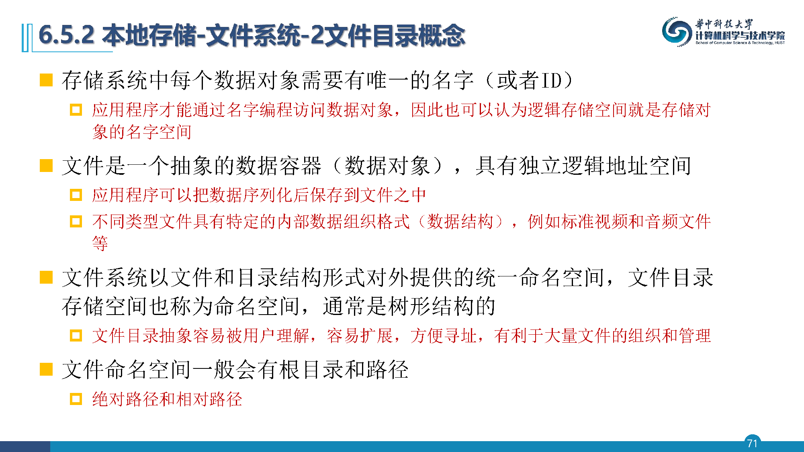

---

## 文件系统元数据

文件系统实现文件和文件目录结构到逻辑卷空间之间的映射。核心是一组数据结构（元数据）：

- **超级块：** 存储文件系统基本信息
- **存储分配表：** 记录磁盘块的使用情况
- **文件索引表（inode）：** 记录文件的属性和文件块到数据块索引结构

inode 中最重要的数据结构是实现**文件块→数据块**索引结构，即文件内部逻辑块地址到逻辑卷块地址映射。

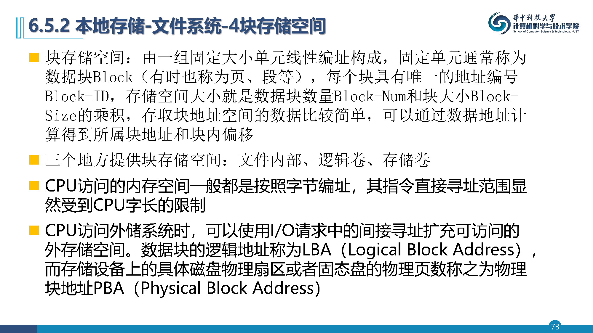

---

## 本地存储与网络存储结构

**DAS（Direct-Attached Storage）：** 在单机系统中，CPU 通过总线连接到物理存储设备，操作系统管理存储设备中的数据。受限于总线电气特性和带宽，不能连接过多存储设备。

**四种基本网络存储结构：**
- 存储区域网（SAN）
- 附网存储（NAS）
- iSCSI 存储
- 分布式文件系统

---

## NAS（附网存储）

NAS 是通过网络向用户提供文件级服务的存储服务器，将硬件和软件有机地集成在一起，为多个用户提供文件视图。

**优点：**
- 异构平台下的文件共享
- 充分利用现有局域网结构
- 容易安装、使用和管理
- 基于 IP/Ethernet 及标准 NFS/CIFS，可适应复杂网络环境
- 较低的总拥有成本

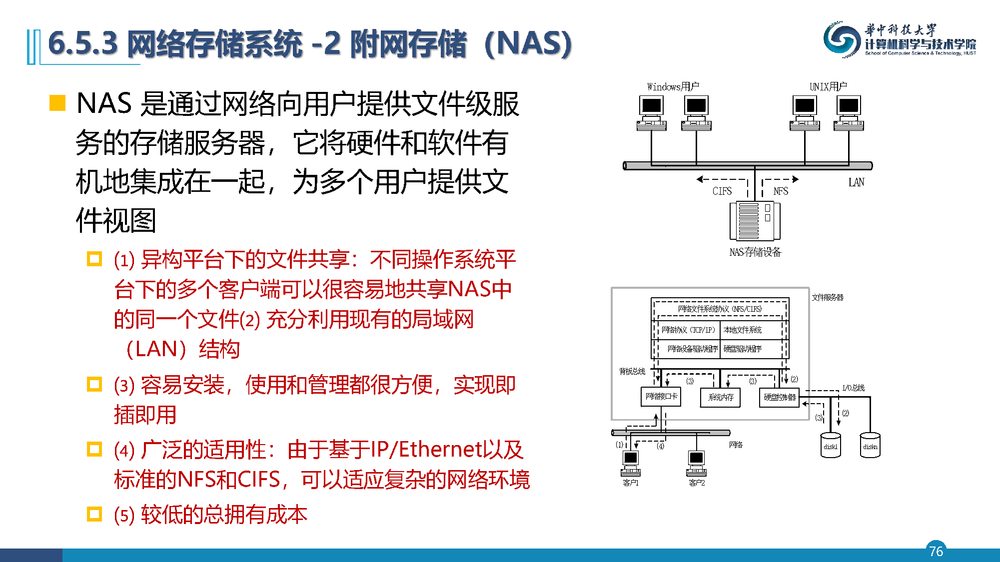

---

## SAN（存储区域网）

SAN 是一种以网络为中心的存储结构，利用专用网络（Fibre Channel）连接服务器和存储设备，直接传送 block I/O 数据。

**优点：**
- 高性能、高速存取（Infiniband 可提供 100 Gbps 带宽）
- 高可用性，具有更多冗余存储空间
- 集中存储和管理，形成统一的存储池
- 高可扩展性，服务器和存储设备相分离

**弱点：** 设备的互操作性较差，依赖专用网络协议。

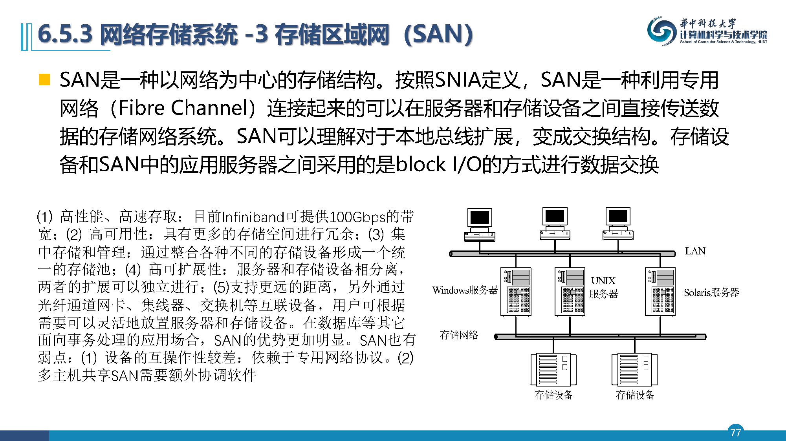

---

## iSCSI

iSCSI 在 TCP/IP 上封装 SCSI 存储协议，是一种基于 IP 的 SAN。采用 Initiator/Target 实现模式。

**工作流程：**
1. 应用程序通过系统调用访问文件系统
2. 文件系统解释 I/O 命令，发送给 SCSI 上层驱动程序
3. SCSI 驱动程序将 I/O 命令转化为 SCSI 命令，发给 iSCSI Initiator
4. iSCSI Initiator 把 SCSI 命令通过网络发送到 iSCSI Target
5. iSCSI Target 解析并执行命令，数据按原路返回

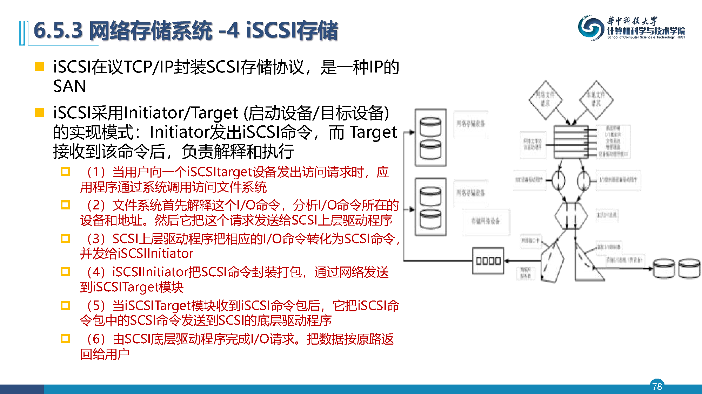

---

## 分布式存储系统

存储集群把多个存储节点、元数据服务器和客户服务器通过高速网络连接起来，通过元数据服务器对外提供统一命名空间。客户端从元数据服务器获取所请求文件的存储节点信息，然后直接存取相应的存储节点。

这种三方合作 I/O 模式，使存储集群具有良好的扩展性。存储集群通常使用**分布式文件系统**统一管理所有存储节点（如 Lustre、阿里盘古）。

---

## 数据存取路径

分析数据存取性能涉及许多具体细节，一个最为重要的方法是分析数据的存取路径。存取路径包括：

- **物理过程：** 数据在硬件部件上实际数据传输的过程
- **逻辑过程：** 软件对于数据的处理过程

存取路径是数据在存储系统中传递的通道，无论是读还是写过程都需要数据和命令的传输。

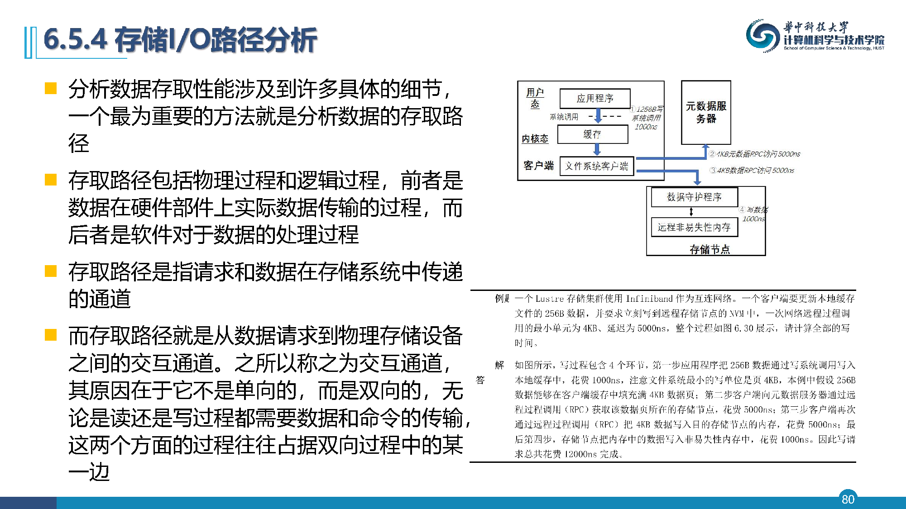

---

## 附录内容

附录 F 进一步介绍了外存系统相关的高级内容：
- 排队理论（附录 F.3）
- 可靠性概念及度量（附录 F.3.1）、容错机制（附录 F.3.2）
- 磁盘阵列实现（附录 F.4.1）
- 文件系统（附录 F.5.1）和网络存储系统（附录 F.5.2）

---

<!-- _layout: image -->

