<!-- _class: lead -->

# 数据级并行

**计算机系统结构**

---

## 本章内容

- **理解数据级并行概念及其实现分类**
- **掌握向量处理概念及实现方式**
- **掌握SIMD指令集概念及实现方式**
- **掌握图形处理单元概念体系及实现方式**
- **理解向量体系结构、多媒体扩展指令集和 GPU 的异同**

---

- **现实世界中，很多应用需要处理向量、矩阵和多维张量数据（统称为向量），包括科学计算、音视频多媒体处理、大数据处理、机器学习等**
- **针对向量的运算，能转化为多个内部分量的独立运算，分量之间具有天然的数据级并行度（Data Level Parallelism）**
- **SIMD计算机可以对多个分量同时执行相同的操作，单条SIMD指令能同时发射多个分量运算，减少指令取值和译码操作，因此SIMD在向量计算方面比SIMD和MIMD具有更高的能效**
- **SIMD计算机有三种典型的系统结构：向量体系结构、多媒体SIMD指令集扩展、图形处理单元(GPU)**

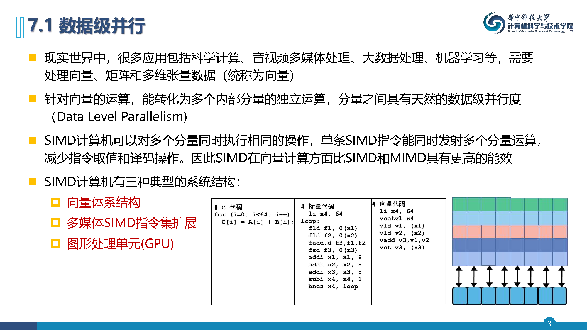

---

- **计算机硬件通过指令集识别数据类型，因此向量指令集首先必须定义、识别、存储和处理向量**
  - 标量内存连续放置
  - 向量内存可能离散放置（因此不像标量一样简单标识）
  - 向量存取流水化
- **向量体系结构**
- **RV64V指令集体系结构的主要组件如下：向量寄存器、向量功能单元、向置载入/存储单元、标量寄存器集合**

---

- **向量操作同时让多个数据元素执行同样的操作**
- **系统可以采用时间或者空间并行方式对向量数据元素进行运算**
  - 在使用完全流水线处理（时间并行）时，每一拍启动一组数据元素执行操作，当然流水线有装入和清空时间，越长向量能获得更高流水线使用效率
  - 向量设计可以采用慢而宽的执行单元
  - 采用多个部件并行处理方式，单周期内对许多元素同时进行操作
- **现实中往往采用折中方案，使用多个流水化功能单元，每条流水线称之为车道**

---

- **链接(chaining)**
  - 如果前后相邻的向量指令存在真数据相关，那么无需等待前一个向量全部元素执行完，而是当前一个向量功能执行的元素完成后直接重定向第二向量功能单元，也就是把两个前后功能单元组装成更长的流水线
- **每个向量指令只会因为等待每个向量的第一个元素而停顿，然后后续元素会沿着流水线顺畅流动。因此真数据相关操作是可被"链接"在一起的**
- **允许处理器同时读、写一个特定的向量寄存器，但同一时间读写不同元素。最近的链接实现采用灵活设置，允许向量指令链接到几乎任意其他活动向量指令，只要不导致结构性冲突就行。所有现代向量体系结构都支持灵活链接**

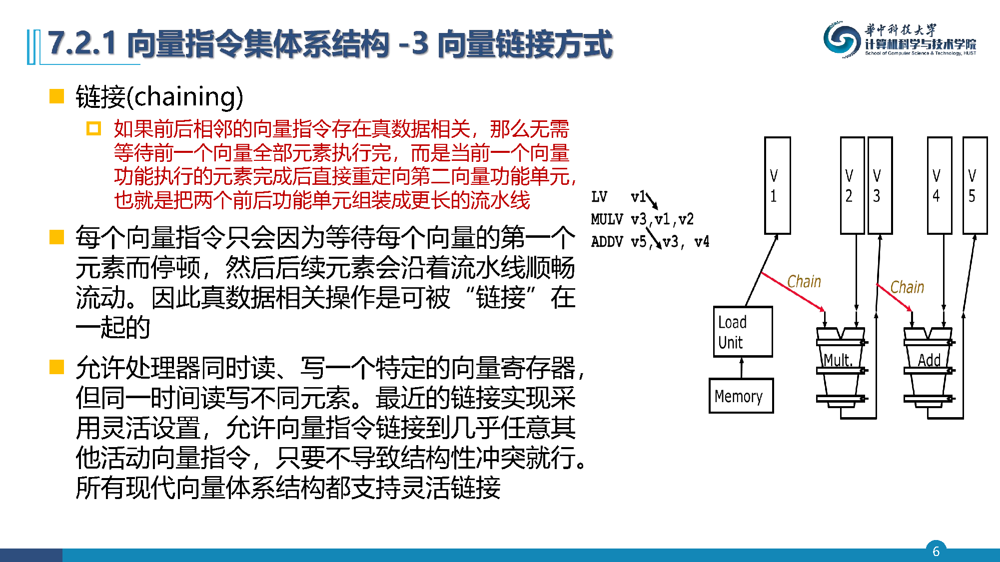

---

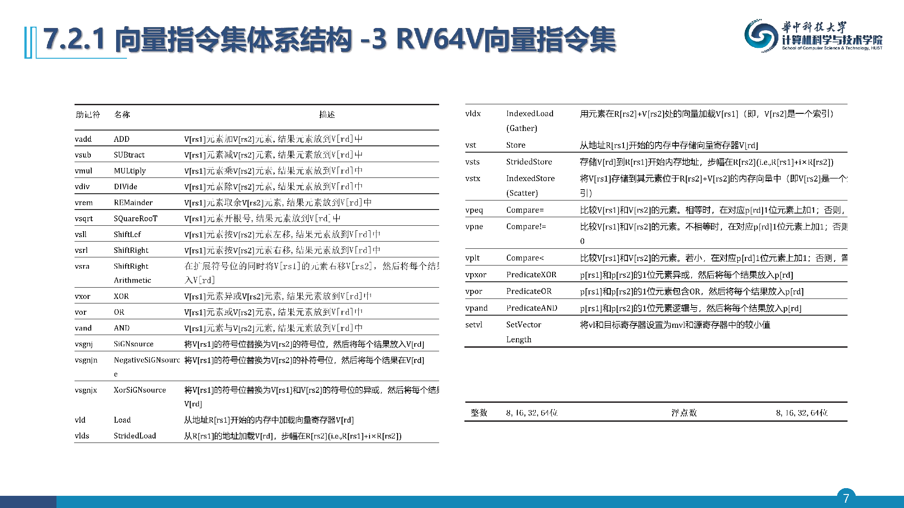

---

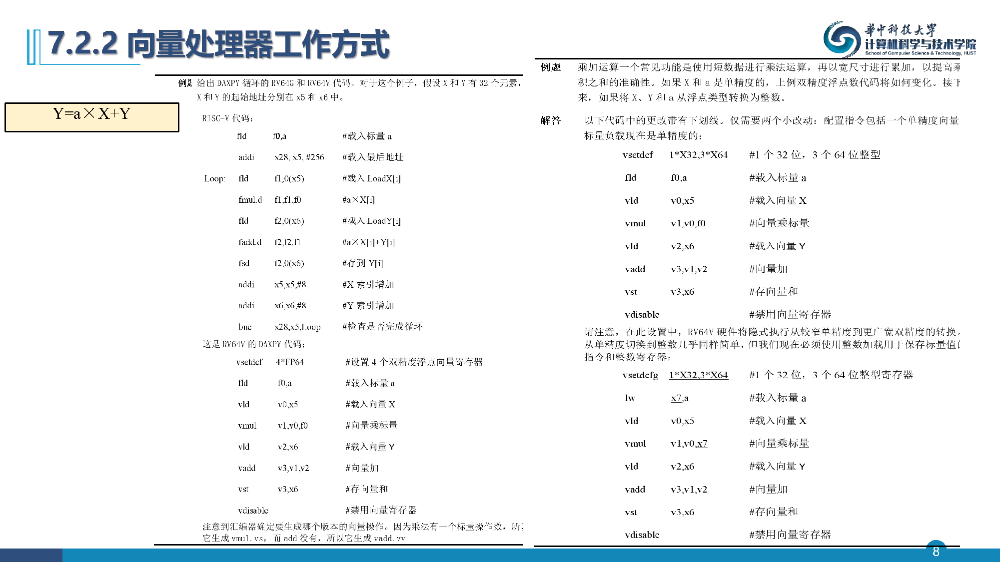

---

- **向量操作的执行时间主要取决于三个因素：（1）操作向量的长度、（2）结构冲突、（3）数据相关**
- **给定向量长度和初始速率，初始速率就是向量单元生成新结果的速率，一条车道每个周期产生1个结果**
- **现代向量计算机通常采用多条并行流水线（车道）的向量功能单元，在每个时钟周期可以生成两个或多个结果**
- **引入编组指令组(convoy)的概念，它是一次执行的一组向量指令**
  - convoy中的指令不能包含任何结构性冲突，如果存在这种冲突，则需要串行化执行不同convoy
  - 分析convoy的执行时间，其执行所花费的时间称之为钟鸣（chime）。执行由m个convoy构成的向量序列需要m次钟鸣

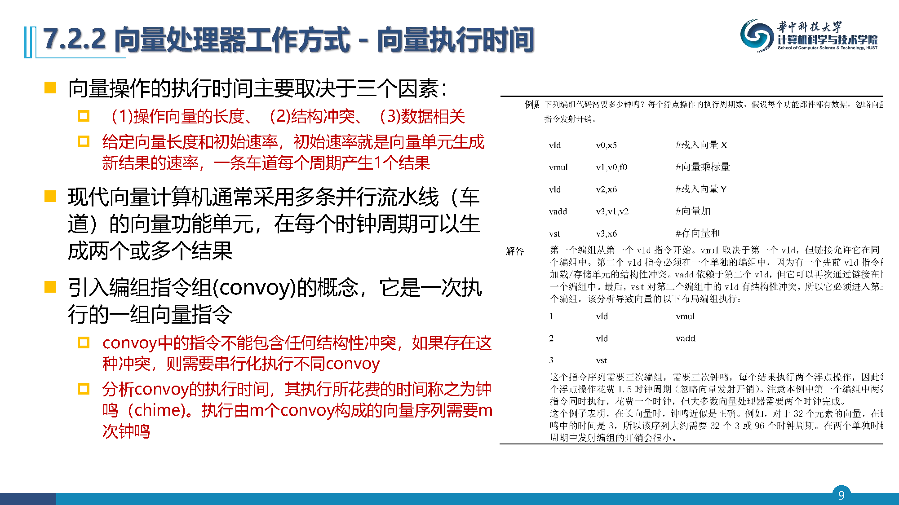

---

- **向量指令形式和传统标量指令相同，但一条向量指令就能让数十、上百个运算操作执行。这来源于多个深度流水化向量功能单元具有的高度时间和空间并行能力**
- **向量算术指令让所有源向量寄存器第N个元素同步运算，构造出高度流水化的向量单元，这种模式形成一条处理通道**
- **可以通过添加更多车道来提高向量功能单元的峰值吞吐量**
- **每个车道都包含向量寄存器堆的一部分和来自每个向量功能单元的一个执行流水线。以每个时钟周期一个元素组的速度执行向量指令**
- **向量寄存器分散在各个车道中，每个车道保存每个向量寄存器每4个元素中的1个。此图显示了三个向量功能单元，包括一个浮点加法、浮点乘法**
- **标量处理器（或控制处理器）向所有车道广播标量值，向量算术单元各包含4条流水线，每个车道1条，它们共同完成一条向量指令**

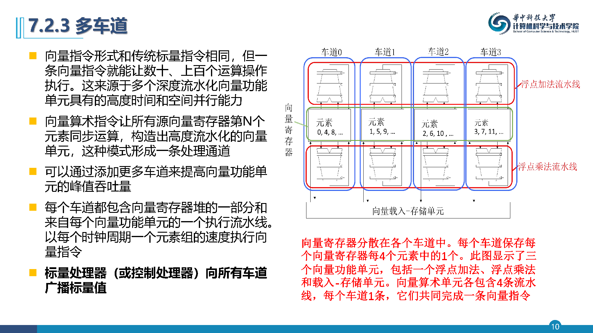

---

- **向量寄存器是固定长度的，其最大元素数目定义为MVL（Maximal Vector Length）。**
  `for(i=0;i<n;i=i+1) Y[i]=a×X[i]+Y[i];`
- **实际向量长度是多样的，通常不等于MVL**
- **增加一个向量长度寄存器（VLR）。VLR控制所有向量运算的长度，包括向量载入与存储运算**
- **引入分段开采(strip mining)技术，把长向量切成一组等于或者小于MVL的"短"向量，每次执行一个**

---

- **向量处理时，元素处理存在条件（IF语句）、稀疏矩阵是向量化程度低的两个主要原因**
- **常见扩展称为向量掩码控制**
- **掩码寄存器使用布尔向量来控制一条向量指令中每个元素运算的条件执行**
- **在启用向置掩码寄存器时，任何向量指令都只允许位为1的相应向量元素来执行**
- **向量掩码寄存器全置为1，后续向量指令将针对所有向量元素执行**

---

- **如果存储器组发生停顿，则会降低有效并发处理吞吐量**
  - 在无停顿情况下执行向量操作，那么向量初始化速率就等于提取或存储新字的速度
  - 保持每个时钟周期提取或存储一个字的速率，存储器系统必须提供足够的数据读写带宽，将访问对象分散在多个独立存储器体中，保证所需速率
- **需要大量存储器体可以高效地处理访问多行或多列数据的向量载入或存储指令**
  - 许多向量计算机每个时钟周期可以执行多个载入或存储操作，存储器体的周期时间通常比处理器周期时间高几倍
  - 大多数向量处理器支持载入或存储非连续数据字的功能
  - 大多数向量计算机支持多个处理器共享存储器，所以每个处理器会生成其自己的独立寻址流

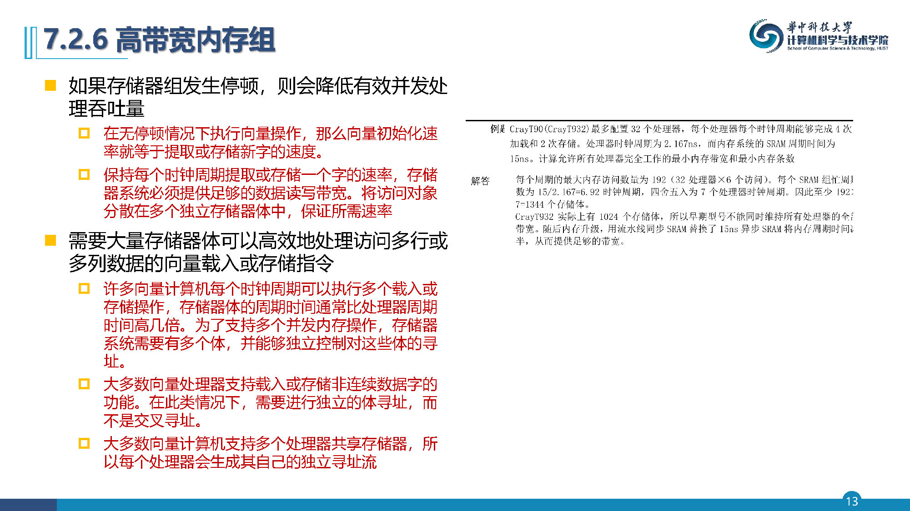

---

- **向量中相邻元素在内存中的位置可能并不一定连续**
- **要么行中的元素在内存中不相邻，要么列中的元素在内存中不相邻**
- **对于等间隔数据访问，可以通过收集（gather）指令把等间距放置的元素装载到一个寄存器中素，元素之间地址距离称为步幅**
- **利用具有步幅功能的向量载入-存储指令，向量处理器可以处理大于1的步幅，这种步幅称为非单位步幅。向量处理器的主要优势之一就是能够访问非连续存储器位置，并对其进行调整，放到一个紧密存储结构中**
- **为了支持大于1的步幅，会使存储器系统变得复杂。在引入非单位步幅之后，就有可能频繁访问同一个组。当多个访问对一个存储器组产生竞争时，就会发生存储器组冲突**

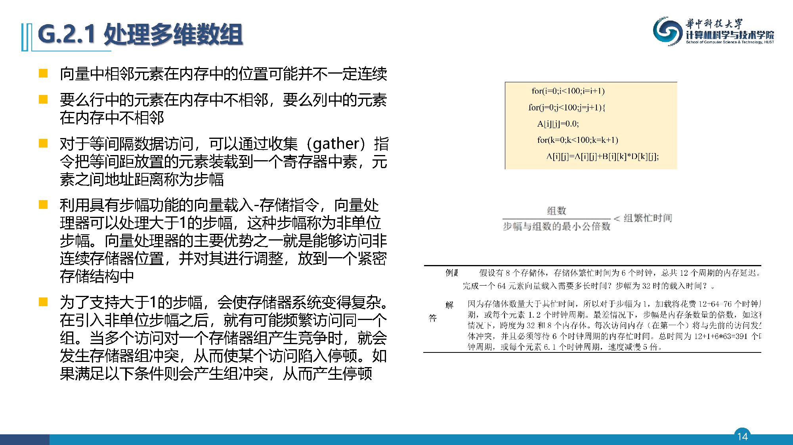

---

- **向量计算机需要处理常见的稀疏矩阵**
- **支持稀疏矩阵的主要机制是采用索引向量的集中-分散操作。这种运算目的是支持在稀疏矩阵的压缩表示（即不包含零）和正常表示（即包含零）之间进行转换**
- **集中操作是获取索引向量，并在此向量中提取元素。元素位置的确立是将基础地址加上索引向量中给定的偏移量，指向向量寄存器中的一个紧凑（dense）向量**
- **在以紧凑形式对这些元素进行操作之后，再使用同一索引向量，通过分散（Scatter）存储操作，以扩展方式存储这一稀疏向量**
- **集中-分散操作允许以向量模式运行带有稀疏矩阵的代码**
- **在GPU中，所有载入操作都是集中，所有存储都是分散**

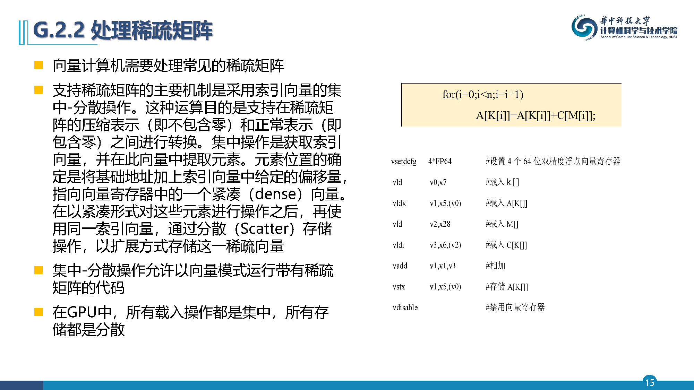

---

- **向量体系结构的优势在于编译器可以在编译时判定某段代码是否可以向量化**
- **运行在向量模式取决于程序本身的结构**
- **两种代码版本在CrayY-MP上运行时，以向量模式运行的运算比例。第一个版本仅对源代码进行了编译器优化，而第二个版本则利用了CrayResearch程序员团队给出的一些提示**
- **对向量处理器上的应用程序性能进行多次研究后发现，编译器向量化水平的变化范围很大。提示优化版本在代码的向量化上显示出显著的优势，编译器本身无法很好地向量化。但两种情况下，所有代码都有50%以上向量化。平均向量化从大约70%提高到大约90%**

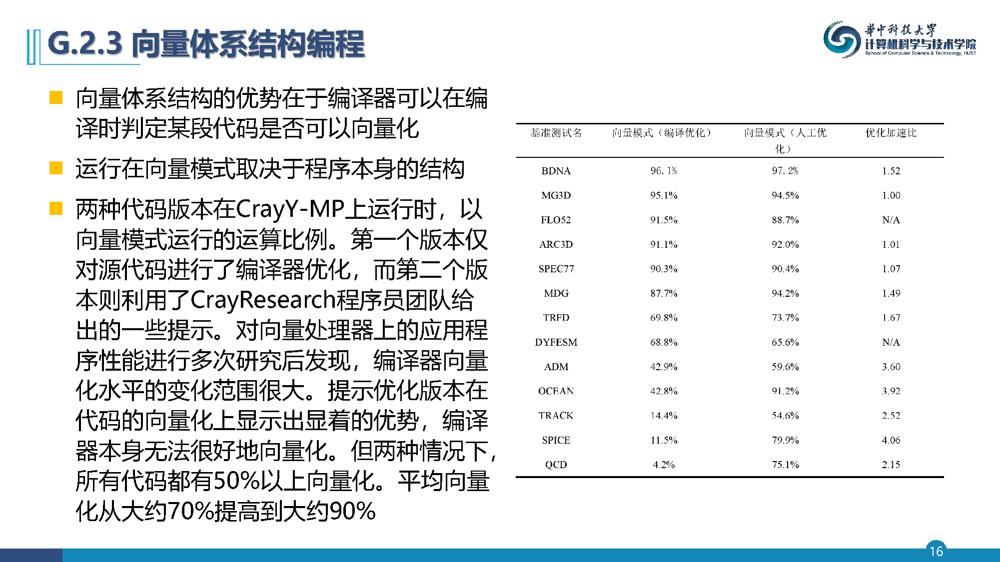

---

- **向量处理器是支持向量指令集的完整向量专用处理器硬件形态，通常仅用在高性能超算领域**
- **商业处理器在兼容已有软件基础之上，以多媒体扩展集方式支持向量处理**
- **和向量指令一样，SIMD指令规定了对数据向量的相同操作。一些向量机器拥有大型寄存器堆，比如RV64V向量寄存器，8个向量寄存器中的每一个都可以保存64个64位元素，SIMD指令与之不同，它指定的操作数较少，因此使用的寄存器堆也较小**
- **SIMD扩展主要进行了以下3项简化：（1）无向量长度寄存器；（2）无步长或者集中-分散数据传输指令；（3）无掩码寄存器**

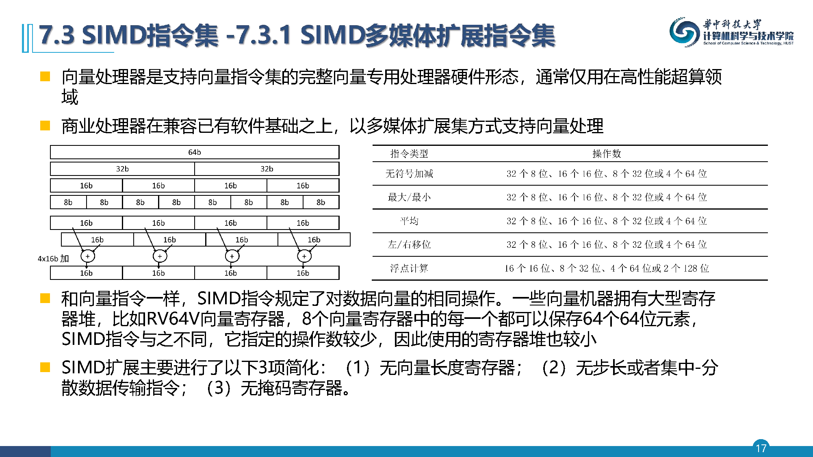

---

- **1996年增加的MMX指令，确定了64位浮点寄存器，所以基本指令可以同时执行8个8位运算或4个16位运算**
- **1999年推出了流式SIMD扩展(SSE)，增加了宽128位的独立寄存器，所以现在的指令可以同时执行16个8位运算、8个16位运算或4个32位运算。它还能并行执行单精度浮点运算**
- **2010年扩展了高级向量扩展（AVX)，再次将寄存器的宽度加倍，变为256位，并提供了一些指令，将针对所有较窄数据类型的运算数目翻了一番**

---

- **多媒体SIMD扩展优势在于简单：**
  - 尽量复用现有硬件，添加标准算术单元
  - 无需维护额外向量处理状态
  - 有限向量长度减少对于存储器带宽的需要
  - SIMD复用现有内存访问和缺页处理机
- **SIMD扩展对于操作数的每个SIMD指令用独立的数据传送（这些操作数在存储器中是对齐的），所以它们不能跨越页面边界**
- **固定长度的简短SIMD"向量"还能够引入一些符合新媒体标准的指令**
- **由于SIMD多媒体扩展的特有本质，使用这些指令的最简便方法就是通过库或用汇编语言编写**

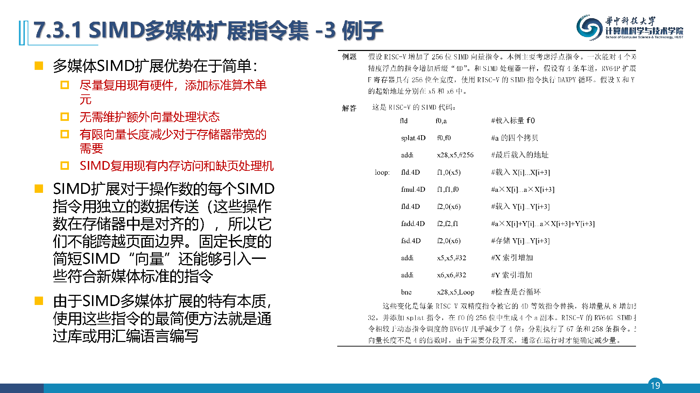

---

- **SIMD处理器实际性能同时依赖于数据读写和计算能力，通常使用Roofline模型直观比较各种SIMD体系结构的浮点性能**
- **运算强度定义为运行程序的浮点运算数除以访存总字节数。一些计算核的算术强度正比于问题规模**
- **可获得的GFLOP/s = Min(峰值存储器带宽×运算强度，峰值浮点性能)**

---

- **图像处理器（Graphics Processing Units，GPU）最早作为主机的显示卡用来加速图形处理和视频显示**
- **后来NVIDIA为代表GPU厂商提供专用编程语言能够利用GPU的计算能力，GPU成为一种通用计算平台（General-Purpose GPU，GPGPU）**
- **目前已经在高性能图像处理领域（例如高画质游戏）、机器学习和超算等计算密集型领域广泛应用，也是人工智能、加密货币等产业的硬件基础**
- **GPU目前仍作为计算加速器，而不是通用处理器，因此需要和主机CPU合作运行**
- **NVIDIA开发一种类似C的编程语言和编程环境，称为计算统一设备体系结构（Compute Unified Device Architecture，CUDA）**
- **GPU的编程模型基于CUDA线程，作为基础的并行调度单元**

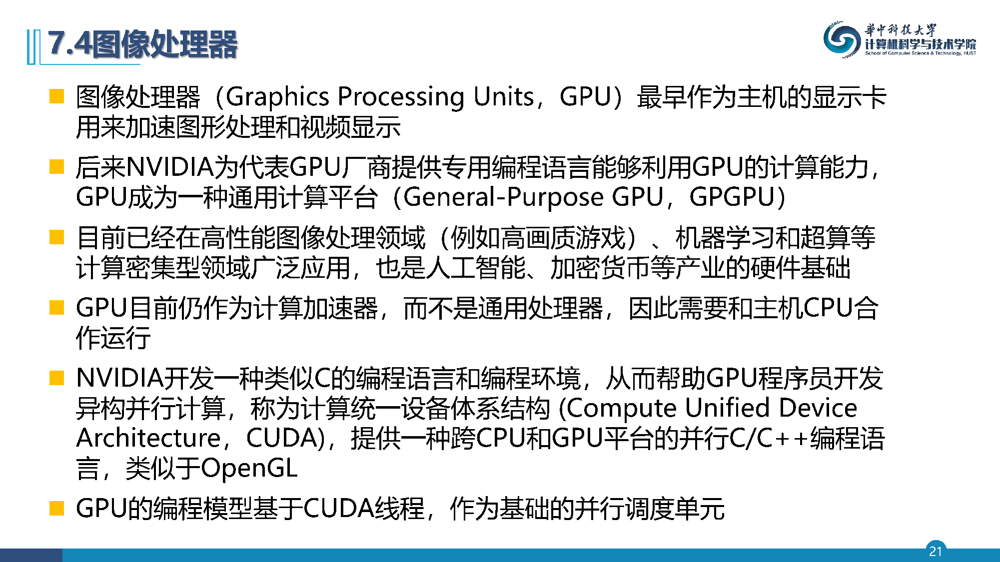

---

- **CUDA程序示例：**
  - 为了区分GPU（设备）与主机CPU，CUDA使用`_device_`或`_global_`表示前者，使用`_host_`表示后者
  - 被声明为`_device_`或`_global_functions`的CUDA变量被分配给GPU存储器，可以供所有多线程SIMD处理器访问
  - 对于在GPU上运行的函数name进行拓展函数调用的语法为

---

- **GPU基本概念体系。使用CUDA术语来描述软件，而用向量处理器相关概念介绍硬件，再将它们对应到NVIDIA GPU的官方术语**
- **以GPU-NVIDIA为例，使用Pascal体系结构阐述上面CUDA并行编程语言的术语**
- **GPU硬件包含一组用来执行线程块网络（向量化循环体）的多线程SIMD处理器，也就是说，GPU是一个由多线程SIMD处理器组成的多处理器**
- **NVIDIA-GPU架构围绕可扩展的多线程流式多处理器(SM:StreamingMultiprocessors)阵列构建**
- **网格的块被枚举并分发到具有可用执行能力的多处理器。一个线程块的线程在一个SM上并发执行，多个线程块可以在一个SM上并发执行**
- **采用了一种称为SIMT（Single-Instruction, Multiple-Thread:单指令，多线程）的独特架构**

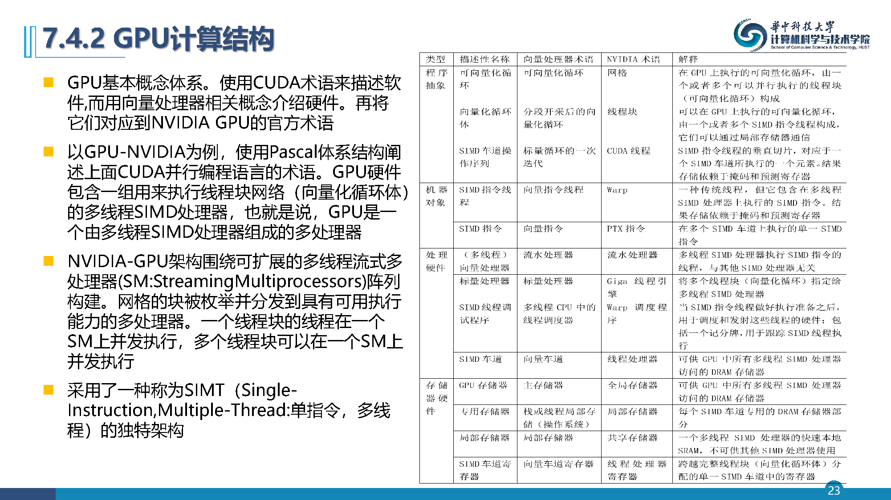

---

- **GPU能很好地解决数据级并行问题。这两种类型拥有集中-分散数据传送和掩码寄存器，GPU处理器的寄存器要比向量处理器更多**
- **向量计算机通常是编译时用软件来实现指令调度等功能，而GPU使用运行时硬件调度实现相应功能**
- **GPU在单个多线程SIMD处理器中使用多线程机制来隐藏存储器延迟。如要在向量体系结构和GPU编写高效代码，程序员还需要考虑SIMD操作分组**
- **网格是运行在GPU上、由一组线程块构成的代码**

---

- **GPU有许多并行功能单元，每个都是深度流水化的，具有独立PC的完整处理器，使用线程进行编程**
- **SIMD线程调度程序包括一个记分牌，标识哪些SIMD指令线程已经做好运行准备，然后将它们发送给分发单元，以在多线程SIMD处理器上运行**
- **两级硬件调度程序：**
  - （1）线程块调度程序，将线程块（向量化循环体）分配给多线程SIMD处理器，确保线程块被分配给其局部存储器拥有相应数据的处理器
  - （2）SIMD处理器内部的SIMD线程调度程序，由它来调度应当何时运行SIMD指令线程

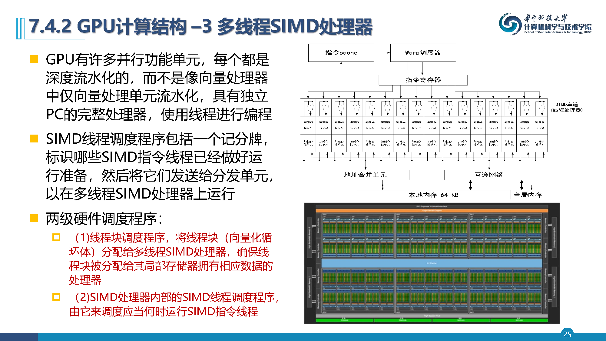

---

- **每个SIMD处理器中的车道数在各代GPU中是不同的**
- **SIMD指令线程是相互独立的，SIMD线程调度程序可以选择任何已经准备就绪的SIMD指令线程，而不需要立刻执行线程序列中的下一条SIMD指令**
- **SIMD线程调度程序在不同时间以不同顺序选取SIMD指令线程**
- **为了能够执行多个SIMD指令线程，需要在创建SIMD指令线程时在每个SIMD处理器上动态分配一组物理寄存器，并在退出SIMD线程时加以释放**
- **因为SIMD指令的线程是独立的，调度器每次可能会选择不同的SIMD线程**

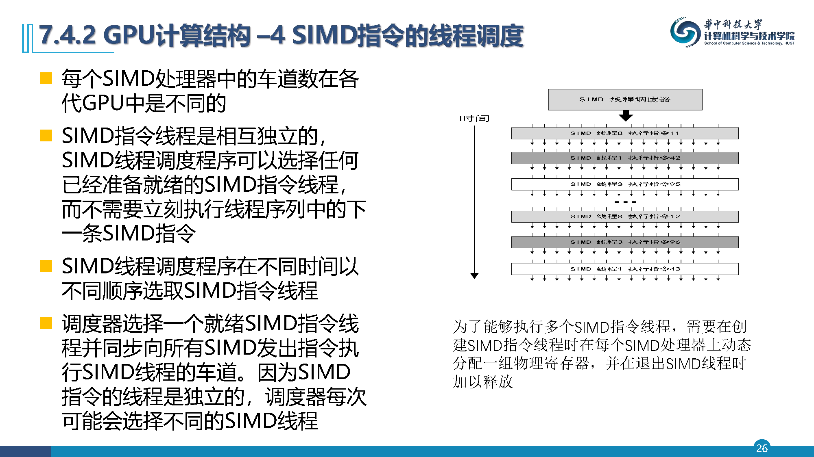

---

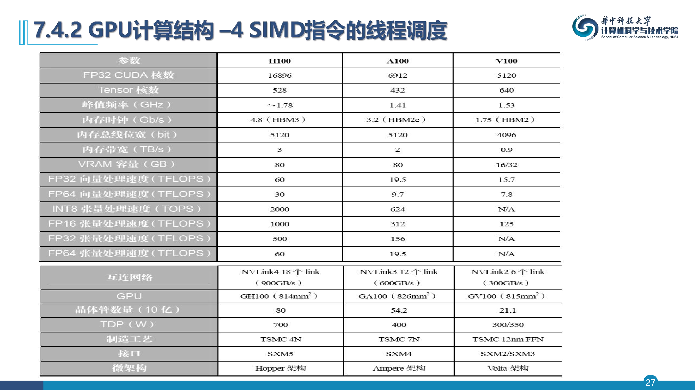

---

- **与通用处理器不同，NVIDIA编译器的指令集目标是硬件指令集的一种抽象。PTX(并行线程执行）为编译器提供了一种稳定的指令集，可以实现各代GPU之间的兼容性**
- **向程序员隐藏了硬件指令集。PTX指令描述了对单个CUDA线程的操作，通常与硬件指令一对一映射，但一个PTX指令可以扩展到许多机器指令**
- **PTX使用无限数量的逻辑一次写寄存器，而编译器需要把PTX寄存器分配到具体的物理向量寄存器**

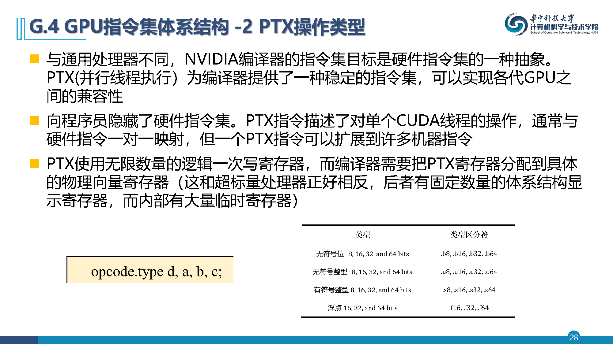

---

- **基本指令集。所有指令可以由1位断言寄存器进行判定，这些寄存器可以由设置断言指令（setp）来设定**
- **控制流指令包括函数call和return，线程exit、branch以及线程块内线程的屏障同步（bar.sync）**
- **在分支指令之前放置断言就可以提供条件分支**
- **编译器或PTX程序员将虚拟寄存器声明为32位或64位有类型或无类型值**

---

- **CUDA编程模型为每个循环迭代指定一个CUDA线程，为每个线程块指定一个唯一的识别编号（blockIdx），也为块中的每个CUDA线程指定一个唯一识别编号（threadIdx）**
- **GPU与向量体系结构不同，它们没有分别用于顺序数据传送、步幅数据传送和集中-分散数据传送的指令。所有数据传送都采用集中-分散方式**

---

- **向量体系结构和GPU在处理IF语句方面非常相似，前者主要以软件实现这一机制，硬件支持非常有限，而后者则利用了更多的硬件**
- **GPU分支硬件使用显式断言寄存器、内部掩码、分支同步桟和指令标记来控制分支何时分为多个执行路径，这些路径何时会汇合**
- **GPU硬件指令级别，控制流包括分支、跳转、索引跳转、调用、索引调用、返回、退出和管理分支同步栈的特殊指令**
- **GPU硬件为每个SIMD线程提供了私有栈；一个堆栈项包含一个标识符标记、一个目标指令地址和一个目标线程活动掩码**
- **PTX汇编程序通常会将用PTX分支指令编码的简单外层IF/THEN/ELSE语句优化为设有断言的GPU指令，不采用任何GPU分支指令**
- **GPU设定断言指令（setp）对IF语句的条件部分求值**

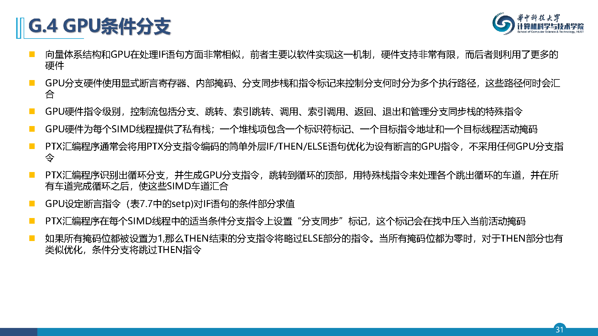

---

- **IF语句可以编译为以下PTX指令（假定R8已经拥有经过调整的线程ID）**
- **`*Push`、`*Conp`、`*Pop`表示由PTX汇编程序插入的分支同步标记，用于压入旧掩码、对当前掩码求补、弹出恢复旧掩码**
- **IF_THEN_ELSE语句中的所有指令通常都是由SIMD处理器执行**

---

- **GPU存储器由所有网格共享，本地存储器由线程块中的所有SIMD指令线程共享，专用存储器由单个CUDA线程私有**
- **多线程SIMD处理器中的每个SIMD车道获得片外DRAM的一个私有部分，称之为私有存储器，用于栈帧、溢出寄存器和不能放在寄存器中的私有变量。SIMD车道不共享私有存储器**
- **每个多线程SIMD处理器本地的片上存储器称为本地存储器。它是一个小的暂存内存，具有几十周期的存取延迟和每周期128字节的高带宽**
- **主机通用CPU可以读取或写入GPU存储器。但本地存储器不能供主机使用，它是每个多线程SIMD处理器专用的。私有存储器也不可供主机使用**
- **GPU通常不是依赖大型缓存来保存应用程序的整个工作集，而是使用较少的流式缓存，依靠大量的SIMD指令多线程来隐藏DRAM的较长延迟**

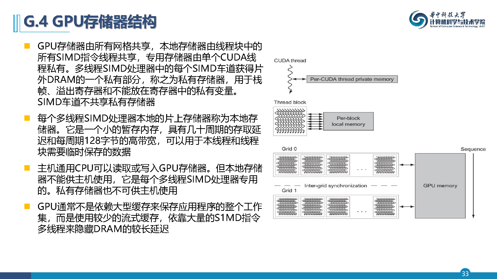

---

- **Pascal双SIMD线程调度器模块图，Pascal GP100 GPU的多线程SIMD处理器的框图**
- **高带宽内存：PascalGP100使用堆叠式高带宽内存(HBM2)**
- **芯片到芯片的高速互连**
- **统一虚拟内存和分页机制支持**

---

- **GPU和向量体系结构、多媒体扩展指令集有许多相似之处。但是每个领域大量似是而非的概念会让人迷惑，难以理解数据级并行及相应处理硬件的本质**
- **一个向量的每个元素可以并行处理，具有数据级并行潜力，可以从空间和时间并行性两个方面进行处理**
- **SIMD处理器，顾名思义是一条指令对多个数据元素进行同时处理，那么就需要设置多个处理单元，每个单元处理一个元素。因此SIMD更强调空间并行性，需要多个车道**
- **而向量体系结构在提出时，由于硬件成本很高，更多采用流水线的方式从空间并行性角度提高性能。而GPU则结合了上面两种类型，同时挖掘时间并行性和空间并行性**

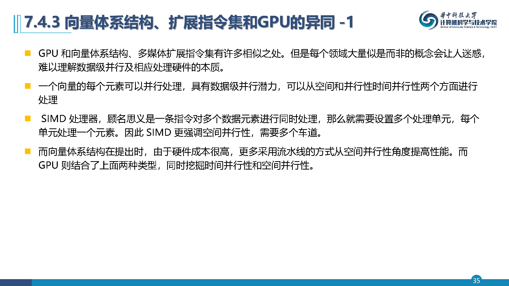

---

- **GPU与向量处理器有很多类似。单个SIMD处理器像独立MIMD处理核一样，就好像是向量计算机拥有多个向量处理器，两者之间最大的区别是多线程机制**
- **RV64V寄存器堆拥有整个向量，也就是说，由64个双精度值构成的连续块。相反，GPU中的单个向量会分散在所有SIMD车道的寄存器中**
- **SIMD处理器的工作方式与向量处理器非常类似。但实际上，GPU中的车道要多很多，所以GPU"钟鸣"更短一些**
- **与向量化循环最接近的GPU术语是网格，PTX指令与向量指令最接近，这是因为SIMD线程向所有SIMD车道广播PTX指令**
- **两种体系结构中的存储器访问指令：所有GPU载入都是集中指令，所有GPU存储都是分散指令**
- **向量计算机的控制处理器在向量指令的执行过程中扮演着重要角色，GPU中没有控制处理器**

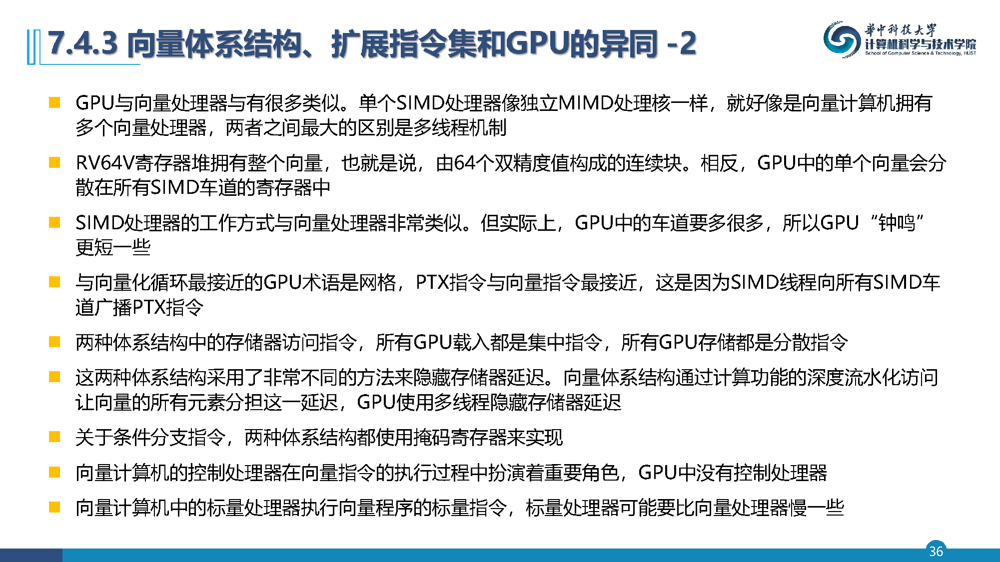

---

- **从高层角度来看，具有多媒体SIMD指令扩展的多核计算机的确与GPU有一些相似之处。这两种多处理器的处理器都使用多个SIMD车道，只不过GPU的处理器更多一些，车道数要多很多**
- **GPU使用的流式缓存要小一些，多核计算机使用大型多级缓存，以尝试完全包含整个工作集**
- **它们都使用64位地址空间，不过GPU中的物理主存储器要小得多。尽管GPU支持页面级别的存储器保护，但它们都不支持需求分页**
- **在传统计算机中，标量处理器和多媒体SIMD指令紧密集成在一起；它们由GPU中的I/O总线隔离，它们甚至还有独立的主存储器**
- **GPU中的多个SIMD处理器使用单一地址空间，但这些缓存不是像传统的多核计算机那样是一致的**

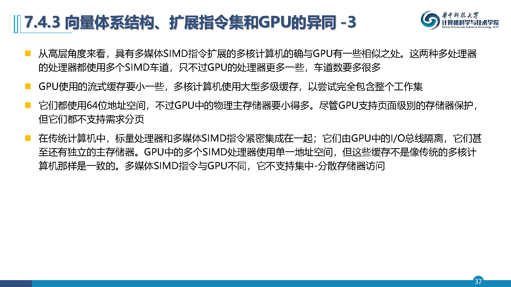

---

- **GPU实际上就是多线程SIMD处理器，只不过与传统的多核计算机相比，它们的处理器更多、每个处理器的车道更多，多线程硬件更多**

---

- **附录G进一步介绍了向量计算机相关的高级内容，并按照本章相关主题进行了分类**
- **在7.2节的基础之上讲解了RV64V向量指令集、处理多维数组、向量处理稀疏矩阵和向量体系结构编程**
- **在7.3节的基础之上讲解了Roofline可视性能模型**
- **在7.4节的基础之上讲解了GPU指令集体系结构、GPU条件分支、GPU存储器结构、Pascal GPU体系结构新特性、概念辨析（向量体系结构、扩展指令集和GPU概念辨析）**

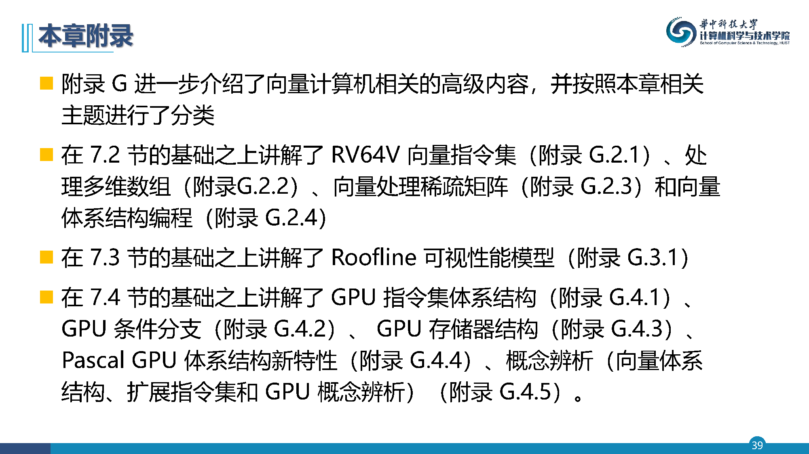

---

---
