<!-- _class: lead -->

# 多处理器

**计算机系统结构**

---

## 本章内容

- **掌握多处理器概念和基本结构**
- **掌握多处理器中的互连网络架构及性能分析**
- **掌握缓存一致性概念及监听一致性协议原理**
- **掌握同步概念及其实现方式**
- **理解存储顺序一致性概念**

---

- **单处理器性能提升速率减缓，近年年增长率仅为2.9%，单处理器性能有限**
- **通过增加处理器个数或者处理器核数增加整体计算能力**
- **2003年之后，从低端到高端的各类处理器普遍采用多核、多处理器体系结构**
- **多处理器属于MIMD模型，其每个核/处理器是通用的，可以独立执行程序，提供线程级并行（Thread-Level Parallelism，TLP）**
- **共享网络和全局多级存储（缓存、内存和外存）连接在一起**
- **多处理器通过两种不同的软件模型来开发TLP：**
  - 任务级并行处理（Job-Level Parallelism，JLP）：运行一组紧密耦合的线程，协同完成同一项任务
  - 请求级并行(Request-Level Parallelism，RLP)：执行可能由一或多位用户发起的多个相对独立的进程

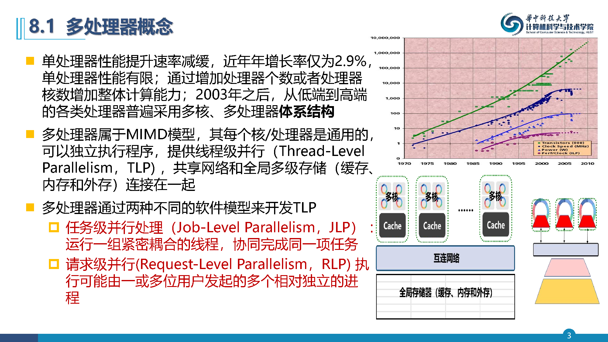

---

- **多处理器体系结构可以从其存储器物理组织结构进行分类：**
  - 集中式共享存储器结构（也称为对称（共 享存储器）多处理器，symmetric shared-memory multiprocessors，SMP）
  - 分布式存储器结构（Distributed Shared Memory，DSM）：通过高速互连网络连接多个处理器结点
- **分布式共享存储结构中每个处理器结点包含：独立的处理器、存储器、I/O和网络接口，处理器能够共享分散式存储器**

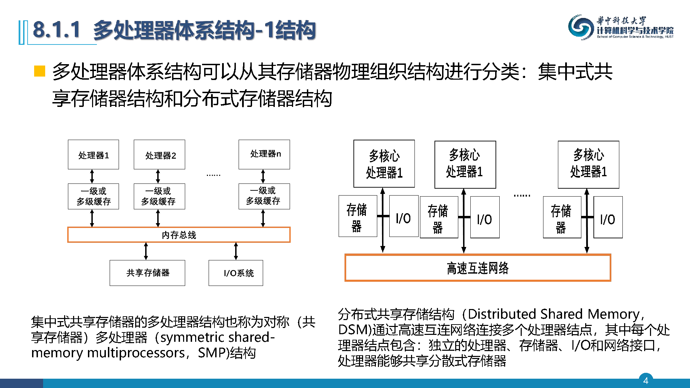

---

- **从存储地址逻辑空间组织结构方面进行分类。这是程序员能够看到的存储地址空间，总体分为两类：全局共享地址空间和独立分布式地址空间**
- **全局共享地址空间优势：**
  1. 能够与常用的对称式多处理机很好的配合
  2. 易于编程，采用单一存储空间模型开发应用程序
  3. 简化编译器设计
  4. 当通信数据量较小时，通信开销较低，带宽利用较好
  5. 可以采用Cache机制来减少远程通信的频度，减少了通信延迟以及对共享数据的访问冲突
- **独立分布式内存地址空间结构是指整个系统的存储地址空间是由多个独立内存编址空间构成**

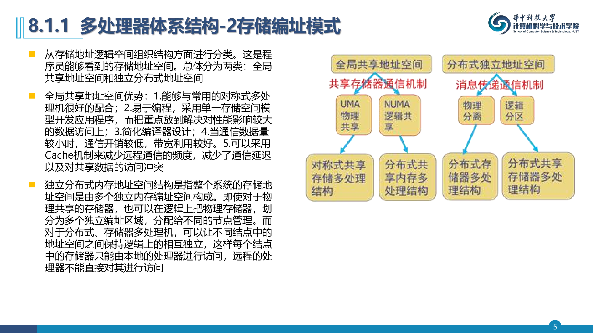

---

- **处理器通信机制分为两类：共享存储器通信机制和消息传递通信机制**
- **共享存储通信机制：基于全局共享地址空间，各个处理器用load和store指令对全局共享的存储地址进行存储-载入操作**
- **消息传递通信机制：基于独立地址空间，处理器访问各个独立存储空间时，需要显式地传递消息**
- **分为同步消息传递和异步消息传递：**
  - 同步消息传递：请求处理器发送消息后一直要等到应答完成才继续运行
  - 异步消息传递：请求处理器发送消息后可以处理其他事情
- **消息传递通信机制优点：硬件简单、通信显式容易分析、编程者可以参与开发并行程序、同步操作与发送消息关联减少同步错误**

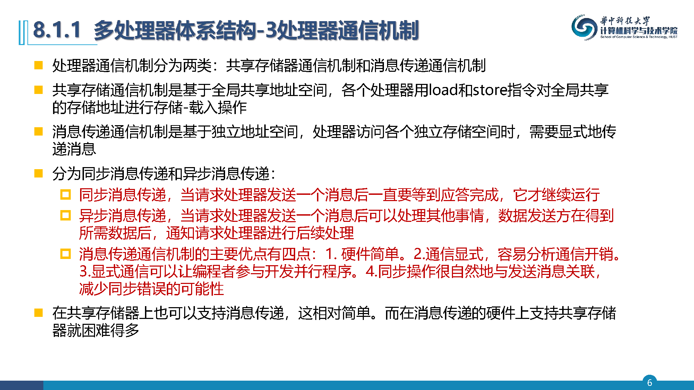

---

- **早期，多个处理器和存储器通过共享总线互连，是典型的SMP结构**
- **近年，多核处理器迅速发展，多个核心也通过共享总线互连**
- **目前大多数多核多路高性能服务器中，往往采用NUMA结构，前端总线（QPI）实现CPU之间的互连**
- **CPU通过内存总线和内存直接相连**
- **CPU通过I/O总线连接高速设备，这些总线控制器都集成到处理器中**

---

- **并行较难实现**
  - 程序内部并行度可能有限
  - 处理器之间通信的成本较高

---

- **并行度不足、远程通信开销大是多处理器性能提升的难点**

---

- **互联网络是计算机部件、计算机节点或计算机系统之间的链接**
- **可能连接：CPU处理器内的多个核、多个CPU处理器、CPU处理器和存储器、一个CPU内存和其他CPU内存、多个计算机、甚至多个计算机网**
- **是SIMD计算机和MIMD计算机的关键组成部分**
- **理解互联网络能够更好的设计和评价计算机系统**
- **互连网络的主要设计目标是：在成本、能耗等约束下，在尽可能短的时间内传输更可能多的数据，避免成为系统的瓶颈**

---

- **互连网络分为四种类型：**
  - **片上网络（On-chip networks，OCNs）**：主要用于芯片内微架构内功能单元的互连，包括片内寄存器文件、缓存、计算模块以及功能IP模块
  - **系统/存储区域网络（System/storage area networks，SANs）**：用于多处理器之间、处理器-内存互连，也用于连接服务器和数据中心环境中的存储和I/O组件
  - **局域网（Local area networks，LANs）**：用于在机房、整个建筑物或校园环境中互连计算机，可以将PC互连成集群
  - **广域网（Wide area networks，WANs）**：连接分布在全球的计算机系统

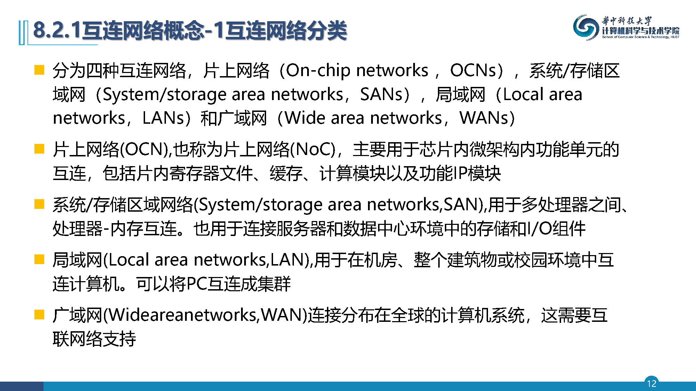

---

- **互连网络的性能指标：评估互连网络性能的两个基本指标是时延和带宽**
- **通信时延：指从源结点到目的结点传送一条消息所需的总时间**
  - 通信延迟 = 软件开销 + 通道时延 + 选路时延 + 竞争时延
- **网络时延：通道时延与选路时延的和，由网络硬件特征决定，与程序行为和网络传输状态无关**

---

- **通信延迟模型：**
  - 发送开销 + 飞行时间 + 网络传输时间 + 接收开销
  - 网络传输时间 = 数据包大小 / 带宽
  - 飞行时间由光速和距离决定

---

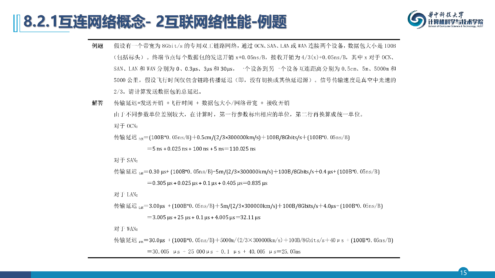

---

- **网络拓扑结构可以使用图表示，通过有向边或无向边描述节点间的连接关系**
- **网络拓扑结构的几个关键参数：**
  - **网络规模**：网络中结点的个数，表示该网络所能链接的部件的数量
  - **结点度**：与结点相连接的边数，可以进一步分为入度和出度
  - **结点距离**：网络中任意两个结点间通路所经历边数的最小值
  - **网络直径D**：网络中任意两结点间距离的最大值，网络直径应当尽可能地小
  - **等分宽度b**：当把一个N结点网络切分为结点数相同的两部分时，沿切口边数的最小值
    - 线等分宽度：B = b × w，w为通道宽度（用位表示）
  - **对称性**：如果从任何结点看，网络拓扑结构都相同的，就称为对称网络

---

- **互联网络可以看成是输入节点到输出节点之间的一组互连映射关系，可以用互联函数进行形式化表示**
- **在互联函数f的作用下，输入端x连接到输出端f(x)**
- **互连函数反映了网络输入数组和输出数组之间对应的置换关系或排列关系（置换函数或排列函数）**
- **互连函数有多种表示方式，一个网络通过开关切换可以形成多个映射关系，所以要用"互连函数族"来定义一个网络**

---

- **互联函数f(x)采用循环表示**
- **j称为该循环的长度，即：（x₀ x₁ x₂ ... xⱼ₋₁）**
- **表示：f(x₀)=x₁, f(x₁)=x₂, ..., f(xⱼ₋₁)=x₀**
- **设n=log₂N，则可以用n位二进制来表示N个输入端和输出端的二进制地址**

---

- **恒等函数I：实现同号输入端和输出端之间的连接**
- **交换函数E：实现二进制地址编码中第k位互反的输入端和输出端之间的连接**
- **网络结点个数为N时，共有N种互连函数，通常用Cubeₖ来表示对结点二进制地址第k位形成的连接关系**
- **当k=N=8, n=3时，称之为立方体函数**

---

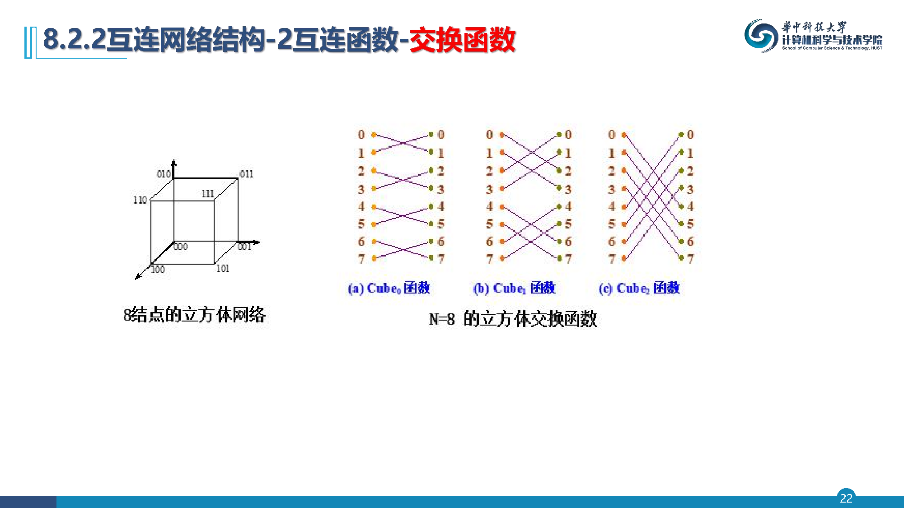

---

- **均匀洗牌函数σ(x)：将输入端分成数目相等的两半，按类似均匀混洗扑克牌的方式，交叉地连接到输出端，也称为混洗函数**
- **σ函数就是把输入端的二进制编号循环左移一位**

---

- **子函数和超函数：**
  - 互连函数的第k个子函数：把该函数作用于输入端的二进制编号的低k位
  - 互连函数的第k个超函数：把该函数作用于输入端的二进制编号的高k位
- **对于均匀洗牌函数：**
  - 第k个子函数：即把输入端的二进制编号中的低k位循环左移一位
  - 第k个超函数：即把输入端的二进制编号中的高k位循环左移一位

---

- **逆函数：对于任意一种函数f(x)，如果存在g(x)，使得f(x)×g(x)=I(x)，则称g(x)是f(x)的逆函数，记为f⁻¹(x)**
- **逆均匀洗牌函数f⁻¹(x)：将输入端的二进制编号循环右移一位而得到所连接的输出端编号**
- **互联函数：σ⁻¹(x) = σ(xₙ₋₁ x₀ x₁ ... xₙ₋₂)**
- **逆均匀洗牌是均匀洗牌的逆函数**

---

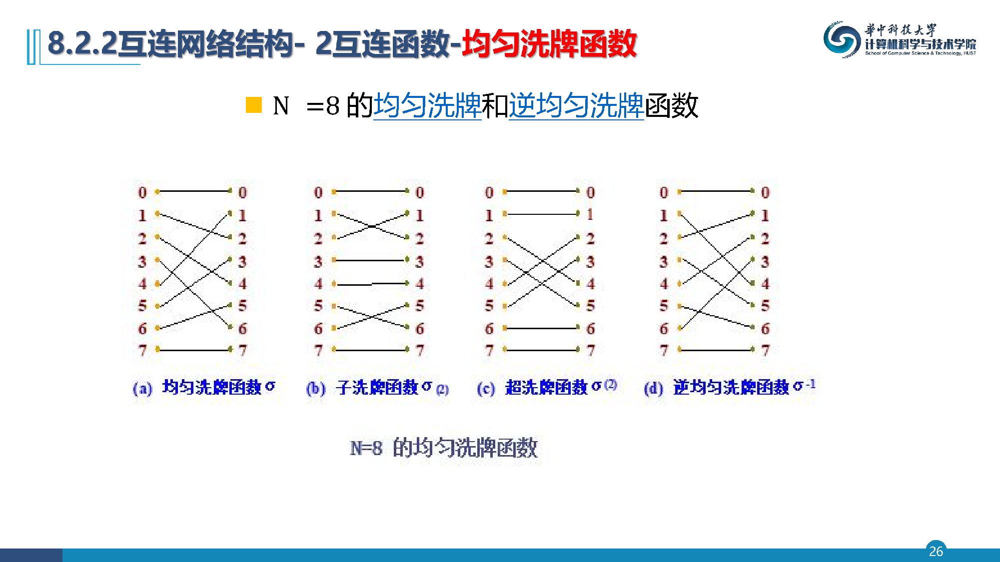

---

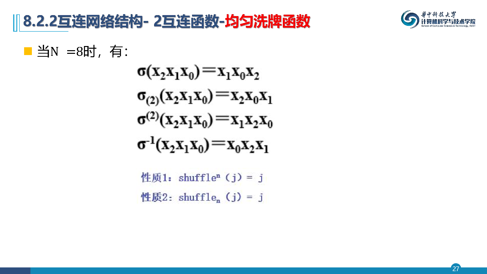

---

- **蝶式函数（β）：把输入端的二进制编号的最高位与最低位互换位置，便得到了输出端的编号**
- **第k个子函数和第k个超函数**
- **蝶式变换与交换变换的多级组合是构成多级立方体网络的基础**

---

- **反位序函数：将输入端二进制编号的位序颠倒过来求得相应输出端的编号**
- **反位序函数：β(xₙ₋₁ ... x₁ x₀) = (x₀ x₁ ... xₙ₋₁)**
- **第k个子函数和第k个超函数**

---

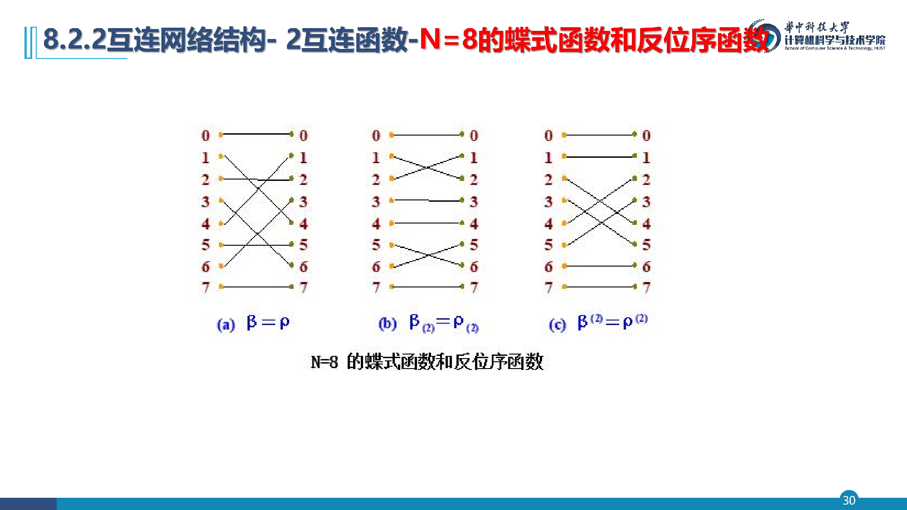

---

- **移数函数：将各输入端都错开一定的位置（模N）后连到输出端**
- **移数函数：PM2₊ᵢ(x) = (x + 2ⁱ) mod N**

---

- **PM2ᵢ函数（加减2ⁱ函数）：**
  - P和M分别表示加和减，2ⁱ表示2的i次方
  - PM2ᵢ函数：一种移数函数，将各输入端都错开一定的位置（模N）后连到输出端
  - PM2ᵢ互连网络共有2n个互连函数

---

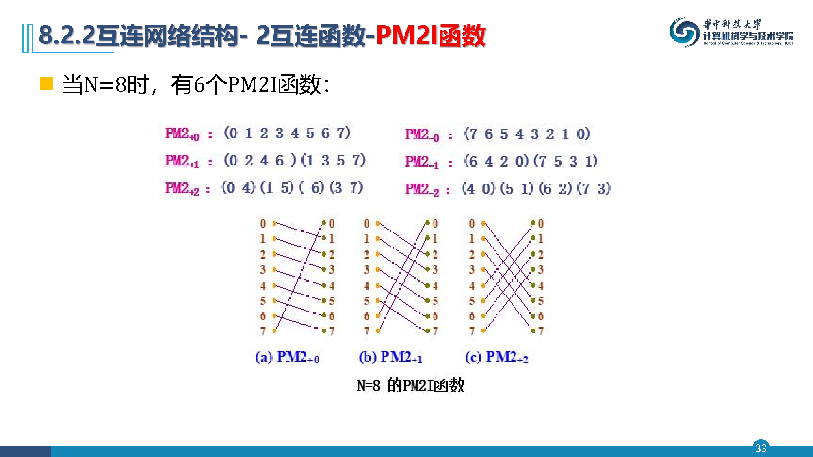

---

- **例题：现有16个处理器（编号0, 1, ..., 15），用一个N=16的互连网络互连**
- **处理器i的输出通道连接互连网络的输入端i，处理器i的输入通道连接互连网络的输出端i**
- **当该互连网络实现的互连函数分别为Cube₃, PM2₊₃, PM2⁻₀, σ, σ²时，分别给出与第13号处理器所连接的处理器号**

---

- **互连网络通常可以分为两大类：**
  - **静态互连网络**：各结点之间有固定的连接通路、且在运行中不能改变的网络
  - **动态互连网络**：由交换开关构成、可按运行程序的要求动态地改变连接状态的网络

---

- **1.线性阵列是一维线性网络，N个结点用N-1个两两连接的链路连成一串**
  - 端结点的度为1，其余结点的度为2
  - 网络直径为N-1
  - 等分宽度b=1

---

- **2.环形结构：线性阵列首尾相连，有单向环、双向环，是一种对称互连结构**
  - 结点的度都是2，等分宽度b=2
  - 双向环：网络直径为N/2
  - 单向环：网络直径为N-1

---

- **带弦环：增加的链路愈多，结点度愈高，网络直径就愈小**

---

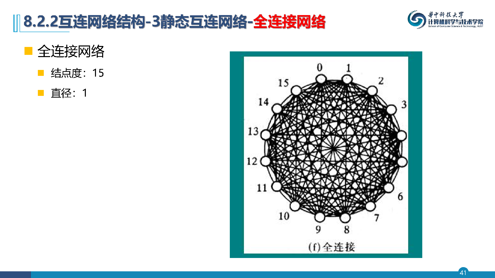

---

- **3.循环移数网络：通过在环上每个结点到所有与其距离为2的整数幂的结点之间都增加一条附加链而构成**
- **一般地，如果｜j-i｜=2ʳ（r=0,1,2,...,n-1，n=log₂N），则结点i与结点j连接**
  - 结点度：2n-1
  - 直径：n/2
  - 网络规模N=2ⁿ

---

- **4.树形结构：对于有N=2ᵏ-1个结点、k层的完全平衡的二叉树**
  - 最大结点度为3，直径为2(k-1)，等分宽度b=1
- **星形结构：结点度较高，为N-1。直径较小，为常数2，等分宽度b=N/2向下取整**
- **5.胖树结构：整体结构和二叉树结构类似，但是越往上层，相应的链路带宽也越高**

---

- **6.网格形网络和环网形：对于规模为N=n×n的2维网格形网络**
  - 内部结点的度是4
  - 边结点的度是3
  - 角结点的度是2
  - 网络直径D=2(n-1)
  - 等分宽度为n
- **一个由N=nᵏ个结点构成的k维网格形网络（每维n个结点）的内部结点度d=2k，网络直径D=k(n-1)**

---

- **Illiac网络：名称来源于采用了这种网络的Illiac IV计算机**
- **与2维网格形网络结构相比，它把每一列的两个端结点分别连接起来，再把所有行的依次首尾相连为一长串**
- **对于规模为n×n的Illiac网络：**
  - 所有结点的度都为4
  - 网络直径n-1，只有纯网格形网络直径的一半
  - 等分宽度：2n

---

- **环网：把Illiac网络结构每一列的两个端结点连接起来**
- **不同处是，它把每一行的两个端结点分别连接起来，而不是把所有行串在一起**
- **是环形和网格形组合**
- **对于n×n的环网形网：**
  - 结点度4
  - 网络直径2×⌊n/2⌋
  - 等分宽度b=2n

---

- **7.超立方体：一种二元n立方体结构**
- **一般来说，一个二元n立方体由N=2ⁿ个结点组成，它们分布在n维上，每维有两个结点**
- **为实现一个n立方体，只要把两个(n-1)立方体中相对应的结点用链路连接起来即可，共需要2ⁿ⁻¹条链路**
- **n立方体中结点的度都是n，直径也是n，等分宽度为b=N/2**

---

- **8.带环立方体（简称3-CCC）：把3-立方体的每个结点换成一个由3个结点构成的环而形成的**

---

- **8.带环k-立方体（简称k-CCC）：k-立方体的变形，通过用k个结点构成的环取代k-立方体中的每个结点而形成**
  - 网络规模为N=k×2ᵏ
  - 网络直径为D=2k-1+⌊k/2⌋
  - 比k-立方体的直径大一倍
  - 等分宽度为b=N/(2k)

---

- **9.k元n-立方体：环形、网格、环网形、二元n-立方体（超立方体）和Omega网络都是k元n-立方体网络系列的拓扑同构体**
- **在k元n-立方体网络中，参数n是立方体的维数，k是基数，即每一维上的结点个数**
- **N=kⁿ，（k=ⁿ√N，n=logₖN）**
- **k元n-立方体的结点可以用基数为k的n位地址A=(a₁ a₂ ... aₙ)来表示，其中aᵢ表示该结点在第i维上的位置**

---

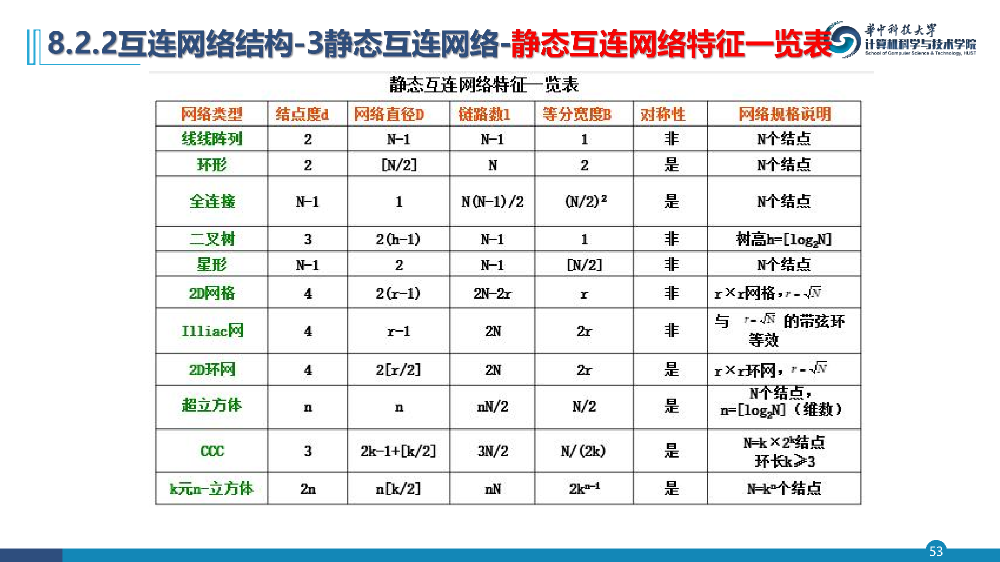

---

- **确定性寻径和自适应寻径：**
  - **确定性寻径**：通信路径完全由源结点地址和目的地址来决定，与网络的状况无关
    - 二维网格网络的X-Y寻径
    - n维超方体的E-cube寻径
  - **自适应寻径**：通信的通路每一次都要根据资源或者网络的情况来选择
    - 具有拥塞控制，可以避开拥挤的或者有故障的结点
    - 例如：TCP/IP网络

---

- **二维网格网络的X-Y寻径：先沿X维方向进行寻径，然后再沿Y维方向寻找路径**
- **任意一个源结点：s=(x₁,y₁)，任意一个目的结点：d=(x₂,y₂)**
- **从s出发，先沿X轴方向前进，直到找到d所在的列x₂；然后再沿Y轴方向前进，直到找到目标结点(x₂,y₂)**

---

- **对于二维网格，确定以下4组"源结点-目的结点"所需要的路径：**
  - (2,1)到(7,6)：需要一条东-北路径
  - (0,7)到(4,5)：需要一条东-南路径
  - (6,4)到(2,0)：需要一条西-南路径
  - (5,3)到(1,5)：需要一条西-北路径

---

- **考虑一个由N＝2ⁿ个结点构成的n方体，每个结点的编号是形为b＝bₙ₋₁...b₁b₀的二进制编码**
- **设：源结点s＝sₙ₋₁...s₁s₀，目的结点d＝dₙ₋₁...d₁d₀**
- **现在要确定一条从s到d的步数最少的路径**
- **算法：**
  1. 计算方向位rᵢ = sᵢ ⊕ dᵢ（i=1,2,...,n）
  2. 令v=s, i=1
  3. 如果rᵢ=1，则从当前结点v寻径到下一结点v⊕2ⁱ⁻¹；否则跳过
  4. i←i+1，如果i≤n，则转第3步，否则退出

---

- **动态网络：动态互连网络能够在运行时改变网络拓扑，主要分为3种形式：总线网络、交叉开关网络和多级互连网络**
- **总线网络：**
  - 由一组导线和插座构成，经常被用来实现计算机系统中处理机模块、存储模块和外围设备等之间的互连
  - 每一次总线只能用于一个源（主部件）到一个或多个目的（从部件）之间的数据传送
  - 特点：结构简单、实现成本低、带宽较窄

---

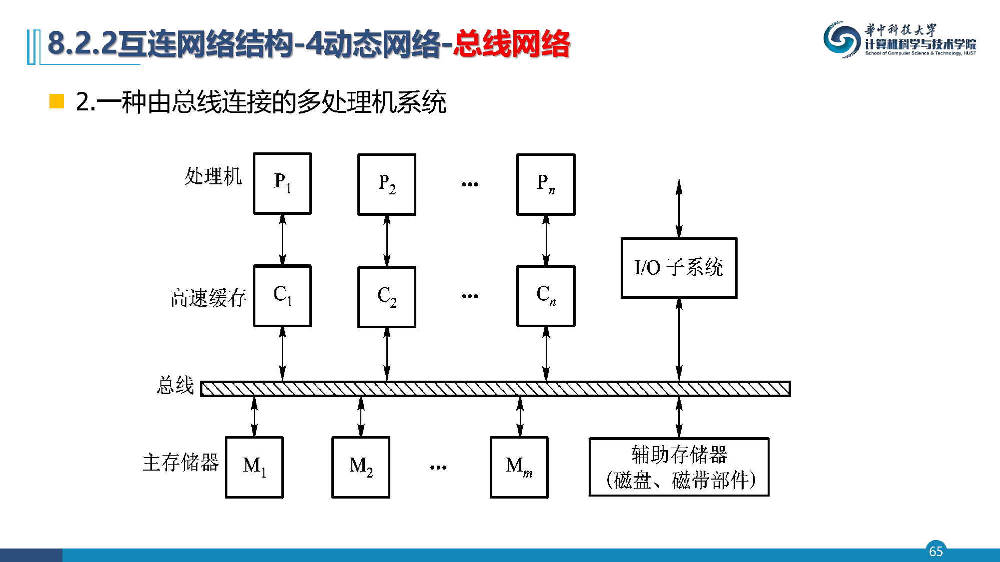

---

- **解决总线带宽较窄问题：采用多总线或多层次的总线**
  - **多总线**：设置多条总线
    - 为不同的功能设置专门的总线
    - 重复设置相同功能的总线
  - **多层次的总线**：按层次的架构设置速度不同的总线，使得不同速度的模块有比较适合的总线连接

---

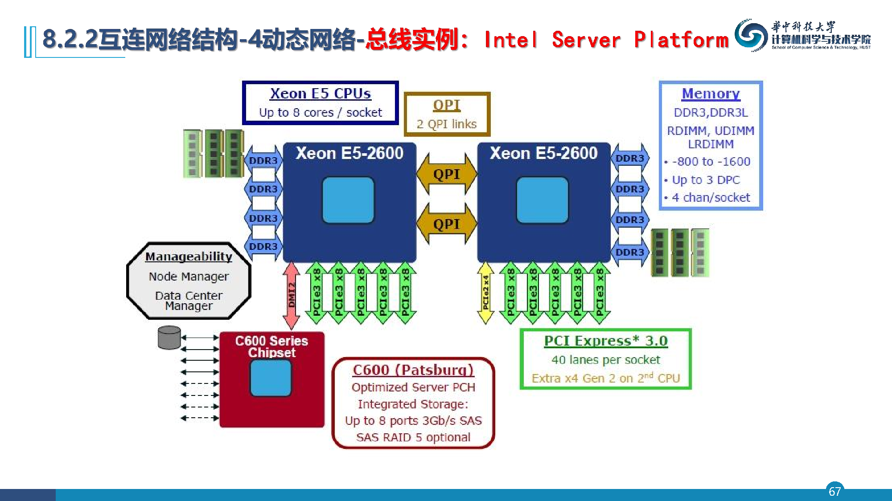

---

- **交叉开关网络：单级开关网络**
- **交叉点开关能在对偶（源、目的）之间形成动态连接，同时实现多个对偶之间的无阻塞连接**
- **带宽和互连特性最好**
- **一个n×n的交叉开关网络，可以无阻塞地实现n!种置换**
- **当n很大时，交叉开关网络所需要的硬件数量非常巨大**

---

- **C.mmp多处理机的互连结构：16台处理机与16个存储模块互连**
- **最多可同时实现16台处理机对16个不同存储模块的并行访问**

---

- **Fujitsu VPP500向量并行处理机的开关网络（224×224）：发PE₀₀₁~PE₂₂₂发送，CP₀₀₁~CP₀₀₂接通/断开接收**

---

- **多级互连网络的构成：**
  - MIMD和SIMD计算机都采用多级互连网络MIN（Multistage Interconnection Network）
  - 使用多级开关，使得数据在一次通过网络的过程中可以实现的MIN置换种类更多
  - 由a×b开关模块和级间连接构成
  - 每一级都用了多个a×b开关（a个输入和b个输出，通常a=b=2ᵏ，k≥1）
  - 相邻各级开关之间都有固定的级间连接
- **通常在N个结点的网络中，多级ICN由n级构成（n=log₂N）**
- **经典的多级互连网有多级立方体网、多级混洗交换网和多级PM2ᵢ网**

---

- **最简单的开关模块：2×2开关**
- **二元交换开关的四种基本接通状态："直连"、"交换"、"上播"和"下播"**
- **在进行数据置换时只能使用前2种**

---

- **各种多级互连网络的区别在于所用开关模块、控制方式和级间互连模式的不同**
- **控制方式：**
  - **级控制**：每一级所有开关只用一个控制信号控制，只能同时处于同一种状态
  - **单元控制**：每一个开关都有一个独立的控制信号，可各自处于不同的状态
  - **部分级控制**：第i级的所有开关分别用i+1个信号控制（0≤i≤n-1）
- **常用的级间互连模式：均匀洗牌、蝶式、多路洗牌、纵横交叉、立方体连接等**

---

- **多级立方体网络包括STARAN网络和间接二进制n方体网络等**
- **两者仅在控制方式上不同，都采用二功能（直送和交换）的2×2开关**
- **当第i级（0≤i≤n-1）交换开关处于交换状态时，实现的是Cubeᵢ互连函数**
- **一个N输入的多级立方体网络有log₂N级，每级用N/2个2×2开关模块，共需要Nlog₂N/2个开关**

---

- **间接二进制n方体网络采用单元控制，具有更大灵活性**
- **STARAN网络采用级控制和部分级控制：**
  - 采用级控制时，实现交换功能
  - 采用部分级控制时，实现移数功能

---

- **交换：将有序的一组元素头尾对称地进行交换**
- **对于由8个元素构成的组，各种基本交换的图形：**
  - (a) 4组2元交换
  - (b) 2组4元交换
  - (c) 1组8元交换

---

- **3级STARAN网络在各种级控制信号的情况下所实现的入出端连接以及所实现的交换函数和功能**

| 级控制信号 k₂k₁k₀ | 连接的输出端号序列 | 实现的分组交换 | 实现的互连函数 |
| --- | --- | --- | --- |
| 000 | 0 1 2 3 4 5 6 7 | 恒等 | I |
| 001 | 1 0 3 2 5 4 7 6 | 4组2元交换 | Cube₀ |
| 010 | 2 3 0 1 6 7 4 5 | 2组4元交换 | Cube₁ |
| 011 | 3 2 1 0 7 6 5 4 | 2组4元交换+4组2元交换 | Cube₀+Cube₁ |
| 100 | 4 5 6 7 0 1 2 3 | 1组8元交换 | Cube₂ |
| 101 | 5 4 7 6 1 0 3 2 | 4组2元交换+1组8元交换 | Cube₀+Cube₂ |
| 110 | 6 7 4 5 2 3 0 1 | 2组4元交换+1组8元交换 | Cube₁+Cube₂ |
| 111 | 7 6 5 4 3 2 1 0 | 1组8元交换 | Cube₀+Cube₁+Cube₂ |

---

- **STARAN网络用作移数网络时，采用部分级控制**

| 部分级控制信号 |  |  | 连接的输出端号序列 | 所实现的移数功能 |
| --- | --- | --- | --- | --- |
| A B C D | E G | F H | I J | K L | | |
| 1 0 0 1 | 0 1 | 0 0 | 1 1 1 0 0 0 0 | 移1 mod 8 |
| 1 0 0 1 | 0 1 | 1 0 | 2 3 4 5 6 7 0 1 | 移2 mod 8 |
| 1 0 0 1 | 1 1 | 0 0 | 4 5 6 7 0 1 2 3 | 移4 mod 8 |
| 0 1 0 1 | 1 1 | 0 0 | 1 2 3 0 5 6 7 4 | 移1 mod 4 |
| 0 1 0 1 | 0 0 | 1 0 | 2 3 0 1 6 7 4 5 | 移2 mod 4 |
| 1 0 0 1 | 0 0 | 0 0 | 1 0 3 2 5 4 7 6 | 移1 mod 2 |
| 0 0 0 0 | 0 0 | 0 0 | 0 1 2 3 4 5 6 7 | 不移/全等 |

---

- **3.Omega网络（多级混洗—交换网络）：**
  - 有log₂N级，每级N/2个2×2开关模块
  - 每个开关模块均采用单元控制方式
  - 不同开关状态组合可实现各种置换、广播或从输入到输出的其它连接
  - 级间互连采用均匀洗牌连接方式
  - 各级编号是(n-1)...1,0，即按降序排列

---

- **8×8的Omega网络：**
  - 单独一级混洗拓扑线路可完成一次数据混洗(σ)
  - 单独一列二元交换开关在处于"交换"状态时可完成一次交换操作(Cube₀)**

---

- **目的：根据给定的输入/输出对应关系，确定各开关的状态**
- **方法：源-目的地址异或法**
- **操作：将任一个输入地址与它要到达的输出地址作异或运算，其结果的bitᵢ控制数据到达的第i级开关，"0"表示"直连"，"1"表示"交换"**
- **例如：给定传输101B→011B，二者异或结果为110B，于是从101B号输入端开始，把第2、1级开关置为"交换"，第0级开关置为"直连"**

---

- **N输入互连网络，可能的置换数总共N!个**
- **N输入的Omega网，一次通过可实现N^(N/2)个→阻塞网络**

---

- **InfiniBand是IBTA行业协会于2000年10月提出的一种工业级的系统网络通信协议**
- **提供基于交换机的点到点双向串行链路结构，用于处理器节点之间以及处理器节点与输入/输出节点之间的高速互连**
- **通过交换机在节点之间直接创建一个专用的受保护通道，并通过适配器执行远程直接内存访问（RDMA）和发送/接收卸载**
- **InfiniBand采用远程直接内存访问（RDMA）实现通过网络在应用程序之间直接传输数据的能力，无需操作系统参与的零拷贝传输**
- **InfiniBand流量控制是硬件实现的，而TCP是软件实现**

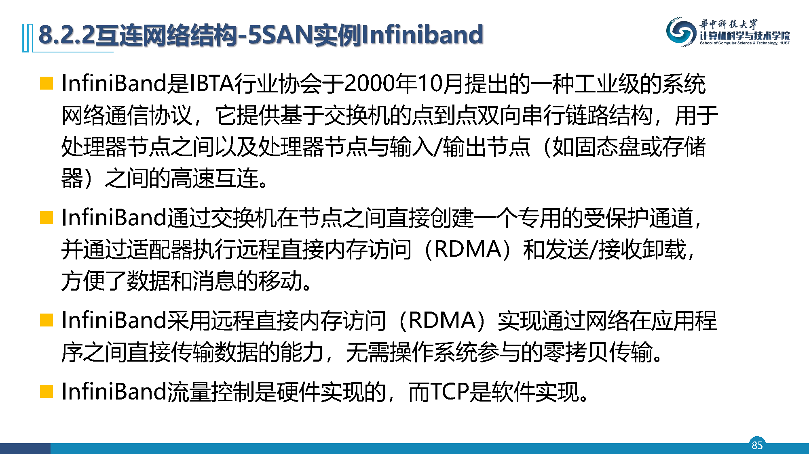

---

- **缓存一致性概念：当多个处理器同时存取内存中的共享数据时也会引入一致性问题**

---

- **对称式共享存储器系统结构（SMP）为例说明分析缓存（Cache）一致性问题**
- **允许共享数据进入Cache，就可能出现多个处理器的Cache中都有同一存储块的副本**
- **当其中某个处理器对其Cache中的数据进行修改后，就会使得其Cache中的数据与其他Cache中的数据不一致**

---

- **缓存一致性：如果对某个数据项的任何读操作均可得到其最新写入的值，则认为这个存储系统是一致的**
- **存储系统行为的两个不同方面：**
  - **What**：读操作得到的是什么值
  - **When**：什么时候才能将已写入的值返回给读操作
- **需要满足以下条件：**
  - 处理器P对单元X进行一次写之后又对单元X进行读，读和写之间没有其它处理器对单元X进行写，则P读到的值总是前面写进去的值
  - 处理器P对单元X进行写之后，另一处理器Q对单元X进行读，读和写之间无其它写，则Q读到的值应为P写进去的值
  - 对同一单元的写是串行化的，即任意两个处理器对同一单元的两次写，从各个处理器的角度看顺序都是相同的（写串行化）

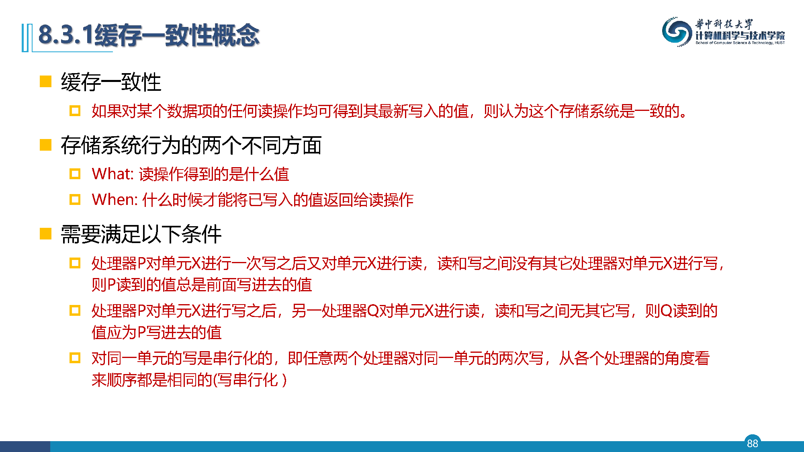

---

- **一致性假设：**
  - 直到所有的处理器均看到了写的结果，这个写操作才算完成
  - 处理器的任何访存均不能改变写的顺序
- **在多个处理器中用来维护一致性的协议，关键在于跟踪记录共享数据块的状态**
- **两类协议：**
  - 监听式协议（snooping）
  - 目录式协议（directory）

---

- **监听一致性协议（Snooping）：**
- **Cache通常连在共享存储器的总线上，当某个Cache需要访问存储器时，它会把请求放到总线上广播出去**
- **其他各个Cache控制器通过监听总线来判断它们是否有总线上请求的数据块**
- **每个Cache除了包含物理存储器中块的数据拷贝之外，也保存着各个块的共享状态信息**

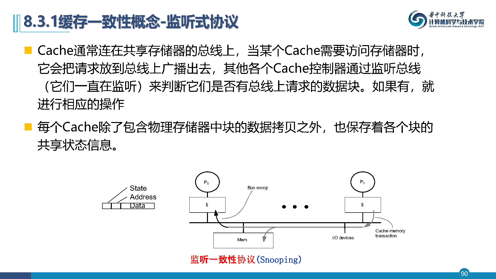

---

- **目录式协议（Directory）：**
- **记录该块的状态**
- **物理存储器中数据块的共享状态被保存在一个称为目录的地方**
- **每个节点添加一个目录，相关存储器的目录信息可能保存在多核心处理器的内部或者外部**

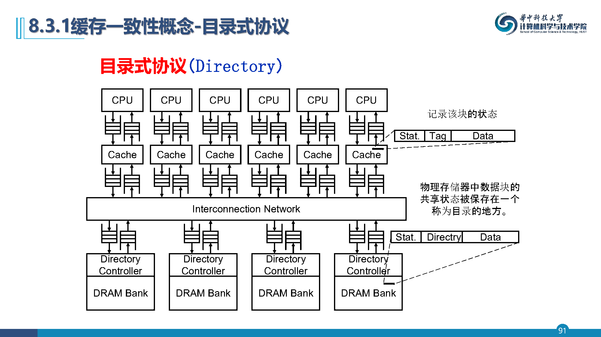

---

- **多处理器写更新操作处理：**
  - **写作废协议（写失效）**：在处理器对某个数据项进行写入之前，保证它拥有对该数据项的唯一的访问权
  - **写更新协议**：当一个处理器对某数据项进行写入时，通过广播使其它Cache中所有对应于该数据项的副本进行更新
- **写策略：写直达操作、写回操作**

---

- **写失效协议（Write Invalid Protocol）：**
- **在执行写入操作时会使其他副本失效**
- **这是最常用的协议**
- **示例：两个处理器先写、后读某一数据块的情景**
- **由于写操作需要独占访问，其他所有此数据块副本都必须失效**
- **再次读取时，数据已失效的处理器会在缓存中发生缺失，从而强制读取数据块的新副本**
- **这一协议实现了写入串行化**

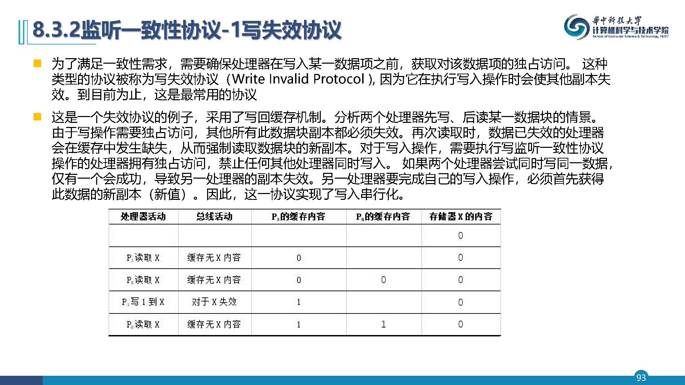

---

- **失效协议中，共享总线或其他广播介质来执行失效操作**
- **在写入一个共享块时，执行写入操作的处理器必须获取总线访问权限来广播其失效**
- **如果两个处理器尝试同时写入共享块，当它们争用总线时，由总线实现这些写入操作的串行化**
- **写回缓存可以为缓存缺失和写入操作使用相同的监听机制**
- **每个处理器都监听放在共享总线上的所有地址**
- **在每个结点内嵌入一个有限状态控制器**

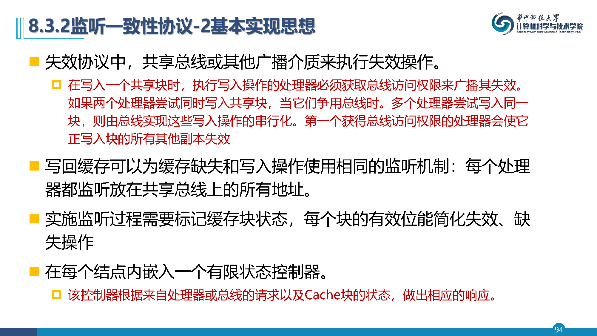

---

- **监听缓存（Snoopy Cache）结构：每个块有一个相关联的独立控制器**
- **对不同块的监听操作或缓存请求可以独立进行**
- **实际中，单个控制器允许交错执行以不同块为目标的多个操作**

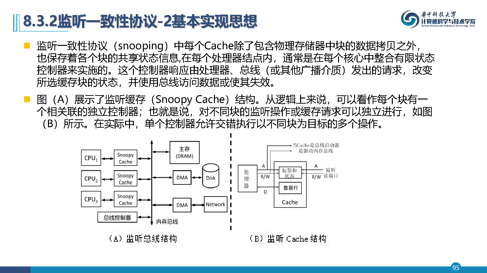

---

- **每个数据块有三种状态：修改（Modified）、共享（Shared）和无效（Invalid），称之为MSI协议**
- **共享状态表明专用缓存中的块可能被共享**
- **已修改状态表明在专用缓存中更新了这个块**

---

- **MSI协议状态转换：**
  - **读取命中**：正常命中，处理器在共享或已修改状态下读取本地缓存中的数据
  - **读取缺失**：在无效状态下产生读取缺失，将读取缺失放在总线上
  - **地址冲突缺失**：在共享或已修改状态下产生地址冲突缺失，已修改状态需要写回块
  - **写命中**：在已修改状态下正常命中，在共享状态下产生一致性操作（失效）
  - **写缺失**：在无效或共享状态下产生写缺失

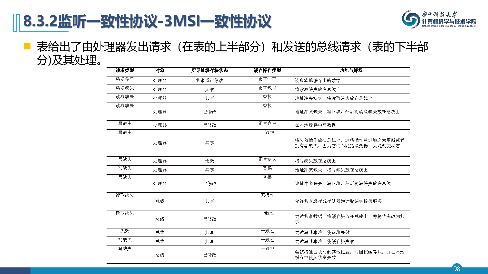

---

- **每个高速缓存行都有状态标志位：**
  - **M（Modified）**：已修改
  - **S（Shared）**：共享
  - **I（Invalid）**：无效

---

- **MSI基本协议的扩展：**
  - **MESI协议**：在基本MSI协议中添加了"独占"(Exclusive)状态，用于表示缓存块仅在一个缓存中且是干净的
  - **MOESI协议**：在MESI协议基础之上添加了"拥有"(Owned)状态，表示相关块由该缓存拥有，在存储器中已经过时

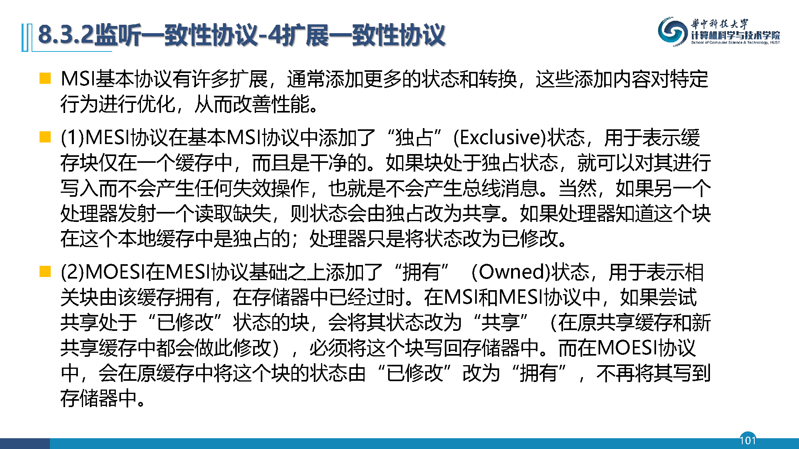

---

- **监听一致性协议的开销和挑战：**
  - **性能开销**：节点之间需要通信、交换消息和协商，增加网络延迟和计算负载
  - **节点故障**：协议可能需要额外的机制来处理节点的故障
  - **异步通信**：无法保证在有限时间内达到一致性
  - **扩展性**：在大规模系统中的扩展性是一个挑战
  - **安全性**：对拜占庭容错具有限制

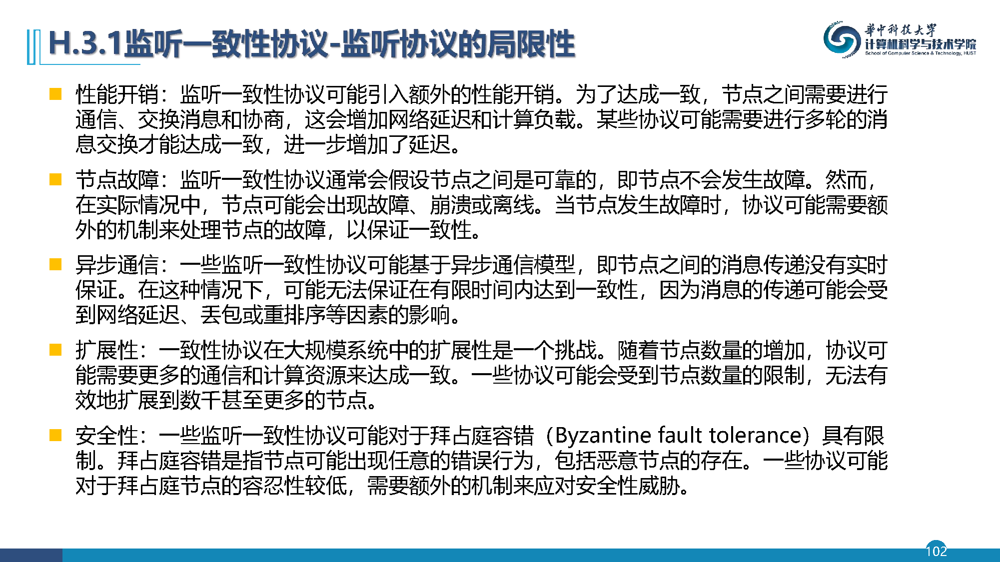

---

- **Cache缺失归因于三种因素：容量(Capacity)、强制(Compulsory)和冲突(Conflict)**
- **多处理器之间的通信也会导致缺失，被称为一致性缺失，分为两种情况：**
  - **真共享缺失**：源自通过缓存一致性机制进行的数据通信
  - **假共享缺失**：因为使用了基于失效的一致性算法，这种算法利用了数据块的有效位

---

- **集中式数据结构的瓶颈问题：近年，多核处理器的发展迫使设计转向某种分布式存储器，以支持各个处理器的带宽要求**
- **通过分布式存储器来提高存储器带宽和互连带宽，本地存储器通信与远程存储器通信隔离开来，将降低了对存储器系统和互连网络的带宽要求**
- **监听式一致性协议的替代方法是目录式协议**
- **目录中保存了每个可缓存块的状态，包括哪些缓存（或缓存集合）拥有这个块的副本，它是否需要更新等**

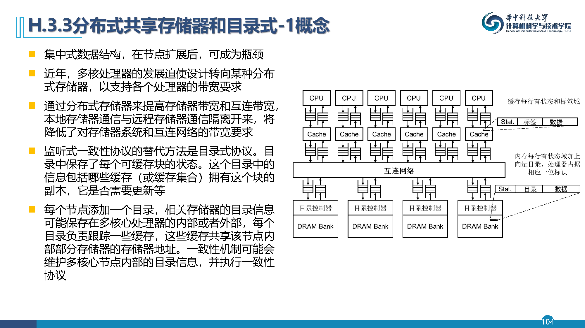

---

- **目录式协议的三种状态：**
  - **共享**：一个或多个节点缓存这个块，存储器的值是最新的
  - **未缓存**：所有节点都没有这个缓存块的副本
  - **已修改**：只有一个节点有这个缓存块的副本，它已经对这个块进行了写操作，所以存储副本已经过期。这个处理器被称为这个块的拥有者
- **目录式协议也必须实现两种主要操作：处理读取缺失和处理写共享块**

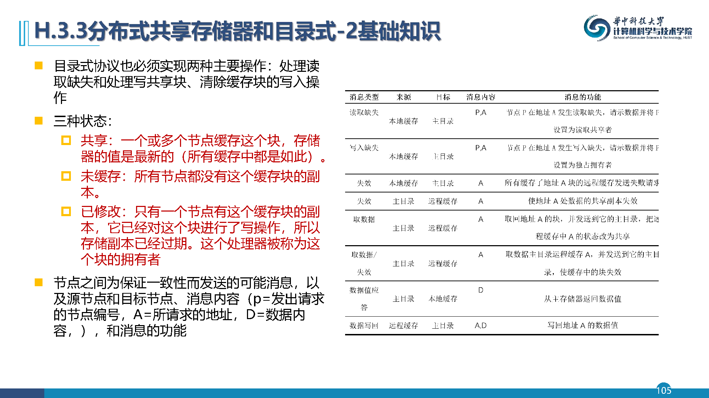

---

- **多个进程或者线程需要并发执行时，需要考虑它们之间如何同步**
- **同步机制通常是以软件例程实现的，这些例程依赖于硬件提供的同步指令**
- **对于较小型的多处理器或低竞争解决方案，关键硬件功能是拥有不可中断的指令或指令序列，它们能以原子方式获取和修改一个值**

---

- **在多处理器中实施同步时所需要的关键功能就是一组能够以原子方式读取和修改存储器的硬件原语**
- **硬件原语：**
  - （1）原子交换（atomic exchange）
  - （2）测试并置定（test and set）
  - （3）读取并加1（fetch and increment）

---

- **一般利用一对指令构造同步原语，通过第二条指令返回值判断这一对指令是否以原子形式执行**
- **在RISC-V中，这种指令对包含：**
  - **LR（load reserved或load linked）**：链接载入指令
  - **SC（store conditional）**：条件存储指令

---

- **在拥有原子操作之后，就可以使用多处理器的一致性机制来实施自旋锁（spinlock）**
- **处理器持续用循环来尝试获取锁，直到成功为止**
- **多处理器支持缓存一致性，就可以使用一致性机制将锁放在缓存中，保持锁值的一致性**
- **将锁放在缓存中有两个好处：**
  - 第一，仅通过循环针对本地缓存副本完成"自旋"过程，不需要在每次尝试获取锁时都请求全局存储器访问
  - 第二个好处是利用了锁访问存在的局域性

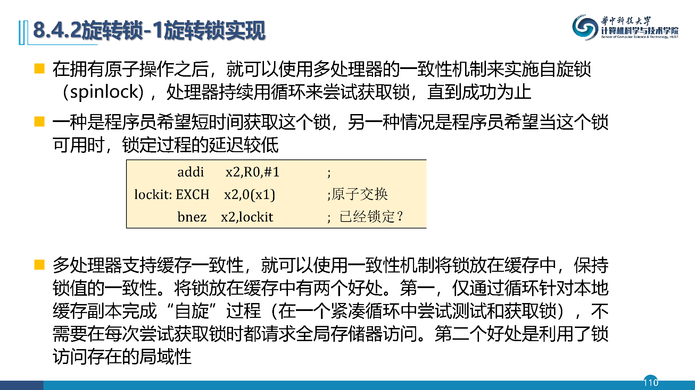

---

- **使用LR/SC原语实现旋转锁操作**
- **第一个分支形成环绕的循环体，第二个分支解决了两个处理器同时看到锁可用的情况下的争用问题**
- **改进旋转锁的整体思路是：首先只对本地Cache中锁的副本进行读取和检测，直到发现该锁已经被释放**

---

- **旋转锁的主要优点是当重复访问未变锁值时，总是cache读命中，从而减少其内存访问**
- **在大规模多处理机中，若所有的处理器都同时争用同一个锁，则会导致大量锁争用和通信开销**
- **当竞争不激烈且同步操作较少时，主要关心的是一个同步原语操作的延迟**

---

- **当多个处理器通过共享变量进行通信时，缓存视图一致性（coherence）保证了多个处理器读到存储器内容是一致的**
- **不同处理器上程序读写多个共享变量次序和内存看到的读写次序可能不一样**
- **其原因在于现代处理器为了优化写性能，会使用写缓存**
- **如果一个或多个处理器发出的读写次序到达存储器的次序是否相同，则称为存储顺序一致性（consistency）问题**

---

- **存储顺序一致性的最简单模型称为顺序一致性模型（sequential consistency）**
- **顺序一致性要求在不同处理器之间的访问任意交错时，但是存取内存的顺序都是一样的，就像每个处理器是按顺序执行存储器访问操作**
- **实现顺序一致性模型的最简单方法是要求处理器立刻执行所有存储器访问，直到该访问操作所导致的其他处理器缓存全部失效均告完成为止**
- **顺序一致性模型给出了一种简单的编程范例，但它可能会大幅度降低性能，特别是当多处理器数目很多或者互连延迟很长时**

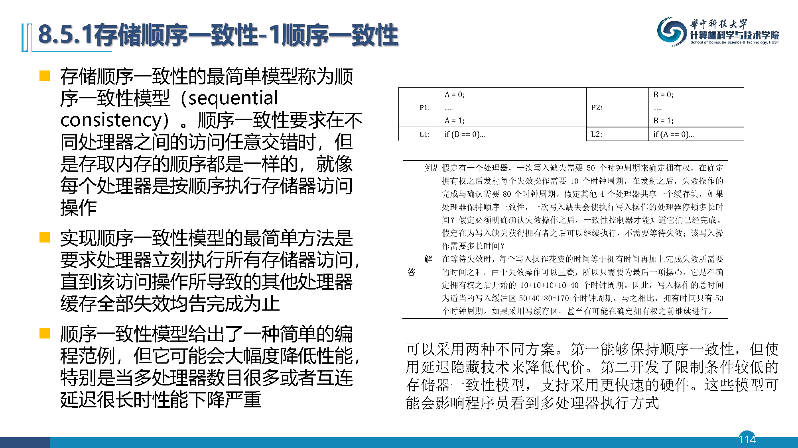

---

- **从程序员的角度来看，顺序一致性模型是直观和简单，但有性能方面的不足**
- **一种更高效的编程模型是程序员通过显示地同步操作控制对共享数据的访问次序**
- **无论什么情况，一个处理器对某一变量的写入操作与另一个处理器对这个变量的访问（或者为读取，或者为写入）之间由一对同步操作隔离开来**
- **如果变量可以在未由同步操作进行排序的情况下更新，就会产生数据竞赛（data races）**
- **几乎所有的程序员都选择使用标准同步库**

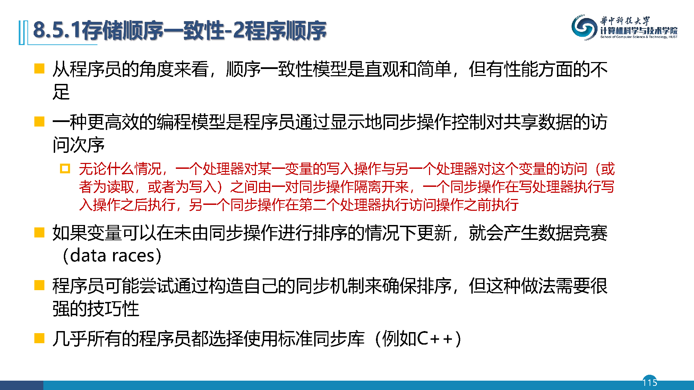

---

- **宽松一致性模型的关键思想是允许乱序执行读取和写入操作，但使用同步操作来实施排序**
- **形式化定义一组规则来描述顺序，其形式为X→Y，也就是说必须在完成操作X之后才能执行操作Y**
- **放松W→R顺序：得到完全存储排序或处理器一致性模型（Total Store Order，TSO）**
- **放松W→R和W→W顺序：得到部分存储顺序的模型**
- **放松四种顺序：得到弱排序、PowerPC一致性模型、释放一致性、RISC-V一致性模型**
- **更强的一致性模型能够简化编程，但需要更多的硬件确保执行次序**

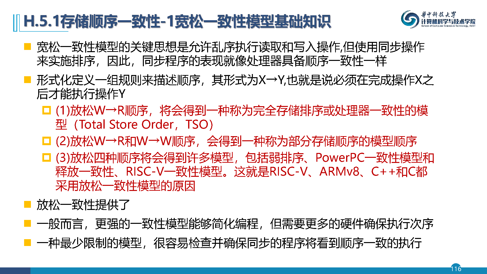

---

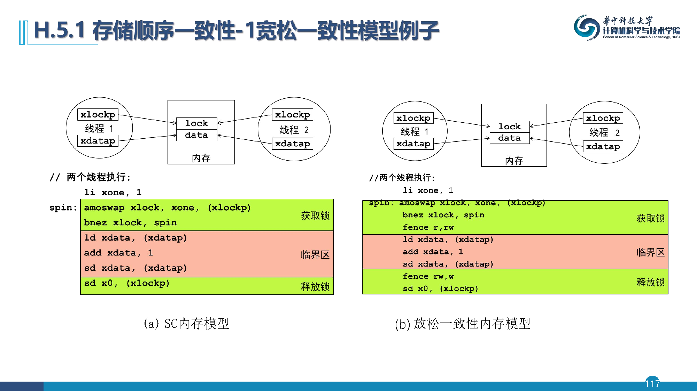

---

- **多级缓存提供包含性（multilevel inclusion），也就是缓存层次结构中上一级都是下一级的子集**
- **当L1和L2的块大小不同时，一般L2的通常要大得多，而L2中的一个块对应于L1中的多个块**

---

- **附录H进一步介绍了多处理器相关的扩展内容**
- **在8.3节的基础之上讲解了监听协议的局域性、对称共享存储器多处理器的性能和面向分布式共享存储器的目录式一致性协议**
- **在8.5节的基础之上讲解了宽松一致性模型和包含性及实现**

---

---
