<!-- _class: lead -->

# 计算机集群和数据中心

**计算机系统结构**


---

## 本章内容

- **掌握数据中心的基本特性**
- **理解数据中心的工作负载**
- **掌握数据中心的计算机体系结构**
- **理解数据中心的效率与成本**

---

<style>
.columns { display: grid; grid-template-columns: 1fr 1fr; gap: 1.5rem; }
</style>

<div class='columns'>

<div>

- **数据中心是许多人每日所用互联网服务的基础，这些服务包括：搜索、社交网络、在线地图、视频共享、网上购物、电子邮件服务等**
  - 谷歌称其为Warehouse-Scale Computer，WSC
- **在互联网服务庞大市场的驱动下，数据中心得到了快速发展**
- **传统的巨型计算机系统如超算，尽管数据中心看起来和其颇为相似，但体系结构和工作任务有很大的不同**
- **如今的数据中心成本大约为1亿5千万美元，包括机房、配电与制冷基础设施、服务器和联网设备，连接和容纳50000～100000台服务器**
- **此外，云计算的快速发展让每一个拥有在线支付账户的人都能使用数据中心**

</div>

<div>

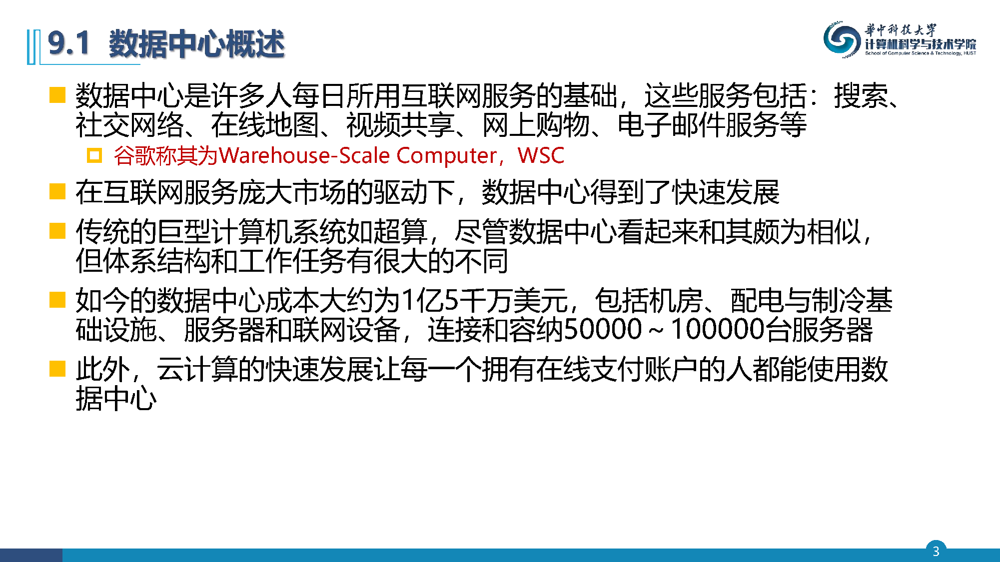

</div>

</div>

---

<style>
.columns { display: grid; grid-template-columns: 1fr 1fr; gap: 1.5rem; }
</style>

<div class='columns'>

<div>

- **数据中心的早期形态，是被称作计算机集群（Cluster）的系统，最早出现于20世纪60年代，用以运行单机难以装载的大型计算任务，抑或需要在处理过程中以冗余备份机应对处理机的意外失效**
  - Tandem公司在1975年推出了一个包含16个节点的集群系统
  - Digital公司在1984年推出了VAX集群系统
- **此类系统最初采取的是一种由独立处理机共享I/O设备的设计，通过一种分布式操作系统来进行协调**
- **随后，又给处理机提供了互连网络，以支持处理机在空间上的分布，实现容灾、提高可用性**

</div>

<div>

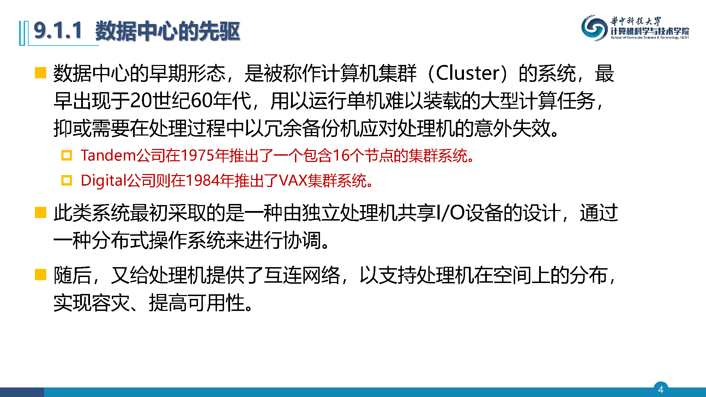

</div>

</div>

---

<style>
.columns { display: grid; grid-template-columns: 1fr 1fr; gap: 1.5rem; }
</style>

<div class='columns'>

<div>

- **在科学计算领域，集群系统已成为并行多处理机（Multiple Parallel Processors，MPP）的主要竞争对手**
- **1994年，贝奥武夫（Beowulf）项目启动**
  - 旨在实现美国国家航空航天局的低成本1 GFLOPS算力计算机目标（成本在5万美元以内）
- **1994年，基于16台80486个人计算机成功实现了这样一套集群系统**
  - 其关键在于实现一套软件生态，为任务提交、协同工作以及调试大型或大批程序提供支持

</div>

<div>

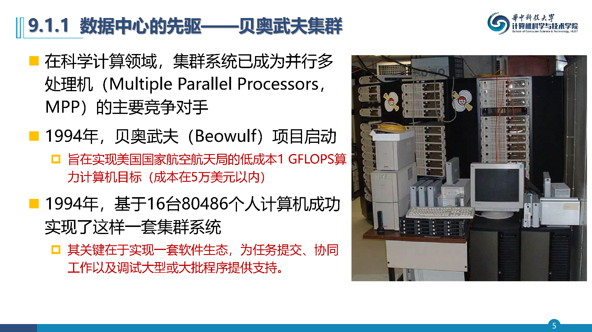

</div>

</div>

---

<style>
.columns { display: grid; grid-template-columns: 1fr 1fr; gap: 1.5rem; }
</style>

<div class='columns'>

<div>

- **随后，有不少研究工作聚焦于减少集群处理机之间的通信延迟，提高传输带宽**
  - 其中有一项成功的商业化成果，即虚拟接口（Virtual Interface，VI）接口标准，为集群处理机之间提供了低延迟的通信机制，在随后的工作中由Infiniband发展壮大
- **低延迟通信技术随即在形形色色的应用中表现出了价值，例如**
  - 1997年由加州大学伯克利分校基于100台UltraSPARC台式机组建的集群系统，使用由Myrinet提供的单链路160MB/s交换机连接
  - 创造了数据库排序的世界纪录，也就是在1min之内完成存放于磁盘内8.6GB数据的排序，以及仅用3.5h破解由40-bit DES密钥加密的信息

</div>

<div>

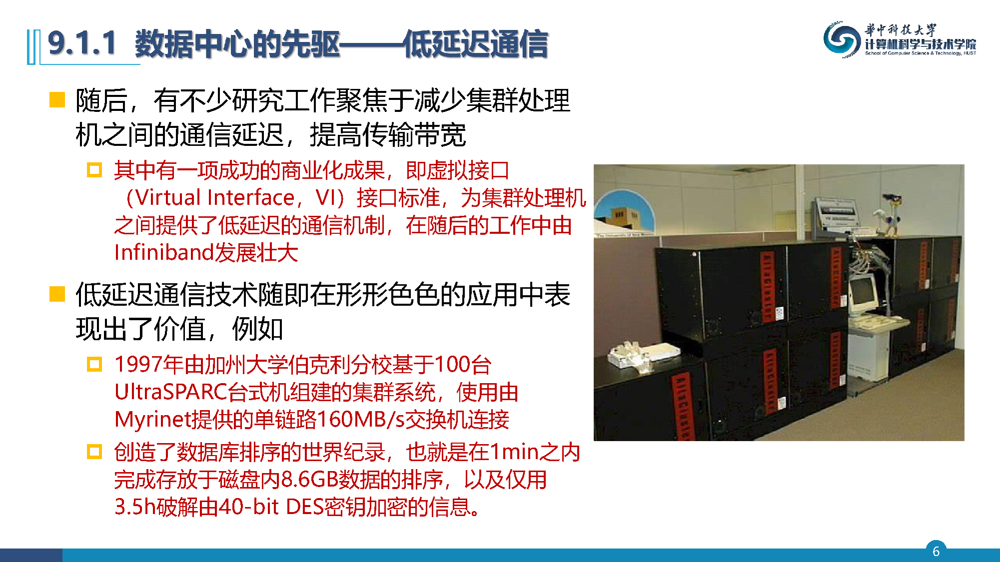

</div>

</div>

---

<style>
.columns { display: grid; grid-template-columns: 1fr 1fr; gap: 1.5rem; }
</style>

<div class='columns'>

<div>

- **1995年，搜索引擎Inktomi背后的同名初创公司启动了一个名为工作站网络NOW的项目**
  - 标准化网络和常规机架式服务器让Inktomi构建的集群具备了优秀的可扩展性
  - 与之形成鲜明对比的是，彼时领先的搜索引擎Alta Vista则是基于大规模对称多处理器系统实现
  - 和传统高性能计算架构相比，集群系统借助于相对更大规模的低成本节点和简洁的编程模型，走向了一条更经济的发展路线
- **在随后的发展历程中，NOW项目和Inktomi一般就被当做数据中心和云计算的奠基工作，谷歌将这条技术路线发展壮大，成为了最成功的搜索引擎**
  - 这套系统也被谷歌称作WSC的数据中心架构，在其著名的搜索结果排序算法PageRank之后被作为最关键的创新公之于众
  - 经历多年考验至今，几乎所有互联网服务都基于集群技术来构建系统，以服务数以百万计的海量客户

</div>

<div>

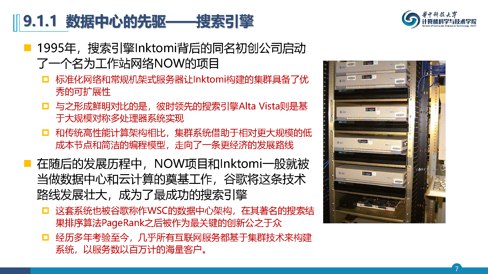

</div>

</div>

---

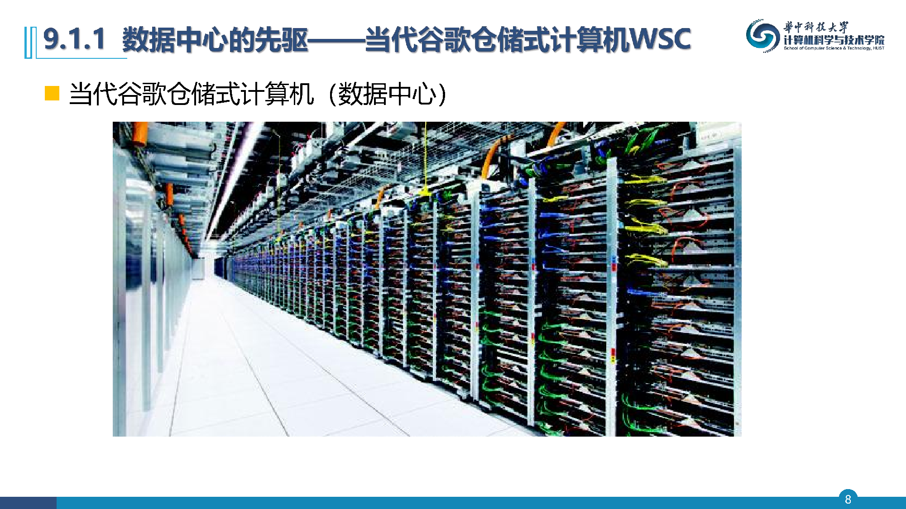

---

<style>
.columns { display: grid; grid-template-columns: 1fr 1fr; gap: 1.5rem; }
</style>

<div class='columns'>

<div>

- **当前数据中心的规模已经达到相当的水平，以至于不能继续依赖传统的供电、冷却和监控管理方法，需要在这些方面做出创新**
- **数据中心也常常被认为是超级计算机的现代衍生物——后者使西摩·克雷（Seymour Cray）成为当今数据中心架构师的先驱**
  - 高端计算机可以完成几乎在其它所有机器上都无法运行的计算任务，但又十分昂贵，只有很少几家客户可以承受得起
  - 而现在的目标是为普罗大众提供信息技术，而不再是仅为科学家和工程师们提供高性能计算
  - 因此，相对于超级计算机在过去发挥的作用，数据中心在当今社会中具有更为普遍的意义

</div>

<div>

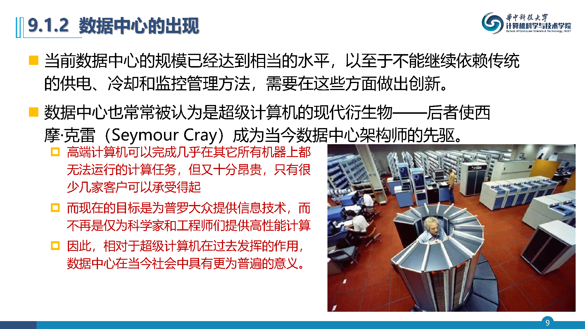

</div>

</div>

---

<style>
.columns { display: grid; grid-template-columns: 1fr 1fr; gap: 1.5rem; }
</style>

<div class='columns'>

<div>

- **数据中心架构师有许多目标和需求与高性能服务器架构师是一致的**
  - **成本与性能**：单位资金能够完成的工作量至关重要，数据中心的规模太大了
  - **能耗效率**：配电成本与功率消耗具有函数关系，需要有充足的配电供给才能按照额定功率运转
  - **通过冗余提高可靠性**：互联网服务的性质要求其必须长时间运行，这就意味着数据中心中的硬件和软件在整体上至少提供99.99%的可用性，即，每年的宕机时间必须小于1h
  - **网络I/O**：服务器架构师必须提供一个有性能保证的外部网络，数据中心架构师也必须如此
  - **交互式与批处理工作负载**：对于诸如搜索和社交网络等拥有海量用户的服务，人们期望其工作负载具有很强的交互性

</div>

<div>

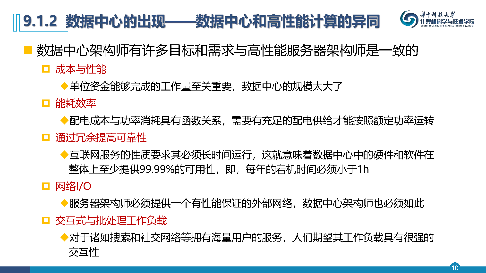

</div>

</div>

---

<style>
.columns { display: grid; grid-template-columns: 1fr 1fr; gap: 1.5rem; }
</style>

<div class='columns'>

<div>

- **数据中心架构师有许多目标和需求与高性能服务器架构师是一致的**
  - **充足的并行**：服务器架构师的一个顾虑是目标应用是否有足够的并行度，以充分发挥大量并行硬件的功用，为实现这一并行，需要通信硬件提供足够的资源和性能，其成本是否过高？数据中心架构师则不关注应用内部的并行度，用户之间足以充分并行
  - **运行成本计算**：服务器架构师通常是在成本预算内使设计的系统实现峰值性能，对于功率的主要顾虑是确保其不会超出机柜的冷却能力；对于服务器的运行成本，相对于购买成本来说，一般不那么显著，因此一般会被忽略；数据中心的寿命明显要长于服务器，机房、配电和制冷基础设施通常要使用10年以上，所以运营成本也不可小视
  - **规模、与规模相关的机会/问题**：通常，高端计算机都异常昂贵，因其常常需要定制硬件，但又因为高端计算机的制造数量很少，所以就无法有效地分摊定制成本；如果是购买50000台常规服务器和相关基础设施，用来建造一个数据中心，那就完全不同

</div>

<div>

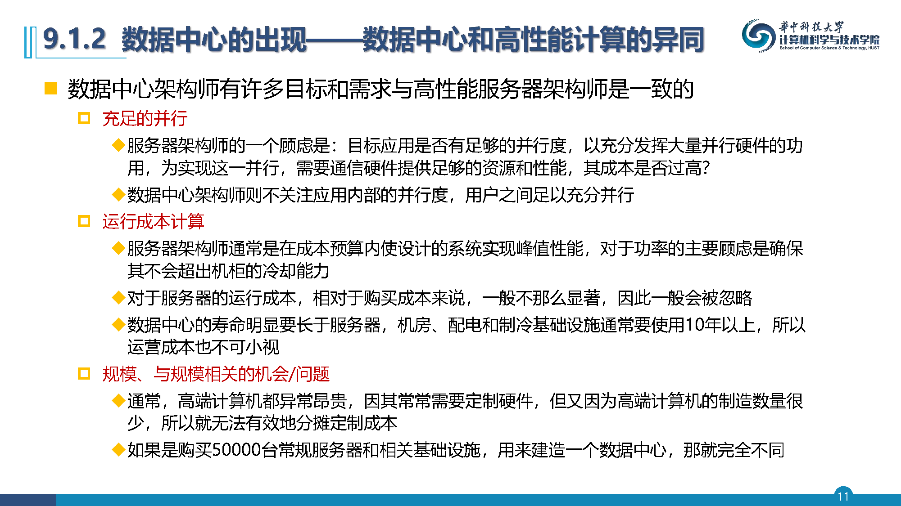

</div>

</div>

---

<style>
.columns { display: grid; grid-template-columns: 1fr 1fr; gap: 1.5rem; }
</style>

<div class='columns'>

<div>

- **数据中心与传统服务器机房相比又怎么样呢？**
  - 传统服务器机房的运营商通常会从其所服务组织的多个部门收集机器和第三方软件，并集中运行和管理
    - 通常关注将许多信息服务整合到相对较少的机器中以节约成本提高效率，即服务器整合（Server Consolidation），这些机器往往还要相互隔离，以保护敏感信息
    - 因此，虚拟机的重要性日益增加
  - 与数据中心不同的是：传统服务器机房往往拥有各种原本分属不同客户的各型硬件和软件，为一家组织中的各种客户分别提供服务；数据中心程序员则自行定制第三方软件或者专门开发软件，数据中心往往拥有更为同质化的硬件，数据中心的目标是让整个系统中的硬件、软件看起来就像是只有一台计算机，只是上面运行着各种不同的应用程序

</div>

<div>

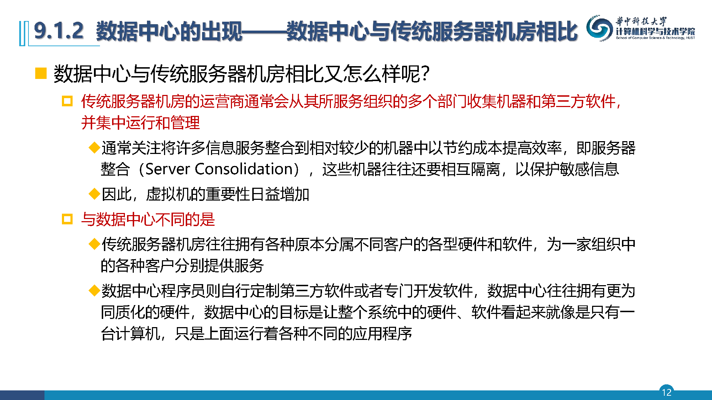

</div>

</div>

---

<style>
.columns { display: grid; grid-template-columns: 1fr 1fr; gap: 1.5rem; }
</style>

<div class='columns'>

<div>

- **亚马逊分布在全球的数据中心**

In 2017 AWS had 16 sites ("regions"), with two more opening soon. Most sites have two to three availability zones, which are located nearby but are unlikely to be affected by the same natural disaster or power outage, if one were to occur. (The number of availability zones are listed inside each circle on the map.) These 16 sites or regions collectively have 42 availability zones. Each availability zone has one or more WSCs.

https://aws.amazon.com/about-aws/global-infrastructure/

</div>

<div>

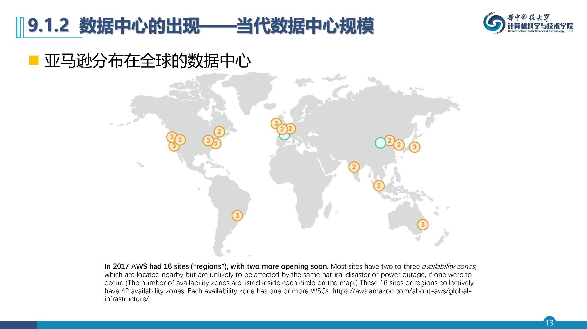

</div>

</div>

---

<style>
.columns { display: grid; grid-template-columns: 1fr 1fr; gap: 1.5rem; }
</style>

<div class='columns'>

<div>

- **谷歌分布在全球的数据中心**

In 2017 Google had 15 sites. In the Americas: Berkeley County, South Carolina; Council Bluffs, Iowa; Douglas County, Georgia; Jackson County, Alabama; Lenoir, North Carolina; Mayes County, Oklahoma; Montgomery County, Tennessee; Quilicura, Chile; and The Dalles, Oregon. In Asia: Changhua County, Taiwan; Singapore. In Europe: Dublin, Ireland; Eemshaven, Netherlands; Hamina, Finland; St. Ghislain, Belgium.

https://www.google.com/about/datacenters/inside/locations/

</div>

<div>

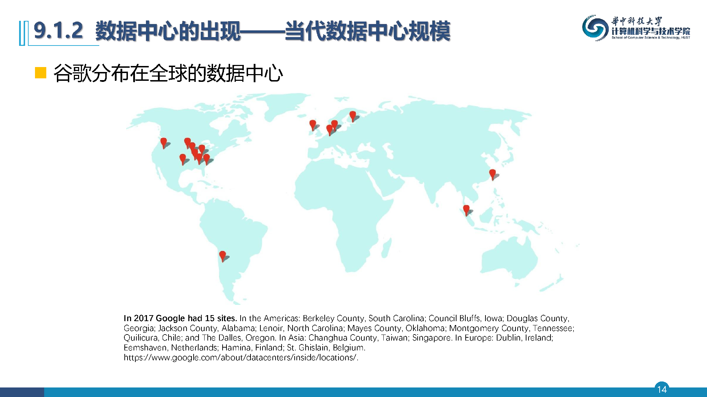

</div>

</div>

---

<style>
.columns { display: grid; grid-template-columns: 1fr 1fr; gap: 1.5rem; }
</style>

<div class='columns'>

<div>

- **微软分布在全球的数据中心**

In 2017 Microsoft had 34 sites, with four more opening soon.

https://azure.microsoft.com/en-us/regions/

</div>

<div>

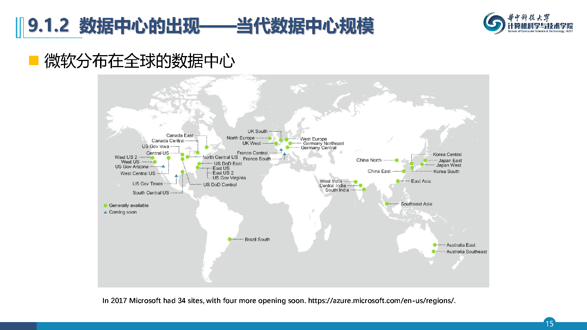

</div>

</div>

---

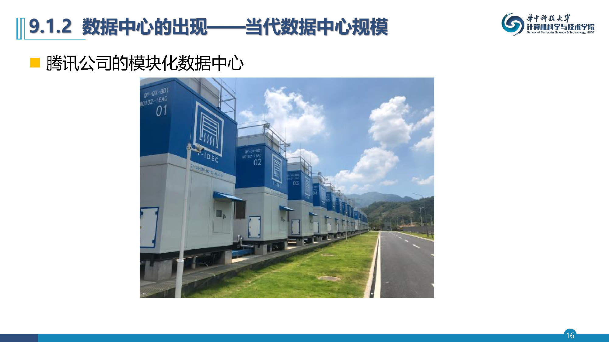

---

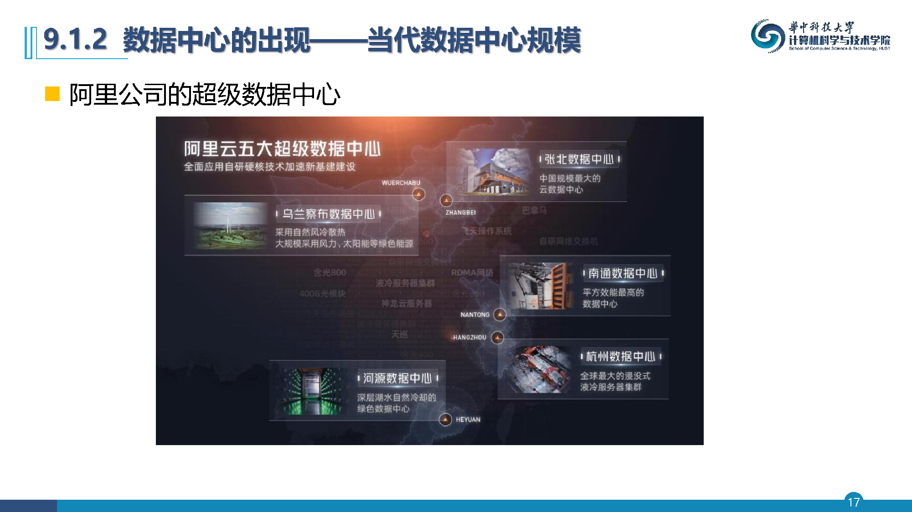

---

<style>
.columns { display: grid; grid-template-columns: 1fr 1fr; gap: 1.5rem; }
</style>

<div class='columns'>

<div>

- **数据中心中最流行的批处理框架是MapReduce及开源框架Hadoop**

| 统计日期 | MapReduce作业数 | 平均完成时间（s） | 每项作业均使用的服务器台数 | 每台服务器的平均核数 | 用核年合计 | 输入数据（PB） | 中间数据（PB） | 输出数据（PB） |
| --- | --- | --- | --- | --- | --- | --- | --- | --- |
| 2016-9 | 95775891 | 331 | 130 | 2.4 | 311691 | 11553 | 4095 | 6982 |
| 2015-9 | 115375750 | 231 | 120 | 2.7 | 272322 | 8307 | 3980 | 5801 |
| 2014-9 | 55913646 | 412 | 142 | 1.9 | 200778 | 5989 | 2530 | 3951 |
| 2013-9 | 28328775 | 469 | 137 | 1.4 | 81992 | 2579 | 1193 | 1684 |
| 2012-9 | 15662118 | 480 | 142 | 1.8 | 60987 | 2171 | 818 | 874 |
| 2011-9 | 7961481 | 499 | 147 | 2.2 | 40993 | 1162 | 276 | 333 |
| 2010-9 | 5207069 | 714 | 164 | 1.6 | 30262 | 573 | 139 | 37 |
| 2009-9 | 4114919 | 515 | 156 | 3.2 | 33582 | 548 | 118 | 99 |
| 2007-9 | 2217000 | 395 | 394 | 1.0 | 11081 | 394 | 34 | 14 |
| 2006-3 | 171000 | 874 | 268 | 1.6 | 2002 | 51 | 7 | 3 |
| 2004-8 | 29000 | 634 | 157 | 1.9 | 217 | 3.2 | 0.7 | 0.2 |

</div>

<div>

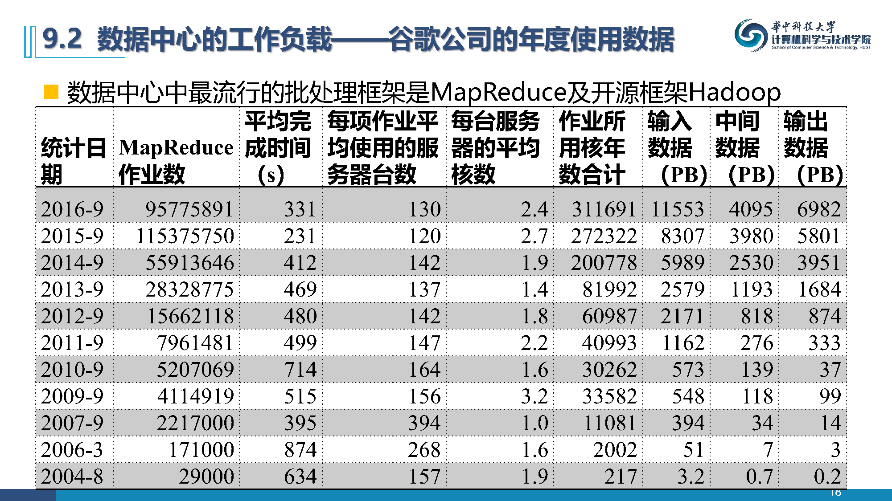

</div>

</div>

---

<style>
.columns { display: grid; grid-template-columns: 1fr 1fr; gap: 1.5rem; }
</style>

<div class='columns'>

<div>

- **数据中心中最流行的批处理框架是MapReduce及开源框架Hadoop**
  - 表中显示了谷歌公司MapReduce的年度使用数据
  - 受同名Lisp函数的启发，Map首先将程序员提供的函数应用于每条逻辑输入记录。Map在数千台计算机上运行，生成由键/值对组成的中间结果
  - Reduce收集这些分布式任务的输出，并使用另一个由程序员定义的函数来分解它们
  - 通过适当的软件支持，这两者都是高度并行的，而且其理解和使用都很容易
  - 在30分钟之内，不需要如超算那样进行严谨的培训，新手就可以在数千台计算机上运行MapReduce任务

</div>

<div>

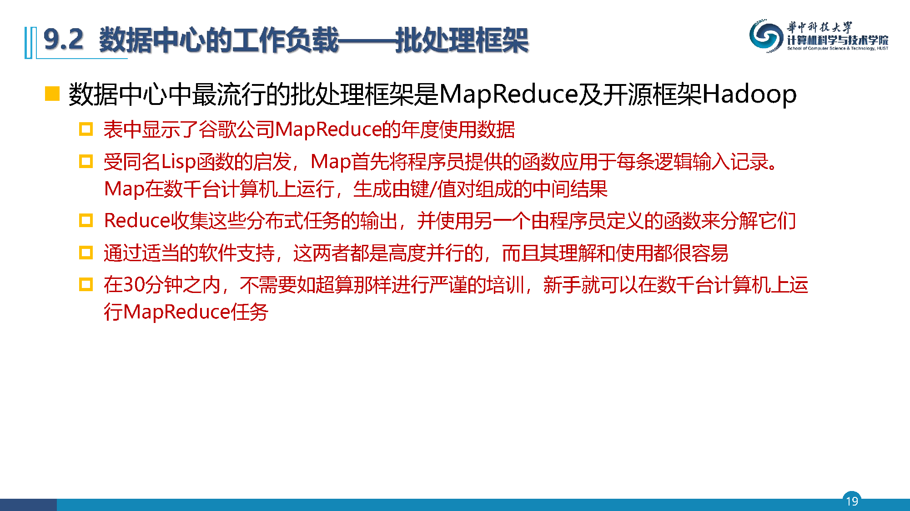

</div>

</div>

---

<style>
.columns { display: grid; grid-template-columns: 1fr 1fr; gap: 1.5rem; }
</style>

<div class='columns'>

<div>

- **例如，用一个MapReduce程序计算一大组文档中每个英文单词的出现次数。下面是这个程序的简化版本，仅给出了内层循环，并假定所有英文单词仅在文档中出现一次**

```python
map(String key, String value):
  // key: document name
  // value: document contents
  for each word w in value
    EmitIntermediate(w,"1"); // Produce list of all words

reduce(String key, Iterator values):
  // key: a word
  // value: a list of counts
  int result = 0;
  for each v in values
    result += ParseInt(v); // get integer from key-value pair
  Emit(AsString(result));
```

</div>

<div>

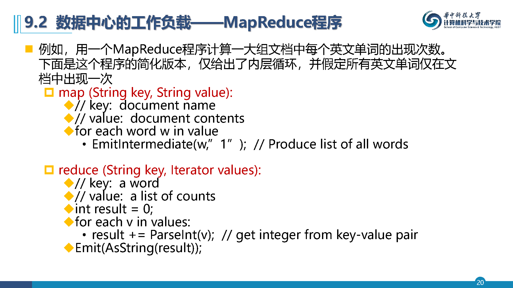

</div>

</div>

---

<style>
.columns { display: grid; grid-template-columns: 1fr 1fr; gap: 1.5rem; }
</style>

<div class='columns'>

<div>

- **为了适应数千台计算机的性能变化，MapReduce调度程序根据各个节点完成先前任务的速度来分配新的任务**
  - 显然，哪怕只有一个速度缓慢的任务，也可能会阻挡大型MapReduce作业的完成
- **在数据中心中，对缓慢任务的解决方法是提供一种软件机制，以应对如此规模的性能变化**
  - 这种方法与传统集群系统采取的解决方案截然不同，在集群系统中，任务缓慢通常意味着硬件损坏，需要替换，或者服务器软件需要调优或重写
  - 对于数据中心中的数万台服务器来说，性能出现差异是正常现象

</div>

<div>

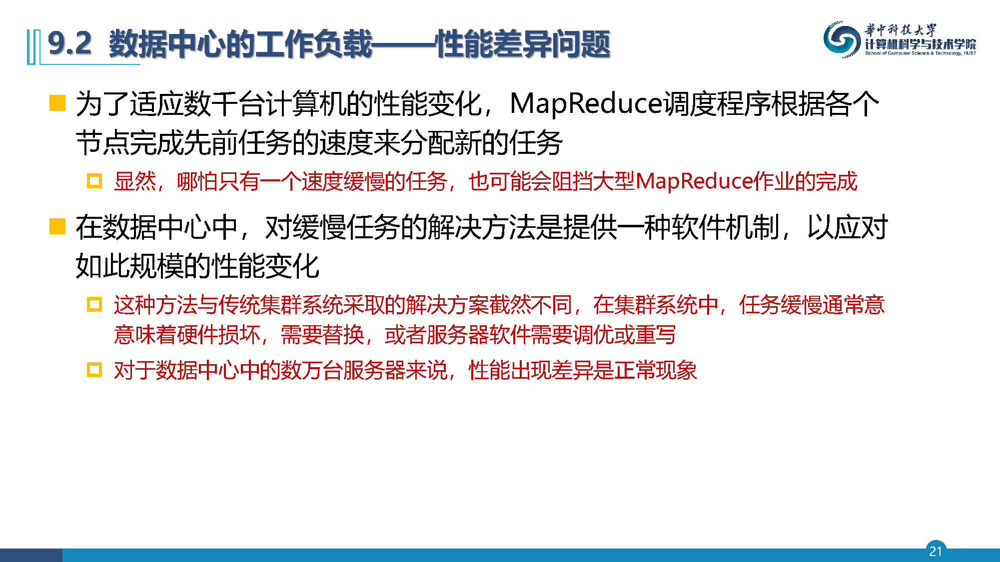

</div>

</div>

---

<style>
.columns { display: grid; grid-template-columns: 1fr 1fr; gap: 1.5rem; }
</style>

<div class='columns'>

<div>

- **公共交互式服务的工作负载需求都会有大幅波动**
  - 即使是谷歌搜索这样流行的全球性服务，在一天中的不同时间也可能会有两倍的变化幅度
- **如果针对某些应用程序考虑周末、假日和一年中高峰时间等因素，将会看到提供互联网服务的服务器在利用率方面都波动较大**
  - 如春节假期的红包服务，或者"双十一"的网上购物活动

</div>

<div>

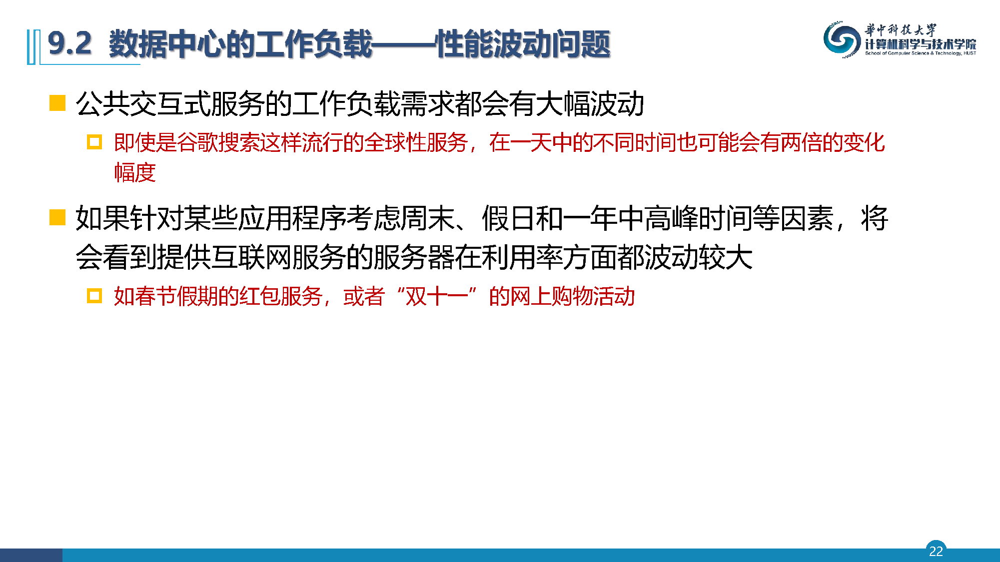

</div>

</div>

---

<style>
.columns { display: grid; grid-template-columns: 1fr 1fr; gap: 1.5rem; }
</style>

<div class='columns'>

<div>

- **图中给出了5000台谷歌服务器在6个月内的平均CPU利用率**
  - 不难发现，服务器很少是完全空闲或全负荷工作的，不到0.5%的服务器平均利用率达到100%，在大多数时间里，服务器的利用率介于10%～50%之间
  - 换句话说，利用率超过50%的服务器仅占全部服务器的10%
  - 对于数据中心的服务器来说，在工作负载很低时的良好表现要远比峰值负载时的高效运行重要得多，因为它们很少会在峰值状态下运行

</div>

<div>

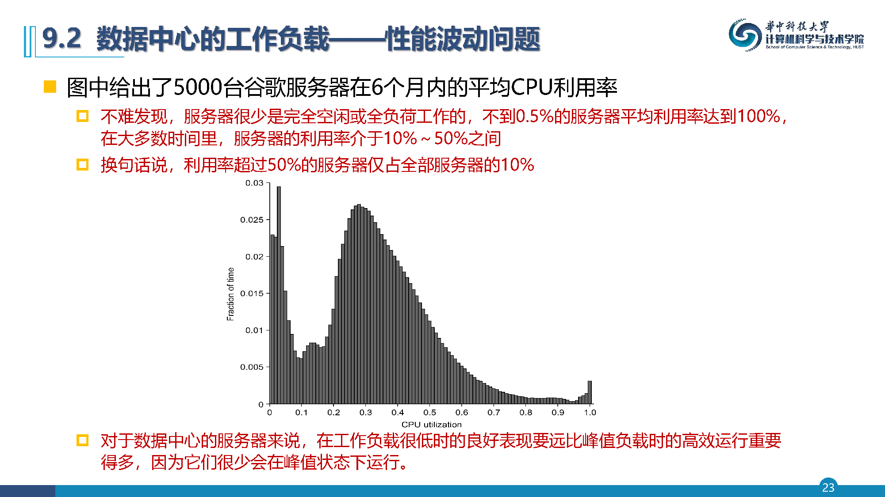

</div>

</div>

---

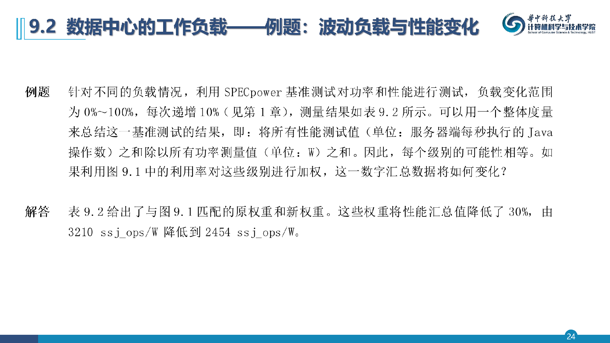

---

<style>
.columns { display: grid; grid-template-columns: 1fr 1fr; gap: 1.5rem; }
</style>

<div class='columns'>

<div>

- **服务器利用率与功耗、效率的关系**

| 利用率 | 实际权重 | 功率（W） | SPEC加权性能 | 基于实际权重加权性能 | 基于实际权重加权功率（W） | 加权PUE | ssj_ops/W |
| --- | --- | --- | --- | --- | --- | --- | --- |
| 100% | 9.09% | 2889020 | 662 | 262638 | 60 | 0.80% | 22206 |
| 90% | 9.09% | 2611130 | 617 | 237375 | 56 | 1.20% | 31756 |
| 80% | 9.09% | 2319900 | 576 | 210900 | 52 | 1.50% | 35889 |
| 70% | 9.09% | 2031260 | 533 | 184660 | 48 | 2.10% | 42491 |
| 60% | 9.09% | 1740980 | 490 | 158271 | 45 | 5.10% | 88082 |
| 50% | 9.09% | 1448810 | 451 | 131710 | 41 | 11.50% | 166335 |
| 40% | 9.09% | 1159760 | 416 | 105433 | 38 | 19.10% | 221165 |
| 30% | 9.09% | 869077 | 382 | 79007 | 35 | 24.60% | 213929 |
| 20% | 9.09% | 581126 | 351 | 52830 | 32 | 15.30% | 88769 |
| 10% | 9.09% | 290762 | 308 | 26433 | 28 | 8.00% | 23198 |
| 0% | 9.09% | 0 | 181 | 0 | 16 | 10.90% | 0 |
| 合计 | 100% | 15941825 | 4967 | 1449257 | 452 | 933820 | 380 |

ssj_ops/W（实际）：3210　　ssj_ops/W（加权）：2454

</div>

<div>

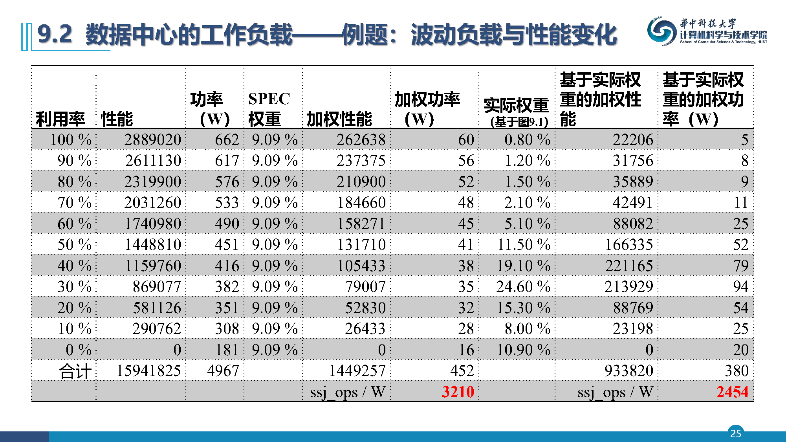

</div>

</div>

---


---

<style>
.columns { display: grid; grid-template-columns: 1fr 1fr; gap: 1.5rem; }
</style>

<div class='columns'>

<div>

- **数据中心网络是将大量服务器连接在一起的中枢**
  - 类似于第5章的存储器层次结构，数据中心使用一种层次网络结构
  - 其结构来自于巴罗索（Barroso）和霍尔兹勒（Hölzle）的论文：A Google rack for its WSC. Its dimensions are about 7 ft high, 4 ft wide, and 2 ft deep (2 m × 1.2 m × 0.5 m). The Top of Rack switches are indeed at the top of this rack. Next comes the power converter that converts from 240 V AC to 48 V DC for the servers in the rack using a bus bar at the back of the rack. Next is the 20 slots (depending on the height of the server) that can be configured for the various types of servers that can be placed in the rack. Up to four servers can be placed per tray. At the bottom of the rack are high-efficiency distributed modular DC uninterruptible power supply (UPS) batteries.

</div>

<div>

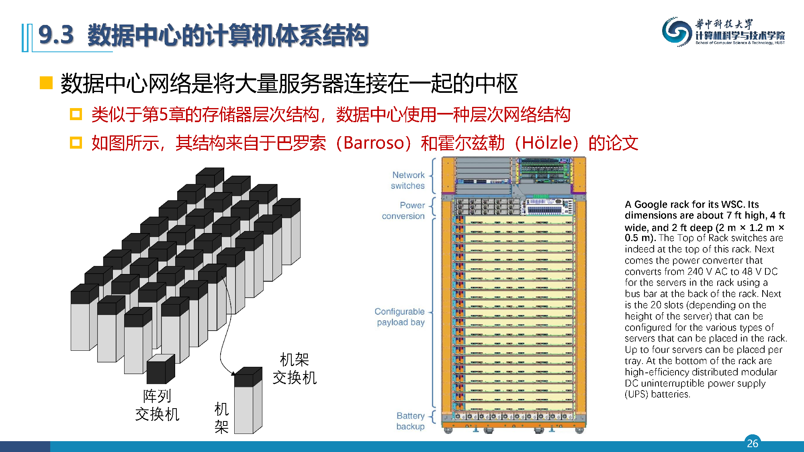

</div>

</div>

---

<style>
.columns { display: grid; grid-template-columns: 1fr 1fr; gap: 1.5rem; }
</style>

<div class='columns'>

<div>

- **一种很自然的设计是用服务器填充一个机架，扣除大众化以太网机架交换机所需要的空间**
- **这种设计带来一个问题：把存储放在哪儿？**
  - 从硬件构建的角度来看，最简单的解决方案是将磁盘包含在服务器中，通过以太网连接访问远程服务器磁盘上的信息
  - 另一种替代方案是使用NAS，可以是通过类似于InfiniBand的存储网络来连接集中部署的磁盘。NAS解决方案的每TB存储容量成本通常要更高一些，但它提供了许多功能，包括用于提高存储器可靠性的RAID技术

</div>

<div>

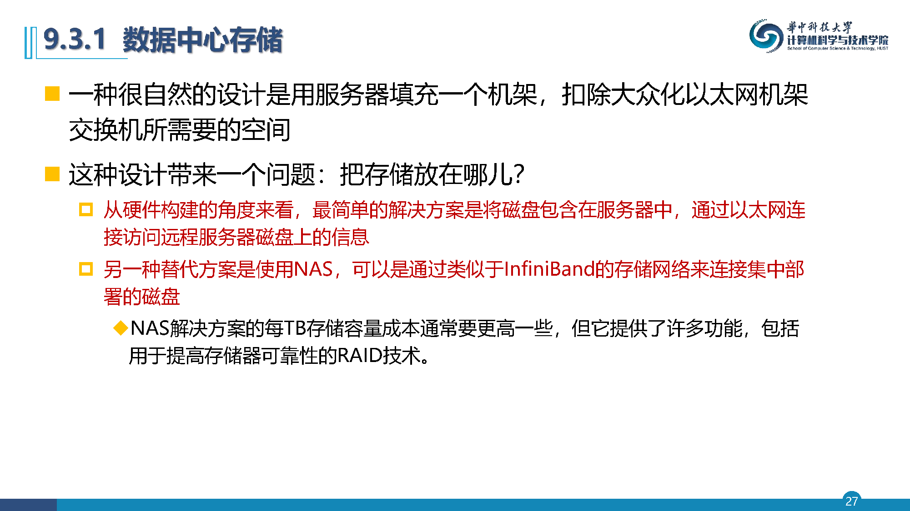

</div>

</div>

---

<style>
.columns { display: grid; grid-template-columns: 1fr 1fr; gap: 1.5rem; }
</style>

<div class='columns'>

<div>

- **根据上一节表达的思想，可以预计：**
  - 数据中心通常会依靠本地磁盘，并提供用于处理连接性和可靠性的存储软件
  - 例如，谷歌文件系统（GFS）使用本地磁盘，至少维护3个副本，以克服可靠性问题
    - 这一冗余不仅可以应对本地磁盘故障，还能应对机架和整个集群的电源故障
    - 最终一致性设计给GFS提供的灵活性降低了使这些副本保持一致所需的成本，还降低了存储系统的网络带宽需求
  - 稍后将会看到，本地访问模式还意味着连向本地存储的高带宽

</div>

<div>

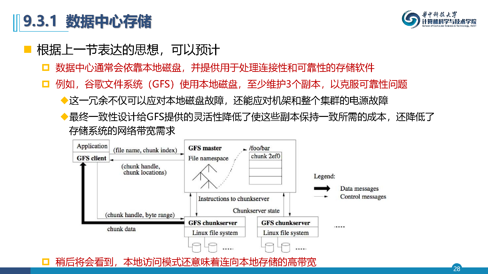

</div>

</div>

---

<style>
.columns { display: grid; grid-template-columns: 1fr 1fr; gap: 1.5rem; }
</style>

<div class='columns'>

<div>

- **以谷歌数据中心为例给出了数据中心内部的存储系统层次结构**

服务器（单台）→机架交换机→机架（40台服务器）→……→数据中心骨干网→机群（125台机架）→阵列交换机

</div>

<div>

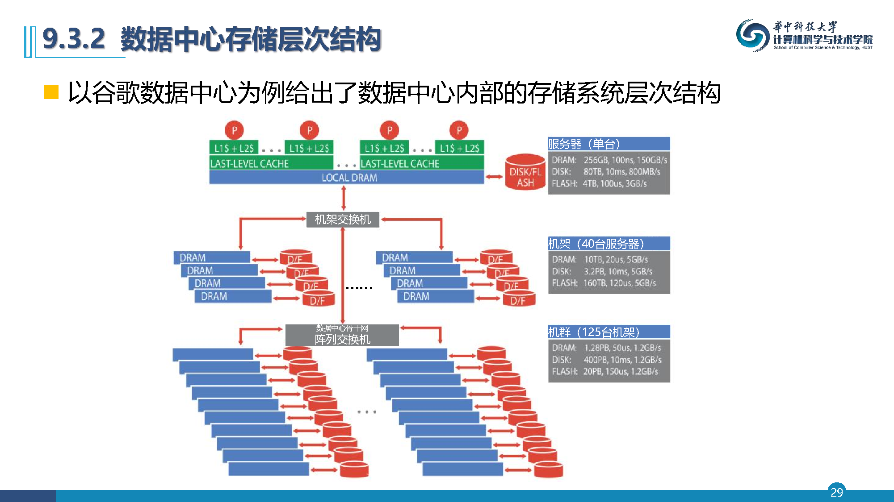

</div>

</div>

---

<style>
.columns { display: grid; grid-template-columns: 1fr 1fr; gap: 1.5rem; }
</style>

<div class='columns'>

<div>

- **数据中心存储器层次结构的延迟、带宽和容量**

| 各级存储器性能参数 | 本地 | 机架 | 阵列 |
| --- | --- | --- | --- |
| DRAM延迟（μs） | 0.1 | 300 | 500 |
| 闪存延迟（μs） | 100 | 400 | 600 |
| 磁盘延迟（μs） | 10000 | 11000 | 12000 |
| DRAM带宽（MB/s） | 20000 | 100 | 10 |
| 闪存带宽（MB/s） | 1000 | 100 | 10 |
| 磁盘带宽（MB/s） | 200 | 100 | 10 |
| DRAM容量（GB） | 16 | 1024 | 31200 |
| 闪存容量（GB） | 128 | 20000 | 600000 |
| 磁盘容量（GB） | 2000 | 160000 | 4800000 |

</div>

<div>

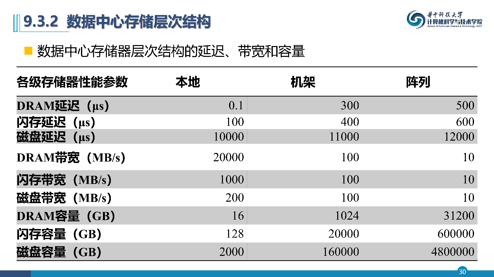

</div>

</div>

---

<style>
.columns { display: grid; grid-template-columns: 1fr 1fr; gap: 1.5rem; }
</style>

<div class='columns'>

<div>

- **每台服务器**包含16 GB内存，访问时间为100 ns，传输速度为20 GB/s，还有一个2 TB磁盘，访问时间为10 ms，传输速度为200 MB/s。每块主板上有两个插槽，它们共享一个1 Gbit/s以太网端口
- **每对机架**包括一台机架交换机，容纳80个2U服务器。联网软件再加上交换机开销将DRAM的延迟增加至100 ms，磁盘访问延迟增加到11 ms。因此，一个机架的总存储容量大约为1 TB的DRAM和160 TB的磁盘存储。1 Gbit/s以太网将连向该机架内的DRAM或磁盘的远程带宽限制为100 MB/s
- **阵列交换机**可以承载30个机架，所以一个阵列的存储容量可增加30倍：DRAM为30 TB，磁盘为4.8 PB。阵列交换机硬件和软件将连向阵列内DRAM的延迟增加到300 ms，磁盘延迟增加到12 ms。数据交换机的带宽将连向阵列DRAM或阵列磁盘的远程带宽限制为10 MB/s

</div>

<div>

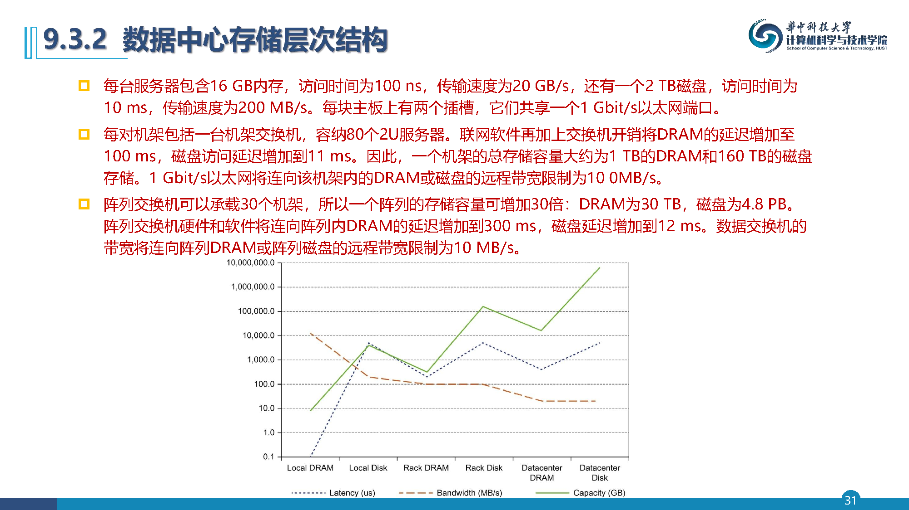

</div>

</div>

---

<style>
.columns { display: grid; grid-template-columns: 1fr 1fr; gap: 1.5rem; }
</style>

<div class='columns'>

<div>

- **需要20台阵列交换机连接到50000台服务器，所以联网层次又多一级**

</div>

<div>

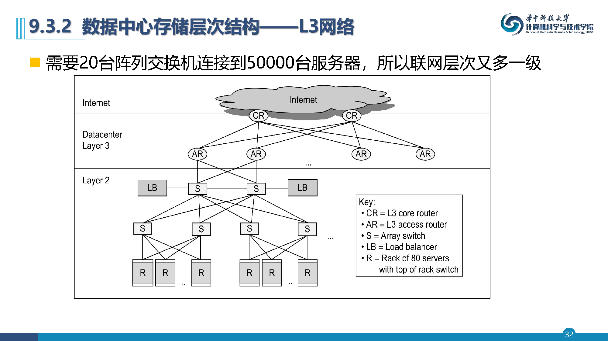

</div>

</div>

---

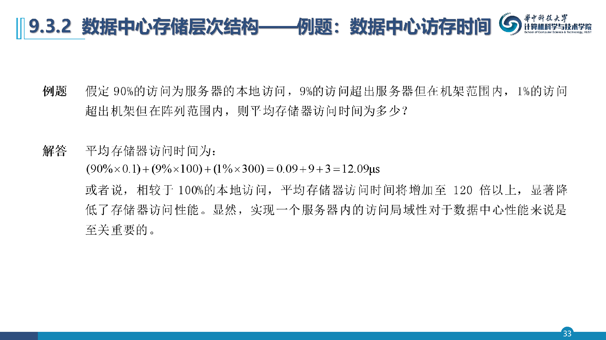

---

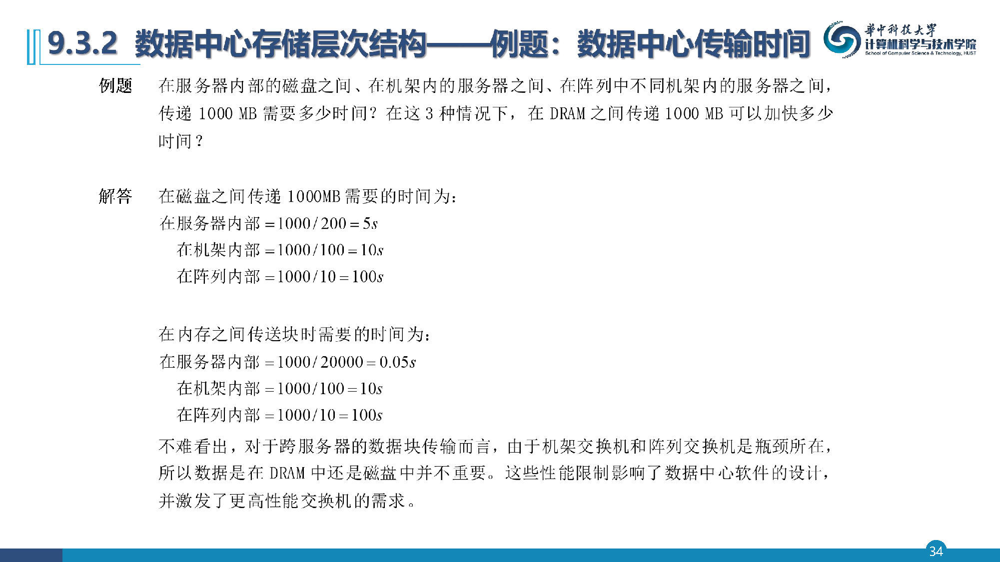

---

<style>
.columns { display: grid; grid-template-columns: 1fr 1fr; gap: 1.5rem; }
</style>

<div class='columns'>

<div>

- **要构建数据中心，首先需要建造一个仓库**
- **第一个问题就是：在哪里建造？**
  - 房地产代理强调位置，但对数据中心来说，位置意味着接近互联网骨干光纤、电力成本低、环境灾难风险低（比如地震、洪水和飓风）
- **对于一个拥有许多数据中心的公司来说，还需要找到一个在地理上接近当前或未来互联网用户群的地方，以降低通过互联网的延迟**
  - 还有其它许多现实考虑因素，比如不动产税率

</div>

<div>

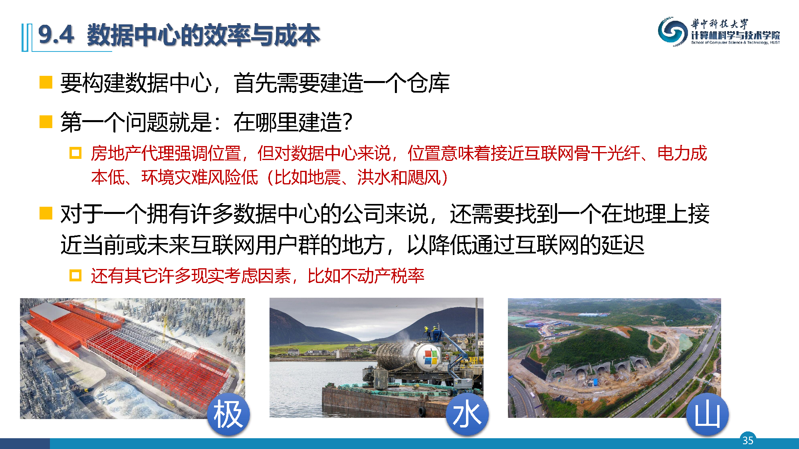

</div>

</div>

---

<style>
.columns { display: grid; grid-template-columns: 1fr 1fr; gap: 1.5rem; }
</style>

<div class='columns'>

<div>

- **配电与制冷的基础设施成本会让数据中心的构建成本相形见绌**
- **图中给出了数据中心内的配电基础设施**
  - 尽管有许多不同的部署方式，但从电力塔高压线开始，电力通常经过大约5个步骤、4级电压变换到达服务器
  - 各环节效率：99.7%、98%、98%、94%、99%
  - 传统数据中心供电损耗约11%
  - $0.997 × 0.98 × 0.98 × 0.94 × 0.99 ≈ 89\%$

</div>

<div>

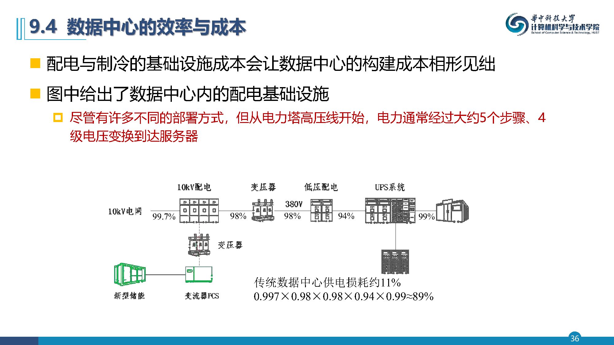

</div>

</div>

---

<style>
.columns { display: grid; grid-template-columns: 1fr 1fr; gap: 1.5rem; }
</style>

<div class='columns'>

<div>

- **配电与制冷的基础设施成本会让数据中心的构建成本相形见绌**
- **图中给出了数据中心内的制冷基础设施**
  - 在典型数据中心中，制冷系统与IT设备的相对功率成本如下：
    - 冷减器占IT设备功率的30%～50%
    - CRAC占IT设备功率的10%～20%，大多消耗在风扇上

</div>

<div>

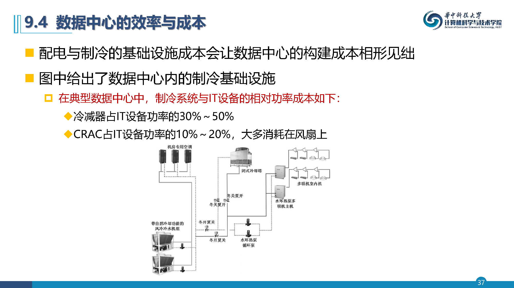

</div>

</div>

---

<style>
.columns { display: grid; grid-template-columns: 1fr 1fr; gap: 1.5rem; }
</style>

<div class='columns'>

<div>

- **巴罗索等人对数据中心设备自身内部的功率利用进行了分解，据此给出了在2012年部署的谷歌数据中心的数据，具体如下：**
  - 42%的功率用于处理器
  - 12%用于DRAM
  - 14%用于磁盘
  - 5%用于联网
  - 15%用于制冷开销
  - 8%用于供电开销
  - 4%用于其他方面

</div>

<div>

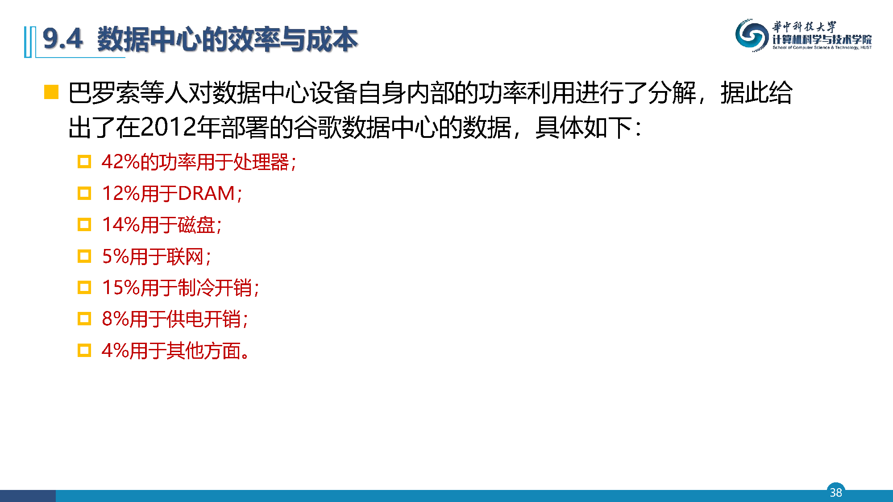

</div>

</div>

---

<style>
.columns { display: grid; grid-template-columns: 1fr 1fr; gap: 1.5rem; }
</style>

<div class='columns'>

<div>

- **一种广泛使用的简单度量可以用来评估一个数据中心的效率，称为功率利用效率（Power Utilization Effectiveness，PUE）**

$$PUE = \frac{总设施功率}{IT设备功率}$$

- **很明显，PUE总是大于或等于1，PUE越大，数据中心的效率就越低**

</div>

<div>


</div>

</div>

---

<style>
.columns { display: grid; grid-template-columns: 1fr 1fr; gap: 1.5rem; }
</style>

<div class='columns'>

<div>

- **PUE随数据中心投产时间的变化趋势**

$$PUE = \frac{总设施功率}{IT设备功率}$$

图中展示了1995年至2030年数据中心的实际PUE（Real World PUE）变化趋势，以及理论运行PUE。

</div>

<div>

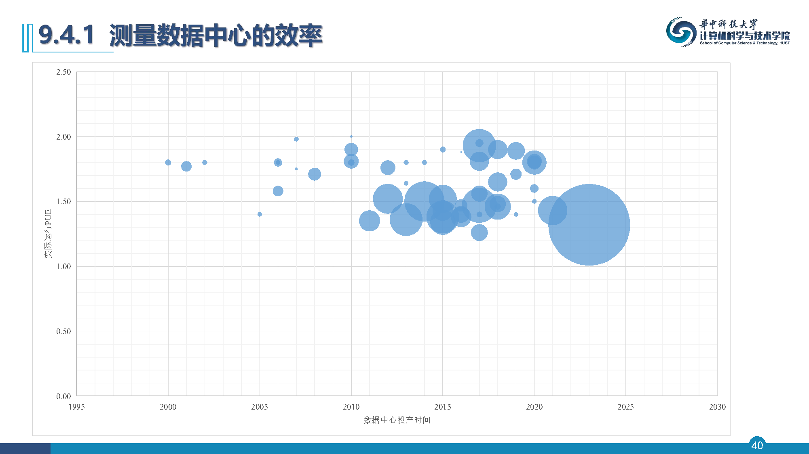

</div>

</div>

---

<style>
.columns { display: grid; grid-template-columns: 1fr 1fr; gap: 1.5rem; }
</style>

<div class='columns'>

<div>

- **数据中心的设计者需要同时关注数据中心的运行成本和构建成本**
  - 前者是运营成本（Operational expenditures，OPEX）
  - 后者是资本支出（Capital expenditures，CAPEX）
- **为了正确合理地看待能源成本，汉密尔顿（Hamilton）等人研究了数据中心的成本，确定8MW设施的CAPEX为8800万美元，大约46000台服务器和相应的网络设备，向数据中心的CAPEX另外增加了7900万美元**
  - 考虑数据中心上部署的应用一般有着不同的网络流量和服务质量需求，因特网带宽成本将随应用程序变化，所以这里未包含在内。设施CAPEX的其余18%包括购买知识产权和机房的建设成本

</div>

<div>

| 评估项 | 评估值 |
| --- | --- |
| 设施规模（临界负载） | 8000000 W |
| 平均功率利用率 | 80% |
| 功率利用效率（PUE） | 1.45 |
| 电力成本 | 0.07 美元/KWh |
| 电力和制冷基础设施百分比 | 82% |
| 设施CAPEX（不包括IT设备） | 88000000 美元 |
| 服务器数 | 45978 |
| 服务器CAPEX | 66700000 美元 |
| 成本/服务器 | 1450 美元 |
| 机架交换机数 | 1150 |
| 成本/机架交换机 | 4800 美元 |
| 阵列交换机数 | 22 |
| 成本/阵列交换机 | 300000 美元 |
| L3交换机数 | 2 |
| 成本/L3交换机 | 500000 美元 |
| 边界路由器数目 | 2 |
| 成本/边界路由器 | 144800 美元 |
| 网络设备CAPEX | 12810000 美元 |
| 数据中心的总CAPEX | 167510000 美元 |
| 服务器分摊时间 | 3年 |
| 网络设备分摊时间 | 4年 |
| 设施分摊时间 | 10年 |
| 借款的年度利率 | 5% |

</div>

<div>

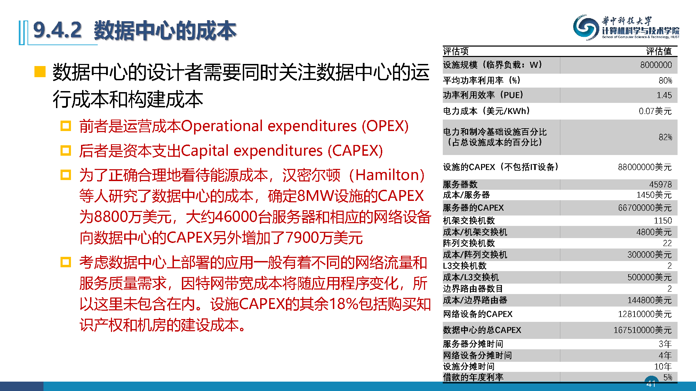

</div>

</div>

---

<style>
.columns { display: grid; grid-template-columns: 1fr 1fr; gap: 1.5rem; }
</style>

<div class='columns'>

<div>

- **表中对这一案例研究的月度OPEX进行了分解**
  - 不同设备的分摊率有很大不同，设施的分摊期限为10年，网络设备为4年，服务器为3年
  - 数据中心设施以10年为单位持续运行，但需要每3年将服务器更换一次，每4年将网络设备更换一次
  - 通过分摊CAPEX，汉密尔顿（Hamilton）计算出月度OPEX，包括贷款支付数据中心款项的利率（每年5%）。月度OPEX为380万美元，大约为CAPEX的2%

</div>

<div>

| 费用类别 | 月度成本（美元） | 月度成本百分比 |
| --- | --- | --- |
| **分摊CAPEX（85%）** | | |
| 服务器 | 2000000 | 53% |
| 网络设备 | 290000 | 8% |
| 电力与制冷基础设施 | 765000 | 20% |
| 其他基础设施 | 170000 | 4% |
| **OPEX（15%）** | | |
| 月度用电成本 | 475000 | 13% |
| 月度人员薪金与津贴 | 85000 | 2% |
| **总OPEX** | **3800000** | **100%** |

</div>

<div>

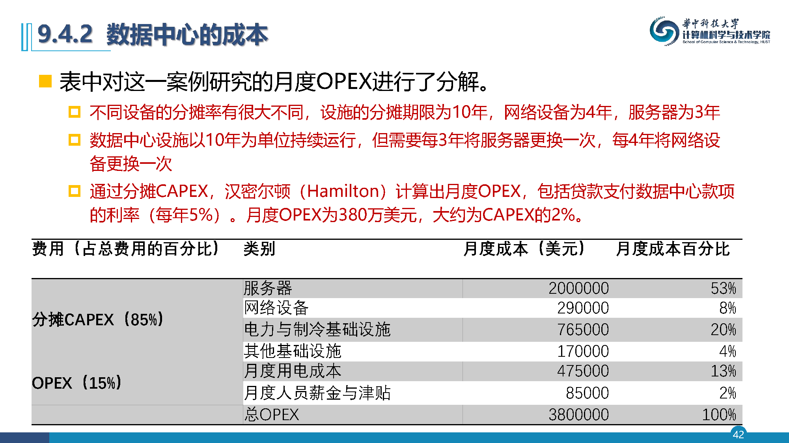

</div>

</div>

---

<style>
.columns { display: grid; grid-template-columns: 1fr 1fr; gap: 1.5rem; }
</style>

<div class='columns'>

<div>

- **在一个数据中心中，每年每瓦的全额成本为：**

$$\frac{基础设施的月度成本 + 电力的月度成本}{设施规模} \times 12 = \frac{76.5万 + 47.5万}{800万} \times 12 = 1.86 美元/瓦·年$$

</div>

<div>

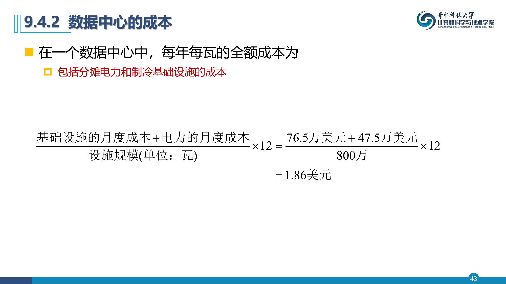

</div>

</div>

---

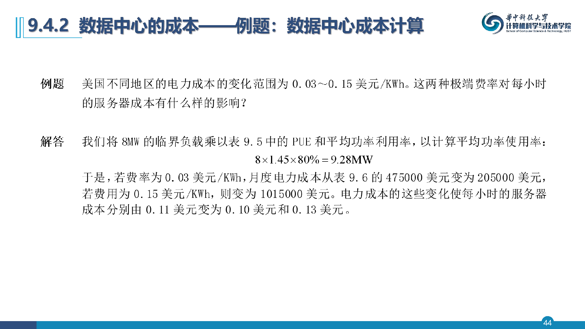

---

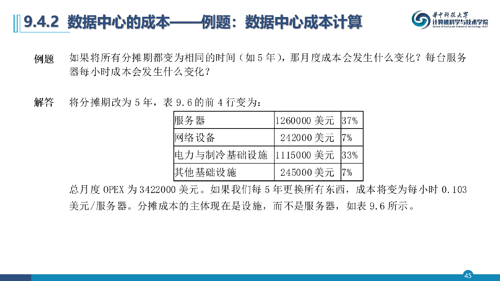

---

<style>
.columns { display: grid; grid-template-columns: 1fr 1fr; gap: 1.5rem; }
</style>

<div class='columns'>

<div>

- **分摊成本的优势**
  - 根据前面例题的计算，在数据中心内部，每小时0.11美元/服务器的费率远低于许多公司拥有和运行自有（较小）传统数据中心的成本
  - 在数据中心外部，通过合理选址和布局，整体权衡成本和收益，还可以进一步优化资源使用
  - 数据中心的成本优势导致大型互联网公司都将计算功能当作一种公用设施来提供，和电力一样，用户只需要为自己使用的那一部分付费即可
- **如今，公用计算有一个更响亮的名字——云计算**

</div>

<div>

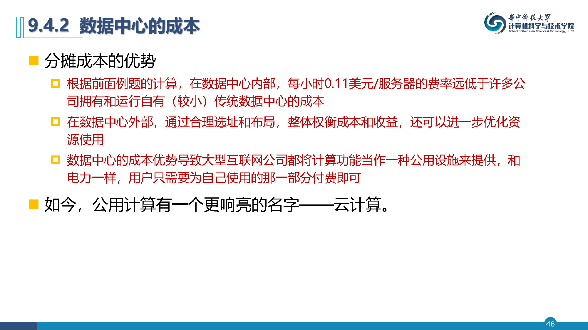

</div>

</div>

---

<style>
.columns { display: grid; grid-template-columns: 1fr 1fr; gap: 1.5rem; }
</style>

<div class='columns'>

<div>

- **通过集中建设数据通信网络，可以：**
  - 转移供电压力，减少传输损耗
  - 甚至可借助环境特点进一步改善能效
- **基于这个理念，在我们国家启动了"东数西算"工程，旨在：**
  - 帮助促进我国西部地区的数字经济发展
  - 同时也在一定程度上缓解东部供电的压力

</div>

<div>

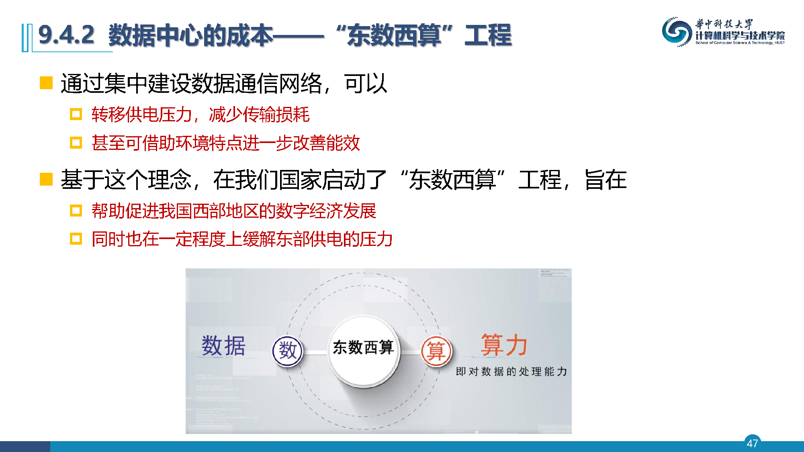

</div>

</div>

---

<style>
.columns { display: grid; grid-template-columns: 1fr 1fr; gap: 1.5rem; }
</style>

<div class='columns'>

<div>

- **假设为服务东部沿海地区快速发展的互联网业务，需要建设一个包含100万台服务器的数据中心，这个数据中心年均用电量约为30亿KWh，这里有3种可能的场景：**
  - **场景1**：数据中心选址在东部沿海地区，就近服务用户，但需要从2000 Km外运煤过来进行本地发电供电
  - **场景2**：数据中心选址在东部沿海地区，就近服务用户，但需要从2000 Km外通过特高压电网输电过来
  - **场景3**：数据中心选址在煤矿附近，本地发电供应，但是需要通过光纤网络实现与2000 Km外的东部沿海地区互联

</div>

<div>

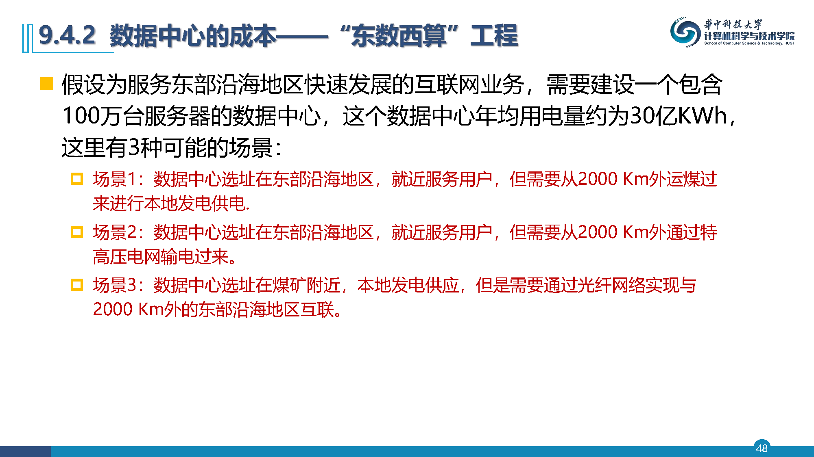

</div>

</div>

---

<style>
.columns { display: grid; grid-template-columns: 1fr 1fr; gap: 1.5rem; }
</style>

<div class='columns'>

<div>

- **统一折算为每KWh电的成本，输煤发电为0.142元，远距离高压输电为0.138元，可是远距离光纤网络则仅需0.015元，优势明显**
  - 而且这个数据是比较理想的估算，没有考虑运煤、输电的损耗，还有不同区域的电费差异，东西部可以达到3倍以上，即1元和0.30元左右
- **这样一个拥有100万台服务器的数据中心：**
  - 若建设于东部，电费即可轻松突破年均30亿
  - 若建设于西部，则仅需年均10亿电费外加光纤网络需要的年均不足1亿的信息网络使用费

</div>

<div>

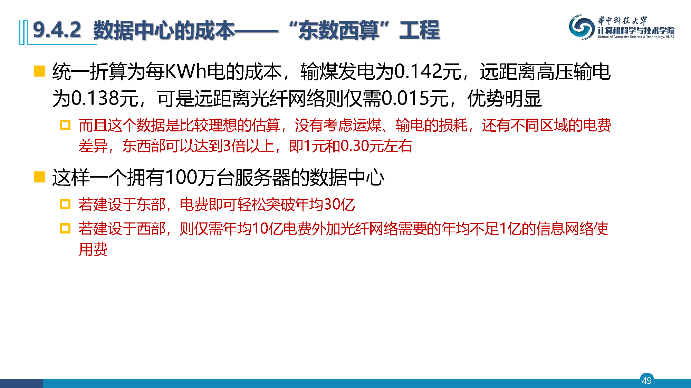

</div>

</div>

---

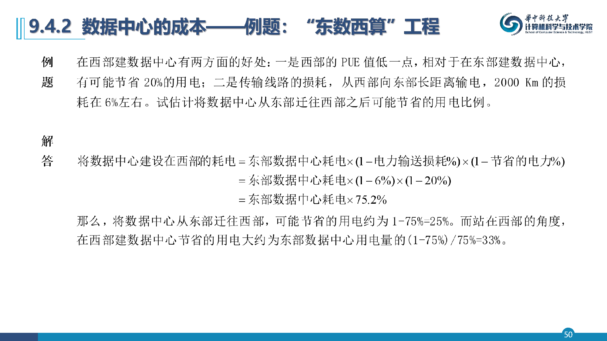

---

<style>
.columns { display: grid; grid-template-columns: 1fr 1fr; gap: 1.5rem; }
</style>

<div class='columns'>

<div>

- **附录I进一步介绍数据中心相关的扩展内容，并按照本章节相关主题进行分类。具体而言：**
  - 在附录I.1节介绍数据中心的可靠性，以数据中心常用的副本和纠删码技术为主
  - 在附录I.2节介绍数据中心的可用性，以尾延迟问题和服务质量保障技术为主

</div>

<div>


</div>

</div>

---


