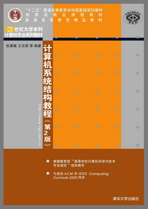
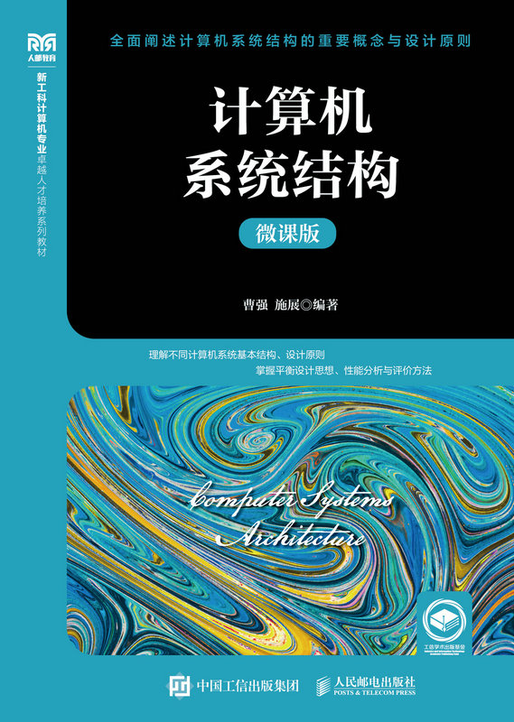
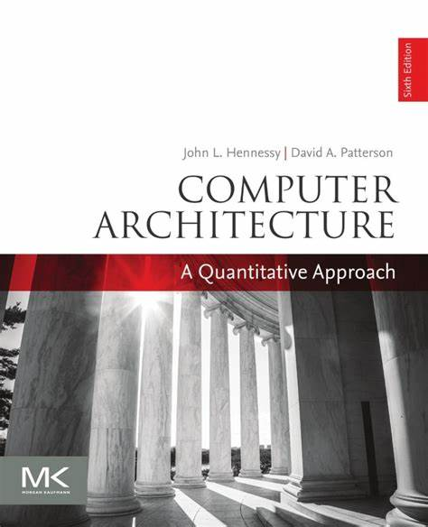
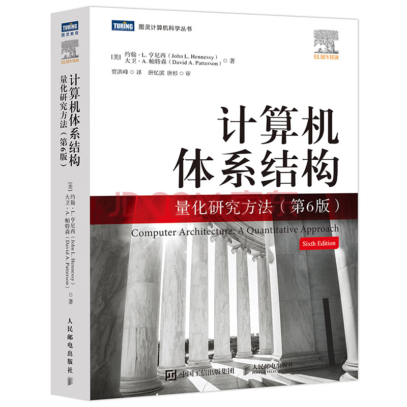
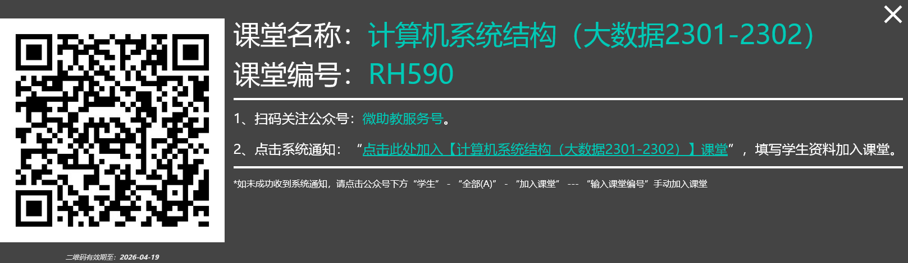

<!-- _class: lead -->

# 课堂简介

计算机学院 & 武汉光电国家研究中心
华中科技大学
2026-03-17 至 2026-05-07

---

## 课程资料

- 教材: [计算机系统结构教程（第2版）](http://www.tup.tsinghua.edu.cn/booksCenter/book_05056301.html), 清华大学出版社, 2014
- 参考书
  - [**计算机系统结构（微课版）**](https://www.ptpress.com.cn/shopping/buy?bookId=43961df3-4a07-4e0e-8b0f-bdf3b21d695f), 人民邮电出版社, 2024
  - [John Hennessy](https://hennessy.stanford.edu/), [David Patterson](https://www2.eecs.berkeley.edu/Faculty/Homepages/patterson.html), [**Computer Architecture: A Quantitative Approach**, 6th Edition.](https://www.elsevier.com/books/computer-architecture/hennessy/978-0-12-811905-1), 2017
  - [**计算机体系结构：量化研究方法**（第6版）](https://item.jd.com/13427803.html), 人民邮电出版社, 2017
- 课堂实验 <https://github.com/cs-course/computer-architecture-experiment>

   

---

## 微助教平台

- 课堂名称：[计算机系统结构（大数据2301-2302）](https://www.teachermate.com.cn/classes/1469141)
- 课堂编号：RH590

---

## 教师信息

- **王海卫**，**施展**，武汉光电国家研究中心，存储部
- 联系方式
  - 主页
    - <https://faculty.hust.edu.cn/wanghaiwei/zh_CN/index.htm>
    - <http://faculty.hust.edu.cn/shizhan/zh_CN/index.htm>
    - <https://shizhan.github.io/>, <https://shi_zhan.gitee.io/>

---

## 授课目标

- 从系统层面认识计算机
- 建立整机系统概念
- 总体设计与设计策略

---

## 评分构成

- **作业** *20%*
  - 每章一次作业
- **实验** *20%*
  - [头哥](https://www.educoder.net/classrooms/iua8p7kn?code=DORTCN)，至05月31日
- **考试** *60%*

---

## 课程计划

地点：**西十二楼 N401**

| 周次 | 日期 (周二、周四) | 内容 |
| :- |:--------|:------|
| 第 3 周 | 03-17, 03-19 | [计算机系统结构基础](https://share.weiyun.com/lCwsqYmM) |
| 第 4 周 | 03-24, 03-26 | [流水线技术](https://share.weiyun.com/cc2DtGjx) |
| 第 5 周 | 03-30, 04-02 | [指令级并行](https://share.weiyun.com/wlII1OP9) |
| 第 6 周 | 04-07, 04-09 | [存储系统](https://share.weiyun.com/oD5xmF5L) |
| 第 7 周 | 04-14, 04-16 | [存储系统](https://share.weiyun.com/oD5xmF5L) |
| 第 8 周 | 04-21, 04-23 | [I/O 系统](https://share.weiyun.com/rT3ADE3z) |
| 第 9 周 | 04-28, 04-30 | [互联网络](https://share.weiyun.com/k2Wx7sJr) |
| 第 10 周 | ~~05-05~~, 05-07, 05-09 | [多处理机](https://share.weiyun.com/0w14t0Do) + [习题参考]() |

---

## 课程讲义参考

| 章节 | 讲义内容 | 幻灯片 |
|:---:|:---|:---:|
| 第 1 章 | [计算机系统结构概述](Ch1/index.html) | 62 页 |
| 第 2 章 | [指令系统](Ch2/index.html) | 37 页 |
| 第 3 章 | [流水线处理器](Ch3/index.html) | 57 页 |
| 第 4 章 | [指令级并行处理](Ch4/index.html) | 55 页 |
| 第 5 章 | [内存系统](Ch5/index.html) | 89 页 |
| 第 6 章 | [外存系统](Ch6/index.html) | 68 页 |
| 第 7 章 | [数据级并行](Ch7/index.html) | 42 页 |
| 第 8 章 | [多处理器](Ch8/index.html) | 104 页 |
| 第 9 章 | [计算机集群和数据中心](Ch9/index.html) | 54 页 |
| 第 10 章 | [专用加速器](Ch10/index.html) | 22 页 |
